# [!UICONTROL ガントチャート]での情報の表示方法の設定

<!-- Audited: 5/2025 -->

タスクリストガントチャートとプロジェクトリストガントチャートの両方に表示される情報を設定できます。

## アクセス要件

+++ 展開すると、この記事の機能のアクセス要件が表示されます。

<table style="table-layout:auto"> 
 <col> 
 <col> 
 <tbody> 
  <tr> 
   <td role="rowheader">[!DNL Adobe Workfront] パッケージ</td> 
   <td> 
任意
 </td> 
  </tr> 
  <tr> 
   <td role="rowheader">[!DNL Adobe Workfront] ライセンス</td> 
   <td> 
   
[!UICONTROL Light]以上

   
[!UICONTROL Review] 以降

   </td> 
  </tr> 
  <tr> 
   <td role="rowheader">アクセスレベル設定</td> 
   <td> 
プロジェクトとタスクに対する[!UICONTROL View]以上のアクセス権
</td> 
  </tr> 
  <tr> 
   <td role="rowheader">オブジェクト権限</td> 
   <td> 
[!UICONTROL View]以降のプロジェクトおよびタスクへのアクセス
 </td> 
  </tr> 
 </tbody> 
</table>

この表の情報について詳しくは、[Workfront ドキュメントのアクセス要件](/help/quicksilver/administration-and-setup/add-users/access-levels-and-object-permissions/access-level-requirements-in-documentation.md)を参照してください。

+++

<!--
Old:
<table style="table-layout:auto"> 
 <col> 
 <col> 
 <tbody> 
  <tr> 
   <td role="rowheader"> Adobe Workfront plan</td> 
   <td> 
Any 
 </td> 
  </tr> 
  <tr> 
   <td role="rowheader">Adobe Workfront license</td> 
   <td> 
   
New: Light

   
Or

   
Current: Review

   </td> 
  </tr> 
  <tr> 
   <td role="rowheader">Access level configurations</td> 
   <td> 
[!UICONTROL View] or higher access to Projects and Tasks
 
Note: If you still don't have access, ask your [!DNL Workfront] administrator if they set additional restrictions in your access level. For information on how a [!DNL Workfront] administrator can modify your access level, see <a href="../../../administration-and-setup/add-users/configure-and-grant-access/create-modify-access-levels.md" class="MCXref xref">Create or modify custom access levels</a>.
 </td> 
  </tr> 
  <tr> 
   <td role="rowheader">Object permissions</td> 
   <td> 
[!UICONTROL View] or higher access to the project
 
For information on requesting additional access, see <a href="../../../workfront-basics/grant-and-request-access-to-objects/request-access.md" class="MCXref xref">Request access to objects </a>.
 </td> 
  </tr> 
 </tbody> 
</table>
-->

## 表示オプションについて

[!UICONTROL ガントチャート]の表示オプションの詳細を次の表に示します。

<table style="table-layout:auto"> 
 <col> 
 <col> 
 <col> 
 <tbody> 
  <tr> 
   <td role="rowheader">実際の日付</td> 
   <td> 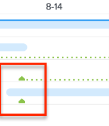 </td> 
   <td> 
[!UICONTROL Actual Start Date]と[!UICONTROL Actual Completion Date]が三角形のアイコンと共に表示されます。[!UICONTROL Actual Completion Date]が null の場合は、[!UICONTROL Actual Start Date]のみが表示されます。
 
詳細については、「<a href="../../../manage-work/projects/planning-a-project/project-actual-completion-date.md" class="MCXref xref"> プロジェクトの概要[!UICONTROL 実完了日] </a>」および「<a href="../../../manage-work/projects/planning-a-project/project-actual-start-date.md" class="MCXref xref"> プロジェクトの概要[!UICONTROL 実開始日] </a>」を参照してください。
 </td> 
  </tr> 
  <tr> 
   <td role="rowheader">[!UICONTROL Assignments]</td> 
   <td> 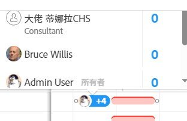 </td> 
   <td> 
タスクの割り当て先を表示します。 担当者の名前の横にある「詳細」リンクにカーソルを合わせると、タスクに対する割り当ての割合など、担当者に関する詳細な情報が表示されます。
 
[!UICONTROL ガントチャート &#x200B;]をPDFに書き出しても、担当者は[!UICONTROL ガントチャート &#x200B;]に表示されません。 [!UICONTROL ガントチャート &#x200B;]をPDFに書き出すと、担当者はタスクリストにのみ表示されます。
 </td> 
  </tr> 
  <tr> 
   <td role="rowheader">[!UICONTROL Baseline]</td> 
   <td> 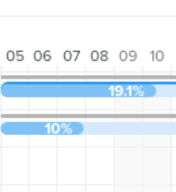 </td> 
   <td> 
初期のプロジェクト計画に含まれる、プロジェクトに関する主要なデータを表すプロジェクトスナップショット。ベースラインは、プロジェクトのタイムライン全体を通して設定できます。 [!UICONTROL Gantt chart]にベースラインを表示できるようにする場合は、表示するベースラインを選択します。[!UICONTROL Gantt chart]では、一度に 1 つのベースラインのみ表示でき、グレーのバー形式で表示されます。
 
ベースラインについて詳しくは、<a href="../../../manage-work/projects/create-projects/create-baselines.md" class="MCXref xref">プロジェクトのベースラインの作成</a>を参照してください。
 </td> 
  </tr> 
  <tr> 
   <td role="rowheader">[!UICONTROL Commit Date]</td> 
   <td> 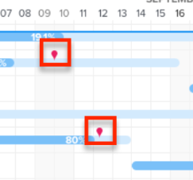 </td> 
   <td> 
割り当て先がタスクの完了時期として約束した日付が、[!UICONTROL Gantt chart]にマーカーで表示されます。 
 
コミット日の詳細について詳しくは、<a href="../../../manage-work/projects/updating-work-in-a-project/overview-of-commit-dates.md" class="MCXref xref">[!UICONTROL Commit Date]の概要</a>を参照してください。
 </td> 
  </tr> 
  <tr> 
   <td role="rowheader">[!UICONTROL % Complete]</td> 
   <td> 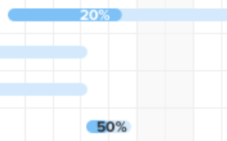 </td> 
   <td> 完了したタスクの割合がタスクラインに表示されます。  </td> 
  </tr> 
  <tr> 
   <td role="rowheader">[!UICONTROL Critical Path]</td> 
   <td> 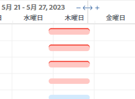 </td> 
   <td>プロジェクトのタイムラインに影響を与える可能性のあるタスクは、クリティカルパスの一部と見なされ、赤色で表示されます。 </td> 
  </tr> 
  <tr> 
   <td role="rowheader">[!UICONTROL Milestone] ダイヤモンド</td> 
   <td> 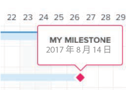 </td> 
   <td> 
マイルストーンに関連付けられたタスクの後に、ひし形のアイコンが表示されます。 マイルストーンにカーソルを合わせると、マイルストーンの名前と日付が表示されます。 [!DNL Workfront] 管理者が、各マイルストーンのダイヤモンドの色を決定します。
 
マイルストーンについて詳しくは、<a href="../../../administration-and-setup/customize-workfront/configure-approval-milestone-processes/create-milestone-path.md" class="MCXref xref">マイルストーンパスを作成</a>を参照してください。
 </td> 
  </tr> 
  <tr> 
   <td role="rowheader">[!UICONTROL Milestone] 行</td> 
   <td> 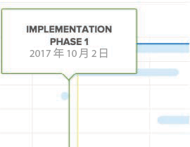 </td> 
   <td> 
マイルストーンに関連付けられているタスクの後に線が表示されます。マイルストーンにカーソルを合わせると、マイルストーンの名前と日付が表示されます。 [!DNL Workfront] 管理者が、各マイルストーン行の色を決定します。
 
 マイルストーンに関して詳しくは、<a href="../../../administration-and-setup/customize-workfront/configure-approval-milestone-processes/create-milestone-path.md" class="MCXref xref">マイルストーンパスを作成</a>を参照
 </td> 
  </tr> 
  <tr> 
   <td role="rowheader">[!UICONTROL Predecessors]</td> 
   <td> 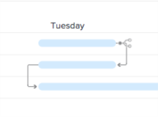 </td> 
   <td> 
2 つのタスク間の先行関係を示す、1 つのタスクから別のタスクへの行。個々の先行タスク行をハイライト表示するには、その行にカーソルを合わせます。 クリックすると、ハイライト表示されたままになります。先行タスク関係は、一度に 1 行だけハイライト表示できます。
 
ガントチャートの複数のページにまたがる先行タスク関係を持つタスクまたはクロスプロジェクト先行タスクを持つタスクの横に[!UICONTROL 先行タスク &#x200B;] アイコンが表示されます。
 
[!UICONTROL Predecessor] アイコンをクリックして、すべての先行タスクと後続タスク、タスク名、先行タスク関係の種類、キーの日付などの詳細を表示します。
 
メモ：プロジェクトのリストの [!UICONTROL Gantt Chart] には、プロジェクトをまたいだ先行タスクに関する情報が表示されます。異なるプロジェクト間で先行タスク関係を作成する方法に関して詳しくは、<a href="../../../manage-work/tasks/use-prdcssrs/cross-project-predecessors.md" class="MCXref xref">プロジェクト間の先行タスクを作成</a>を参照
 
先行タスクに関して詳しくは、「<a href="../../../manage-work/tasks/use-prdcssrs/enforced-predecessors.md" class="MCXref xref">先行タスクを強制的に実行</a>を参照してください。
 </td> 
  </tr> 
  <tr> 
   <td role="rowheader">[!UICONTROL Progress Status]</td> 
   <td> 
[!UICONTROL On Time]
 
[!UICONTROL Behind]
 
[!UICONTROL At Risk]
 
遅延        
 </td> 
   <td> 
 
 
特定のタスクの現在の進捗状況のステータス。 
 
詳細については、<a href="../../../manage-work/tasks/task-information/task-progress-status.md" class="MCXref xref"> タスク [!UICONTROL 進捗ステータス &#x200B;]の概要</a>を参照してください。
 </td> 
  </tr> 
  <tr> 
   <td role="rowheader">見込み日</td> 
   <td> 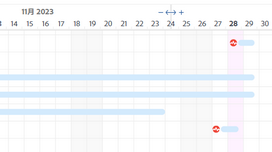 </td> 
   <td> 
完了した現在の作業と残りの作業に基づいて、予定開始日と完了日を示す予定予定予定期間。 
 
完了予定日について詳しくは、<a href="../../../manage-work/projects/planning-a-project/project-projected-completion-date.md" class="MCXref xref"> プロジェクト、タスク、イシューの完了予定日の概要</a>を参照してください。
 </td> 
  </tr> 
 </tbody> 
</table>

## 表示オプションを設定

1. **タスクリストガントチャート**&#x200B;または&#x200B;**プロジェクトリストガントチャート**&#x200B;に移動します。\
   ガントチャートの場所について詳しくは、[&#x200B; ガントチャートの概要[!UICONTROL を参照してください。]](../../../manage-work/gantt-chart/use-the-gantt-chart/get-started-with-gantt.md)

1. （オプション）「**予定日に切り替え**」設定を選択して、タスクを予定日で表示します。 デフォルトでは、タスクは予定日で表示されます。
1. 「**オプション**」アイコンをクリックします。 **オプション** ダイアログボックスが開きます。\
   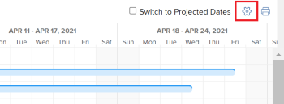

1. [!UICONTROL ガントチャート]に表示する「設定」オプションを選択します。

   >[!NOTE]
   >
   > すべての「設定」オプションがプロジェクトリストの[!UICONTROL ガントチャート]で使用できるわけではありません。

1. ガントチャートの任意の場所をクリックして、**オプション** ダイアログボックスを閉じます。
