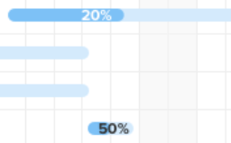

# [!UICONTROL ガントチャート]での情報の表示方法の設定

<!-- Audited: 5/2025 -->

タスク リストのガント チャートとプロジェクト リストのガント チャートの両方に表示する情報を設定できます。

## アクセス要件

+++ 展開すると、この記事の機能のアクセス要件が表示されます。

この記事の手順に従うには、以下が必要です。

<table style="table-layout:auto"> 
 <col> 
 <col> 
 <tbody> 
  <tr> 
   <td role="rowheader"> Adobe Workfront プラン</td> 
   <td> 
任意 
 </td> 
  </tr> 
  <tr> 
   <td role="rowheader">Adobe Workfront プラン</td> 
   <td> 
   
新規：軽い

   
または

   
現在：レビュー

   </td> 
  </tr> 
  <tr> 
   <td role="rowheader">アクセスレベル設定</td> 
   <td> 
プロジェクトとタスクに対する[!UICONTROL View]以上のアクセス権
 
メモ：まだアクセス権がない場合は、[!DNL Workfront] 管理者に問い合わせて、アクセスレベルに追加の制限が設定されているかどうかを確認してください。[!DNL Workfront] 管理者がアクセスレベルを変更する方法について詳しくは、<a href="../../../administration-and-setup/add-users/configure-and-grant-access/create-modify-access-levels.md" class="MCXref xref">カスタムアクセスレベルの作成または変更</a>を参照してください。
 </td> 
  </tr> 
  <tr> 
   <td role="rowheader">オブジェクト権限</td> 
   <td> 
プロジェクトに対する[!UICONTROL View]以上のアクセス権
 
追加のアクセス権のリクエストについて詳しくは、<a href="../../../workfront-basics/grant-and-request-access-to-objects/request-access.md" class="MCXref xref">オブジェクトへのアクセス権のリクエスト</a>を参照してください。
 </td> 
  </tr> 
 </tbody> 
</table>

この表の情報について詳しくは、[Workfront ドキュメントのアクセス要件](/help/quicksilver/administration-and-setup/add-users/access-levels-and-object-permissions/access-level-requirements-in-documentation.md)を参照してください。

+++

## 表示オプションについて

[!UICONTROL ガントチャート]の表示オプションの詳細を次の表に示します。

<table style="table-layout:auto"> 
 <col> 
 <col> 
 <col> 
 <tbody> 
  <tr> 
   <td role="rowheader">実際の日付</td> 
   <td>  </td> 
   <td> 
[!UICONTROL Actual Start Date]と[!UICONTROL Actual Completion Date]が三角形のアイコンと共に表示されます。[!UICONTROL Actual Completion Date]が null の場合は、[!UICONTROL Actual Start Date]のみが表示されます。
 
詳しくは、<a href="../../../manage-work/projects/planning-a-project/project-actual-completion-date.md" class="MCXref xref"> プロジェクトの概要 [!UICONTROL 実際の完了日 ] </a> および <a href="../../../manage-work/projects/planning-a-project/project-actual-start-date.md" class="MCXref xref"> プロジェクトの概要 [!UICONTROL 実際の開始日 ] </a> を参照してください。
 </td> 
  </tr> 
  <tr> 
   <td role="rowheader">[!UICONTROL Assignments]</td> 
   <td>  </td> 
   <td> 
タスクの割り当て先を表示します。 担当者の名前の横にある詳細リンクにポインタを合わせると、タスクに割り当てられた割合など、担当者に関する詳細情報が表示されます。
 
PDFに [!UICONTROL ガントチャート ] を書き出すと、担当者が [!UICONTROL ガントチャート ] に表示されません。 [!UICONTROL ガントチャート ] がPDFに書き出されると、担当者はタスクリストにのみ表示されます。
 </td> 
  </tr> 
  <tr> 
   <td role="rowheader">[!UICONTROL Baseline]</td> 
   <td>  </td> 
   <td> 
初期のプロジェクト計画に含まれる、プロジェクトに関する主要なデータを表すプロジェクトスナップショット。ベースラインは、プロジェクトのタイムライン全体を通じて取得できます。 [!UICONTROL Gantt chart]にベースラインを表示できるようにする場合は、表示するベースラインを選択します。[!UICONTROL Gantt chart]では、一度に 1 つのベースラインのみ表示でき、グレーのバー形式で表示されます。
 
ベースラインについて詳しくは、<a href="../../../manage-work/projects/create-projects/create-baselines.md" class="MCXref xref">プロジェクトのベースラインの作成</a>を参照してください。
 </td> 
  </tr> 
  <tr> 
   <td role="rowheader">[!UICONTROL Commit Date]</td> 
   <td>  </td> 
   <td> 
割り当て先がタスクの完了時期として約束した日付が、[!UICONTROL Gantt chart]にマーカーで表示されます。 
 
コミット日の詳細について詳しくは、<a href="../../../manage-work/projects/updating-work-in-a-project/overview-of-commit-dates.md" class="MCXref xref">[!UICONTROL Commit Date]の概要</a>を参照してください。
 </td> 
  </tr> 
  <tr> 
   <td role="rowheader">[!UICONTROL % Complete]</td> 
   <td>  </td> 
   <td> 完了したタスクの割合がタスクラインに表示されます。  </td> 
  </tr> 
  <tr> 
   <td role="rowheader">[!UICONTROL Critical Path]</td> 
   <td>  </td> 
   <td>プロジェクトのタイムラインに影響を与える可能性のあるタスクは、クリティカルパスの一部と見なされ、赤で明確にマークされます。 </td> 
  </tr> 
  <tr> 
   <td role="rowheader">[!UICONTROL Milestone] ダイヤモンド</td> 
   <td>  </td> 
   <td> 
マイルストーンに関連付けられたタスクの後に、ひし形アイコンが表示されます。 マイルストーンの上にマウスポインターを置くと、マイルストーンの名前と日付が表示されます。 [!DNL Workfront] 管理者が、各マイルストーンのダイヤモンドの色を決定します。
 
マイルストーンについて詳しくは、<a href="../../../administration-and-setup/customize-workfront/configure-approval-milestone-processes/create-milestone-path.md" class="MCXref xref">マイルストーンパスを作成</a>を参照してください。
 </td> 
  </tr> 
  <tr> 
   <td role="rowheader">[!UICONTROL Milestone] 行</td> 
   <td>  </td> 
   <td> 
マイルストーンに関連付けられているタスクの後に線が表示されます。マイルストーンの上にマウスポインターを置くと、マイルストーンの名前と日付が表示されます。 [!DNL Workfront] 管理者が、各マイルストーン行の色を決定します。
 
 マイルストーンに関して詳しくは、<a href="../../../administration-and-setup/customize-workfront/configure-approval-milestone-processes/create-milestone-path.md" class="MCXref xref">マイルストーンパスを作成</a>を参照
 </td> 
  </tr> 
  <tr> 
   <td role="rowheader">[!UICONTROL Predecessors]</td> 
   <td>  </td> 
   <td> 
2 つのタスク間の先行関係を示す、1 つのタスクから別のタスクへの行。個々の先行タスク行を強調表示するには、その上にカーソルを置きます。 クリックすると、ハイライト表示されたままになります。先行タスク関係は、一度に 1 行だけハイライト表示できます。
 
[!UICONTROL 先行タスク ] アイコンは、[ ガント チャート ]、またはプロジェクト間の先行タスクを持つタスクの、複数ページにわたる先行タスク関係を持つタスクの横に表示されます。
 
[!UICONTROL 先行タスク ] アイコンをクリックすると、すべての先行タスクと後続タスクとその詳細（タスク名、先行タスク関係のタイプ、キー日付など）が表示されます。
 
メモ：プロジェクトのリストの [!UICONTROL Gantt Chart] には、プロジェクトをまたいだ先行タスクに関する情報が表示されます。異なるプロジェクト間で先行タスク関係を作成する方法に関して詳しくは、<a href="../../../manage-work/tasks/use-prdcssrs/cross-project-predecessors.md" class="MCXref xref">プロジェクト間の先行タスクを作成</a>を参照
 
先行タスクに関して詳しくは、「<a href="../../../manage-work/tasks/use-prdcssrs/enforced-predecessors.md" class="MCXref xref">先行タスクを強制的に実行</a>を参照してください。
 </td> 
  </tr> 
  <tr> 
   <td role="rowheader">[!UICONTROL Progress Status]</td> 
   <td> 
[!UICONTROL On Time]
 
[!UICONTROL Behind]
 
[!UICONTROL At Risk]
 
遅延        
 </td> 
   <td> 
 
 
特定のタスクの現在の進捗状況のステータス。 
 
詳しくは、<a href="../../../manage-work/tasks/task-information/task-progress-status.md" class="MCXref xref"> タスク [!UICONTROL 進捗ステータス ] の概要 </a> を参照してください。
 </td> 
  </tr> 
  <tr> 
   <td role="rowheader">見込み日</td> 
   <td>  </td> 
   <td> 
見込み開始および完了日を示す見込み見込みタイムライン。現在の作業の完了に加えて、残りの作業が基づきます。 
 
予定完了日について詳しくは、<a href="../../../manage-work/projects/planning-a-project/project-projected-completion-date.md" class="MCXref xref"> プロジェクト、タスクおよび問題の予定完了日の概要 </a> を参照してください。
 </td> 
  </tr> 
 </tbody> 
</table>

## 表示オプションを設定

1. **タスク リスト ガント チャート** または **プロジェクト リスト ガント チャート** に移動します。\
   ガントチャートのいずれかの場所について詳しくは、[ ガントチャート [!UICONTROL  の基本を学ぶ ]](../../../manage-work/gantt-chart/use-the-gantt-chart/get-started-with-gantt.md) を参照してください。

1. （オプション）「**見込み日に切り替え**」設定を選択して、タスクを見込み日別に表示します。 デフォルトでは、タスクは予定日別に表示されます。
1. **オプション** アイコンをクリックします。 **オプション** ダイアログボックスが開きます。\
   

1. [!UICONTROL ガントチャート]に表示する「設定」オプションを選択します。

   >[!NOTE]
   >
   > すべての「設定」オプションがプロジェクトリストの[!UICONTROL ガントチャート]で使用できるわけではありません。

1. ガントチャートの任意の場所をクリックして、「**オプション**」ダイアログボックスを閉じます。
