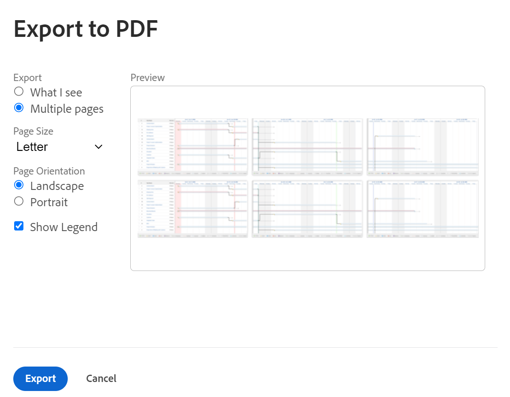
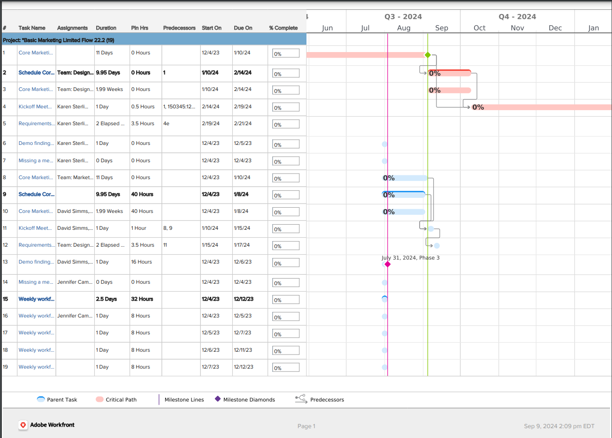

# [!UICONTROL ガントチャート]の PDF への書き出し

<!--Audited: 08/2025-->

[!UICONTROL  ガントチャート ]をPDFに書き出すことができます。 その後、それを印刷するかメールに添付して、他のユーザーと共有することができます。

## アクセス要件

+++ 展開すると、この記事の機能のアクセス要件が表示されます。 

<table style="table-layout:auto"> 
 <col> 
 <col> 
 <tbody> 
  <tr> 
   <td role="rowheader">[!UICONTROL Adobe Workfront] パッケージ</td> 
   <td> 
任意
 </td> 
  </tr> 
  <tr> 
   <td role="rowheader">[!UICONTROL Adobe Workfront] ライセンス</td> 
   <td> 
[!UICONTROL Light]以上

   
[!UICONTROL Review] 以降
 </td> 
  </tr> 
  <tr> 
   <td role="rowheader">アクセスレベル設定</td> 
   <td> 
プロジェクトとタスクに対する[!UICONTROL View]以上のアクセス権
 </td> 
  </tr> 
  <tr> 
   <td role="rowheader">オブジェクト権限</td> 
   <td> 
[!UICONTROL View]以降のプロジェクトおよびタスクへのアクセス
 </td> 
  </tr> 
 </tbody> 
</table>

この表の情報について詳しくは、[Workfront ドキュメントのアクセス要件](/help/quicksilver/administration-and-setup/add-users/access-levels-and-object-permissions/access-level-requirements-in-documentation.md)を参照してください。

+++

<!--
Old:

<table style="table-layout:auto"> 
 <col> 
 <col> 
 <tbody> 
  <tr> 
   <td role="rowheader">[!UICONTROL Adobe Workfront] plan</td> 
   <td> 
Any 
 </td> 
  </tr> 
  <tr> 
   <td role="rowheader">[!UICONTROL Adobe Workfront] license</td> 
   <td> 
New:[!UICONTROL Light] or higher

   
Current:[!UICONTROL Review] or higher
 </td> 
  </tr> 
  <tr> 
   <td role="rowheader">Access level configurations</td> 
   <td> 
[!UICONTROL View] or higher access to Projects and Tasks
 </td> 
  </tr> 
  <tr> 
   <td role="rowheader">Object permissions</td> 
   <td> 
[!UICONTROL View] or higher access to the project
 </td> 
  </tr> 
 </tbody> 
</table>

-->

## [!UICONTROL ガントチャート]を書き出します。

1. PDF に書き出す[!UICONTROL ガントチャート]をアクセスします（[[!UICONTROL ガントチャートの基本を学ぶ]](../../../manage-work/gantt-chart/use-the-gantt-chart/get-started-with-gantt.md)を参照）。
1. [!UICONTROL  ガントチャート ]を設定して、書き出す適切な情報を表示します。

   >[!NOTE]
   >
   >プロジェクトのリストから[!UICONTROL ガントチャート]を書き出す場合、PDF ファイルには、各プロジェクトのタスクではなく、リスト内のプロジェクトのみが含まれます。タスクのリストを書き出す場合は、タスクが関連付けられているプロジェクトから実行するか、タスクレポートを作成してレポートの結果を[!UICONTROL ガントチャート表示]に表示することで実行することができます。

   次のいずれかの情報を設定します。

   * **ガントチャート**&#x200B;の上にある&#x200B;**フィルター**、**ビュー**&#x200B;および[!UICONTROL  グループ化] アイコンをクリックし、[!UICONTROL  ガントチャート ]のアイテムのリストに適用されている既存のフィルター、ビュー、またはグループ化を追加または編集します。

     [!UICONTROL  ガントチャート ]を表示する際に、リスト表示で選択されたフィルターとグループが保持されます。 ビューは、書き出された[!UICONTROL  ガントチャート ]に、最初のページの[!UICONTROL  ガントチャート ]の横に表示されるリスト内でのみ反映されます。 ビューは、[!UICONTROL ガントチャート]自体に表示されません。

     >[!TIP]
     >
     >[!UICONTROL  ガントチャート ]に対してより多くの余裕を持たせるには、できるだけ少ない列を含むビューを適用します。

   * 「予定日に切り替え&#x200B;**予定日に切り替え**」オプションを選択して、予定日ではなく予定日を表示します。 デフォルトでは、予定日が表示されます。

   * ガントチャートの右上隅にある&#x200B;**設定** アイコン をクリックし、表示する情報を選択します。 選択すると、この情報は書き出されたGantt PDF ファイルに含まれます。

     次のオプションから選択します。

      * 実際の日付
      * 割り当て
      * ベースライン
      * コミット日
      * 完了率（％）
      * クリティカルパス
      * マイルストーンひし形
      * マイルストーン線
      * 先行タスク
      * 進捗ステータス
      * （条件付き）予定日
      * （条件付き）予定日

     詳しくは、[[!UICONTROL ガントチャートでの情報の表示設定]](../../../manage-work/gantt-chart/use-the-gantt-chart/configure-info-on-gantt-chart.md)を参照してください。

     >[!NOTE]
     >
     > [!UICONTROL ガントチャート] が PDF に書き出される場合、割り当ては[!UICONTROL ガントチャート]に表示されません。書き出すと、割り当てはリスト表示にのみ表示されます。

   * [!UICONTROL  ガントチャート ]に表示される期間。 書き出しファイルでこれが表示される方法は、後の手順で&#x200B;**[!UICONTROL 表示される内容]**&#x200B;を選択するか、**[!UICONTROL 複数ページ]**&#x200B;を選択するかによって異なります。

     詳しくは、[[!UICONTROL ガントチャートでの情報の表示]](../../../manage-work/gantt-chart/use-the-gantt-chart/view-info-in-gantt.md)を参照してください。

1. （オプション）書き出されたPDFに特定のタスクのみを含めるには、含めるタスクを選択します。 タスクを選択しない場合は、書き出された PDF にすべてのタスクが含まれます。

   例えば、50 件のタスクを含むプロジェクトの[!UICONTROL ガントチャート]を表示する際、書き出した[!UICONTROL ガントチャート]に 10 件のタスクのみを表示する場合、表示する 10 件のタスクを選択します。

1. ガントチャートの右上隅にあるプリンターアイコン をクリックします。
「**[!UICONTROL PDFに書き出し]**」ダイアログボックスが表示されます。

   

1. **書き出し** セクションで、次のオプションから選択して、表示される内容のみを書き出すか、[!UICONTROL  ガントチャート ]全体を書き出すかを指定します。

   * **[!UICONTROL 表示ビュー]：**&#x200B;最大 500 件の項目を書き出す前に、画面に表示されるすべてのタスク（サブタスクを含む）を書き出します。（**[!UICONTROL プレビュー]** セクションに表示されるものではありません。**プレビュー** セクションにはサンプルデータのみが含まれています。）

     親タスクが折りたたまれ、サブタスクが表示されない場合でも、書き出された PDF にサブタスクが含まれます。親タスクのみを含めるには、含める親タスクを選択し、サブタスクを選択解除の状態にします。

     >[!TIP]
     >
     >[!UICONTROL  ガントチャート ]の[情報の表示で説明されているように、ズームツールまたはスライダーツールを使用して、[!UICONTROL  ガントチャート ]](../../../manage-work/gantt-chart/use-the-gantt-chart/view-info-in-gantt.md)の一部のみを表示できます。 書き出すページの数を増やすには、より詳細なオプションを選択します。書き出すページの数を減らすには、より詳細なオプションを選択します。

   * **[!UICONTROL 複数ページ ]:**&#x200B;現在の画面に表示されていない項目を含む、[!UICONTROL  ガントチャート ]全体（最大500項目）を書き出します。

     >[!NOTE]
     >
     >* 500個を超えるアイテムを含む[!UICONTROL  ガントチャート ]を書き出す必要がある場合は、[!UICONTROL  ガントチャート ]を表示する前に、リストにフィルターを適用して、500個を下回るアイテムまたは250 ページが表示されるようにします。 フィルターの適用方法について詳しくは、[フィルターの概要](../../../reports-and-dashboards/reports/reporting-elements/filters-overview.md)を参照してください。
     >
     >
     >* 次の状況では、ガントチャート全体を書き出すことはできません。
     >   
     >   * ダウンロード数は250 ページを超えています。
     >   * 500個以上の商品が入っているとき。

1. PDFに書き出した後にPDFが印刷される場合は、**[!UICONTROL ページサイズ]** ドロップダウンメニューで、印刷する用紙のサイズを選択します。
以下のオプションから選択できます。

   * **[!UICONTROL 文字]**
   * **[!UICONTROL 法務]**
   * **[!UICONTROL 元帳]**
   * **[!UICONTROL A1]**
   * **[!UICONTROL A2]**
   * **[!UICONTROL A3]** （一部の言語でのみ利用可能）
   * **[!UICONTROL A4]**
1. 「**[!UICONTROL ページオリエンテーション]**」セクションで、PDF を横向き方向と縦向き方向のどちらで書き出すかを選択します。
1. 書き出した PDF に凡例を含める場合、「**[!UICONTROL 凡例の表示]**」を選択します。
1. 「**[!UICONTROL 書き出し]**」をクリックします。 PDFが作成され、コンピューターにダウンロードされます。

   書き出されたファイルの下部にある凡例では、[!UICONTROL  ガントチャート ]で有効にし、タスクリストで使用可能なオプションのみを説明しています。 例えば、マイルストーンに関連付けられたタスクが 1 つ以上ある場合にのみ、マイルストーンが凡例に表示されます。

   
