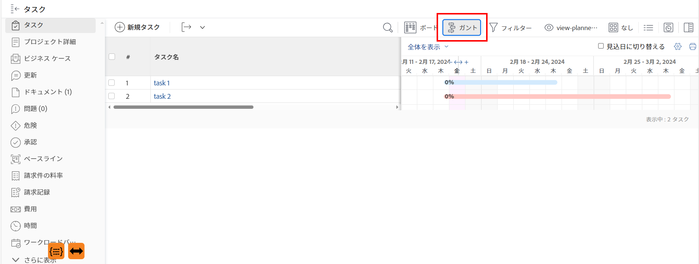
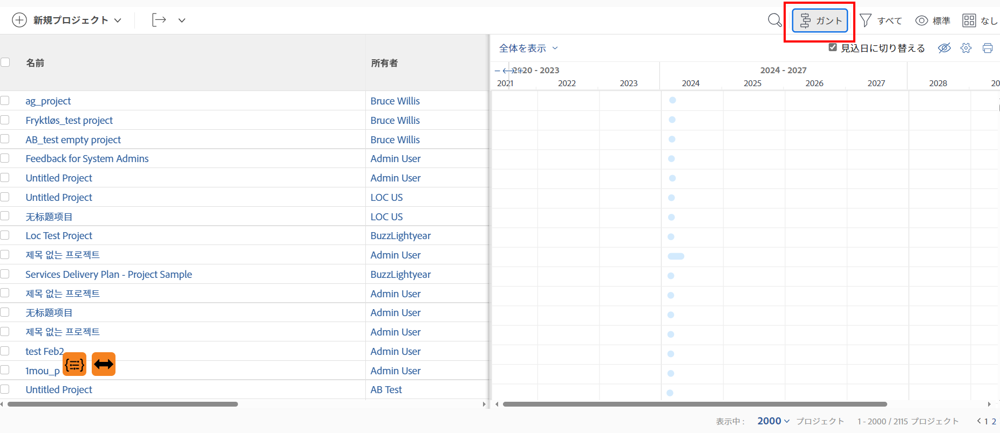

# の基本を学ぶ [!UICONTROL ガントチャート]

Adobe Workfrontのガントチャートは、タスクまたはプロジェクトのリストのタイムラインを視覚的に表します。

In [!DNL Adobe Workfront]、2 つあります [!UICONTROL ガントチャート] 同様の機能を備えています。

* **タスクリスト [!UICONTROL ガントチャート]**：タスクとそのタイムラインに関する情報をプロジェクトレベルで表示します。 類似 [!UICONTROL ガントチャート] テンプレートレベルのテンプレートタスクに関する情報を表示します。
* **プロジェクトリスト [!UICONTROL ガントチャート]**：プロジェクトとそのタイムラインに関する情報を表示します。

見た目と感じ方は似ていますが、それぞれの機能は異なります。

## ガントチャートに関する考慮事項

* 情報は、次の場所で編集できます [!UICONTROL ガントチャート]:
   * タスクリスト
* 次の情報は編集できません [!UICONTROL ガントチャート]:
   * テンプレートタスクリスト
   * プロジェクトリスト
* 次の項目はありません： [!UICONTROL ガントチャート] オプションを使用します。
* 両方のタスクリストに表示する情報を設定できます [!UICONTROL ガントチャート] およびプロジェクトリスト [!UICONTROL ガントチャート].
* 色やフォントを設定することはできません。 [!UICONTROL ガントチャート] 情報が表示されます。
* タスクから情報を更新すると、両方のタスクリストに自動的に反映されます [!UICONTROL ガントチャート] およびプロジェクトリスト [!UICONTROL ガントチャート].
* テンプレートタスクから情報を更新すると、テンプレートタスクリストに自動的に反映されます [!UICONTROL ガントチャート].

## 次にアクセス： [!UICONTROL ガントチャート]

The [!UICONTROL ガント] のグラフ [!DNL Workfront]  タスクまたはプロジェクトのリストを視覚的に表現します。

タスクリストを表示できます [!UICONTROL ガントチャート] を、プロジェクトのタスクリストまたはタスクレポートから直接開きます。

プロジェクトリストを表示できます [!UICONTROL ガントチャート] （プロジェクトリストまたはプロジェクトレポート）。

* [タスクリスト [!UICONTROL ガントチャート]](#task-list-gantt-chart)
* [プロジェクトリスト [!UICONTROL ガントチャート]](#project-list-gantt-chart)

### タスクリスト [!UICONTROL ガントチャート] {#task-list-gantt-chart}

<!--The task list [!UICONTROL Gantt Chart] is accessible in the following areas:

* In a Project

   * [!UICONTROL Tasks] section
   * [!UICONTROL Subtasks] section of a task

* In a [!UICONTROL Template]

* In a [!UICONTROL Task] report-->

タスクリストにアクセスするには [!UICONTROL ガントチャート] プロジェクトまたはテンプレートの

1. 次のいずれかの領域に移動します。

   * プロジェクトを選択し、「 [!UICONTROL **タスク**] をクリックします。
   * テンプレートを作成し、「 [!UICONTROL **テンプレートタスク**] 左パネル内
   * タスクまたはテンプレートタスクを選択し、「 [!UICONTROL **サブタスク**] をクリックします。
   * タスクレポート

1. 次をクリック： [!UICONTROL **ガント**] アイコン  をタスクリストの最上部に表示します。

   

   タスクリスト [!UICONTROL ガントチャート] がタスクリストの右側に開きます。

1. タスクに表示する情報を設定するには [!UICONTROL ガント] グラフで、 [!UICONTROL **設定**] アイコンをクリックし、次のいずれかのオプションを有効にします。

   * [!UICONTROL 実際の日付]
   * [!UICONTROL 割り当て]
   * [!UICONTROL ベースライン]
   * [!UICONTROL コミット日]
   * [!UICONTROL % 完了]
   * [!UICONTROL クリティカル パス]
   * [!UICONTROL マイルストーンひし形]
   * [!UICONTROL マイルストーン線]
   * [!UICONTROL 先行タスク]
   * [!UICONTROL 進捗状態]
   * [!UICONTROL 見込み日]

1. 次の記事の説明に従って、タスクの編集を開始します。

   * [ガントチャートでの情報の表示方法を設定します](../use-the-gantt-chart/configure-info-on-gantt-chart.md)
   * [タスクリストのガントチャートの情報を更新する](../use-the-gantt-chart/update-info-task-list-gantt.md)

### プロジェクトリスト [!UICONTROL ガントチャート] {#project-list-gantt-chart}

<!--The project list [!UICONTROL Gantt Chart] is accessible in the following areas:

* In the [!UICONTROL Projects] area
* In the [!UICONTROL Projects] section of a [!UICONTROL Portfolio]
* In the [!UICONTROL Projects] section of a [!UICONTROL Program]
* In a [!UICONTROL Project] report-->

プロジェクトリストにアクセスするには [!UICONTROL ガントチャート]:

1. 次のいずれかの領域に移動します。

   * The [!UICONTROL **プロジェクト**] 領域
   * The [!UICONTROL **プロジェクト**] のセクション [!UICONTROL Portfolio]
   * The [!UICONTROL **プロジェクト**] のセクション [!UICONTROL プログラム]
   * A [!UICONTROL **プロジェクト**] レポート

1. 次をクリック： [!UICONTROL **ガント**] アイコンをクリックします。

   

   プロジェクトリスト [!UICONTROL ガントチャート] が開きます。

1. プロジェクトに表示する情報を設定するには [!UICONTROL ガント] グラフで、 [!UICONTROL **設定**] アイコンをクリックし、次のいずれかのオプションを有効にします。

   * [!UICONTROL 実際の日付]
   * [!UICONTROL % 完了]
   * [!UICONTROL マイルストーンひし形]
   * [!UICONTROL マイルストーン線]
   * [!UICONTROL 先行タスク]
   * [!UICONTROL 進捗状態]
   * [!UICONTROL 見込み日]
