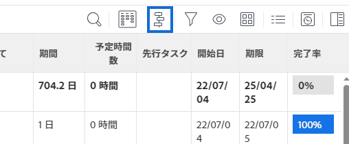

# の基本を学ぶ [!UICONTROL ガントチャート]

In [!DNL Adobe Workfront]、2 つの [!UICONTROL ガントチャート] 同様の機能を備えています。

* タスクリスト [!UICONTROL ガントチャート]:プロジェクトレベルのタスクに関する情報を表示し、編集可能です。
* プロジェクトリスト [!UICONTROL ガントチャート]:は、プロジェクトに関する情報を表示し、編集できません。

見た目と感じ方は似ていますが、それぞれの機能は異なります。

## 次にアクセス： [!UICONTROL ガントチャート]

この [!UICONTROL ガント] グラフ [!DNL Workfront]  タスクまたはプロジェクトのリストを視覚的に表現します。 タスクリストを表示できます [!UICONTROL ガントチャート] を、プロジェクトのタスクリストまたはタスクレポートから直接開きます。 プロジェクトリストを表示できます [!UICONTROL ガントチャート] （プロジェクトリストまたはプロジェクトレポート）

* [タスクリスト [!UICONTROL ガントチャート]](#task-list-gantt-chart)
* [プロジェクトリスト [!UICONTROL ガントチャート]](#project-list-gantt-chart)

### タスクリスト [!UICONTROL ガントチャート] {#task-list-gantt-chart}

タスクリスト [!UICONTROL ガントチャート] は、次の領域でアクセスできます。

* プロジェクト内

   * [!UICONTROL タスク] 領域
   * [!UICONTROL サブタスク] 領域

* テンプレート内

タスクリストにアクセスするには [!UICONTROL ガントチャート]をクリックし、前述のいずれかの領域に移動して、 [!UICONTROL ガントチャート] アイコン

### プロジェクトリスト [!UICONTROL ガントチャート] {#project-list-gantt-chart}

プロジェクトリスト [!UICONTROL ガントチャート] は、次の領域でアクセスできます。

* 内 [!UICONTROL プロジェクト] 領域
* Portfolio内

   * [!UICONTROL プロジェクト] 領域

* プロジェクトレポート内

   * 任意のプロジェクトまたはタスクレポート

* プログラム内

   * 内 [!UICONTROL プロジェクト] 領域

次の手順で [!UICONTROL プロジェクトリストガントチャート]をクリックし、前述のいずれかの領域に移動して、 [!UICONTROL ガントチャート] アイコン

## 情報を [!UICONTROL ガントチャート]

両方のタスクリストに表示する情報を設定できます [!UICONTROL ガントチャート] プロジェクトリスト [!UICONTROL ガントチャート].\
色やフォントは設定できません。 [!UICONTROL ガントチャート] 情報が表示されます。

* [タスクリスト [!UICONTROL ガントチャート]](#task-list-gantt-chart)
* [プロジェクトリスト [!UICONTROL ガントチャート]](#project-list-gantt-chart)

### タスクリスト [!UICONTROL ガントチャート] {#task-list-gantt-chart-1}

タスクリストでは、次の表示オプションを使用できます [!UICONTROL ガントチャート]:

* [!UICONTROL 実際の日付]
* [!UICONTROL 割り当て]
* [!UICONTROL ベースライン]
* [!UICONTROL コミット日]
* [!UICONTROL % 完了]
* [!UICONTROL クリティカル パス]
* [!UICONTROL マイルストーンひし形]
* [!UICONTROL マイルストーン線]
* [!UICONTROL 先行タスク]
* [!UICONTROL 進捗状態]
* [!UICONTROL 見込日]

上記の表示オプションについて詳しくは、 [情報を [!UICONTROL ガントチャート]](../../../manage-work/gantt-chart/use-the-gantt-chart/configure-info-on-gantt-chart.md).

### プロジェクトリスト [!UICONTROL ガントチャート] {#project-list-gantt-chart-1}

プロジェクトリストでは、次の表示オプションを使用できます [!UICONTROL ガントチャート]:

* [!UICONTROL 実際の日付]
* [!UICONTROL % 完了]
* [!UICONTROL マイルストーンひし形]
* [!UICONTROL マイルストーン線]
* [!UICONTROL 先行タスク]
* [!UICONTROL 進捗状態]
* [!UICONTROL 見込み日]

上記の表示オプションについて詳しくは、 [情報を [!UICONTROL ガントチャート]](../../../manage-work/gantt-chart/use-the-gantt-chart/configure-info-on-gantt-chart.md).

## を更新します。 [!UICONTROL ガントチャート]

タスクリストから情報を更新すると、両方のタスクリストに自動的に反映されます [!UICONTROL ガントチャート] プロジェクトリスト [!UICONTROL ガントチャート].

* [タスクリスト [!UICONTROL ガントチャート]](#task-list-gantt-chart)
* [プロジェクトリスト [!UICONTROL ガントチャート]](#project-list-gantt-chart)

### タスクリスト [!UICONTROL ガントチャート] {#task-list-gantt-chart-2}

プロジェクトでは、タスクリストを更新できます [!UICONTROL ガントチャート] 直接 [!UICONTROL ガントチャート] またはタスクリストから。 詳しくは、 [タスクリストの情報を更新 [!UICONTROL ガントチャート]](../../../manage-work/gantt-chart/use-the-gantt-chart/update-info-task-list-gantt.md).

テンプレートでは、タスクリスト [!UICONTROL ガントチャート] テンプレートのタスクリストでおこなわれた更新を反映します。 この [!UICONTROL ガントチャート] は編集できません。

### プロジェクトリスト [!UICONTROL ガントチャート] {#project-list-gantt-chart-2}

この [!UICONTROL プロジェクトリストガントチャート] は、各プロジェクトのタスクリストでおこなわれた更新を反映します。 この [!UICONTROL ガントチャート] は編集できません。

## 次に関する情報を表示： [!UICONTROL ガントチャート]

タスクリスト [!UICONTROL ガントチャート] およびプロジェクトリスト [!UICONTROL ガントチャート] タスクとプロジェクトに関する情報を表示します。 詳しくは、 [情報を [!UICONTROL ガントチャート]](../../../manage-work/gantt-chart/use-the-gantt-chart/view-info-in-gantt.md).
