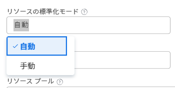

# リソースのレベル設定 [!UICONTROL ガントチャート]

プロジェクトでのリソースの平準化には、次の 2 つの目的があります。

* 担当者の時間の過剰配分を自動的に調整する。
* プロジェクトの現実的なタスクスケジュールを自動的に作成する。

## アクセス要件

この記事の手順を実行するには、次のアクセス権が必要です。

<table style="table-layout:auto"> 
 <col> 
 <col> 
 <tbody> 
  <tr> 
   <td role="rowheader">[!DNL Adobe Workfront] plan*</td> 
   <td> 
任意 
 </td> 
  </tr> 
  <tr> 
   <td role="rowheader">[!DNL Workfront] ライセンス*</td> 
   <td> 
[!UICONTROL プラン ] 
 </td> 
  </tr> 
  <tr> 
   <td role="rowheader">アクセスレベル設定*</td> 
   <td> 
プロジェクトへの [!UICONTROL 編集 ] アクセス
 
<b>メモ</b>

まだアクセス権がない場合は、 [!DNL Workfront] 管理者（アクセスレベルに追加の制限を設定している場合） を参照してください。 [!DNL Workfront] 管理者はアクセスレベルを変更できます。詳しくは、 <a href="../../../administration-and-setup/add-users/configure-and-grant-access/create-modify-access-levels.md" class="MCXref xref">カスタムアクセスレベルの作成または変更</a>.
 </td>
</tr> 
  <tr> 
   <td role="rowheader">オブジェクトの権限</td> 
   <td> 
プロジェクトへの [!UICONTROL 管理 ] アクセス
 
追加のアクセス権のリクエストについて詳しくは、 <a href="../../../workfront-basics/grant-and-request-access-to-objects/request-access.md" class="MCXref xref">オブジェクトへのアクセスのリクエスト </a>.
 </td> 
  </tr> 
 </tbody> 
</table>

&#42;ご利用のプラン、ライセンスの種類、アクセス権を確認するには、 [!DNL Workfront] 管理者。

## リソースの平準化の概要

同じリソースを 2 つの異なるタスクに割り当てる場合は、リソースの平準化を使用して、同時に発生しないようにタスクのタイムラインを調整できます。

プロジェクトのリソースを平準化する場合は、次の点を考慮してください。

* リソースの平準化は 1 つのプロジェクトにのみ適用されるため、 [!DNL Adobe Workfront] では、一度に複数のプロジェクトにわたるリソースのレベルを設定しません。
* 次の場合 **[!UICONTROL 労力に基づく]** が **[!UICONTROL 期間のタイプ]**, [!DNL Workfront] はリソースをレベル設定しません。
* 複数のユーザーが同じタスクに割り当てられている場合、平準化はキャンセルされます。
* タイプの条件 **[!UICONTROL タスクの制約]** は、リソースの平準化よりも優先されます。 例えば、 **[!UICONTROL 固定日付]** が [!UICONTROL タスクの制約]リソースの平準化によってタスクの日付が変更されることはありません。
* 先行関係は、リソースの平準化よりも優先されます。
* **[!UICONTROL リソースの平準化]** に設定する必要があります **[!UICONTROL 手動]** の平準化を調整するためのプロジェクトの [!UICONTROL ガントチャート]. プロジェクトに対する管理権限を持っている場合は、プロジェクトでこの設定を調整し、「 」を選択することで、システムが自動的にリソースをレベル設定できます **[!UICONTROL 自動]** の代わりに **[!UICONTROL 手動]** （内） **[!UICONTROL プロジェクトを編集]** ボックス。

  

* プロジェクトの所有者またはタスクの担当者は、タスクに平準化遅延を設定して、タスクに余分な時間が必要になる可能性が高いことを示すことができます。 タスクに平準化遅延を追加する方法については、「 [タスクの平準化遅延の更新](../../../manage-work/tasks/task-information/task-leveling-delay.md).

## リソースの平準化を [!UICONTROL ガントチャート]

タスクリストを使用できます。 [!UICONTROL ガントチャート] を使用して、リソースをレベル化します。

1. レベルを設定するプロジェクトに移動します。
1. Adobe Analytics の **[!UICONTROL タスク]** 「 」領域で、 **[!UICONTROL ガントチャート]** アイコン。

   すべての変更は、 **[!UICONTROL 自動保存]** 」オプションが有効になっている。 これはデフォルトで有効になっています。

1. （オプション） **[!UICONTROL プラン] mode** アイコンと選択 **[!UICONTROL 手動での標準保存]** または **[!UICONTROL タイムライン計画]** をクリックして、手動で変更を保存します。

   >[!TIP]
   >
   >リソースを  [!UICONTROL ガントチャート] 時に [!UICONTROL 自動保存] 」オプションが有効になっている。

   

1. 次をクリック： **[!UICONTROL レベルリソース]** ドロップダウンメニュー。

   

1. 次のいずれかのオプションを選択します。

   * **[!UICONTROL 今すぐレベル]**：選択したタスクにリソースの平準化を適用します。
   * **[!UICONTROL 平準化の解除]**：選択したタスクからすべてのリソースの平準化を削除します。

   >[!NOTE]
   >
   >同じ期間に発生する複数のタスクにリソースが割り当てられている場合、リソースが割り当て超過になることがあります。

1. （オプションおよび条件付き）自動保存オプションを無効にした場合、 **[!UICONTROL 取り消し]** または&#x200B;**[!UICONTROL やり直し]** アイコンを使用します。

   >[!TIP]
   >
   >以下のキーボードショートカットを使用して、 [!UICONTROL ガントチャート]:
   >
   >* [!DNL Mac]：使用 [!UICONTROL Command + Z] 取り消しおよび [!UICONTROL Command + Shift + Z] やり直しに使用します。
   >* Windows：次を使用します。 [!UICONTROL Ctrl + Z] 取り消しおよび [!UICONTROL Ctrl + Y] やり直しに使用します。

1. クリック **[!UICONTROL 保存]** の右上隅に [!UICONTROL ガントチャート].

<!--

<h2>Overview of Leveling Delay</h2>

(NOTE: moved to its own article: /Content/Manage work/Tasks/Task information/task-leveling-delay.htm) 

At times, there might be conflicts between task schedules on a project. You can level resources or address resource conflicts by rescheduling resources and tasks so that all tasks can be completed within a realistic schedule. 

As the project manager, or the task assignee, you can also add a Leveling Delay on individual tasks to account for any resource or scheduling conflicts. In other words, a task might be scheduled with a delay to ensure that when Adobe Workfront levels the tasks a more realistic schedule overcomes resource conflicts.

To manually add a Leveling Delay to a task:

<ol>
<li value="1">Navigate to a task for which you want to add a Leveling Delay.</li>
<li value="2"> 
 Click the <strong>More icon</strong> to the right of the task name, then click <strong>Edit</strong>. 
  </li>
<li value="3">Click <strong>Settings</strong>. </li>
<li value="4">Specify the <strong>Leveling Delay</strong>, in hours. This is the time that the resource will be delayed starting the task due to resource conflicts.</li>
<li value="5">Click <strong>Save Changes</strong>. </li>
</ol>

-->
