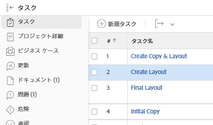
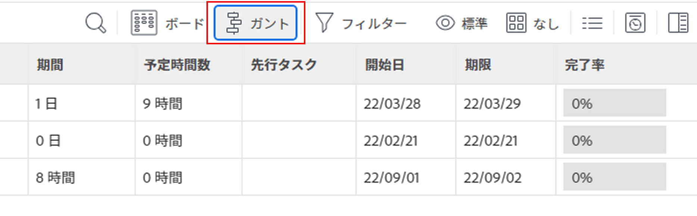
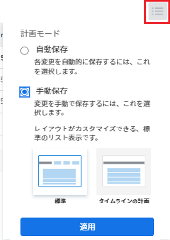
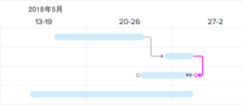
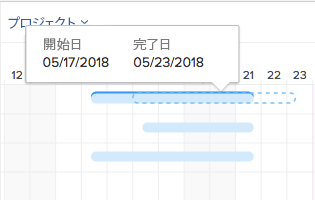
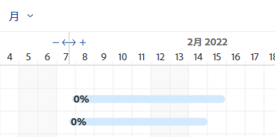
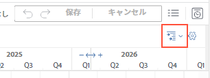

# タスクリストの情報を更新 [!UICONTROL ガントチャート]

タスクリスト [!UICONTROL ガントチャート] プロジェクトまたはテンプレート上のタスクの詳細を表示します。

テンプレートでは、タスクリスト [!UICONTROL ガントチャート] テンプレートのタスクリストでタスクレベルでおこなわれた更新を反映します。 次の項目は編集できません： [!UICONTROL ガントチャート] テンプレートに関連付けられている。

プロジェクトでは、タスクリスト内のタスク情報を直接更新できます [!UICONTROL ガントチャート].

この記事では、タスクリストで直接実行できる次の操作について説明します [!UICONTROL ガントチャート]:

* タスク期間の変更
* 先行関係を作成または削除する
* タスクの開始日と終了日の変更
* 完了率の更新
* プロジェクトリソースのレベル設定

## アクセス要件

この記事の手順に従うには、次の手順を実行する必要があります。

<table style="table-layout:auto"> 
 <col> 
 <col> 
 <tbody> 
  <tr> 
   <td role="rowheader">[!DNL Adobe Workfront] 計画*</td> 
   <td> 
任意 
 </td> 
  </tr> 
  <tr> 
   <td role="rowheader">[!DNL Adobe Workfront] ライセンス*</td> 
   <td> 
[!UICONTROL プラン ] 
 </td> 
  </tr> 
  <tr> 
   <td role="rowheader">アクセスレベル設定*</td> 
   <td> 
[!UICONTROL 編集 ] によるプロジェクトとタスクへのアクセス
 
注意：まだアクセス権がない場合は、 [!DNL Workfront] 管理者（アクセスレベルに追加の制限を設定している場合） を参照してください。 [!DNL Workfront] 管理者はアクセスレベルを変更できます。詳しくは、 <a href="../../../administration-and-setup/add-users/configure-and-grant-access/create-modify-access-levels.md" class="MCXref xref">カスタムアクセスレベルの作成または変更</a>.
 </td> 
  </tr> 
  <tr> 
   <td role="rowheader">オブジェクト権限</td> 
   <td> 
プロジェクトおよびタスクへの [!UICONTROL 管理 ] アクセス 
 
追加のアクセス権のリクエストについて詳しくは、 <a href="../../../workfront-basics/grant-and-request-access-to-objects/request-access.md" class="MCXref xref">オブジェクトへのアクセスのリクエスト </a>.
 </td> 
  </tr> 
 </tbody> 
</table>

&#42;ご利用のプラン、ライセンスの種類、アクセス権を確認するには、 [!DNL Workfront] 管理者。

## タスク期間の変更

1. 変更するプロジェクトに移動します。
1. クリック **[!UICONTROL タスク]** をクリックします。

   

1. 次をクリック： **[!UICONTROL ガントチャート]** アイコン

   

   すべての変更は、 **[!UICONTROL 自動保存]** 」オプションが有効になっている。 これはデフォルトで有効になっています。

1. （オプション） **[!UICONTROL プランモード]** アイコンと選択 **[!UICONTROL 手動での標準保存]** または **[!UICONTROL タイムライン計画]** をクリックして、手動で変更を保存します。

   

1. タスクのタイムラインにマウスポインターを置き、タイムラインインジケーターを別の日付にドラッグします。
1. タスクの正しい新しい完了日になったら、インジケーターをドロップします。
1. （オプションおよび条件付き）変更を手動で保存することを選択した場合、 **[!UICONTROL 取り消し]** または&#x200B;**[!UICONTROL やり直し]** アイコンを使用します。

   >[!TIP]
   >
   >ガントチャートの変更の取り消しややり直しを行うには、次のキーボードショートカットを使用します。
   >
   >   
   >   
   >   * [!DNL Mac]:用途 [!UICONTROL Command + Z] 取り消しおよび [!UICONTROL Command + Shift + Z] やり直しに使用します。
   >   * [!DNL Windows]:用途 [!UICONTROL Ctrl + Z] 取り消しおよび [!UICONTROL Ctrl + Y] やり直しに使用します。
   >   
   >

1. クリック **[!UICONTROL 保存]** の右上隅に [!UICONTROL ガントチャート].

## 先行関係を作成または削除する

1. 変更するプロジェクトに移動します。
1. 内 **[!UICONTROL タスク]** 」領域で、 **[!UICONTROL ガントチャート]** アイコン

   この **[!UICONTROL 自動保存]** 「 」オプションはデフォルトで選択されています。この場合、すべての変更が自動的に保存されます。

   

1. （オプション） **[!UICONTROL プランモード]** アイコンと選択 **[!UICONTROL 手動での標準保存]** または **[!UICONTROL タイムライン計画]** をクリックして、手動で変更を保存します。

   

1. 先行タスク関係を作成するには、タスクの開始点をクリックし、タスクの終了点までドラッグします。
1. 先行関係を削除するには、2 つのタスクを接続する先行関係をクリックして選択し、 **[!UICONTROL 削除]** キーボードで\
   

1. （オプションおよび条件付き）変更を手動で保存することを選択した場合、 **[!UICONTROL 取り消し]** または&#x200B;**[!UICONTROL やり直し]** アイコンを使用します。

   >[!TIP]
   >
   >ガントチャートの変更の取り消しややり直しを行うには、次のキーボードショートカットを使用します。
   >
   >   
   >   
   >   * [!DNL Mac]:用途 [!UICONTROL Command + Z] 取り消しおよび [!UICONTROL Command + Shift + Z] やり直しに使用します。
   >   * [!DNL Windows]: [!UICONTROL Ctrl + Z キーを使用] 取り消しおよび [!UICONTROL Ctrl + Y] やり直しに使用します。
   >   
   >

1. 「**[!UICONTROL 保存]**」をクリックします。

## タスクの開始日と終了日の変更

1. 変更するプロジェクトに移動します。
1. 内 **[!UICONTROL タスク]** 」領域で、 **[!UICONTROL ガントチャート]** アイコン

   すべての変更は、 **[!UICONTROL 自動保存]** 」オプションが有効になっている。 これはデフォルトで有効になっています。

   

1. （オプション） **[!UICONTROL プランモード]** アイコンと選択 **[!UICONTROL 手動での標準保存]** または **[!UICONTROL タイムライン計画]** をクリックして、手動で変更を保存します。

   

1. タスクの中央にマウスポインターを置き、複数方向の矢印を見つけます。
1. タスクをクリックし、目的の日付までドラッグします。

   

1. タスクの制約に影響を与えるようにタスクの日付を変更する場合は、 **[!UICONTROL 確定]** タスク制約の変更を確認します。

   >[!NOTE]
   >
   >タスクに次の制約がある場合、システムは [!UICONTROL タスク制約] から [!UICONTROL 今すぐ開始] プロジェクトが [!UICONTROL 開始日] または [!UICONTROL 次の日までに完了] プロジェクトが [!UICONTROL 完了日]:
   >
   >   
   >   
   >   * [!UICONTROL できるだけ早く]
   >   * [!UICONTROL できるだけ遅く]
   >   * [!UICONTROL 最も早い空き時間]
   >   * [!UICONTROL 最も遅い空き時間]
   >   
   >   
   >場合によっては、先行タスクの関係がタスクの先行を妨げ、タスクの移動が許可されないことがあります。

1. （オプションおよび条件付き）変更を手動で保存することを選択した場合、 **[!UICONTROL 取り消し]** または&#x200B;**[!UICONTROL やり直し]** アイコンを使用します。

   >[!TIP]
   >
   >以下のキーボードショートカットを使用して、 [!UICONTROL ガントチャート]:
   >
   >   
   >   
   >   * [!DNL Mac]:用途 [!UICONTROL Command + Z] 取り消しおよび [!UICONTROL Command + Shift + Z] やり直しに使用します。
   >   * [!DNL Windows]:用途 [!UICONTROL Ctrl + Z] 取り消しおよび [!UICONTROL Ctrl + Y] やり直しに使用します。
   >   
   >

1. 「**[!UICONTROL 保存]**」をクリックします。

## 完了率の更新

1. 変更するプロジェクトに移動します。
1. 内 **[!UICONTROL タスク]** 」領域で、 **[!UICONTROL ガントチャート]** アイコン

   

   すべての変更は、 **[!UICONTROL 自動保存]** 」オプションが有効になっている。 これはデフォルトで有効になっています。

1. （オプション） **[!UICONTROL プランモード]** アイコンと選択 **[!UICONTROL 手動での標準保存]** または **[!UICONTROL タイムライン計画]** をクリックして、手動で変更を保存します。
1. タスク内の割合番号をダブルクリックし、数値を入力します。

   >[!IMPORTANT]
   >
   >必ず [!UICONTROL %完了] 選択された [!UICONTROL オプション] ダイアログが表示されます。 これをおこなうには、 **[!UICONTROL オプション]** アイコンと選択 **[!UICONTROL %完了]**.
   >
   >
   >   >
   >

1. （オプションおよび条件付き）変更を手動で保存することを選択した場合、 **[!UICONTROL 取り消し]** または&#x200B;**[!UICONTROL やり直し]** アイコンを使用します。

   >[!TIP]
   >
   >以下のキーボードショートカットを使用して、 [!UICONTROL ガントチャート]:
   >
   >   
   >   
   >   * [!DNL Mac]:用途 [!UICONTROL Command + Z] 取り消しおよび [!UICONTROL Command + Shift + Z] やり直しに使用します。
   >   * [!DNL Windows]:用途 [!UICONTROL Ctrl + Z] 取り消しおよび [!UICONTROL Ctrl + Y] やり直しに使用します。
   >   
   >

1. クリック **[!UICONTROL 保存]** の右上隅に [!UICONTROL ガントチャート].

## プロジェクトリソースのレベル設定

タスクリストを使用できます [!UICONTROL ガントチャート] を使用して、リソースをレベル化します。

リソースの平準化に関する情報 [!UICONTROL ガントチャート]を参照してください。 [リソースのレベル設定 [!UICONTROL ガントチャート]](../../../manage-work/gantt-chart/use-the-gantt-chart/level-resources-in-gantt.md).

<!--

(NOTE:&nbsp;this is drafted because I moved the whole content to the article linked above)

<ol>
<li value="1">Go to the project you want to level.</li>
<li value="2"> 
 In the <strong>Tasks</strong> area, click the <strong>Gantt chart</strong> icon.
 
All changes are saved automatically when the <strong>Autosave</strong> option is enabled. It is enabled by default. 
 </li>
<li value="3">

(Optional) Click the <strong>Plan mode</strong> icon and select <strong>Manual save Standard</strong> or <strong>Timeline Planning</strong> to save your changes manually.
 <note type="tip">
You cannot level resources in the Gantt chart when the Autosave option is enabled.
</note>

  

 </li>
<li value="4"> 
Click the <strong>Level Resources</strong> drop-down menu.
 
  
 </li>
<li value="5">Select one of following options:
<ul>
<li><strong>Level Now</strong>: Applies resource leveling to the selected task.</li>
<li>
<strong>Clear Leveling</strong>: Removes all resource leveling from the selected task.
</li>
</ul><note type="note">
Your resources might be overallocated if they are assigned to multiple tasks which occur during the same time frame.
</note></li>
<li value="6"> 
(Optional and conditional) If you have disabled the Autosave option, click the <strong>Undo</strong> or<strong>Redo</strong> icons if you want to cancel or duplicate any of the changes. 
 <note type="tip">

You can use the following keyboard shortcuts to undo or redo changes on the Gantt chart:

<ul>
<li>Mac: Use Command + Z to undo and Command + Shift + Z to redo.</li>
<li>Windows: Use Ctrl + Z to undo and Ctrl + Y to redo.</li>
</ul>
</note> </li>
<li value="7">Click <strong>Save</strong> in the upper-right corner of the Gantt chart.</li>
</ol>

-->

<!--
<h2 data-mc-conditions="QuicksilverOrClassic.Draft mode"> </h2>
-->
