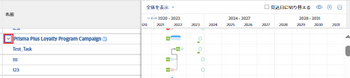
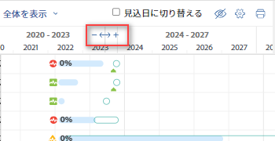
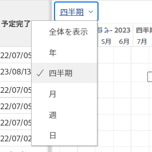

# 情報を  [!UICONTROL ガントチャート]

タスクリスト [!UICONTROL ガントチャート] およびプロジェクトリスト [!UICONTROL ガントチャート] プロジェクトとタスクに関する情報を表示します。

## アクセス要件

この記事の手順に従うには、次の手順を実行する必要があります。

<table style="table-layout:auto"> 
 <col> 
 <col> 
 <tbody> 
  <tr> 
   <td role="rowheader">[!DNL Adobe Workfront] plan*</td> 
   <td> 
任意 
 </td> 
  </tr> 
  <tr> 
   <td role="rowheader">[!DNL Adobe Workfront] ライセンスの概要*</td> 
   <td> 
[!UICONTROL Review] 以降
 </td> 
  </tr> 
  <tr> 
   <td role="rowheader">アクセスレベル設定*</td> 
   <td> 
[!UICONTROL 表示 ] 以降のプロジェクトおよびタスクへのアクセス権
 
<b>メモ</b>

まだアクセス権がない場合は、 [!DNL Workfront] 管理者（アクセスレベルに追加の制限を設定している場合） を参照してください。 [!DNL Workfront] 管理者はアクセスレベルを変更できます。詳しくは、 <a href="../../../administration-and-setup/add-users/configure-and-grant-access/create-modify-access-levels.md" class="MCXref xref">カスタムアクセスレベルの作成または変更</a>.
 </td>
</tr> 
  <tr> 
   <td role="rowheader">オブジェクトの権限</td> 
   <td> 
プロジェクトへの [!UICONTROL 表示 ] 以降のアクセス権
 
追加のアクセス権のリクエストについて詳しくは、 <a href="../../../workfront-basics/grant-and-request-access-to-objects/request-access.md" class="MCXref xref">オブジェクトへのアクセスのリクエスト </a>.
 </td> 
  </tr> 
 </tbody> 
</table>

&#42;ご利用のプラン、ライセンスの種類、アクセス権を確認するには、 [!DNL Workfront] 管理者。

## 次を見つけます。  [!UICONTROL ガントチャート]

タスクリストガントチャートとプロジェクトリストの両方を見つけることができます [!UICONTROL ガントチャート] Workfront内の複数の領域から 詳しくは、 [の基本を学ぶ [!UICONTROL ガントチャート]](../../../manage-work/gantt-chart/use-the-gantt-chart/get-started-with-gantt.md).

## タスクを表示 [!UICONTROL クリティカルパス]

プロジェクトリスト内 [!UICONTROL ガントチャート]、にないタスク [!UICONTROL クリティカルパス] は、明るい青の水平線として表示されます。 にあるタスク [!UICONTROL クリティカルパス] プロジェクトの横に赤い線が表示されます。

タスクの詳細については、 [!UICONTROL クリティカルパス]を参照してください。 [プロジェクトの概要 [!UICONTROL クリティカルパス]](../../../manage-work/tasks/manage-tasks/critical-path.md).

## プロジェクト一覧にタスク情報を表示する [!UICONTROL ガントチャート]

プロジェクトのタスク情報は、プロジェクト一覧から直接表示できます。 タスクは、各プロジェクトの名前の下に表示されます。

>[!NOTE]
>
>プロジェクトリストからタスクを編集することはできません [!UICONTROL ガントチャート].

次の領域にあるプロジェクトのリストから、プロジェクトのタスク情報を直接表示できます。

* Adobe Analytics の [!UICONTROL プロジェクト] 領域
* Portfolio内
* プログラム内

プロジェクトのリストからプロジェクト内のタスクを表示するには、次の手順に従います。

1. 上記の領域の 1 つに移動します。

   例えば、 [!UICONTROL メインメニュー]をクリックし、 **[!UICONTROL プロジェクト]**.

   プロジェクトのリストが表示されます。

1. 次をクリック： **[!UICONTROL ガントチャート]** アイコン  をクリックします。

   <!--
   
(NOTE: images conditioned for classic and nwe)  

   -->

1. 次をクリック： **[!UICONTROL タスクリストを表示]** アイコン。

1. 左側のプロジェクトリストで、プロジェクト名の横にあるドロップダウン矢印をクリックして、そのプロジェクトの下にあるタスクを表示します。\
   これにより、  [!UICONTROL ガントチャート].\
   

1. （オプション） **[!UICONTROL 印刷]** 右上隅のアイコンを使用して、 [!UICONTROL ガントチャート].

   >[!NOTE]
   >
   >プロジェクトリスト [!UICONTROL ガントチャート] は、プロジェクトのみを書き出します。 タスク情報は含まれていません。

## 情報が [!UICONTROL ガントチャート]

期間は、 [!UICONTROL ガントチャート] 詳細なレベルで情報を表示する場合や、日、週、月、四半期、年の各ビューにすばやく移動する場合は、次の手順を実行します。

* [詳細なレベルで期間を変更](#change-the-time-period-on-a-granular-level)
* [日、週、月、四半期、年別に情報を表示](#view-information-by-day-week-month-quarter-or-year)

### 詳細なレベルで期間を変更 {#change-the-time-period-on-a-granular-level}

1. タイムラインの上にマウスポインターを置く  [!UICONTROL ガントチャート]をクリックし、左から右にズームインジケーターをドラッグして、タイムラインを展開または縮小します。\
   

### 日、週、月、四半期、年別に情報を表示 {#view-information-by-day-week-month-quarter-or-year}

1. Adobe Analytics の  [!UICONTROL ガントチャート]をクリックし、時間枠ドロップダウンメニューをクリックします。

   

1. 次の利用可能なオプションから期間を選択します。

   * **[!UICONTROL すべてに合わせる]**：このオプションは、プロジェクト全体のタイムラインを表示します。
   * **[!UICONTROL すべてのプロジェクト]**：このオプションは、プロジェクトリストガントチャートでのみ使用できます。
   * **[!UICONTROL 年]**
   * **[!UICONTROL 四半期]**
   * **[!UICONTROL 月]**
   * **[!UICONTROL 週]**
   * **[!UICONTROL 日]**

1. （オプション）より詳細な期間 ( 例： [!UICONTROL 週] または [!UICONTROL 日]をクリックし、  [!UICONTROL ガントチャート] プロジェクトのタイムライン上で左から右に移動します。\
   タイムラインのスナップショット [!UICONTROL ガント] プロジェクト全体を表示するには、が表示されます。

   >[!TIP]
   >
   >タイムラインのスナップショットは、水平スクロールバーをクリックした後にのみ表示されます。

   

1. （オプション）タイムラインスナップショット内の任意の場所をクリックして、プロジェクトの期間内の特定のポイントに移動します。\
   または\
   スナップショットビューアのハンドルをドラッグして、特定のタイムライン範囲を選択し、メインに表示します [!UICONTROL ガント].

## フィルター、ビュー、グループ化の使用

The [!UICONTROL ガントチャート] は、タスクリストに現在表示されている情報を視覚的に表します。 両方のリストにあるオブジェクトにフィルタ、ビュー、グループを適用できます。 [!UICONTROL ガントチャート]s.

>[!CAUTION]
>
>選択した時点では、フィルター、ビューおよびグループを適用できません [!UICONTROL 手動] 保存 [!UICONTROL タイムライン計画] をクリックして、タスクリストに対する変更を保存します。 リスト内のタスクに対する変更を保存する方法については、 [リスト内のタスクの編集](../../../manage-work/tasks/manage-tasks/edit-tasks-in-a-list.md).

リストに適用するフィルタとグループは、プロジェクトリストとタスクリストの両方に反映されます  [!UICONTROL ガントチャート]ガントチャートをエクスポートする際に、s およびも含まれます。

* フィルター\
   リストにフィルターを適用して、リストに表示される情報を制御できます。 [!UICONTROL ガントチャート].\
   フィルターの適用について詳しくは、  [フィルターの概要](../../../reports-and-dashboards/reports/reporting-elements/filters-overview.md).

* グループ化\
   リストに適用するグループは、 [!UICONTROL ガントチャート].\
   グループ化の適用について詳しくは、  [Adobe Workfrontでのグループ化の概要](../../../reports-and-dashboards/reports/reporting-elements/groupings-overview.md).

ビューは、 [!UICONTROL ガントチャート]. ただし、 [!UICONTROL ガントチャート] (  [を書き出します。 [!UICONTROL ガントチャート] PDF](../../../manage-work/gantt-chart/use-the-gantt-chart/export-gantt-chart-to-pdf.md)) の場合、タスクリストは [!UICONTROL ガントチャート]現在のビューをリストに適用した状態。

## 表示オプションを設定する

両方に表示する情報の種類を選択できます [!UICONTROL ガントチャート]. 詳しくは、 [情報を [!UICONTROL ガントチャート]](../../../manage-work/gantt-chart/use-the-gantt-chart/configure-info-on-gantt-chart.md).
