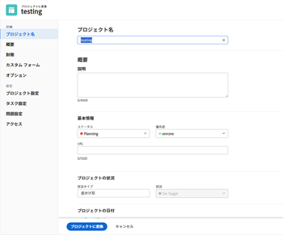

# イシューをAdobe Workfrontのプロジェクトに変換する

問題の送信後に、問題を完了するために必要な作業が他にもある場合は、その問題をプロジェクトに変換できます。

イシューを新しいプロジェクトに変換するか、テンプレートを使用してプロジェクトに変換できます。 この記事では、問題をプロジェクトに変換する両方の方法について説明します。

>[!IMPORTANT]
>
>問題の変換に関する一般的な情報については、記事もお読みください [Adobe Workfrontでの変換の問題の概要](../../../manage-work/issues/convert-issues/convert-issues.md).

問題からプロジェクトを作成する場合、プロジェクト上の一部のフィールドが他のオブジェクトから入力されます。 詳細については、この記事の「新しいプロジェクトのデフォルト設定」の節を参照してください [プロジェクトの作成](../../../manage-work/projects/create-projects/create-project.md).

## アクセス要件

この記事の手順を実行するには、次のアクセス権が必要です。

<table style="table-layout:auto"> 
 <col> 
 <col> 
 <tbody> 
  <tr> 
   <td role="rowheader">Adobe Workfront plan*</td> 
   <td> 
任意
 </td> 
  </tr> 
  <tr> 
   <td role="rowheader">Adobe Workfront license*</td> 
   <td> 
計画 
 </td> 
  </tr> 
  <tr> 
   <td role="rowheader">アクセスレベル設定*</td> 
   <td> 
問題、タスクおよびプロジェクトへのアクセスを編集
 
財務データへのアクセスを編集して、問題から変換された予測の財務情報を更新します
 
注意：まだアクセス権がない場合は、Workfront管理者に、アクセスレベルに追加の制限が設定されているかどうかを問い合わせてください。 Workfront管理者がアクセスレベルを変更する方法について詳しくは、 <a href="../../../administration-and-setup/add-users/configure-and-grant-access/create-modify-access-levels.md" class="MCXref xref">カスタムアクセスレベルの作成または変更</a>.
 </td> 
  </tr> 
  <tr> 
   <td role="rowheader">オブジェクトの権限</td> 
   <td> 
問題に対する権限を表示
 
問題の変換後、プロジェクトに対する管理権限を取得します。
 
追加のアクセス権のリクエストについて詳しくは、 <a href="../../../workfront-basics/grant-and-request-access-to-objects/request-access.md" class="MCXref xref">オブジェクトへのアクセスのリクエスト </a>.
 </td> 
  </tr> 
 </tbody> 
</table>

*保有するプラン、ライセンスの種類、アクセス権を確認するには、Workfront管理者にお問い合わせください。

## イシューのプロジェクトへの変換

イシューを空のプロジェクトに変換したり、テンプレートを使用してイシューをプロジェクトに変換したりできます。

1. プロジェクトに移動し、「 **[!UICONTROL 問題]** をクリックします。
1. 表示される問題の一覧で、次のいずれかの操作を行います。

   * イシューを空のプロジェクトに変換するには、イシューの名前をクリックし、 **[!UICONTROL その他]** メニュー  問題名の右側に移動し、「 **[!UICONTROL 空のプロジェクトに変換]**.

     または

     問題のリストで問題を選択し、 **[!UICONTROL その他]** メニュー  リストの上部で、「 **[!UICONTROL 空のプロジェクトに変換]**.

     >[!IMPORTANT]
     >
     >「空のプロジェクトに変換」オプションは、システム管理者またはグループ管理者が [!UICONTROL テンプレートを使用せずにプロジェクトを作成することをユーザーに許可する] 好み [!UICONTROL 設定] 領域。 詳しくは、 [システム全体のプロジェクト環境設定の指定](../../../administration-and-setup/set-up-workfront/configure-system-defaults/set-project-preferences.md).

     イシューを変換した後は、手動でタスクをプロジェクトに追加するか、テンプレートをプロジェクトに添付する必要があります。

     次の手順 3e に進みます。

     <!--
     Is this accurate?
     -->

     >[!TIP]
     >   
     >* リクエストキューを使用して問題が作成された場合、新しいプロジェクトはリクエストキューのグループを継承します。
     >* イシューをプロジェクトの「イシュー」セクションに追加して作成した場合、新しいプロジェクトはイシューのプロジェクトの「グループ」を継承します。

   * テンプレートを使用してイシューをプロジェクトに変換するには、次のいずれかの操作を行います。

      * イシューの名前をクリックし、 [!UICONTROL **その他**] メニュー  を問題名の右側に追加します。

        または

      * 問題のリスト、レポートまたはダッシュボードで問題を選択し、 **その他** メニュー  リストの上部で、「 **テンプレートからプロジェクトに変換** をクリックし、 **テンプレートを検索** 」ボックスを選択し、リストに表示されるテンプレートの名前をクリックします。 手順 3 に進みます。

        <!--      
        (is this accurate?)      
        -->

     >[!TIP]
     >
     >お気に入りリストにテンプレートを追加した場合は、 [!UICONTROL **お気に入りのテンプレート**] メニューを開き、使用するテンプレートをクリックします。

     「テンプレートからの新規プロジェクト」ボックスが表示されます。

     

     >[!TIP]
     >
     >問題が承認プロセスに関連付けられている場合、または既に解決オブジェクトに関連付けられている場合は、Workfrontの「プロジェクトに変換」ボックスの上部に警告が表示され、変換中に承認が削除されたり、解決オブジェクトが上書きされたりします。 詳しくは、 [Adobe Workfrontでの変換の問題の概要](../../../manage-work/issues/convert-issues/convert-issues.md).

1. （条件付き）テンプレートを使用してイシューをプロジェクトに変換する場合は、次の手順に進みます。

   1. 右側でテンプレートの詳細を確認します。

      テンプレートの詳細には、以下が含まれます。

      * テンプレートの期間
      * テンプレート所有者
      * 上位 3 つのタスクの名前を含む最上位タスクの数
      * テンプレート内のすべてのタスクの数
      * テンプレートのカスタムフォームの名前

   1. （オプション）テンプレート名の上にマウスポインターを置いて、お気に入りアイコンをクリックします  将来の使用のお気に入りとしてマークする

      >[!TIP]
      >
      >お気に入りに登録できるWorkfront項目は 40 個までです。 これには、テンプレートやその他の項目が含まれます。

   1. クリック [!UICONTROL **テンプレートを使用**] をクリックして、テンプレートを選択します。

      The [!UICONTROL プロジェクトに変換] ボックスが開きます。

      

   1. テンプレートに既にフィールドが入力されている場合、そのフィールドは [!UICONTROL プロジェクトに変換] ボックス。 事前入力された値を編集して、プロジェクトに合わせて調整できます。 詳しくは、 [プロジェクトを編集](../../../manage-work/projects/manage-projects/edit-projects.md).

      >[!TIP]
      >
      >* システム管理者またはグループ管理者は、 [!UICONTROL [ プロジェクトに変換 ] ボックス] プロジェクトの詳細情報を更新し、 [!UICONTROL レイアウトテンプレート].
      >
      >* 次の項目のフィールドを更新するには： [!UICONTROL 金融] セクション内 [!UICONTROL プロジェクトに変換] 必要なボックス [!UICONTROL 編集] ～へのアクセス権 [!UICONTROL 財務データ] を設定します。 次の条件を満たしている場合： [!UICONTROL 表示] ～へのアクセス権 [!UICONTROL 財務データ] アクセスレベルでは、テンプレートから新しいプロジェクトにすべての財務情報が転送され、イシューの変換中は編集できません。 詳しくは、 [財務データへのアクセス権の付与](../../../administration-and-setup/add-users/configure-and-grant-access/grant-access-financial.md) および [テンプレートの共有](../../../workfront-basics/grant-and-request-access-to-objects/share-a-template.md).

   1. （オプションおよび条件付き）「 [!UICONTROL **オプション**] 左のパネルで、使用可能なオプションから「 」を選択します。

      * [!UICONTROL **元の問題を保持し、その解決策をこのプロジェクトに関連付ける**]

        選択を解除すると、元の問題が削除されます。

        >[!NOTE]
        >
        >この設定の状態に関係なく、アクセス権やイシューを削除する権限を持たないユーザーは、イシューを変換する際にイシューを削除できません。 アクセスおよび問題に対する権限について詳しくは、次を参照してください。
        >
        >* [問題へのアクセス権の付与](../../../administration-and-setup/add-users/configure-and-grant-access/grant-access-issues.md)
        > 
        >* [イシューの共有](../../../workfront-basics/grant-and-request-access-to-objects/share-an-issue.md)

      * [!UICONTROL **（ユーザー名）にこのプロジェクトへのアクセスを許可**]

        選択しない場合、問題は [!UICONTROL プライマリ連絡先] には、新しいタスクへのアクセス権がありません。

        >[!NOTE]
        >
        >ここで使用できるオプションは、Workfront管理者がシステム内の全員またはグループに対してどのように設定したかによって異なります。 詳しくは、 [システム全体のタスクと問題の環境設定を構成する](../../../administration-and-setup/set-up-workfront/configure-system-defaults/set-task-issue-preferences.md).
        >
        >
        >また、組織の最上位グループが別々に設定した場合、ここで使用できるオプションは、手順 6 で新しいプロジェクトに選択したグループによって異なります。 詳しくは、 [グループのタスクと問題の環境設定を設定する](../../../administration-and-setup/manage-groups/create-and-manage-groups/configure-task-issue-preferences-group.md).

   1. クリック [!UICONTROL **カスタムForms**] 次のいずれかの操作を行います。

      * テンプレートに添付されているカスタムフォームを確認します。 新しいプロジェクトに転送されます。
      * すべての必須フィールドに有効な情報が入力されていることを確認します。
      * カスタムフォームをドラッグして再配置する  必要な場所に行きます。
      * 次をクリック： **x** プロジェクトに転送しないフォームの右側のアイコン
      * 必要に応じて、問題のカスタムフォーム情報をプロジェクトに転送します。

        >[!TIP]
        >
        >* イシューに複数オブジェクトのカスタムフォームを添付して、イシューとプロジェクトの両方で使用するように設定した場合、イシューとプロジェクトのカスタムフォームの両方にフィールドが存在する場合、フォームに保存された情報はすべて保持されます。
        >* 計算フィールドを持つ複数オブジェクトのカスタムフォームがイシューおよびプロジェクトに添付されている場合、イシューおよびプロジェクトは、フォームの計算カスタムフィールドで参照されているすべてのフィールドと互換性が必要です。 非互換性がある場合は、調整を行うように警告するメッセージが表示されます。 詳しくは、 [レガシーフォームビルダーを使用して計算データをカスタムフォームに追加する](../../../administration-and-setup/customize-workfront/create-manage-custom-forms/add-calculated-data-to-custom-form.md).
        >* 変換用のテンプレートを使用していて、テンプレートに添付されたカスタムフォームに、イシューに添付されたカスタムフォームにもカスタムフィールドが含まれている場合は、イシューのフィールド値が新しいプロジェクトで使用されます。 ただし、問題でカスタムフィールドが空白の場合は、テンプレートの値が使用されます。

   1. クリック [!UICONTROL **プロジェクトに変換**].

      >[!TIP]
      >
      >元のイシューを削除することにした場合、そのイシューはプロジェクトになります。
      >   
      >または
      >  
      >元の問題を保持することにした場合、問題は新しいプロジェクトにリンクされ、プロジェクトが完了すると完了します。
      >
      >一部の問題フィールドはプロジェクトに転送されます。 前の手順で変更しなかった場合、テンプレートで定義されたほとんどのフィールドは、新しく作成されたプロジェクトに自動的に転送されます。 詳しくは、 [Adobe Workfrontでの変換の問題の概要](../../../manage-work/issues/convert-issues/convert-issues.md).

1. （オプション）必要に応じて、その他のプロジ&#x200B;ェクトの詳細（プロジェクト所有者、プロジェクトの日付）およびタスクを設定します。
1. クリック [!UICONTROL **プロジェクトに変換**].

   問題がプロジェクトに変換されました。

1. クリック [!UICONTROL **プロジェクトに移動**] 内側 [!UICONTROL 成功] 通知を作成します。 プロジェクトページが開きます。
