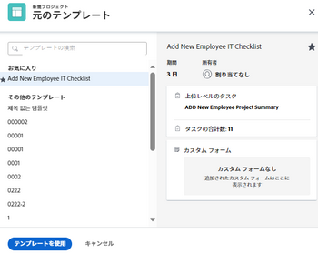

# Adobe Workfront でのイシューからプロジェクトへの変換

<!--Audited: 01/2024-->

イシューの送信後に、イシューを完了するために必要な作業が他にもある場合は、そのイシューをプロジェクトに変換できます。

イシューを新しいプロジェクトに変換するか、テンプレートを使用してイシューをプロジェクトに変換することができます。この記事では、イシューをプロジェクトに変換するための両方の方法について説明します。

>[!IMPORTANT]
>
>問題の変換に関する一般的な情報については、記事もお読みください [Adobe Workfrontでの変換の問題の概要](../../../manage-work/issues/convert-issues/convert-issues.md).

イシューからプロジェクトを作成する場合、プロジェクトの一部のフィールドは他のオブジェクトから入力されます。詳しくは、[プロジェクトの作成](../../../manage-work/projects/create-projects/create-project.md)の記事で「新規プロジェクトのデフォルト設定」の節を参照してください。

## アクセス要件

この記事の手順を実行するには、次のアクセス権が必要です。

<table style="table-layout:auto"> 
 <col> 
 <col> 
 <tbody> 
  <tr> 
   <td role="rowheader">Adobe Workfront プラン</td> 
   <td> 
任意
 </td> 
  </tr> 
  <tr> 
   <td role="rowheader">Adobe Workfront ライセンス</td> 
   <td>
   
新規：標準 
 
    
現在：プラン 
 </td> 
  </tr> 
  <tr> 
   <td role="rowheader">アクセスレベル設定*</td> 
   <td> 
問題、タスクおよびプロジェクトへの編集アクセス権
 
財務データへの編集アクセス権（イシューから変換されたプロジェクトの財務情報を更新するため）
 </td> 
  </tr> 
  <tr> 
   <td role="rowheader">オブジェクト権限</td> 
   <td> 
イシューの表示権限
 
イシューの変換後に、プロジェクトの管理権限を取得します
 </td> 
  </tr> 
 </tbody> 
</table>

この表の情報の詳細については、 [Workfrontドキュメントのアクセス要件](/help/quicksilver/administration-and-setup/add-users/access-levels-and-object-permissions/access-level-requirements-in-documentation.md).

## イシューをプロジェクトに変換

イシューを空のプロジェクトに変換できます。

1. プロジェクトに移動し、左パネルの「**[!UICONTROL 問題]**」をクリックします。
1. 表示されるイシューのリストで、次のいずれかを行います。

   * イシューを空のプロジェクトに変換するには、イシューの名前をクリックし、イシュー名の右側にある&#x200B;**[!UICONTROL その他]**&#x200B;メニューアイコン  をクリックして、「**[!UICONTROL 空白プロジェクトに変換]**」をクリックします。

     または

     イシューのリストでイシューを選択し、リストの上部にある&#x200B;**[!UICONTROL その他]**&#x200B;メニューアイコン  をクリックして、「**[!UICONTROL 空白プロジェクトに変換]**」をクリックします。

     >[!IMPORTANT]
     >
     >「空白プロジェクトに変換」オプションは、システム管理者またはグループ管理者が[!UICONTROL 設定]エリアで「[!UICONTROL ユーザーがテンプレートを使用せずにプロジェクトを作成することを許可]」環境設定を有効にした場合にのみ表示されます。詳しくは、[システム全体のプロジェクト環境設定の指定](../../../administration-and-setup/set-up-workfront/configure-system-defaults/set-project-preferences.md)を参照してください。

     イシューの変換後に、プロジェクトに手動でタスクを追加するか、プロジェクトにテンプレートを添付する必要があります。

     >[!TIP]
     >   
     >* リクエストキューを使用してイシューが作成されている場合、新しいプロジェクトはリクエストキューのグループを継承します。
     >* プロジェクトの「イシュー」セクションに追加してイシューが作成されている場合、新しいプロジェクトはイシューのプロジェクトのグループを継承します。

     >[!TIP]
     >
     >イシューが承認プロセスに関連付けられている場合や、既に解決オブジェクトに関連付けられている場合は、Workfront のプロジェクトに変換ボックスの上部に警告が表示され、変換中に承認が解除されるか解決オブジェクトが上書きされることを通知します。詳しくは、[Adobe Workfront でのイシューの変換の概要](../../../manage-work/issues/convert-issues/convert-issues.md)を参照してください。

1. （オプションおよび条件付き）左側のパネルで「[!UICONTROL **オプション**]」をクリックし、使用可能なオプションから選択します。

   * [!UICONTROL **元のイシューを保持し、その解決策をこのプロジェクトに関連付ける**]

     選択を解除すると、元のイシューが削除されます。

     >[!NOTE]
     >
     >この設定のステータスに関係なく、イシューを削除するアクセス権や権限を持たないユーザーは、イシューを変換する際にイシューを削除できません。イシューに対するアクセス権および権限について詳しくは、次を参照してください。
     >
     >* [イシューへのアクセスの許可](../../../administration-and-setup/add-users/configure-and-grant-access/grant-access-issues.md)
     > 
     >* [イシューの共有](../../../workfront-basics/grant-and-request-access-to-objects/share-an-issue.md)

   * [!UICONTROL **（ユーザー名）にこのプロジェクトへのアクセスを許可**]

     選択しない場合、イシューの[!UICONTROL プライマリ連絡先]には、新規タスクへのアクセス権がありません。

     >[!NOTE]
     >
     >ここで使用できるオプションは、Workfront 管理者がシステム内の全員またはグループに対してどのように設定したかによって異なります。詳しくは、[システム全体のタスクとイシューの環境設定を行う](../../../administration-and-setup/set-up-workfront/configure-system-defaults/set-task-issue-preferences.md)を参照してください。
     >
     >
     >また、組織の最上位グループが別々に設定した場合、ここで使用できるオプションは、手順 6 で新規プロジェクトに選択したグループによって異なります。詳しくは、[グループのタスクとイシューの環境設定を行う](../../../administration-and-setup/manage-groups/create-and-manage-groups/configure-task-issue-preferences-group.md)を参照してください。

1. 「[!UICONTROL **カスタムフォーム**]」をクリックして、次のいずれかの操作を行います。

   * 問題に添付されたカスタムフォームを確認します。 カスタムフォームもプロジェクトする場合は、新しいプロジェクトに転送されます。
   * カスタムフォームの追加
   * すべての必須フィールドに有効な情報が入力されていることを確認します。
   * カスタムフォームを希望の場所にドラッグ  して、カスタムフォームを並べ替えます。
   * 次をクリック： **x** プロジェクトに転送しないフォームの右側のアイコン これにより、プロジェクトからフォームが削除されます。
   * 必要に応じて、イシューのカスタムフォーム情報をプロジェクトに転送します。

     >[!TIP]
     >
     >* イシューに添付された複数オブジェクトのカスタムフォームをイシューとプロジェクトの両方で使用するように設定すると、イシューとプロジェクトのカスタムフォームの両方にフィールドが存在する場合、フォームに保存されたすべての情報が変換時に保持されます。
     >* 計算フィールドを持つ複数オブジェクトのカスタムフォームがイシューおよびプロジェクトに添付されている場合、イシューおよびプロジェクトは、フォームの計算カスタムフィールドで参照されているすべてのフィールドと互換性が必要です。互換性がない場合は、調整を行うように警告するメッセージが表示されます。詳しくは、[レガシーフォームビルダーを使用して計算データをカスタムフォームに追加](../../../administration-and-setup/customize-workfront/create-manage-custom-forms/add-calculated-data-to-custom-form.md)の「マルチオブジェクトカスタムフォームの計算カスタムフィールド」を参照してください。

1. 「[!UICONTROL **プロジェクトに変換**]」をクリックします。

   >[!TIP]
   >
   >元のイシューを削除することにした場合、そのイシューはプロジェクトになります。
   >   
   >または
   >  
   >元のイシューを保持することにした場合、イシューは新規プロジェクトにリンクされ、そのプロジェクトが完了すると完了します。
   >
   >一部の問題フィールドの情報は、変換時に変更しなかった場合に、プロジェクトに転送されます。

1. （オプション）必要に応じて、プロジェクトの詳細（プロジェクト所有者、プロジェクトの日付）とタスクをさらに設定します。
1. 「[!UICONTROL **プロジェクトに変換**]」をクリックします。

   問題がプロジェクトに変換されました。 プロジェクトページが表示されます。

## イシューをテンプレートを使用してプロジェクトに変換する

イシューは、テンプレートを使用してプロジェクトに変換できます。

1. プロジェクトに移動し、左パネルの「**[!UICONTROL 問題]**」をクリックします。
1. 表示されるイシューのリストで、イシューの名前をクリックし、 **[!UICONTROL その他]** メニュー  問題名の右側に移動し、「 **テンプレートからプロジェクトに変換** をクリックし、 **テンプレートを検索** 」ボックスを選択し、リストに表示されるテンプレートの名前をクリックします。 手順 3 に進みます。

   >[!TIP]
   >
   >テンプレートをお気に入りリストに追加してある場合は、[!UICONTROL **お気に入りのテンプレート**]&#x200B;メニューにポインタを合わせ、使用するテンプレートをクリックします。

   テンプレートからの新規プロジェクトボックスが表示されます。

   

   >[!TIP]
   >
   >* イシューが承認プロセスに関連付けられている場合や、既に解決オブジェクトに関連付けられている場合は、Workfront のプロジェクトに変換ボックスの上部に警告が表示され、変換中に承認が解除されるか解決オブジェクトが上書きされることを通知します。詳しくは、[Adobe Workfront でのイシューの変換の概要](../../../manage-work/issues/convert-issues/convert-issues.md)を参照してください。
   >   
   >* リクエストキューを使用してイシューが作成されている場合、新しいプロジェクトはリクエストキューのグループを継承します。
   >* プロジェクトの「イシュー」セクションに追加してイシューが作成されている場合、新しいプロジェクトはイシューのプロジェクトのグループを継承します。

1. 右側でテンプレートの詳細を確認します。

   テンプレートの詳細には、以下の情報が含まれています。

   * テンプレートの期間
   * テンプレート所有者
   * 上位 3 つのタスクの名前を含む上位レベルのタスクの数
   * テンプレート内のすべてのタスクの数
   * テンプレートのカスタムフォームの名前

1. （オプション）テンプレート名の上にマウスポインターを置いて、 **お気に入力** アイコン  将来の使用のお気に入りとしてマークする

   >[!TIP]
   >
   >お気に入りに登録できる Workfront の項目は最大 40 個です。これには、テンプレートやその他の項目が含まれます。

1. 「[!UICONTROL **テンプレートを使用**]」をクリックして、テンプレートを選択します。

   「[!UICONTROL プロジェクトに変換]」ボックスが開きます。

   

1. テンプレートに既にフィールドが入力されている場合、そのフィールドは「[!UICONTROL プロジェクトに変換]」ボックスに事前入力されます。事前入力された値を編集し、プロジェクトに合わせて調整できます。詳しくは、[プロジェクトの編集](../../../manage-work/projects/manage-projects/edit-projects.md)を参照してください。

   >[!TIP]
   >
   >* システム管理者またはグループ管理者は、[!UICONTROL レイアウトテンプレート]のプロジェクトの詳細情報を更新することで、[!UICONTROL 「プロジェクトに変換」ボックス]のフィールドを追加または削除できます。
   >
   >* 「[!UICONTROL プロジェクトに変換]」ボックスの「[!UICONTROL 財務]」セクションのフィールドを更新するには、アクセスレベルで[!UICONTROL 財務データ]への[!UICONTROL 編集]アクセス権が必要です。自身のアクセスレベルで[!UICONTROL 財務データ]への[!UICONTROL 表示]アクセス権を持っている場合、テンプレートから新規プロジェクトにすべての財務情報が転送され、イシューの変換中に編集することはできません。詳しくは、[財務データへのアクセスの許可](../../../administration-and-setup/add-users/configure-and-grant-access/grant-access-financial.md)および[テンプレートの共有](../../../workfront-basics/grant-and-request-access-to-objects/share-a-template.md)を参照してください。

1. （オプションおよび条件付き）左側のパネルで「[!UICONTROL **オプション**]」をクリックし、使用可能なオプションから選択します。

   * [!UICONTROL **元のイシューを保持し、その解決策をこのプロジェクトに関連付ける**]

     選択を解除すると、元のイシューが削除されます。

     >[!NOTE]
     >
     >この設定のステータスに関係なく、イシューを削除するアクセス権や権限を持たないユーザーは、イシューを変換する際にイシューを削除できません。イシューに対するアクセス権および権限について詳しくは、次を参照してください。
     >
     >* [イシューへのアクセスの許可](../../../administration-and-setup/add-users/configure-and-grant-access/grant-access-issues.md)
     > 
     >* [イシューの共有](../../../workfront-basics/grant-and-request-access-to-objects/share-an-issue.md)

   * [!UICONTROL **（ユーザー名）にこのプロジェクトへのアクセスを許可**]

     選択しない場合、イシューの[!UICONTROL プライマリ連絡先]には、新規タスクへのアクセス権がありません。

     >[!NOTE]
     >
     >ここで使用できるオプションは、Workfront 管理者がシステム内の全員またはグループに対してどのように設定したかによって異なります。詳しくは、[システム全体のタスクとイシューの環境設定を行う](../../../administration-and-setup/set-up-workfront/configure-system-defaults/set-task-issue-preferences.md)を参照してください。
     >
     >
     >また、組織の最上位グループが別々に設定した場合、ここで使用できるオプションは、手順 6 で新規プロジェクトに選択したグループによって異なります。詳しくは、[グループのタスクとイシューの環境設定を行う](../../../administration-and-setup/manage-groups/create-and-manage-groups/configure-task-issue-preferences-group.md)を参照してください。

   1. 「[!UICONTROL **カスタムフォーム**]」をクリックして、次のいずれかの操作を行います。

      * テンプレートに添付されているカスタムフォームをレビューします。新規プロジェクトに転送されます。
      * 問題に添付されたカスタムフォームを確認します。 プロジェクトフォームでもある場合は、プロジェクトに転送されます。
      * すべての必須フィールドに有効な情報が入力されていることを確認します。
      * カスタムフォームを希望の場所にドラッグ  して、カスタムフォームを並べ替えます。
      * プロジェクトに転送しないフォームの右側にある「**x**」アイコンをクリックします。
      * 必要に応じて、イシューのカスタムフォーム情報をプロジェクトに転送します。

        >[!TIP]
        >
        >* イシューに添付された複数オブジェクトのカスタムフォームをイシューとプロジェクトの両方で使用するように設定すると、イシューとプロジェクトのカスタムフォームの両方にフィールドが存在する場合、フォームに保存されたすべての情報が変換時に保持されます。
        >* 計算フィールドを持つ複数オブジェクトのカスタムフォームがイシューおよびプロジェクトに添付されている場合、イシューおよびプロジェクトは、フォームの計算カスタムフィールドで参照されているすべてのフィールドと互換性が必要です。互換性がない場合は、調整を行うように警告するメッセージが表示されます。詳しくは、[レガシーフォームビルダーを使用して計算データをカスタムフォームに追加](../../../administration-and-setup/customize-workfront/create-manage-custom-forms/add-calculated-data-to-custom-form.md)の「マルチオブジェクトカスタムフォームの計算カスタムフィールド」を参照してください。
        >* テンプレートに添付されたカスタムフォームに、イシューに添付されたカスタムフォームにも含まれるカスタムフィールドがある場合は、イシューのフィールド値が新しいプロジェクトで使用されます。 ただし、イシューでカスタムフィールドが空白の場合は、テンプレートの値が使用されます。

1. （オプション）必要に応じて、プロジェクトの詳細（プロジェクト所有者、プロジェクトの日付）とタスクをさらに設定します。

   1. 「[!UICONTROL **プロジェクトに変換**]」をクリックします。

      >[!TIP]
      >
      >元のイシューを削除することにした場合、そのイシューはプロジェクトになります。
      >   
      >または
      >  
      >元のイシューを保持することにした場合、イシューは新規プロジェクトにリンクされ、そのプロジェクトが完了すると完了します。
      >
      >一部のイシューフィールドはプロジェクトに転送されます。前の手順で変更しなかった場合、テンプレートで定義されたほとんどのフィールドは、新しく作成されたプロジェクトに自動的に転送されます。詳しくは、[Adobe Workfront でのイシューの変換の概要](../../../manage-work/issues/convert-issues/convert-issues.md)を参照してください。

   問題がプロジェクトに変換されました。 プロジェクトページが表示されます。