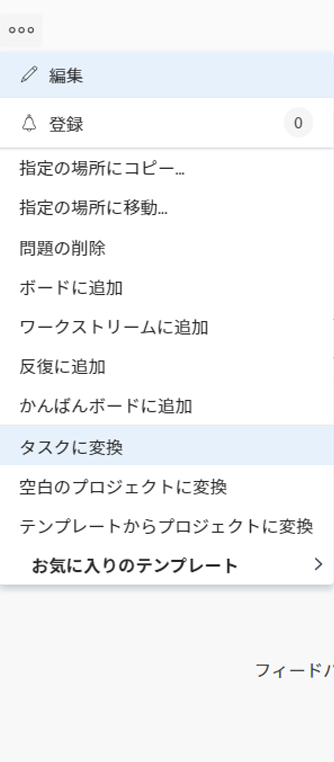

# イシューのAdobe Workfrontでのタスクへの変換

イシューの送信後に、イシューを完了するために他の作業を行う必要がある場合は、イシューをタスクに変換できます。

問題の変換に関する一般的な情報については、 [Adobe Workfrontでの変換の問題の概要](../../../manage-work/issues/convert-issues/convert-issues.md).

## アクセス要件

この記事の手順を実行するには、次のアクセス権が必要です。

<table style="table-layout:auto"> 
 <col> 
 <col> 
 <tbody> 
  <tr> 
   <td role="rowheader">Adobe Workfront plan*</td> 
   <td> 
任意
 </td> 
  </tr> 
  <tr> 
   <td role="rowheader">Adobe Workfront license*</td> 
   <td> 
仕事以上
 </td> 
  </tr> 
  <tr> 
   <td role="rowheader">アクセスレベル設定*</td> 
   <td> 
問題、タスクおよびプロジェクトへのアクセスを編集
 
注意：まだアクセス権がない場合は、Workfront管理者に、アクセスレベルに追加の制限を設定しているかどうかを問い合わせてください。 Workfront管理者がアクセスレベルを変更する方法について詳しくは、 <a href="../../../administration-and-setup/add-users/configure-and-grant-access/create-modify-access-levels.md" class="MCXref xref">カスタムアクセスレベルの作成または変更</a>.
 </td> 
  </tr> 
  <tr> 
   <td role="rowheader">オブジェクト権限</td> 
   <td> 
問題に対する権限を表示
 
プロジェクトに対する権限の投稿
 
問題の変換後、タスクに対する管理権限を取得します
 
追加のアクセス権のリクエストについて詳しくは、 <a href="../../../workfront-basics/grant-and-request-access-to-objects/request-access.md" class="MCXref xref">オブジェクトへのアクセスのリクエスト </a>.
 </td> 
  </tr> 
 </tbody> 
</table>

*保有するプラン、ライセンスの種類、アクセス権を確認するには、Workfront管理者にお問い合わせください。

## イシューのタスクへの変換

1. プロジェクトに移動し、「 [!UICONTROL **問題** ] をクリックします。
1. 変換する問題をクリックして、問題のランディングページに移動します。
1. 次をクリック： [!UICONTROL **詳細**] 問題のメニュー、 [!UICONTROL **タスクに変換**].

   

   >[!TIP]
   >
   >問題が承認プロセスに関連付けられている場合、または既に解決オブジェクトに関連付けられている場合、Workfrontの上部に警告が表示されます [!UICONTROL プロジェクトに変換] ボックスに、変換処理の実行中に承認が削除されたか、解決オブジェクトが上書きされたことを通知します。 詳しくは、 [Adobe Workfrontでの変換の問題の概要](../../../manage-work/issues/convert-issues/convert-issues.md).

1. でタスク名を更新 [!UICONTROL タスク名] 」セクションに入力します。 デフォルトでは、タスクの名前は元のイシューと同じ名前になります。

   

1. クリック [!UICONTROL **宛先プロジェクト**]&#x200B;次に、新しいタスクを配置するプロジェクトの名前を入力します [!UICONTROL **宛先プロジェクト**] フィールドを選択し、リストに表示される場合に選択します。 デフォルトでは、イシューのプロジェクトが選択されています。

1. クリック [!UICONTROL **概要**]&#x200B;を入力し、 [!UICONTROL **説明**] タスクの

   >[!TIP]
   >
   >   システム管理者またはグループ管理者が、レイアウトテンプレートを変更することで、変換ボックスの左側のパネルに表示されるセクションの順序を変更する場合があります。

1. （オプションおよび条件付き）「 [!UICONTROL **オプション**]」で、以下のいずれかのオプションを選択します。

   問題の変換時にWorkfrontの管理者またはグループ管理者がこれらの環境設定を有効にしてから、問題の変換時にこれらの環境設定を表示する必要があります。

   * [!UICONTROL **元の問題を保持し、解決をこのタスクに結び付けます**]

      選択を解除すると、元の問題は削除されます。

      >[!NOTE]
      >
      >この設定の状態に関係なく、アクセス権やイシューを削除する権限を持たないユーザーは、イシューを変換する際にイシューを削除できません。 アクセスおよび問題に対する権限について詳しくは、次を参照してください。
      >   
      >   * [問題へのアクセス権の付与](../../../administration-and-setup/add-users/configure-and-grant-access/grant-access-issues.md)
      >   * [イシューの共有](../../../workfront-basics/grant-and-request-access-to-objects/share-an-issue.md)

   * [!UICONTROL **（ユーザー名）にこのタスクへのアクセスを許可**]

      選択しない場合、問題の「連絡先プライマリ」には新しいタスクへのアクセス権がありません。

   * [!UICONTROL **問題の予定完成日を変更しない**]

      選択しない場合、 [!UICONTROL 計画完了日] 新しいタスクの計算基準は、 [!UICONTROL 計画開始日] タスクの この [!UICONTROL 計画開始日] 新規タスクの設定は、新規タスクのシステム環境設定に従って行われます。

      >[!NOTE]
      >
      >
      >ここに表示されるオプションは、Workfront管理者がシステムの全員に対してどのように設定したかによって異なります。 詳しくは、 [システム全体のタスクと問題の環境設定を構成](../../../administration-and-setup/set-up-workfront/configure-system-defaults/set-task-issue-preferences.md).
      >
      >また、組織の最上位グループが別々に設定した場合、ここに表示されるオプションは、手順 6 で選択したプロジェクトに関連付けられているグループによって異なります。 詳しくは、 [グループのタスクと問題の環境設定を設定する](../../../administration-and-setup/manage-groups/create-and-manage-groups/configure-task-issue-preferences-group.md).

1. （オプション）「 [!UICONTROL **カスタムForms**] 新しいタスク用のカスタムフォームを添付します。

   >[!TIP]
   >
   >* イシューに複数オブジェクトのカスタムフォームを添付して、イシューとタスクの両方で使用するように設定した場合、イシューとカスタムフォームの両方にフィールドが存在する場合、フォームに保存された情報はすべて保持されます。
   >* 計算フィールドを含む複数オブジェクトのカスタムフォームがイシューとタスクに添付されている場合、イシューとタスクは、フォームの計算カスタムフィールドで参照されているすべてのフィールドと互換性がある必要があります。 非互換性がある場合は、調整を行うように警告するメッセージが表示されます。 詳しくは、 [レガシーフォームビルダーを使用して計算データをカスタムフォームに追加する](../../../administration-and-setup/customize-workfront/create-manage-custom-forms/add-calculated-data-to-custom-form.md).
   >* プロジェクトの編集時に、宛先プロジェクトの「タスクのデフォルトのForms」フィールドにデフォルトのフォームが定義されている場合、それらのタスクフォームも新しいタスクに追加されます。 元のイシューとデフォルトのタスクフォームのフィールドの間で共通するカスタムフィールドは、イシューフィールドの情報が事前に入力されます。

1. クリック [!UICONTROL **タスクに変換**].

   元のイシューを削除することにした場合、イシューは指定されたプロジェクトのタスクになります。

   または

   これで、選択したプロジェクトの新しいタスクにリンクされ、元のタスクを保持することにした場合、タスクが完了するとタスクが完了します。

   一部の問題フィールドがタスクに転送されます。 詳しくは、 [プロジェクトとタスクに関する元の問題情報を表示](#view-original-issue-information-on-projects-and-tasks) 」の節を参照してください。

1. （オプション）必要に応じてタスクの編集を続けます。

## プロジェクトとタスクに関する元の問題情報を表示 {#view-original-issue-information-on-projects-and-tasks}

元の問題情報は、プロジェクトとタスクのリストとレポート、または「プロジェクトの詳細」領域で表示できます。 レポートの作成について詳しくは、 [カスタムレポートの作成](../../../reports-and-dashboards/reports/creating-and-managing-reports/create-custom-report.md).

次の表に、変換後のプロジェクトとタスクで、どの問題フィールドが表示されるかを示します。

| 問題フィールド | プロジェクトまたはタスクフィールド | プロジェクトリストまたはレポート | プロジェクトの詳細領域 | タスクリストまたはレポート | タスクの詳細領域 |
|---|---|---|---|---|---|
| [!UICONTROL 問題名] | [!UICONTROL 変換済み問題名] | ✔ | ✔ | ✔ | ✔ |
| [!UICONTROL プライマリ連絡先] | [!UICONTROL 変換された問題の発行者名] | ✔ | ✔ | ✔ |
| [!UICONTROL エントリ日] | [!UICONTROL 変換済み問題のエントリ日] | ✔ |  | ✔ |

>[!CAUTION]
>
>この [!UICONTROL プライマリ連絡先] をクリックします。 [!UICONTROL 変換された問題の発行者名 ]は更新されず、元の [!UICONTROL プライマリ連絡先] 」と入力します。
