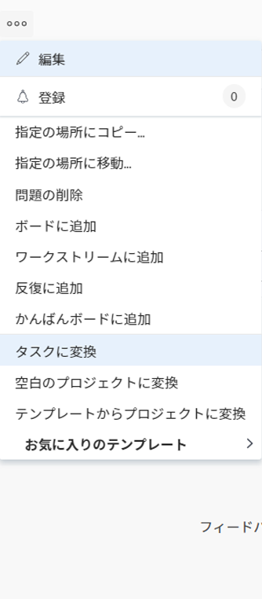
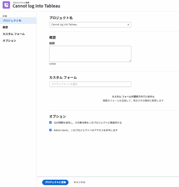
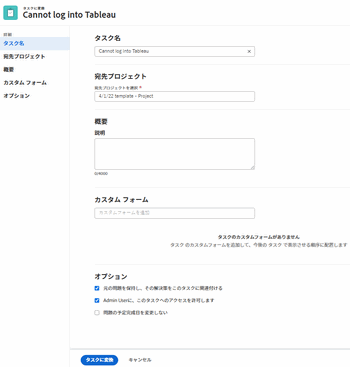

# Adobe Workfrontでの変換の問題の概要

イシューの送信後に、イシューの完了に必要な作業が他にもある場合は、イシューをプロジェクトまたはタスクに変換できます。

問題をタスクに変換する方法について詳しくは、 [イシューのAdobe Workfrontでのタスクへの変換](../../../manage-work/issues/convert-issues/convert-issue-to-task.md).

問題をプロジェクトに変換する方法については、 [イシューをAdobe Workfrontのプロジェクトに変換する](../../../manage-work/issues/convert-issues/convert-issue-to-project.md).

## 問題を変換する際の考慮事項

* Workfrontの管理者またはグループ管理者は、既に、問題への影響、解決、およびプロジェクトまたはタスクに変換された際のプライマリ連絡先のアクセスに関する設定を設定しています。詳しくは、 [システム全体のタスクと問題の環境設定を構成する](../../../administration-and-setup/set-up-workfront/configure-system-defaults/set-task-issue-preferences.md).
* Workfrontは、変換時に問題に関連する承認をすべて削除します。
* タスクまたはプロジェクトに変換すると、Workfrontはイシューの解決オブジェクトを上書きします。 新しいタスクまたはイシューは、変換後に新しいイシューの解決オブジェクトになります。
* 次の点に注意してください。

   * 変換処理の際に、イシューとその解決を、作成するプロジェクトまたはタスクに結び付けておくかどうかを尋ねられる場合があります。
   * 問題を保持すると、プロジェクト、タスク、または問題に変更が生じた場合や、Workfrontでタイムラインが再計算された場合に、問題の状態と完了率が自動的に更新されます。

* イシューをタスクまたはプロジェクトに変換すると、イシューに割り当てられたユーザーの「ホーム」領域からイシューが削除されます。

* 問題を変換する場合、元の問題に対する権限は、変換後のオブジェクト（タスクまたはプロジェクト）には転送されません。

* テンプレートを使用してイシューをプロジェクトに変換する場合、テンプレートのほとんどの情報が新しいプロジェクトに転送されます。 ただし、問題の情報の一部は、新しいプロジェクトにも転送できます。 詳しくは、 [テンプレートを使用してイシューをプロジェクトに変換する際のプロジェクトフィールドの概要](#overview-of-project-fields-when-converting-an-issue-to-a-project-using-a-template) 」の節を参照してください。
* イシューの変換時に、すべてのドキュメントまたはその情報が、イシューの変換先となる新しいオブジェクトに移動されるわけではありません。 ドキュメントまたはドキュメントリンクが添付された問題を変換する場合、次の項目が含まれます。

   * ドキュメント
   * Google Drive やSharePointなど、サードパーティのサービスへのドキュメントリンク。
   * バージョン
   * 配達確認は、「 」オプションの場合にのみ含まれます **元の問題を保持し、解決をこのタスクに結び付けます** が選択されていない。
   * ドキュメントとドキュメントリンクが添付された問題を変換する場合、ドキュメント承認は含まれません。

* 問題を変換後のタスクに留め置くことにし、ドキュメントが添付されている場合は、ドキュメントとそのバージョンがプロジェクトまたはタスクにコピーされます。 配達確認とドキュメント承認は、プロジェクトやタスクにコピーされません。
* 問題を変換後のタスクに含めないことにした場合、ドキュメント、ドキュメント、バージョン、配達確認がプロジェクトまたはタスクに転送されます。 ドキュメント承認は、プロジェクトやタスクには転送されません。
* Google Drive など、サードパーティのサービスで、元の問題にリンクされたドキュメントやフォルダがある場合、変換時に問題を維持するかどうかに関係なく、そのリンクが新しいオブジェクトにコピーされます。
* イシューのコメントは、イシューから変換されたタスクまたはプロジェクトにもコピーされますが、タグ付きユーザーは転送されません。
* イシューのカスタムフォーム情報を変換するプロジェクトまたはタスクに転送する場合は、イシューから転送するフィールドが同じプロジェクトまたはタスクのカスタムフォームがあることを確認してください。 詳しくは、 [オブジェクトの変換時にカスタムフォームデータを転送する](../../../administration-and-setup/customize-workfront/create-manage-custom-forms/transfer-custom-form-data-larger-item.md).

## テンプレートを使用してイシューをプロジェクトに変換する際のプロジェクトフィールドの概要 {#overview-of-project-fields-when-converting-an-issue-to-a-project-using-a-template}

イシューをプロジェクトに変換する場合は、空のプロジェクトに変換するか、テンプレートを使用します。

詳しくは、 [イシューをAdobe Workfrontのプロジェクトに変換する](../../../manage-work/issues/convert-issues/convert-issue-to-project.md).

テンプレートを使用する場合、テンプレートに入力される一部のフィールドは、変換されたイシューから作成されたプロジェクトに転送されます。 その他のフィールドは、変換されたイシューからプロジェクトに転送されます。

次の表に、プロジェクト情報と、その情報がテンプレートから転送されるか、問題から転送されるかを示します。

<table style="table-layout:auto"> 
 <col> 
 <col> 
 <tbody> 
  <tr> 
   <td>説明</td> 
   <td> 
問題の説明は、新しいプロジェクトに転送されます。 
 
 問題に説明がない場合、テンプレートの「説明」がプロジェクトに転送されます。 
 
イシューの場合とテンプレートの場合の両方で「説明」フィールドが空の場合、プロジェクトのフィールドは空になります。 
 </td> 
  </tr> 
  <tr> 
   <td>ステータス</td> 
   <td>テンプレート上のグループに対して選択されたデフォルトのステータス。 テンプレートがグループに関連付けられていない場合、プロジェクトのステータスは、Workfront管理者が設定の「プロジェクト環境設定」領域で設定したデフォルトのステータスに設定されます。 詳しくは、 <a href="../../../administration-and-setup/set-up-workfront/configure-system-defaults/set-project-preferences.md" class="MCXref xref">システム全体のプロジェクト環境設定の指定</a>.</td> 
  </tr> 
  <tr> 
   <td>優先度</td> 
   <td>テンプレートから転送します。 </td> 
  </tr> 
  <tr> 
   <td>URL</td> 
   <td> 
問題の URL が新しいプロジェクトに転送されます。 
 
 問題で URL が指定されていない場合、テンプレートの URL がプロジェクトに転送されます。 
 
イシューの場合とテンプレートの場合の両方で「 URL 」フィールドが空の場合、プロジェクトのフィールドは空になります。 
 </td> 
  </tr> 
  <tr> 
   <td>プロジェクト条件タイプ</td> 
   <td>テンプレートから転送します。</td> 
  </tr> 
  <tr> 
   <td>プロジェクト条件</td> 
   <td>「設定」領域のWorkfront管理者が決定した、システムレベルのデフォルト設定に一致します。 詳しくは、 <a href="../../../administration-and-setup/customize-workfront/create-manage-custom-conditions/set-custom-condition-default-projects.md" class="MCXref xref">カスタム条件をプロジェクトのデフォルトとして設定する</a></td> 
  </tr> 
  <tr> 
   <td>スケジュールの基点</td> 
   <td>テンプレートから転送します。</td> 
  </tr> 
  <tr> 
   <td>プロジェクトの日付</td> 
   <td> 
    <ul> 
     <li> 
<b>計画開始日</b>：テンプレートスケジュールのタイムゾーンに従って、テンプレートスケジュールの稼動時間に基づく最も近い稼動時間を事前に選択する必要があります。 「スケジュール元」フィールドが「完了から」に設定されている場合、このフィールドは無効です。 
 </li> 
     <li> 
<b>計画完了日</b>：テンプレートスケジュールのタイムゾーンに従って、テンプレートスケジュールの稼動時間に基づく最も近い稼動時間を事前に選択する必要があります。 「スケジュール元」フィールドが「開始日」に設定されている場合、このフィールドは無効になります。 
 </li> 
    </ul> </td> 
  </tr> 
  <tr> 
   <td>ポートフォリオ</td> 
   <td>テンプレートから転送します。 それ以外の場合、このフィールドは空です。</td> 
  </tr> 
  <tr> 
   <td>プログラム</td> 
   <td>テンプレートから転送します。 それ以外の場合、このフィールドは空です。</td> 
  </tr> 
  <tr> 
   <td>グループ</td> 
   <td>
 次のシナリオが存在します。

     <ul><li>変換中にグループが指定された場合、そのグループがプロジェクトのグループになります</li>
     <li>テンプレートを使用してプロジェクトに変換し、テンプレートにグループが存在し、変換時にグループを指定しない場合、テンプレートのグループが新しいプロジェクトのグループになります</li>
      <li> テンプレートにグループがなく、変換時にグループを指定しない場合、元のイシューのプロジェクトのグループが新しいプロジェクトのグループになります</li> </ul>
      </td> 
  </tr> 
  <tr> 
   <td>会社</td>    
   <td>  テンプレートから転送します。 それ以外の場合、このフィールドは空です。</td>

</tr> 
  <tr> 
   <td>プロジェクト所有者</td> 
   <td>テンプレートの「テンプレート所有者」フィールドから転送します。 それ以外の場合は、変換処理を実行するログインユーザーに設定されます。 </td> 
  </tr> 
  <tr> 
   <td>プロジェクトスポンサー</td> 
   <td>テンプレートの「テンプレートスポンサー」フィールドから転送します。 それ以外の場合、このフィールドは空です。</td> 
  </tr> 
  <tr> 
   <td>リソースマネージャー</td> 
   <td>テンプレートから転送します。 それ以外の場合、このフィールドは空です。</td> 
  </tr> 
  <tr> 
   <td>タスク設定</td> 
   <td>テンプレートから転送します。</td> 
  </tr> 
  <tr> 
   <td>問題設定</td> 
   <td>テンプレートから転送します。 </td> 
  </tr> 
  <tr> 
   <td>アクセス</td> 
   <td> 
テンプレートの「アクセス」セクションから転送します。 
 </td> 
  </tr> 
  <tr> 
   <td>承認</td> 
   <td>テンプレートから転送します。 問題に関連付けられている承認は、変換処理の実行中に削除されます。 </td> 
  </tr> 
 </tbody> 
</table>

<!--WRITER

<h2>Convert an issue to a project</h2> 

(NOTE:&nbsp;moved to its own article)

-->
<!--
<ol>
<li value="1"> Click the <strong>Issues</strong> icon on a project. 
  
 </li>
<li value="2"> 
Click the issue to be converted to access the issue.
 </li>
<li value="3"> 
 Click the <strong>More</strong> menu, then click <strong>Convert to Project</strong>. 
 
  
 </li>
<li value="4"> 
In the submenu that displays, do one of the following:

<ul>
<li>Click <strong>New Project</strong></li>
<li>Under <strong>New from Template</strong>, click the name of a project template you want to use</li>
</ul> </li>
<li value="5"> 
Specify a name for the project.
 
The default name is the name of the issue you are converting.
 </li>
<li value="6">(Optional and conditional) If you are creating this project from a template, update the available fields in the Convert to Project box. For more information about editing fields on projects, see <a href="../../../manage-work/projects/manage-projects/edit-projects.md" class="MCXref xref">Edit projects</a>.</li>
<li value="7"> 
(Optional and conditional) Under <strong>Options</strong>, select any of the available options:

<ul>
<li> 
<strong>Keep the original issue and tie its resolution to the this project</strong>When deselected, the original issue is deleted.
 <note type="note">

Users without access or permissions to delete issues will not be able to delete the issue as they are converting it, regardless of the status of this setting. For information about access and permissions to issues, see:

<ul>
<li> 
<a href="../../../administration-and-setup/add-users/configure-and-grant-access/grant-access-issues.md" class="MCXref xref">Grant access to issues</a> 
 </li>
<li> 
<a href="../../../workfront-basics/grant-and-request-access-to-objects/share-an-issue.md" class="MCXref xref">Share an issue </a> 
 </li>
</ul>
</note> </li>
<li><strong>Allow <User Name> to have access to this project</strong>If unselected, the user who entered the issue has no access to the new task.</li>
</ul> <note type="note">

The options that are available here depend on how the Workfront administrator has configured them for everyone in the system or for your group. For more information, see <a href="../../../administration-and-setup/set-up-workfront/configure-system-defaults/set-task-issue-preferences.md" class="MCXref xref">Configure system-wide task and issue preferences</a>.

Or, if the top-level groups in your organization configured them separately, the options available here depend on which group you selected for the new project in step 6. For more information, see <a href="../../../administration-and-setup/manage-groups/create-and-manage-groups/configure-task-issue-preferences-group.md" class="MCXref xref">Configure task and issue preferences for a group</a>.

</note> </li>
<li value="8">(Optional) In the <strong>Custom Forms</strong> section, attach any custom forms. For more information about transferring information from the custom form of the issue to that of the new project, see <a href="../../../administration-and-setup/customize-workfront/create-manage-custom-forms/transfer-custom-form-data-larger-item.md" class="MCXref xref">Transfer custom form data when converting an object</a>.</li>
<li value="9"> 
Click <strong>Save Changes.</strong>
 
  
 
The issue is now a project, if you decided to delete the original issue. Or The issue is now linked to the new project and it will complete when the project completes, if you decided to keep the original issue. 
 
Some issue fields transfer to the project. For information, see the <a href="#view-original-issue-information-on-projects-and-tasks" class="MCXref xref">View original issue information on projects and tasks</a> section in this article. 
 </li>
<li value="10"> 
(Optional) Set any further project details ​(project owner, project dates) and tasks as necessary.
 </li>
</ol>

-->

<!--

<h2>Convert an issue to a task</h2> 
(NOTE: moved to its own article)

-->
<!--
<ol>
<li value="1"> Click the Issues icon on a project.  </li>
<li value="2"> 
Click the issue you want to convert to go to the issue's landing page. 
 </li>
<li value="3"> 
 Click the <strong>More</strong> menu on the issue, then <strong>Convert to Task</strong>.  
 
  
 </li>
<li value="4"> 
Name the task.
 </li>
<li value="5"> 
Identify the project where the task will reside. 
 
You can select a different project from the project that the issue is on.
 </li>
<li value="6"> 
In the <strong>Project</strong> box, start typing the name of the project where you want to put the new task, then press <strong>Enter</strong> when it appears.
 
By default, this box the name of the project containing the issue that you are converting.
 </li>
<li value="7"> 
(Optional and conditional) Under <strong>Options</strong>, select any of the following options. 
 
The Workfront administrator or group administrator must enable these preferences before they are visible during the conversion of issues: 

<ul>
<li> 
<strong>Keep the original issue and tie its resolution to the this task</strong> 
 
If unselected, the original issue is deleted.
 <note type="note">

Users without access or permissions to delete issues will not be able to delete the issue as they are converting it, regardless of the status of this setting. For information about access and permissions to issues, see:

<ul>
<li> 
<a href="../../../administration-and-setup/add-users/configure-and-grant-access/grant-access-issues.md" class="MCXref xref">Grant access to issues</a> 
 </li>
<li> 
<a href="../../../workfront-basics/grant-and-request-access-to-objects/share-an-issue.md" class="MCXref xref">Share an issue </a> 
 </li>
</ul>
</note> </li>
<li> 
<strong>Allow <User Name> to have access to this task</strong> 
 
If unselected, the user who entered the issue has no access to the new task.
 </li>
<li> 
<strong>Keep the planned completion date of the issue</strong> 
 
If unselected, the Planned Completion Date of the new task is calculated from the Planned Start Date of the task. The Planned Start Date of the new task is set according to the system preferences for new tasks.
 </li>
</ul> <note type="note">

The options that display here depend on how the Workfront administrator configured them for everyone in the system. For more information, see <a href="../../../administration-and-setup/set-up-workfront/configure-system-defaults/set-task-issue-preferences.md" class="MCXref xref">Configure system-wide task and issue preferences</a>.

Or, if the top-level groups in your organization configured them separately, the options that display here depend on which group is associated with the project you selected in step 6. For more information, see <a href="../../../administration-and-setup/manage-groups/create-and-manage-groups/configure-task-issue-preferences-group.md" class="MCXref xref">Configure task and issue preferences for a group</a>.

</note> </li>
<li value="8">(Optional) Attach custom forms. For more information about transferring information from the custom form of the issue to that of the new task, see <a href="../../../administration-and-setup/customize-workfront/create-manage-custom-forms/transfer-custom-form-data-larger-item.md" class="MCXref xref">Transfer custom form data when converting an object</a>. 

</li>
<li value="9"> 
Click <strong>Save Changes</strong> when all task settings are set.
 
The issue is now a task on the designated project, if you decided to delete the original issue.
 
Or
 
The issue is now linked to the new task on the project you chose, and it will complete once the task completes, if you decided to keep the original issue.
 
Some issue fields transfer to the task. For information, see the <a href="#view-original-issue-information-on-projects-and-tasks" class="MCXref xref">View original issue information on projects and tasks</a> section in this article.  
 </li>
<li value="10"> 
(Optional) Continue editing the task (assignments, dates) as necessary. 
 </li>
</ol>

-->

## プロジェクトとタスクに関する元の問題情報を表示します {#view-original-issue-information-on-projects-and-tasks}

元の問題情報は、プロジェクトとタスクのリストとレポート、または「プロジェクトの詳細」領域で表示できます。 レポートの作成について詳しくは、 [カスタムレポートの作成](../../../reports-and-dashboards/reports/creating-and-managing-reports/create-custom-report.md).

次の表に、変換後のプロジェクトとタスクで、どの問題フィールドが表示されるかを示します。

| 問題フィールド | プロジェクトまたはタスクフィールド | プロジェクトリストまたはレポート | 「プロジェクトの詳細」領域 | タスクリストまたはレポート | 「タスクの詳細」領域 |
|---|---|---|---|---|---|
| 問題名 | 変換済みイシュー名 | ✔ | ✔ | ✔ | ✔ |
| プライマリ連絡先 | 変換された問題の発行者名 | ✔ | `✔` | ✔ |   |
| エントリ日 | 変換された発行の入力日 | ✔ |   | ✔ |   |

>[!CAUTION]
>
>イシューのプライマリ連絡先が変更された場合、またはイシューの変換後にイシューのリンクがプロジェクトまたはタスクから解除された場合は、イシューの変換時に元のプライマリの連絡先が表示され、変換後のイシューの作成者名が更新されません。
