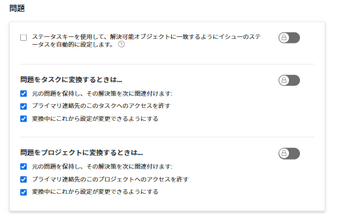
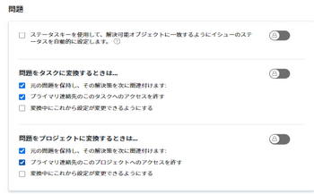
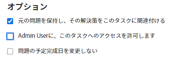
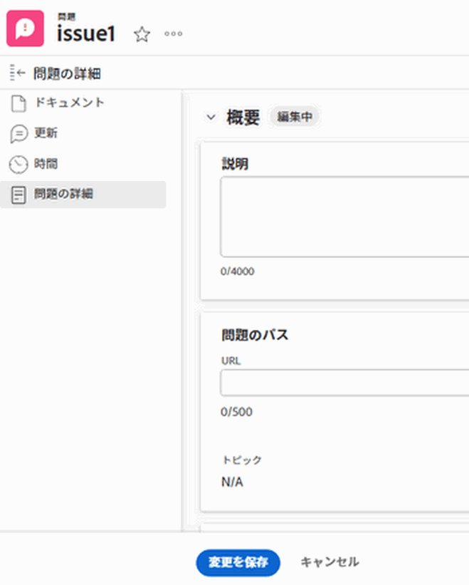
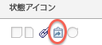

# オブジェクトの解決と解決の概要

解決可能なオブジェクトとは、解決が解決オブジェクトに結び付けられている問題です。 解決オブジェクトは、プロジェクト、タスク、または別の問題です。

イシューをタスクまたはプロジェクトに変換すると、そのイシューはタスクまたはプロジェクトの解決可能なオブジェクトになります。

タスク、プロジェクト、またはイシューのいずれかのイシューを手動で Resolving Object にリンクすることもできます。 詳しくは、 [問題の解決を他の問題、タスク、プロジェクトに手動で関連付ける](../../../manage-work/issues/convert-issues/manually-tie-resolution-of-issue-to-ptis.md).

このシナリオでは、元の問題がタスク、プロジェクトまたは問題の解決可能なオブジェクトになります。

## 解決可能なオブジェクトを処理するためのAdobe Workfrontの設定 {#set-up-adobe-workfront-to-handle-resolvable-objects}

Workfrontの管理者またはグループ管理者は、システム内またはグループ内の解決可能なオブジェクトの処理方法を決定できます。

タスクまたはプロジェクトに変換する際に、解決可能なオブジェクトを保持するか、タスクまたはプロジェクトの作成後に削除するかを選択できます。 イシューの変換中にこれらの設定を変更できるように選択すると、イシューの変換時に、イシューの変換時にそのイシューを保持するか削除するかを選択できます。

>[!NOTE]
>
>解決可能なオブジェクトとは、常に、解決とステータスが、関連付けられている解決オブジェクトの解決とステータスに依存する可能性のある問題です。 オブジェクトの解決は、問題、タスク、またはプロジェクトになる場合があります。

解決可能なオブジェクトを処理するためのプリファレンスの設定については、 [システム全体のタスクと問題の環境設定を構成](../../../administration-and-setup/set-up-workfront/configure-system-defaults/set-task-issue-preferences.md).

<!--WRITER

(Note: drafted and just pointed the user to the article linked above)&nbsp;

To establish the system default for what happens to the issue as it is being converted to a task or a project:

<ol>
<li value="1">Log in to Workfront as a Workfront administrator or group administrator.</li>
<li value="2"> 
  From the main menu, click <strong>Setup</strong>. 
 
  
 </li>
<li value="3">Expand <strong>Project Preferences</strong>.</li>
<li value="4">Click <strong>Tasks & Issues</strong>.</li>
<li value="5">Go to the <strong>Issues</strong> area of the setup.  Consider editing any of the following settings:
<ul>
<li>
<strong>Automatically update Resolvable Issue status when the status of the Resolving Object changes:</strong> Select this option to tie the resolution of the original issue to the resolution of its Resolving Object. In order for this setting to have any effect, the options to <strong>Keep the original issue and tie its resolution to the task</strong> or<strong>project</strong> must be selected.

<ul>
<li>When this setting is enabled, you can create custom statuses with the same key for both issues and projects or tasks. When the project or task (as a resolvable object) turns into the custom status, the change also reflects on the status of the issue. The status key must be the same for the issue and project or task statuses.</li>
<li>
When this setting is disabled, resolving object statuses are automatically set to the default status, instead of the custom ones. For more information about the default statuses, see <a href="#synchronize-the-status-of-the-resolvable-object-with-that-of-the-resolving-object" class="MCXref xref">Synchronize the Status of the Resolvable Object with that of the Resolving Object</a>.
<note type="note">
The default status of the issue is controlled by the status of the project or task, regardless of whether this option is selected or not.
</note></li>
</ul></li>
<li><strong>When converting an issue to a TASK...:</strong> The settings in this section determine what happens during the conversion process from issue to task:
<ul>
<li><strong>Keep the original issue and tie its resolution to the task:</strong> When converting the issue, it remains visible as an issue until the task is complete. The status of the issue automatically changes to Closed when the task completes.</li>
<li><strong>Allow Primary Contact to have access to the task:</strong> Gives the primary contact (issue creator) access to the task to review the task, make updates, and stay informed of its progress.</li>
<li><strong>Allow these settings to be changed during conversion:</strong> Allows the user who is converting the issue to change these options during the conversion of an issue to a task. </li>
</ul></li>
<li><strong>When converting an issue to a PROJECT...:</strong> The settings in this section determine what happens during the conversion process from issue to project:
<ul>
<li><strong>Keep the original issue and tie its resolution to the project:</strong> When converting the issue, it remains visible as an issue until the project is complete. The status of the issue automatically changes to Closed when the project completes.</li>
<li><strong>Allow Primary Contact to have access to the project:</strong> Gives the primary contact (issue creator) access to the project to review the project, make updates, and stay informed of its progress.</li>
<li><strong>Allow these settings to be changed during conversion:</strong> Allows the user who is converting the issue to change these options during the conversion of an issue to a project. </li>
</ul></li>
</ul></li>
<li value="6">Click <strong>Save</strong>.</li>
</ol>

-->

## プロジェクトまたはタスクに変換する際に、解決可能なオブジェクトを処理します

Workfrontまたはグループ管理者がシステムレベルまたはグループレベルの問題設定を構成した方法に応じて、問題をプロジェクトまたはタスクに変換する際に、解決可能なオブジェクトを処理できます。

次のシナリオが存在します。

* Workfrontまたはグループの管理者が **元の問題を保持し、その解決をタスクに結び付けます** そして **元の問題を保持し、その解決をプロジェクトに結び付けます** 選択済みと **変換時にこれらの設定を変更できるようにする** 未選択の場合は、問題をタスクやプロジェクトに変換する際に、これらの設定を変更することはできません。\
   

* Workfrontまたはグループの管理者が **元の問題を保持し、その解決をタスクに結び付けます** そして **元の問題を保持し、その解決をプロジェクトに結び付けます** 「選択」または「選択解除」のどちらかで、 **変換時にこれらの設定を変更できるようにする** オンにすると、問題をタスクやプロジェクトに変換する際に、これらの設定を変更できます。\
   

問題をタスクやプロジェクトに変換する方法について詳しくは、 [Adobe Workfrontでの変換の問題の概要](../../../manage-work/issues/convert-issues/convert-issues.md).

<!--WRITER

<h2>Tie the resolution of an issue to a project, task or </h2> 

(NOTE: created new article for this section; draft when the article is live and see if you need to make a link from this one to the new article) 

You can manually tie the resolution of an issue to the resolution of a project, task, or issue without converting the issue. The issue becomes one of the Resolvable Objects of the project, task, or issue you select. When you do this, a change in the status of the project, task, or issue triggers a change in the status of the original issue, so you cannot manually edit the status of the original issue.  For more information about how the status of the Resolving Object affects the Resolvable Object, see <a href="#synchronize-the-status-of-the-resolvable-object-with-that-of-the-resolving-object" class="MCXref xref">Synchronize the Status of the Resolvable Object with that of the Resolving Object</a>.

You must have Manage permissions on the original issue and View permissions on the project, task, or issue to do this. 

To tie the resolution of an issue to the resolution of a project, task, or issue:

<ol>
<li value="1">Navigate to an issue whose resolution you want to tie to a task or a project.</li>
<li value="2"> 
  Click the <strong>Issue Details</strong> > <strong>Overview</strong> area. 
 
  
 </li>
<li value="3"> 
Click the <strong>Edit</strong> icon  in the upper-right corner of the Issue Details section. 
 </li>
<li value="4">At the bottom of the form,  click in the <strong>Resolved By</strong> field,  and select from the following types of resolving objects:
<ul>
<li><strong>Project</strong></li>
<li><strong>Task</strong></li>
<li>
<strong>Issue</strong>
</li>
</ul>
The field for the resolving object displays. 
</li>
<li value="5">After selecting the object, start typing the name of a specific project, task, or issue in the available field and select it when it appears in the drop-down list. </li>
<li value="6">Click <strong>Save</strong>&nbsp;<strong>Changes</strong>. The original issue becomes the Resolvable Object for the project, task, or issue you selected in step 4 and 5. <note type="note">
One project, task, or issue may have multiple issues as Resolvable Objects.
</note></li>
</ol>

-->

## 解決可能なオブジェクトのステータスと解決可能なオブジェクトのステータスの同期 {#synchronize-the-status-of-the-resolvable-object-with-that-of-the-resolving-object}

* [解決オブジェクトが問題の場合にステータスを同期](#synchronize-statuses-when-the-resolving-object-is-an-issue)
* [Resolving Object がタスクまたはプロジェクトの場合にステータスを同期](#synchronize-statuses-when-the-resolving-object-is-a-task-or-a-project)

### 解決オブジェクトが問題の場合にステータスを同期 {#synchronize-statuses-when-the-resolving-object-is-an-issue}

問題が別の問題に手動で結び付けられている場合、2 番目の問題のステータス（オブジェクトの解決）は、最初の問題のステータス（解決可能なオブジェクト）の変更をトリガーします。 1 つ目の問題のステータスは、2 つ目の問題のステータスと一致します。 これは、デフォルトの問題ステータスとカスタムの問題ステータスの両方に当てはまります。

### Resolving Object がタスクまたはプロジェクトの場合にステータスを同期 {#synchronize-statuses-when-the-resolving-object-is-a-task-or-a-project}

タスクまたはプロジェクトの [ 解決可能なオブジェクト ] に問題がある場合、タスクのステータスが変わり、[ プロジェクト ]トリガーが問題のステータスに変わります。 デフォルトのステータスのトリガー方法は、カスタムステータスとは異なります（この場合は）。

* [解決可能なオブジェクトのデフォルト・ステータスと解決可能なオブジェクトのデフォルト・ステータスの同期](#synchronize-the-default-status-of-the-resolving-object-with-the-default-status-of-the-resolvable-object)
* [解決可能なオブジェクトのカスタムステータスと解決可能なオブジェクトのカスタムステータスの同期](#synchronize-the-custom-status-of-the-resolving-object-with-the-custom-status-of-the-resolvable-object)

#### 解決可能なオブジェクトのデフォルト・ステータスと解決可能なオブジェクトのデフォルト・ステータスの同期 {#synchronize-the-default-status-of-the-resolving-object-with-the-default-status-of-the-resolvable-object}

「Resolving Object（プロジェクトまたはタスク）のデフォルトのステータスが変更されるたびに、「Resolving Object(Resolving Object) のステータスが変更された場合に、解決可能な Issue のステータスを自動的に更新」オプションが選択されているかどうかに関係なく、 デフォルトのステータスのみが、そのような変更のトリガーに既にマッピングされています。

タスクの解決オブジェクトとしてトリガーが設定されている場合、タスクのデフォルトのステータスは次のように変更されます。

| **タスクステータス** | **問題ステータス** |
|---|---|
| 新規 | 新規 |
| 処理中 | 処理中 |
| 完了 | クローズ |

問題がプロジェクトの解決可能なオブジェクトとして設定されている場合、プロジェクトの次のデフォルトステータストリガーは、問題のデフォルトステータスに次の変更を加えます。 一部のプロジェクトステータスでは、トリガーの問題のステータスは変わりません。 問題は、プロジェクトが次のステータスの 1 つに変わる前の状態のままです。

| **プロジェクトステータス** | **問題ステータス** |
|---|---|
| 計画 | 新規 |
| 現在 | 処理中 |
| 保留中 | 保留中 |
| 要求済み | 問題ステータスの変更をトリガーしません。 |
| 承認済み | 問題ステータスの変更をトリガーしません。 |
| 拒否 | 問題ステータスの変更をトリガーしません。 |
| アイデア | 問題ステータスの変更をトリガーしません。 |
| 停止 | クローズ |
| 完了 | クローズ |

>[!NOTE]
>
>タスクまたはプロジェクトを閉じた後に、タスクまたはプロジェクトのステータスがどのように変化したかに関係なく、イシューのステータスが「クローズ済み」に変わった後も、イシューは「クローズ済み」のままになります。

#### 解決可能なオブジェクトのカスタムステータスと解決可能なオブジェクトのカスタムステータスの同期 {#synchronize-the-custom-status-of-the-resolving-object-with-the-custom-status-of-the-resolvable-object}

タスクまたはプロジェクトのステータスをカスタムステータスに変更すると、次の 2 つの条件を満たした場合にのみ、イシューのステータスがカスタムイシューのステータスに変わります。

* 「Resolving Object changes のステータスが変更された場合に、解決可能な問題ステータスを自動的に更新する」オプションが選択されている。 この設定を有効にする方法の詳細については、 [解決可能なオブジェクトを処理するためのAdobe Workfrontの設定](#set-up-adobe-workfront-to-handle-resolvable-objects).

* プロジェクトまたはタスクのカスタムステータスは、イシューのカスタムステータスと同じ 3 文字のコードを持ちます。

イシューとプロジェクト、タスクの両方で、同じキーを使用してカスタムステータスを作成できます。 プロジェクトまたはタスク（解決オブジェクトとして）がカスタムステータスに変更されると、変更は問題のステータスにも反映されます。 イシュー、プロジェクトまたはタスクのステータスについて、ステータスキーは同じにする必要があります。

例えば、「起動済み」という名前のプロジェクトのカスタムステータスを作成し、3 文字のコード「LCD」が「現在」と同じ名前で表示されるようにします。 また、「Project Launched」という名前の問題のカスタムステータスを作成し、「LCD」という文字コードを「In Progress」と同じにします。 プロジェクトを「起動済み」とマークすると、問題のステータスが自動的に「起動済みプロジェクト」に変更されます。 「ステータスキーを使用して解決可能なオブジェクトに合わせて自動的に問題ステータスを設定」設定が有効になっていない場合、問題ステータスは「処理中」（デフォルトのステータス）に変わります。

カスタムステータスの作成について詳しくは、 [ステータスの作成または編集](../../../administration-and-setup/customize-workfront/creating-custom-status-and-priority-labels/create-or-edit-a-status.md).

## 解決可能なオブジェクトの完了率を、解決可能なオブジェクトの完了率と同期します。

タスクまたはプロジェクトによって問題が解決された場合、問題の完了率は、次のいずれかが発生した場合に、解決可能な問題に対して更新されます。 

* 誰かがタスクまたはプロジェクトに対する変更を保存したとき。
* プロジェクトのタイムラインが再計算されます。

問題と問題が別の問題で解決された場合、完了率は、いずれかの問題が更新されると更新されます。

## タスクまたはプロジェクト上で解決可能なオブジェクトを検索する

解決オブジェクトの配置は、タスクとプロジェクトで同じです。

1. イシューをプロジェクトまたはタスクに変換して作成したプロジェクトまたはタスクに移動します。
1. 次をクリック： **プロジェクトの詳細** または **タスクの詳細** アイコンをクリックして展開します。
1. クリック **概要**.
1. タブの下部で、を見つけます。 **この解決** フィールド：このフィールドには、プロジェクトまたはタスクの解決可能なオブジェクトである問題が表示されます。

   >[!NOTE]
   >
   >問題を他の問題に変換することはできませんが、問題の解決に手動で関連付けることはできます。 プロジェクト、タスク、またはイシューは、解決可能なオブジェクトとして複数のイシューを持つことができます。 プロジェクト、タスク、または問題が解決されると、解決可能なオブジェクト（問題）も解決されます。 解決可能な問題は、解決したプロジェクト、タスクまたは問題が再び開いた場合でも、閉じたままになります。

## リスト内の解決オブジェクトに関する問題を特定します

問題の一覧で、ステータスアイコンを使用してオブジェクトの解決としてラベル付けされた問題を特定するには、 **ステータスアイコン** または **フラグ** 列：

## レポート内での解決可能なオブジェクト情報の表示と解決

プロジェクト、タスク、問題に関するビューまたはレポートに、解決可能なオブジェクトまたは解決可能なオブジェクトに関する情報を表示できます。\
次の表に、表示できるフィールドと表示可能なビューを示します。

<table style="table-layout:auto"> 
 <col> 
 <col> 
 <col> 
 <col> 
 <thead> 
  <tr> 
   <th><strong>ビュー内のフィールド</strong> </th> 
   <th><strong>問題ビュー</strong> </th> 
   <th><strong>タスク ビュー</strong> </th> 
   <th><strong>プロジェクト ビュー</strong> </th> 
  </tr> 
 </thead> 
 <tbody> 
  <tr> 
   <td><strong>解決可能なものがあります</strong>:次の項目を表示します。 <strong>True</strong> の値は、プロジェクトまたはタスクに関連付けられた解決可能な問題がある場合に値と <strong>False</strong> 値を指定します（指定しない場合）。</td> 
   <td>✓</td> 
   <td>✓</td> 
   <td>✓</td> 
  </tr> 
  <tr> 
   <td><strong>元の発行名、元の発行日、発行者名</strong>:元のイシューの名前とエントリ日、およびイシューを作成したユーザーの名前をテキストモードのカスタマイズビューで表示します。 元の問題に関する情報を表示するプロジェクト、タスクレポート、またはリストのテキストモードカスタムビューの作成について詳しくは、 <a href="../../../reports-and-dashboards/reports/custom-view-filter-grouping-samples/view-display-original-issue-info-task-project-list.md" class="MCXref xref">表示：タスクとプロジェクトリストに元の問題情報を表示する</a>. </td> 
   <td> </td> 
   <td> ✓</td> 
   <td> ✓</td> 
  </tr> 
  <tr> 
   <td> 
<strong>解像度：</strong> プロジェクト、タスクのレポート、またはリストのすべての解決可能なオブジェクトのリストをテキストモードのカスタムビューで表示します。
 
このビューの作成について詳しくは、 <a href="../../../reports-and-dashboards/reports/custom-view-filter-grouping-samples/view-resolvable-objects-task-project-report.md" class="MCXref xref">表示：タスクまたはプロジェクトレポート内の解決可能なオブジェクト</a>
 </td> 
   <td> </td> 
   <td>✓</td> 
   <td> ✓</td> 
  </tr> 
  <tr> 
   <td><strong>変換された問題の作成者</strong>:タスクに変換された問題を最初に記録したユーザーに関する情報を表示します。 </td> 
   <td> </td> 
   <td>✓</td> 
   <td> </td> 
  </tr> 
  <tr> 
   <td><strong>プロジェクトを解決</strong>:元の問題から変換された、または手動で問題の解決オブジェクトとして指定された、プロジェクトの解決に関する情報を表示します。</td> 
   <td>✓</td> 
   <td> </td> 
   <td> </td> 
  </tr> 
  <tr> 
   <td><strong>タスクを解決</strong>:元の問題から変換された、または手動で問題の解決オブジェクトとして指定された解決タスクに関する情報を表示します。</td> 
   <td>✓ </td> 
   <td> </td> 
   <td> </td> 
  </tr> 
  <tr> 
   <td><strong>問題の解決</strong>:問題の解決オブジェクトとして手動で指定された問題の解決に関する情報を表示します。</td> 
   <td> ✓</td> 
   <td> </td> 
   <td> </td> 
  </tr> 
 </tbody> 
</table>
