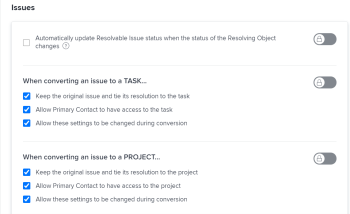
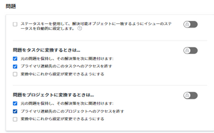
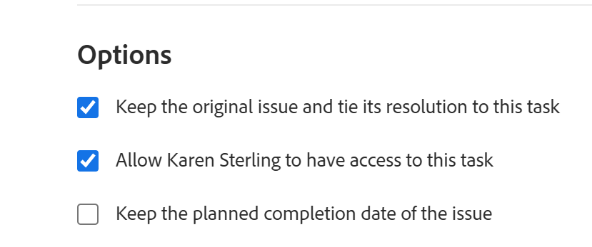
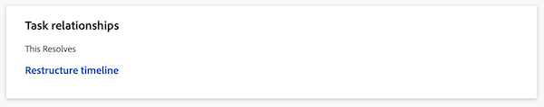
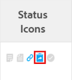

# 解決オブジェクトと解決可能オブジェクトの概要

<!-- Audited: 08/2025 -->

解決可能オブジェクトとは、解決策が解決オブジェクトに結び付けられているイシューです。解決オブジェクトは、プロジェクト、タスクまたは別のイシューです。

イシューをタスクまたはプロジェクトに変換すると、そのイシューはタスクまたはプロジェクトの解決可能オブジェクトになります。

イシューを解決オブジェクト（タスク、プロジェクトまたはイシュー）に手動でリンクすることもできます。詳しくは、[イシューの解決策を他のイシュー、タスクまたはプロジェクトに手動で結び付ける](../../../manage-work/issues/convert-issues/manually-tie-resolution-of-issue-to-ptis.md)を参照してください。

このシナリオでは、元のイシューは、タスク、プロジェクト、イシューの解決可能オブジェクトになります。

## 解決可能オブジェクトを処理するために Adobe Workfront を設定 {#set-up-adobe-workfront-to-handle-resolvable-objects}

Workfront の管理者またはグループ管理者は、システム内またはグループ内の解決可能オブジェクトの処理方法を決定できます。

タスクまたはプロジェクトに変換する際に、解決可能なオブジェクトを保持するか、タスクまたはプロジェクトの作成後に削除するかを選択できます。 イシューの変換中にこれらの設定を変更できるように選択すると、イシューを変換するユーザーが、変換中にイシューを保持するか削除するかを選択できるようになります。

>[!NOTE]
>
>解決可能オブジェクトとは常に、その解決策とステータスが、関連付けられた解決オブジェクトの解決策とステータスに依存する可能性があるイシューです。解決オブジェクトとは、イシュー、タスクまたはプロジェクトです。

解決可能オブジェクトを処理するための環境設定の指定について詳しくは、[システム全体のタスクとイシューの環境設定の指定](../../../administration-and-setup/set-up-workfront/configure-system-defaults/set-task-issue-preferences.md)を参照してください。

<!--
WRITER

(Note: drafted and just pointed the user to the article linked above) 

To establish the system default for what happens to the issue as it is being converted to a task or a project:

<ol>
<li value="1">Log in to Workfront as a Workfront administrator or group administrator.</li>
<li value="2"> 
  From the main menu, click <strong>Setup</strong>. 
 
  
 </li>
<li value="3">Expand <strong>Project Preferences</strong>.</li>
<li value="4">Click <strong>Tasks & Issues</strong>.</li>
<li value="5">Go to the <strong>Issues</strong> area of the setup.  Consider editing any of the following settings:
<ul>
<li>
<strong>Automatically update Resolvable Issue status when the status of the Resolving Object changes:</strong> Select this option to tie the resolution of the original issue to the resolution of its Resolving Object. In order for this setting to have any effect, the options to <strong>Keep the original issue and tie its resolution to the task</strong> or<strong>project</strong> must be selected.

<ul>
<li>When this setting is enabled, you can create custom statuses with the same key for both issues and projects or tasks. When the project or task (as a resolvable object) turns into the custom status, the change also reflects on the status of the issue. The status key must be the same for the issue and project or task statuses.</li>
<li>
When this setting is disabled, resolving object statuses are automatically set to the default status, instead of the custom ones. For more information about the default statuses, see <a href="#synchronize-the-status-of-the-resolvable-object-with-that-of-the-resolving-object" class="MCXref xref">Synchronize the Status of the Resolvable Object with that of the Resolving Object</a>.
<note type="note">
The default status of the issue is controlled by the status of the project or task, regardless of whether this option is selected or not.
</note></li>
</ul></li>
<li><strong>When converting an issue to a TASK...:</strong> The settings in this section determine what happens during the conversion process from issue to task:
<ul>
<li><strong>Keep the original issue and tie its resolution to the task:</strong> When converting the issue, it remains visible as an issue until the task is complete. The status of the issue automatically changes to Closed when the task completes.</li>
<li><strong>Allow Primary Contact to have access to the task:</strong> Gives the primary contact (issue creator) access to the task to review the task, make updates, and stay informed of its progress.</li>
<li><strong>Allow these settings to be changed during conversion:</strong> Allows the user who is converting the issue to change these options during the conversion of an issue to a task. </li>
</ul></li>
<li><strong>When converting an issue to a PROJECT...:</strong> The settings in this section determine what happens during the conversion process from issue to project:
<ul>
<li><strong>Keep the original issue and tie its resolution to the project:</strong> When converting the issue, it remains visible as an issue until the project is complete. The status of the issue automatically changes to Closed when the project completes.</li>
<li><strong>Allow Primary Contact to have access to the project:</strong> Gives the primary contact (issue creator) access to the project to review the project, make updates, and stay informed of its progress.</li>
<li><strong>Allow these settings to be changed during conversion:</strong> Allows the user who is converting the issue to change these options during the conversion of an issue to a project. </li>
</ul></li>
</ul></li>
<li value="6">Click <strong>Save</strong>.</li>
</ol>

-->

## プロジェクトまたはタスクへの変換時の解決可能オブジェクトの処理

Workfrontまたはグループ管理者がシステムレベルまたはグループレベルの問題設定を設定する方法によっては、問題をプロジェクトまたはタスクに変換する際に、解決可能なオブジェクトを処理できる場合があります。

次のシナリオが存在します。

* Workfrontまたはグループ管理者が「元のイシューを保持」を持ち、その解決策をタスクに関連付け、「元のイシューを保持」を選択したプロジェクトに関連付け、「これらの設定の変換中の変更を許可」を選択しない場合、イシューをタスクまたはプロジェクトに変換する際に、これらの設定を変更することはできません。\
  

* Workfrontまたはグループ管理者が「元のイシューを保持」を持ち、その解決策をタスクに関連付け、「元のイシューを保持」を選択または未選択のプロジェクトに関連付け、「変換中にこれらの設定を変更することを許可」を選択すると、イシューをタスクまたはプロジェクトに変換する際にこれらの設定を変更できます。\
  

イシューのタスクやプロジェクトへの変換について詳しくは、[Adobe Workfront でのイシューの変換の概要](../../../manage-work/issues/convert-issues/convert-issues.md)を参照してください。

<!--
WRITER

<h2>Tie the resolution of an issue to a project, task or </h2> 

(NOTE: created new article for this section; draft when the article is live and see if you need to make a link from this one to the new article) 

You can manually tie the resolution of an issue to the resolution of a project, task, or issue without converting the issue. The issue becomes one of the Resolvable Objects of the project, task, or issue you select. When you do this, a change in the status of the project, task, or issue triggers a change in the status of the original issue, so you cannot manually edit the status of the original issue.  For more information about how the status of the Resolving Object affects the Resolvable Object, see <a href="#synchronize-the-status-of-the-resolvable-object-with-that-of-the-resolving-object" class="MCXref xref">Synchronize the Status of the Resolvable Object with that of the Resolving Object</a>.

You must have Manage permissions on the original issue and View permissions on the project, task, or issue to do this. 

To tie the resolution of an issue to the resolution of a project, task, or issue:

<ol>
<li value="1">Navigate to an issue whose resolution you want to tie to a task or a project.</li>
<li value="2"> 
  Click the <strong>Issue Details</strong> > <strong>Overview</strong> area. 
  </li>
<li value="3"> 
Click the <strong>Edit</strong> icon  in the upper-right corner of the Issue Details section. 
 </li>
<li value="4">At the bottom of the form,  click in the <strong>Resolved By</strong> field,  and select from the following types of resolving objects:
<ul>
<li><strong>Project</strong></li>
<li><strong>Task</strong></li>
<li>
<strong>Issue</strong>
</li>
</ul>
The field for the resolving object displays. 
</li>
<li value="5">After selecting the object, start typing the name of a specific project, task, or issue in the available field and select it when it appears in the drop-down list. </li>
<li value="6">Click <strong>Save</strong> <strong>Changes</strong>. The original issue becomes the Resolvable Object for the project, task, or issue you selected in step 4 and 5. <note type="note">
One project, task, or issue may have multiple issues as Resolvable Objects.
</note></li>
</ol>

-->

## 解決可能オブジェクトのステータスと解決オブジェクトのステータスを同期 {#synchronize-the-status-of-the-resolvable-object-with-that-of-the-resolving-object}

* [解決オブジェクトがイシューの場合にステータスを同期](#synchronize-statuses-when-the-resolving-object-is-an-issue)
* [解決オブジェクトがタスクまたはプロジェクトの場合にステータスを同期](#synchronize-statuses-when-the-resolving-object-is-a-task-or-a-project)

### 解決オブジェクトがイシューの場合にステータスを同期 {#synchronize-statuses-when-the-resolving-object-is-an-issue}

あるイシューが別のイシューに手動で関連付けられている場合、2番目のイシュー（Resolving Object）のステータスは、最初のイシュー（Resolvable Object）のステータスの変化をトリガーします。 1 つ目のイシューのステータスは、2 つ目のイシューの変更後のステータスと一致します。これは、デフォルトのイシューステータスとカスタムのイシューステータスの両方に当てはまります。

### 解決オブジェクトがタスクまたはプロジェクトの場合にステータスを同期 {#synchronize-statuses-when-the-resolving-object-is-a-task-or-a-project}

イシューがタスクまたはプロジェクトの解決可能オブジェクトである場合、タスクおよびプロジェクトのステータスの変更は、イシューのステータスの変更をトリガーします。この場合、デフォルトステータスはカスタムステータスとは異なる方法でトリガーされます。

プロジェクトのカスタムステータスがデフォルトのステータスに相当し、イシューステータスへの変更がトリガーされない場合、プロジェクトステータスの変更はイシューのステータスの変更をトリガーしません。

* [解決オブジェクトのデフォルトステータスと解決可能オブジェクトのデフォルトステータスを同期](#synchronize-the-default-status-of-the-resolving-object-with-the-default-status-of-the-resolvable-object)
* [解決オブジェクトのカスタムステータスと解決可能オブジェクトのカスタムステータスを同期](#synchronize-the-custom-status-of-the-resolving-object-with-the-custom-status-of-the-resolvable-object)

#### 解決オブジェクトのデフォルトステータスと解決可能オブジェクトのデフォルトステータスを同期 {#synchronize-the-default-status-of-the-resolving-object-with-the-default-status-of-the-resolvable-object}

「オブジェクトの解決」オプションの「ステータスが変更されたときに解決可能な問題のステータスを自動的に更新する」オプションが選択されているかどうかにかかわらず、解決オブジェクト（プロジェクトまたはタスク）でデフォルトのステータスが変更されるたびに、解決可能なオブジェクト（問題）のステータスが変更されます。 このような変更をトリガーするために、デフォルトステータスのみがすでにマッピングされています。

次のデフォルトのタスクステータスは、イシューがタスクの解決オブジェクトとして設定されている場合に、デフォルトのイシューのステータスに次の変更をトリガーします。

| **タスクステータス** | **イシューステータス** |
|---|---|
| 新規 | 新規 |
| 進行状況 | 進行状況 |
| 完了 | クローズ |

次のデフォルトプロジェクトのステータスは、イシューがプロジェクトの解決可能オブジェクトとして設定されている場合のデフォルトのイシューのステータスの次の変更をトリガーします。 一部のプロジェクトのステータスでは、イシューのステータスに対する変更はトリガーされません。 イシューは、プロジェクトが次のいずれかのステータスに変化する前のステータスを保持します。

| **プロジェクトステータス** | **イシューステータス** |
|---|---|
| プラン | 新規 |
| 現在 | 進行状況 |
| 保留中 | 保留中 |
| リクエスト日 | イシューステータスの変更をトリガーしません。 |
| 承認済み | イシューステータスの変更をトリガーしません。 |
| 却下 | イシューステータスの変更をトリガーしません。 |
| アイデア | イシューステータスの変更をトリガーしません。 |
| 停止 | クローズ |
| 完了 | クローズ |

>[!NOTE]
>
>イシューのステータスがクローズした後（タスクまたはプロジェクトをクローズした結果）、タスクまたはプロジェクトのステータスがクローズした後に変更されたかどうかに関係なく、イシューはクローズされたままになります。

#### 解決オブジェクトのカスタムステータスと解決可能オブジェクトのカスタムステータスを同期 {#synchronize-the-custom-status-of-the-resolving-object-with-the-custom-status-of-the-resolvable-object}

タスクまたはプロジェクトのステータスをカスタムステータスに変更すると、次の2つの条件が満たされた場合にのみ、イシューステータスがカスタムイシューステータスに変更されます。

* 「オブジェクトの解決」オプションのステータスが選択されている場合、「解決可能な問題の自動更新」ステータス。 詳しくは、[解決可能なオブジェクトを処理するためのAdobe Workfrontの設定](#set-up-adobe-workfront-to-handle-resolvable-objects)を参照してください。

* プロジェクトまたはタスクのカスタムステータスには、イシューのカスタムステータスと同じ3文字のコードがあります。

イシューと、プロジェクトまたはタスクの両方で、同じキーを使用してカスタムステータスを作成できます。プロジェクトまたはタスク（解決中オブジェクトとして）がカスタムステータスに変更されると、その変更はイシューステータスにも反映されます。 ステータスキーは、イシューとプロジェクトまたはタスクのステータスで同じにする必要があります。

例えば、「Launched」という名前のプロジェクトカスタムステータスを3文字のコード LCDで作成し、これは「Current」と等価になります。 次に、「Project Launched」という名前のイシューのカスタムステータスを作成します。この場合、レターコードは「LCD」で、「進行中」と表示されます。 プロジェクトを「ローンチ」としてマークすると、イシューはステータスを自動的に「ローンチ済みプロジェクト」に変更します。 「オブジェクトの解決」設定のステータスが有効になっていない場合に、「解決可能な問題の自動更新」ステータスが「進行中」に変更されます。

カスタムステータスの作成について詳しくは、[ステータスの作成または編集](../../../administration-and-setup/customize-workfront/creating-custom-status-and-priority-labels/create-or-edit-a-status.md)を参照してください。

## 解決オブジェクトの完了率を、解決可能オブジェクトの完了率と同期します。

タスクまたはプロジェクトによって問題が解決された場合、次のいずれかの状況が発生した場合、その問題の完了率は解決可能な問題を更新します。

* 誰かがタスクまたはプロジェクトに対する変更を保存したとき。
* プロジェクトのタイムラインが再計算されます。

問題が別の問題によって解決された場合、いずれかの問題が更新されたときに完了率が更新されます。

## タスクまたはプロジェクト上で解決可能オブジェクトの検索

>[!NOTE]
>
>この節の手順を実行するには、少なくともタスクとプロジェクトへの表示アクセス権と、表示する解決可能オブジェクトを含むタスクまたはプロジェクトへの表示権限が必要です。

解決オブジェクトを見つける方法は、タスクとプロジェクトで同じです。

1. イシューを変換して作成したプロジェクトまたはタスクに移動します。
1. ページの左側で、「**タスクの詳細**」または「**プロジェクトの詳細**」タブを選択します。
1. **概要** セクションの下部で、タスクまたはプロジェクトの解決可能オブジェクトが表示されている&#x200B;**この解決** フィールドを見つけます。

   

   >[!NOTE]
   >
   >イシューを他のイシューに変換することはできませんが、イシューを解決中のイシューに手動で関連付けることができます。 プロジェクト、タスクまたはイシューは、解決可能オブジェクトとして複数のイシューを持つことができます。プロジェクト、タスクまたはイシューが解決されると、解決可能オブジェクト（イシュー）も解決されます。解決可能イシューは、解決したプロジェクト、タスクまたはイシューを再び開いた場合でも、クローズドのままになります。

## リスト内の解決オブジェクトに関するイシューの特定

イシューの一覧で、**ステータスアイコン**&#x200B;列または&#x200B;**フラグ**&#x200B;列でステータスアイコンを見つけることで、解決オブジェクトとしてラベル付けされているイシューをこのアイコンで特定できます。

## レポートでの解決可能オブジェクトおよび解決オブジェクト情報の表示

プロジェクト、タスクまたはイシューのビューまたはレポートに、解決可能オブジェクトまたは解決オブジェクトに関する情報を表示できます。

次の表に、表示できるフィールドと、表示できるビューを示します。

<table style="table-layout:auto"> 
 <col> 
 <col> 
 <col> 
 <col> 
 <thead> 
  <tr> 
   <th><strong>表示されるフィールド</strong> </th> 
   <th><strong>問題ビュー</strong> </th> 
   <th><strong>タスク ビュー</strong> </th> 
   <th><strong>プロジェクト ビュー</strong> </th> 
  </tr> 
 </thead> 
 <tbody> 
  <tr> 
   <td><strong>解決可能な問題がある</strong>: プロジェクトまたはタスクに解決可能な問題が関連付けられている場合はTrue値を表示し、そうでない場合はFalse値を表示します。</td> 
   <td>✓</td> 
   <td>✓</td> 
   <td>✓</td> 
  </tr> 
  <tr> 
   <td><strong>元のイシュー名、元のイシューのエントリ日、発信元名</strong>：元のイシューの名前とエントリ日のほか、元のイシューを作成したユーザーの名前を、カスタマイズされたテキストモードビューに表示します。 詳細については、「<a href="../../../reports-and-dashboards/reports/custom-view-filter-grouping-samples/view-display-original-issue-info-task-project-list.md" class="MCXref xref">表示：タスクまたはプロジェクトのリストに元の問題情報を表示する</a>」を参照してください。 </td> 
   <td> </td> 
   <td> ✓</td> 
   <td> ✓</td> 
  </tr> 
  <tr> 
   <td> 
<strong>解決可能</strong>：プロジェクト／タスクレポートまたはリストのテキストモードカスタムビューにすべての解決可能オブジェクトのリストを表示します。
 
詳細については、<a href="../../../reports-and-dashboards/reports/custom-view-filter-grouping-samples/view-resolvable-objects-task-project-report.md" class="MCXref xref">表示：タスクまたはプロジェクト レポート内の解決可能オブジェクト </a>を参照してください
 </td> 
   <td> </td> 
   <td>✓</td> 
   <td> ✓</td> 
  </tr> 
  <tr> 
   <td><strong>変換済みイシューの発信元</strong>：後でタスクに変換されたイシューを最初に記録したユーザーに関する情報を表示します。 </td> 
   <td> </td> 
   <td>✓</td> 
   <td> </td> 
  </tr> 
  <tr> 
   <td><strong> プロジェクト解決</strong>：元のイシューから変換されたか、イシューの解決オブジェクトとして手動で指定された解決中のプロジェクトに関する情報を表示します。</td> 
   <td>✓</td> 
   <td> </td> 
   <td> </td> 
  </tr> 
  <tr> 
   <td><strong> タスク解決</strong>：元のイシューから変換されたか、イシューの解決オブジェクトとして手動で指定された解決タスクに関する情報を表示します。</td> 
   <td>✓ </td> 
   <td> </td> 
   <td> </td> 
  </tr> 
  <tr> 
   <td><strong> イシュー解決</strong>：手動でイシューの解決オブジェクトとして指定されたイシュー解決に関する情報を表示します。</td> 
   <td> ✓</td> 
   <td> </td> 
   <td> </td> 
  </tr> 
 </tbody> 
</table>
