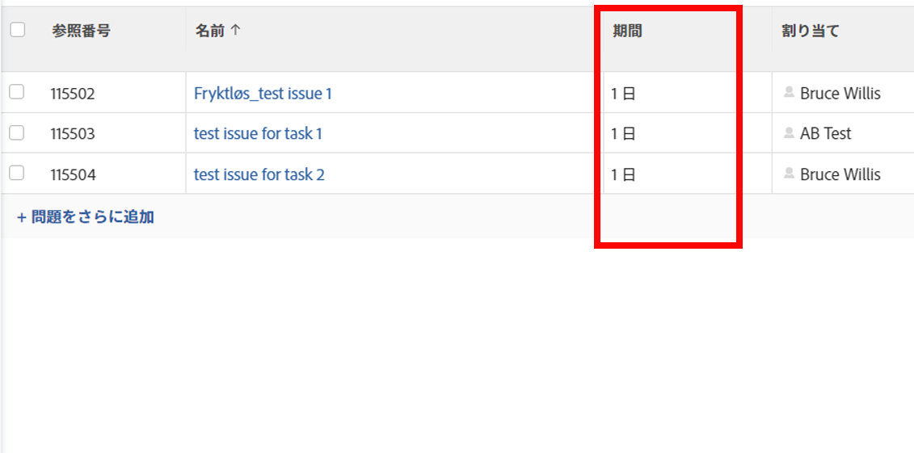

# イシュー期間の概要

<!--Audited: 08/2025-->

イシューの期間は、イシューの計画開始日から計画完了日までの日数です。

Adobe Workfrontはイシューの期間を自動的に計算し、手動で変更することはできません。

イシューの期間は、イシューレポートまたはイシューリストのビューに表示できます。

レポートの作成について詳しくは、[カスタムレポートの作成](../../../reports-and-dashboards/reports/creating-and-managing-reports/create-custom-report.md)を参照してください。

