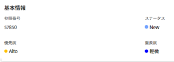

# イシューの優先度の更新

イシューの優先度を定義して、イシューの重要度を示すことができます。

イシューの優先度を変更するには、イシューに対する管理権限が必要です。 [イシューの優先度を更新](#update-the-priority-of-an-issue)。

## アクセス要件

この記事の手順を実行するには、次のアクセス権が必要です。

<table style="table-layout:auto"> 
 <col> 
 <col> 
 <tbody> 
  <tr> 
   <td role="rowheader">Adobe Workfront プラン*</td> 
   <td> 
任意 
 </td> 
  </tr> 
  <tr> 
   <td role="rowheader">Adobe Workfront ライセンス*</td> 
   <td> 
リクエスト以上
 </td> 
  </tr> 
  <tr> 
   <td role="rowheader">アクセスレベル設定*</td> 
   <td> 
イシューへのアクセス権を編集
 
メモ：まだアクセス権がない場合は、アクセスレベルに追加の制限が設定されていないかどうか Workfront 管理者にお問い合わせください。Workfront 管理者がアクセスレベルを変更する方法について詳しくは、<a href="../../../administration-and-setup/add-users/configure-and-grant-access/create-modify-access-levels.md" class="MCXref xref">カスタムアクセスレベルの作成または変更</a>を参照してください。
 </td> 
  </tr> 
  <tr> 
   <td role="rowheader">オブジェクト権限</td> 
   <td> 
イシューに対する権限の管理
 
追加のアクセス権のリクエストについて詳しくは、<a href="../../../workfront-basics/grant-and-request-access-to-objects/request-access.md" class="MCXref xref">オブジェクトへのアクセス権のリクエスト</a>を参照してください。
 </td> 
  </tr> 
 </tbody> 
</table>

&#42;保有するプラン、ライセンスタイプ、アクセス権を確認するには、Workfront 管理者に問い合わせてください。

## イシューの優先度の概要

各優先度ラベルには、変更できない番号が関連付けられています。

Adobe Workfront の管理者は、Workfront 内で優先度ラベルを変更したり、新しい優先度を作成したりできます。その結果、Workfront インスタンスの優先度フィールドに対するオプションが、次に示すオプションと異なる場合があります。

組織で使用される優先度の番号付け順序を把握する必要があります。\
例えば、優先度のラベルが変更されている場合、組織は緊急のタスクを参照するために数字の 1 を使用することがあります。

インスタンスの優先度の名前のカスタマイズについて詳しくは、[優先度の作成とカスタマイズ](../../../administration-and-setup/customize-workfront/creating-custom-status-and-priority-labels/create-customize-priorities.md)を参照してください。

次の表を参照して、各デフォルトの優先度ラベルと対応する数について把握してください。

<table style="table-layout:auto"> 
 <col> 
 <col> 
 <thead> 
  <tr> 
   <th>優先度ラベル （変更可能） </th> 
   <th>優先度番号 （変更不可） </th> 
  </tr> 
 </thead> 
 <tbody> 
  <tr> 
   <td> なし </td> 
   <td> 0 </td> 
  </tr> 
  <tr> 
   <td> 低 </td> 
   <td> 1 </td> 
  </tr> 
  <tr> 
   <td> 標準 </td> 
   <td> 2 </td> 
  </tr> 
  <tr> 
   <td> 高 </td> 
   <td> 3 </td> 
  </tr> 
  <tr> 
   <td> 緊急 </td> 
   <td> 4 </td> 
  </tr> 
 </tbody> 
</table>

## イシューの優先度を更新 {#update-the-priority-of-an-issue}

1. 優先度を変更するイシューに移動します。
1. 左側のパネルで&#x200B;**イシューの詳細**&#x200B;をクリックします。

   **概要**&#x200B;セクションがデフォルトで表示されます。

1. **基本情報**&#x200B;エリアの「**優先度**」フィールドをクリックします。

   

1. 「**優先度**」フィールドの値を選択します。

   Workfront 管理者がシステムの優先度をどのように設定したかに応じて、オプションは異なる場合があります。

1. 「**変更を保存**」をクリックします。
