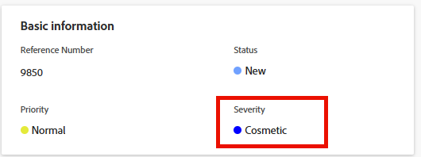

# イシューの重大度を更新

<!--Audited: 08/2025-->

Adobe Workfront で、重大度をイシューに関連付けることができます。タスクとプロジェクトには重要度はありません。

イシューは、プロジェクトが予定通り、または予算内で完了するのを妨げる可能性のある予期しないイベントです。 重要度を使用して、イシューの重要度を示すことができます。

Workfront 管理者は、Workfront で使用できる重大度を定義します。それらを確立すると、イシューに関連付けることができるようになります。\
Workfront での重大度の作成について詳しくは、[イシューの重大度を作成またはカスタマイズ](../../../administration-and-setup/customize-workfront/creating-custom-status-and-priority-labels/create-customize-issue-severities.md)を参照してください。

重大度を更新できるようにするには、イシューに対する投稿権限が必要です。

Workfront の次のエリアでイシューの重大度を更新できます。

* **イシューを編集** ダイアログボックスで
* イシューの **イシューの詳細**&#x200B;エリア
* イシューリストまたはレポートで

## アクセス要件

+++ 展開すると、この記事の機能のアクセス要件が表示されます。

<table style="table-layout:auto"> 
 <col> 
 <col> 
 <tbody> 
  <tr> 
   <td role="rowheader">Adobe Workfront パッケージ</td> 
   <td> 
任意
 </td> 
  </tr> 
  <tr> 
   <td role="rowheader">Adobe Workfront プラン</td> 
   <td>
投稿者以上
 
   
リクエスト以上
 </td> 
  </tr> 
  <tr> 
   <td role="rowheader">アクセスレベル設定</td> 
   <td> 
イシューへのアクセス権を編集
</td> 
  </tr> 
  <tr> 
   <td role="rowheader">オブジェクト権限</td> 
   <td> 
イシューに対する権限の管理
</td> 
  </tr> 
 </tbody> 
</table>

この表の情報について詳しくは、[Workfront ドキュメントのアクセス要件](/help/quicksilver/administration-and-setup/add-users/access-levels-and-object-permissions/access-level-requirements-in-documentation.md)を参照してください。

+++

## イシューの重大度を更新

イシューのイシューの詳細領域でイシューの重大度を更新するには、次の手順を実行します。

1. 重大度を更新するイシューに移動します。
1. 左側のパネルで&#x200B;**イシューの詳細**&#x200B;をクリックします。

   **概要**&#x200B;セクションがデフォルトで表示されます。

1. **基本情報**&#x200B;エリアの&#x200B;**重大度**&#x200B;フィールドをクリックします。

   

1. ドロップダウンメニューから適切な&#x200B;**重大度**&#x200B;を選択します。

   Workfront 管理者がシステムでどのように重大度を設定したかに応じて、オプションは異なる場合があります。

1. 「**変更を保存**」をクリックします。
