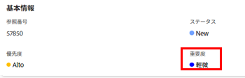

# 問題の重大度を更新

重大度をAdobe Workfrontの問題に関連付けることができます。 タスクとプロジェクトには重要性はありません。

問題とは、プロジェクトが予定どおりに完了しない、または予算内で終了しない可能性のある予期しないイベントです。 重大度を使用して、問題の重大度を示すことができます。 

Workfrontの管理者が、Workfrontで使用できる重大度を定義します。 設定後は、問題と関連付けることができます。\
Workfrontでの重大度の作成について詳しくは、 [問題の重要度を作成またはカスタマイズ](../../../administration-and-setup/customize-workfront/creating-custom-status-and-priority-labels/create-customize-issue-severities.md).

問題の重大度を更新するには、Contribute の権限が必要です。 

Workfrontの次の領域で、問題の重大度を更新できます。

* 内 **問題を編集** ダイアログボックス
* 内 **問題の詳細** 問題の領域
* イシューリストまたはレポート内

## アクセス要件

この記事の手順を実行するには、次のアクセス権が必要です。

<table style="table-layout:auto"> 
 <col> 
 <col> 
 <tbody> 
  <tr> 
   <td role="rowheader">Adobe Workfront plan*</td> 
   <td> 
任意 
 </td> 
  </tr> 
  <tr> 
   <td role="rowheader">Adobe Workfront license*</td> 
   <td> 
リクエスト以上
 </td> 
  </tr> 
  <tr> 
   <td role="rowheader">アクセスレベル設定*</td> 
   <td> 
問題へのアクセスを編集
 
注意：まだアクセス権がない場合は、Workfront管理者に、アクセスレベルに追加の制限を設定しているかどうかを問い合わせてください。 Workfront管理者がアクセスレベルを変更する方法について詳しくは、 <a href="../../../administration-and-setup/add-users/configure-and-grant-access/create-modify-access-levels.md" class="MCXref xref">カスタムアクセスレベルの作成または変更</a>.
 </td> 
  </tr> 
  <tr> 
   <td role="rowheader">オブジェクト権限</td> 
   <td> 
問題に対する権限の管理
 
追加のアクセス権のリクエストについて詳しくは、 <a href="../../../workfront-basics/grant-and-request-access-to-objects/request-access.md" class="MCXref xref">オブジェクトへのアクセスのリクエスト </a>.
 </td> 
  </tr> 
 </tbody> 
</table>

&#42;保有しているプラン、ライセンスの種類、アクセス権を確認するには、Workfront管理者に問い合わせてください。

## 問題の重大度を更新

問題の「Issue Details」領域で問題の重大度を更新する手順は、次のとおりです。

1. 重大度を更新する問題に移動します。
1. クリック **問題の詳細** をクリックします。

   この **概要** デフォルトでは、「 」セクションが表示されます。

1. 次をクリック： **重大度** フィールド **基本情報** 領域

   

1. 適切な **重大度** を選択します。

   システムでのWorkfront管理者による重大度の設定方法に応じて、オプションは異なる場合があります。

1. クリック **変更を保存**.
