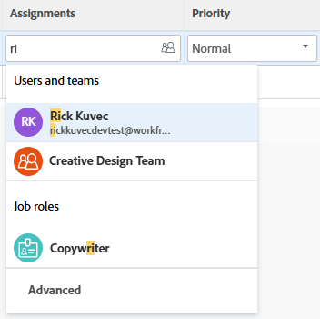

# イシューの割り当て

{{preview-fast-release-general}}

<!--Audited: 07/2024-->

ユーザー、役割、およびチームにイシューを割り当てて、イシューの完了担当者を指定できます。イシューの割り当てについて一般的な情報については、[イシューの割り当ての変更についての概要](../../../manage-work/issues/manage-issues/modify-issue-assignments-overview.md)を参照してください。

>[!TIP]
>
>複数のユーザー、担当業務やチームを割り当てることができます。アクティブなユーザー、担当業務およびチームのみを割り当てることができます。
>
>ユーザー、担当業務、またはチームが非アクティブ化される前に割り当てられていた場合、それらは作業アイテムに割り当てられたままになります。この場合、以下の操作をお勧めします。
>
>* 作業アイテムをアクティブなリソースに再割り当てする。
>* 非アクティブ化されたチームのユーザーをアクティブなチームに関連付け、作業アイテムをアクティブなチームに再割り当てする。

イシューの割り当てに関して詳しくは、この記事に加え、以下の記事を読むことをお勧めします。

* [イシューの割り当て変更の概要](../../../manage-work/issues/manage-issues/modify-issue-assignments-overview.md)
* [イシューの編集](../../../manage-work/issues/manage-issues/edit-issues.md)
* [リスト内の複数のイシューに対するユーザー割り当てを変更](../../../manage-work/issues/manage-issues/edit-assignments-for-multiple-issues.md)
* [詳細な割り当てを作成](../../../manage-work/tasks/assign-tasks/create-advanced-assignments.md)
* [スマート割り当てを実行](../../../manage-work/tasks/assign-tasks/make-smart-assignments.md)
* [スマート割り当ての概要](../../../manage-work/tasks/assign-tasks/smart-assignments.md)
* [ワークロードバランサーでの作業割り当ての概要](../../../resource-mgmt/workload-balancer/assign-work-in-workload-balancer.md)

1 つまたは複数のリソースに個々のイシューレベルでイシューを割り当てたり、複数のリソースを複数のイシューに一度に割り当てたりできます。

問題とタスクの割り当ては、Adobe Workfrontと似ています。 タスクの割り当てに関する一般情報については、[タスクの割り当て変更の概要](../../../manage-work/tasks/assign-tasks/modify-task-assignments-overview.md)を参照してください。

## アクセス要件

+++ 展開すると、この記事の機能のアクセス要件が表示されます。 

<table style="table-layout:auto"> 
 <col> 
 </col>
 <tbody> 
  <tr> 
   <td>Adobe Workfront パッケージ</td> 
   <td> 
任意 
 </td> 
  </tr> 
  <tr> 
   <td>Adobe Workfront プラン</td> 
   <td> 
投稿者以上

   
レビュー以上
 </td> 
  </tr> 
  <tr> 
   <td>アクセスレベル設定</td> 
   <td> 
イシューへのアクセス権を編集
 
プロジェクトおよびタスクへの表示以上のアクセス権を持ち、1 つの問題を割り当てる
 </td> 
  </tr> 
  <tr> 
   <td>オブジェクト権限</td> 
   <td> 
イシューに対する権限の管理
 
 1 つのイシューを割り当てる際に、イシューが存在するプロジェクトまたはタスクへの権限以上を表示する

複数のイシューを割り当てる場合は、イシューが存在するプロジェクトまたはタスクに対する権限以上を投稿します。
 </td> 
  </tr> 
 </tbody> 
</table>

詳しくは、[Workfront ドキュメントのアクセス要件](/help/quicksilver/administration-and-setup/add-users/access-levels-and-object-permissions/access-level-requirements-in-documentation.md)を参照してください。

+++

## 担当業務、チーム、ユーザーに対する複数の割り当てに関する考慮事項

作業アイテムに複数のリソースを割り当てる際は、次の点を考慮してください。

* ユーザーのプロファイルには、複数の担当業務を関連付けることができます。ユーザーと担当業務の関連付けについて詳しくは、[ユーザーのプロファイルを編集](../../../administration-and-setup/add-users/create-and-manage-users/edit-a-users-profile.md)を参照してください。

* 通常、タスクやイシューはまず、1 つまたは複数の担当業務またはチームに割り当てられます。プロジェクトを開始する準備が整ったら、ユーザーに割り当てる必要が生じる場合もあります。

  1 つまたは複数の役割にタスクまたはイシューが割り当てられ、続いてユーザーも割り当てられた場合、Adobe Workfront は次のルールに従って、ユーザー（が存在する場合）に関連付ける担当業務を決定します。

   * 割り当てられた担当業務が 1 つだけで、これがユーザーの主要役割に一致する場合、タスクやイシューは主要役割を果たすユーザーのみに割り当てられます。
   * 複数の役割が割り当てられ、そのうち少なくとも 1 つがユーザーのセカンダリの役割と一致する場合、タスクまたはイシューは、その他の役割の 1 つ（複数の一致がある場合は Workfront がランダムに選択したもの）を果たすユーザー、および追加されたすべての役割に割り当てられます。
   * 1 つ以上の担当業務が割り当てられ、ユーザーの役割に一致するものがない場合、タスクまたはイシューは 1 つまたは複数の役割、およびユーザーの両方とに割り当てられます。

* タスクまたはイシューがチームに割り当てられ、ユーザーも割り当てられた場合、そのタスクまたはイシューはチームとユーザーの両方に割り当てられたままになります。

<!--

<h2> </h2>
<h2>Considerations about removing assignments from issues</h2> 

(NOTE: drafted and moved to Modify issue assignments overview article)

You can remove assignments from one issue at a time, or you can remove assignments from multiple issues in bulk.

For more information about removing assignments from issues in bulk, see <a href="../../../manage-work/issues/manage-issues/edit-assignments-for-multiple-issues.md" class="MCXref xref">Modify user assignments for multiple issues in a list</a>. 

Consider the following when removing assignments from issues: 

<ul>
<li>When you unassign a user from an issue, the issue remains assigned to the job role that the user fulfilled on the issue.</li>
<li>When you unassign a job role or a team from an issue, the issue remains unassigned if it is not assigned to any other resources. </li>
</ul>

-->

## 単一のイシューを割り当てる

1. 割り当てる問題に移動します。
1. **割り当て**&#x200B;エリアのイシューヘッダーの右上隅にある「**割り当て先**」をクリックします。

   または

   イシューが既に割り当てられている場合は、現在の割り当ての名前をクリックします。

   

1. 次のいずれかの操作を行います。

   * 割り当てるユーザー、役割、またはチームの名前を入力し、リストに表示されたらクリックします。

     

   * （条件付き）使用可能なリストの名前、役割、チームのいずれかをクリックします
   * 「**自分に割り当て**」をクリックして、自分に割り当てる
   * 「**詳細**」をクリックします。

     高度な割り当ての作成は、タスクやイシューに似ています。高度な割り当てを行う方法について詳しくは、[高度な割り当てを作成](../../../manage-work/tasks/assign-tasks/create-advanced-assignments.md)を参照してください。

     >[!TIP]
     >
     >ユーザー割り当てを追加する際には、アバター、ユーザーの主要な役割やメールアドレスに注意して、同じ名前のユーザーを区別してください。
     >
     >ユーザーを追加したときに表示するには、少なくとも 1 つの担当業務に関連付ける必要があります。
     >
     >ユーザーがユーザーのメールを表示するには、アクセスレベルで、連絡情報の表示の設定を有効にしておく必要があります。詳しくは、[ユーザーへのアクセス権の付与](../../../administration-and-setup/add-users/configure-and-grant-access/grant-access-other-users.md)を参照してください。
     >

     <!-- this doesn't apply to issues; if it does, add this to the TIP above: 
      >When adding a job role assignment, you can search for the job role or location. Select a role from the Job roles list to use the default billing rate for the assignment, or select a Rate card job role to use the billing rate from the rate card. For more information on rate cards, see [Manage rate cards](/help/quicksilver/administration-and-setup/set-up-workfront/configure-system-defaults/manage-rate-cards.md).-->

1. 「**保存**」をクリックして、イシューの割り当てを完了します。
1. （任意）イシューのヘッダーにある「割り当て」領域で、割り当ての名前の横にある **X** アイコンをクリックして、割り当てを削除します。

## リスト内のイシューを割り当てる

いずれかの割り当てフィールドがリストの表示に示されている場合、リストまたはレポート内のイシューを割り当てることができます。これは、イシューをより迅速に割り当てる方法です。

表示に示されるフィールドに応じて、イシューに以下のエンティティを割り当てることができます。

| オプション | 割り当てられたエンティティ |
|---|---|
| **割り当て先** | 1 人のユーザーの割り当て |
| **割り当て** | 1 人のユーザーの割り当て |
| **割り当て** | ユーザー、担当業務、またはチームを割り当てる |

リスト内のイシューを割り当てる手順は、以下のように行います。

1. ビュー内の、「割り当て先」、「割り当て済み」、または「割り当て」フィールドのあるイシューのリストに移動します。
1. イシューを割り当てるには、以下のいずれかを実行します。

   * 「**割り当て先**」または「**割り当て**」フィールドの内側をクリックし、イシューに割り当てるアクティブなユーザーの名前の入力を開始し、リストに表示されたらクリックします。

     

   * 「**割り当て**」フィールドの内側をクリックし、イシューに割り当てるアクティブなユーザー、担当業務、またはアクティブなチームの名前の入力を開始し、リストに表示されたらクリックします。

      プレビュー環境のサンプル画像：
     

     本番環境のサンプル画像：
     

   >[!TIP]
   >
   >ユーザー割り当てを追加する際には、アバター、ユーザーの主要な役割やメールアドレスに注意して、同じ名前のユーザーを区別してください。
   >
   >ユーザーを追加したときに表示するには、少なくとも 1 つの担当業務に関連付ける必要があります。
   >
   >ユーザーがユーザーのメールを表示するには、アクセスレベルで、連絡情報の表示の設定を有効にしておく必要があります。詳しくは、[ユーザーへのアクセス権の付与](../../../administration-and-setup/add-users/configure-and-grant-access/grant-access-other-users.md)を参照してください。

1. （条件付き）「割り当て」フィールドで、「割り当て」ボックスの右上隅にある **詳細** または **人物アイコン** をクリックして、「詳細な割り当て」ボックスを開き、詳細な割り当てを作成します。 詳しくは、[詳細な割り当てを作成](../../../manage-work/tasks/assign-tasks/create-advanced-assignments.md)を参照してください。

   >[!TIP]
   >
   >割り当て先フィールドまたは割り当て済みフィールドからは、詳細な割り当てを行うことはできません。

1. イシューに担当者を追加した後、Enter キーを押すか、ページ上の任意の場所をクリックして、変更を保存します。

## 一括でイシューを割り当てる

1. 一括で割り当てるイシューのリストに移動します。
1. リストから複数のイシューを選択します。
1. **編集アイコン** をクリックします。

   **問題を編集**&#x200B;ダイアログボックスが開きます。

1. **割り当て**&#x200B;エリアで、「**担当者**」ボックスを選択し、すべてのイシューに割り当てるユーザー名、担当業務、またはチームを入力します。

   >[!IMPORTANT]
   >
   >イシューが既に割り当てられている場合、ここに指定したリソースは、イシュー上の既存のリソースを置き換える代わりに、イシューに追加されます。

1. （オプション）複数のリソースをイシューに割り当てる場合は、**イシュー所有者**&#x200B;列にあるラジオボタンを選択して、イシューの主担当者または所有者であるリソースを示します。これは、チームには使用できません。
1. （オプション）ユーザーをイシューに割り当てる場合、**担当者の役割**&#x200B;列の「**役割を選択**」ドロップダウンメニューから、ユーザーがイシューで果たすべき役割を選択します。役割を選択しない場合、Workfront はユーザーの主要役割を自動的選択します。

1. （オプション）すべてのイシューから既存の担当者を削除する場合は、以下の操作のいずれかを行います。

   1. イシューから削除するユーザー、役割、またはチームの名前の入力を開始し、リストに表示されたら選択して、「**担当者を削除**」をクリックして、削除する担当者を追加します。
   1. 「**既存の担当者をすべて削除**」をクリックし、選択したすべてのイシューからすべての担当者を削除します。

1. 「**変更を保存**」をクリックします。
1. （オプションおよび条件付き）イシューのリストに「割り当て先」フィールドまたは「割り当て」フィールドが表示されたら、イシューのこれらの列のいずれかの内側をクリックし、担当者の名前の横にある「**X アイコン**」をクリックして、イシューから削除します。
