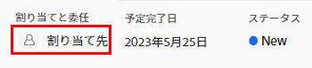
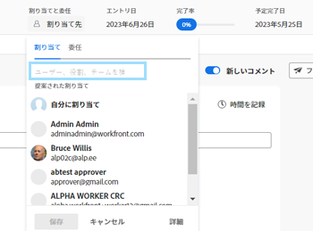
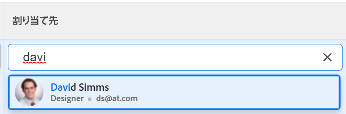
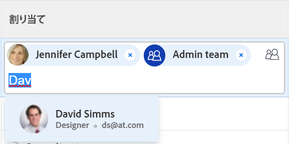

# 問題の割り当て

ユーザー、役割およびチームに問題を割り当てて、問題の完了担当者を指定できます。 問題の割り当てに関する一般情報については、 [問題の割り当ての変更の概要](../../../manage-work/issues/manage-issues/modify-issue-assignments-overview.md).

>[!TIP]
>
>複数のユーザー、ジョブの役割またはチームを割り当てることができます。 アクティブなユーザー、ジョブの役割およびチームのみを割り当てることができます。
>
>非アクティブ化前にユーザー、ジョブの役割、またはチームが割り当てられた場合、そのユーザーは作業項目に割り当てられたままになります。 この場合、次の操作をお勧めします。
>
>* 作業項目をアクティブなリソースに再割り当てする。
>* 非アクティブなチームのユーザをアクティブなチームに関連付け、作業項目をアクティブなチームに再割り当てします。

問題の割り当ての詳細については、この記事に加え、次の記事を読むことをお勧めします。

* [問題の割り当ての変更の概要](../../../manage-work/issues/manage-issues/modify-issue-assignments-overview.md)
* [問題の編集](../../../manage-work/issues/manage-issues/edit-issues.md)
* [リスト内の複数の問題に対するユーザー割り当てを変更する](../../../manage-work/issues/manage-issues/edit-assignments-for-multiple-issues.md)
* [高度な割り当てを作成](../../../manage-work/tasks/assign-tasks/create-advanced-assignments.md)
* [スマート割り当てを行う](../../../manage-work/tasks/assign-tasks/make-smart-assignments.md)
* [スマート割り当ての概要](../../../manage-work/tasks/assign-tasks/smart-assignments.md)
* [ワークロードバランサーでの作業割り当ての概要](../../../resource-mgmt/workload-balancer/assign-work-in-workload-balancer.md)

1 つまたは複数のリソースに個々のイシューレベルでイシューを割り当てたり、複数のリソースを複数のイシューに一度に割り当てたりできます。

問題とタスクの割り当ては、Adobe Workfrontでも同様です。 タスクの割り当てに関する一般情報については、 [タスクの割り当て変更の概要](../../../manage-work/tasks/assign-tasks/modify-task-assignments-overview.md).

## アクセス要件

この記事の手順を実行するには、次のアクセス権が必要です。

<table style="table-layout:auto"> 
 <col> 
 </col> 
 <col> 
 </col> 
 <tbody> 
  <tr> 
   <td role="rowheader">Adobe Workfront plan*</td> 
   <td> 
任意 
 </td> 
  </tr> 
  <tr> 
   <td role="rowheader">Adobe Workfront license*</td> 
   <td> 
レビュー以上
 </td> 
  </tr> 
  <tr> 
   <td role="rowheader">アクセスレベル*</td> 
   <td> 
問題へのアクセスを編集
 
プロジェクトとタスクへのアクセス権を表示または高くする
 
まだアクセス権がない場合は、Workfront管理者に、アクセスレベルに追加の制限を設定しているかどうかを問い合わせてください。 アクセスレベルの問題へのアクセスについて詳しくは、 <a href="../../../administration-and-setup/add-users/configure-and-grant-access/grant-access-issues.md" class="MCXref xref">問題へのアクセス権の付与</a>. Workfront管理者がアクセスレベルを変更する方法について詳しくは、 <a href="../../../administration-and-setup/add-users/configure-and-grant-access/create-modify-access-levels.md" class="MCXref xref">カスタムアクセスレベルの作成または変更</a>. 
 </td> 
  </tr> 
  <tr> 
   <td role="rowheader">オブジェクト権限</td> 
   <td> 
問題に対する権限の管理
 
問題をコピーする項目に対する権限を付与し、問題を追加する機能を付与します。
 
 問題に対する権限の付与について詳しくは、 <a href="../../../workfront-basics/grant-and-request-access-to-objects/share-an-issue.md" class="MCXref xref">イシューの共有 </a>
 
追加の権限のリクエストについて詳しくは、 <a href="../../../administration-and-setup/add-users/configure-and-grant-access/grant-access-other-users.md">ユーザーへのアクセス権の付与</a>.
 </td> 
  </tr> 
 </tbody> 
</table>

*保有するプラン、ライセンスの種類、アクセス権を確認するには、Workfront管理者にお問い合わせください。

## 役割、チーム、ユーザーに対する複数の割り当てに関する考慮事項

作業項目に複数のリソースを割り当てる際は、次の点に注意してください。

* ユーザーのプロファイルには、複数のジョブの役割を関連付けることができます。 ユーザーとジョブの役割の関連付けについて詳しくは、 [ユーザーのプロファイルの編集](../../../administration-and-setup/add-users/create-and-manage-users/edit-a-users-profile.md).

* 通常、タスクや問題は 1 つまたは複数のジョブの役割またはチームに最初に割り当てられます。 プロジェクトを開始する準備が整ったら、ユーザーへの割り当ても必要になる場合があります。

  1 つ以上の役割にタスクまたはイシューが割り当てられ、ユーザーも割り当てられた場合、Adobe Workfrontは、次のルールに従って、追加のユーザーに関連付けるジョブの役割を決定します。

   * プライマリロールが 1 つだけ割り当てられ、プライマリロールと一致する場合、タスクまたはイシューは、そのジョブロールを満たすユーザーにのみ割り当てられます。
   * 複数のロールが割り当てられ、少なくとも 1 つのロールがユーザーのセカンダリロールと一致する場合、タスクまたは問題は、他のロールの 1 つ ( 複数の一致がある場合はWorkfrontがランダムに選択 ) を満たすユーザーと、追加のロールに割り当てられます。
   * 1 つ以上のジョブロールが割り当てられ、ユーザーのロールに一致するものがない場合、タスクまたはイシューはロールまたはロールの両方に割り当てられ、ユーザーにも割り当てられます。

* タスクまたはイシューがチームに割り当てられ、ユーザーも割り当てられた場合、そのタスクまたはイシューはチームとユーザーの両方に割り当てられたままになります。

<!--

<h2> </h2>
<h2>Considerations about removing assignments from issues</h2> 

(NOTE: drafted and moved to Modify issue assignments overview article)

You can remove assignments from one issue at a time, or you can remove assignments from multiple issues in bulk.

For more information about removing assignments from issues in bulk, see <a href="../../../manage-work/issues/manage-issues/edit-assignments-for-multiple-issues.md" class="MCXref xref">Modify user assignments for multiple issues in a list</a>. 

Consider the following when removing assignments from issues: 

<ul>
<li>When you unassign a user from an issue, the issue remains assigned to the job role that the user fulfilled on the issue.</li>
<li>When you unassign a job role or a team from an issue, the issue remains unassigned if it is not assigned to any other resources. </li>
</ul>

-->

## 単一のイシューを割り当て

1. 割り当てる問題に移動します。
1. クリック **割り当て先** をクリックします。 **割り当て** 領域

   または

   問題が既に割り当てられている場合は、現在の割り当ての名前をクリックします。

   

1. 次のいずれかの操作を行います。

   * 割り当てるユーザー、役割、またはチームの名前を入力し、リストに表示されたらクリックします。

     

   * （条件付き） **推奨割り当て** リスト
   * クリック&#x200B;**自分に割り当て** 自分に割り当てる
   * クリック **詳細**

     高度な割り当ての作成は、タスクや問題に似ています。 高度な割り当てを行う方法については、 [高度な割り当てを作成](../../../manage-work/tasks/assign-tasks/create-advanced-assignments.md).

     >[!TIP]
     >
     >ユーザー割り当てを追加する際には、アバター、ユーザーのプライマリの役割、または電子メールアドレスに注意して、同じ名前のユーザーを区別します。
     >
     >ユーザーを追加したときに表示するには、少なくとも 1 つのジョブの役割に関連付ける必要があります。
     >
     >ユーザーがユーザーの電子メールを表示するには、アクセスレベルで [ 連絡先情報の表示 ] 設定を有効にしておく必要があります。 詳しくは、 [ユーザーへのアクセス権の付与](../../../administration-and-setup/add-users/configure-and-grant-access/grant-access-other-users.md)

1. クリック **保存** をクリックして、問題の割り当てを完了します。
1. （オプション） **X アイコン** 割り当てを削除する問題のヘッダーの「割り当て」領域で、割り当ての名前の横に表示されます。

## リスト内の問題の割り当て

いずれかの割り当てフィールドがリストの表示に表示されている場合、リストまたはレポートで問題を割り当てることができます。 これにより、問題をより迅速に割り当てることができます。

ビューに表示されるフィールドに応じて、次のエンティティをイシューに割り当てることができます。

| オプション | 割り当てられたエンティティ |
|---|---|
| **割り当て先** | 1 人のユーザーを割り当て |
| **割り当て** | 1 人のユーザーを割り当て |
| **割り当て** | ユーザー、ジョブの役割、またはチームを割り当てます。 |

リストで問題を割り当てるには：

1. ビューの [ 割り当て先 ]、[ 割り当て先 ]、または [ 割り当て先 ] フィールドを持つ問題の一覧に移動します。
1. イシューを割り当てるには、次のいずれかを実行します。

   * 内側をクリック **割り当て先** または **割り当て済み** フィールドに入力して、イシューに割り当てるアクティブなユーザーの名前を入力し、リストに表示されたらクリックします。

     

   * 内側をクリック **割り当て** フィールドに、イシューに割り当てるアクティブなユーザー、ジョブの役割、またはアクティブなチームの名前を入力し、リストに表示されたらクリックします。

     

   >[!TIP]
   >
   >ユーザー割り当てを追加する際には、アバター、ユーザーのプライマリの役割、または電子メールアドレスに注意して、同じ名前のユーザーを区別します。
   >
   >ユーザーを追加したときに表示するには、少なくとも 1 つのジョブの役割に関連付ける必要があります。
   >
   ユーザーがユーザーの電子メールを表示するには、アクセスレベルで [ 連絡先情報の表示 ] 設定を有効にしておく必要があります。 詳しくは、 [ユーザーへのアクセス権の付与](../../../administration-and-setup/add-users/configure-and-grant-access/grant-access-other-users.md).

1. （条件付き）「割り当て」フィールドに表示されたら、 **人物アイコン**  [ 割り当て ] ボックスの右上隅にある [ 詳細割り当て ] ボックスを開き、高度な割り当てを作成します。 詳しくは、 [高度な割り当てを作成](../../../manage-work/tasks/assign-tasks/create-advanced-assignments.md).

   >[!TIP]
   >
   >「割り当て先」フィールドまたは「割り当て先」フィールドからは、高度な割り当てを行うことはできません。

1. 割り当て先を問題に追加したら、Enter キーを押すか、ページ上の任意の場所をクリックして、変更を保存します。

## 問題の一括割り当て

1. 一括で割り当てる問題のリストに移動します。
1. リストから複数の問題を選択します。
1. 次をクリック： **編集アイコン** .

   この **問題の編集** ダイアログボックスが開きます。

1. 内 **割り当て** 領域で、 **担当者** ボックスに名前を入力し、すべての問題に割り当てるユーザー、ジョブの役割、またはチームの名前を入力します。

   >[!IMPORTANT]
   >
   >既に問題が割り当てられている場合は、既存の問題のリソースを置き換える代わりに、ここで指定したリソースが問題に追加されます。

1. （オプション） **問題の所有者** 複数のリソースをイシューに割り当てる場合に、どのリソースがプライマリー担当者またはイシューの所有者かを示す列。 これは、チームには使用できません。
1. （オプション）ユーザーが問題に関して実行する必要がある役割を **役割を選択** ドロップダウンメニュー **担当者の役割** 」列に表示されます。 役割を選択しない場合、Workfrontはユーザーの役割を自動的にプライマリします。

1. （オプション）すべての問題から既存の担当者を削除する場合は、次のいずれかを実行します。

   1. 問題から削除するユーザー、役割、またはチームの名前の入力を開始し、リストに表示されたら選択して、「 」をクリックします **担当者を削除** をクリックして、削除する担当者を追加します。
   1. クリック **既存の担当者をすべて削除** 選択したすべての問題からすべての担当者を削除します。

1. クリック **変更を保存**.
1. （オプションおよび条件付き）問題のリストに「割り当て先」フィールドまたは「割り当て先」フィールドが表示されたら、問題の列の 1 つをクリックし、 **X アイコン** 担当者の名前の横にある、問題から削除します。
