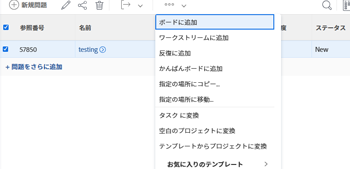
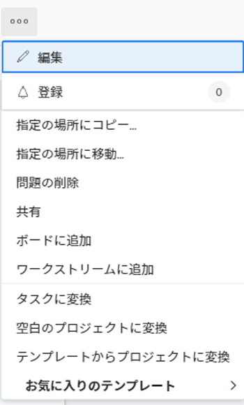
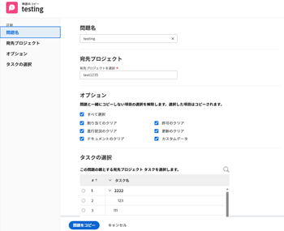

# イシューをコピー

イシューまたはリクエストをコピーして、同じプロジェクトまたは別のプロジェクトに保存できます。 タスクから別のプロジェクトにイシューをコピーすることもできます。

以下のオブジェクトからイシューをコピーできます。

* プロジェクトから同じプロジェクトに（同じプロジェクトに複製）
* タスクから同じタスクに（同じタスクに対しては重複）
* プロジェクトから別のプロジェクトへ
* タスクからプロジェクトへ

>[!TIP]
>
>Workfrontでは、「問題」と「リクエスト」が同じ意味で使用されます。 プロジェクトとタスクの両方で問題を記録し、対処する必要のある予期しない作業を示すことができます。 リクエストキューとして指定されたプロジェクトで問題として記録されたリクエストを送信することもできます。

## アクセス要件

この記事の手順を実行するには、次のアクセス権が必要です。

<table style="table-layout:auto"> 
 <col> 
 <col> 
 <tbody> 
  <tr> 
   <td role="rowheader">Adobe Workfront plan*</td> 
   <td> 
任意
 </td> 
  </tr> 
  <tr> 
   <td role="rowheader">Adobe Workfront license*</td> 
   <td> 
リクエスト以上
 
プロジェクトの「問題」セクションで問題をコピーするには、ライセンスを確認するか、それ以上のライセンスを使用します。
 </td> 
  </tr> 
  <tr> 
   <td role="rowheader">アクセスレベル*</td> 
   <td> 
問題へのアクセスを編集
 
プロジェクトとタスクへのアクセス権を表示または高くする
 
注意：まだアクセス権がない場合は、Workfront管理者に、アクセスレベルに追加の制限を設定しているかどうかを問い合わせてください。 アクセスレベルの問題へのアクセスについて詳しくは、 <a href="../../../administration-and-setup/add-users/configure-and-grant-access/grant-access-issues.md" class="MCXref xref">問題へのアクセス権の付与</a>. Workfront管理者がアクセスレベルを変更する方法について詳しくは、 <a href="../../../administration-and-setup/add-users/configure-and-grant-access/create-modify-access-levels.md" class="MCXref xref">カスタムアクセスレベルの作成または変更</a>. 
 </td> 
  </tr> 
  <tr> 
   <td role="rowheader">オブジェクト権限</td> 
   <td> 
問題に対する権限の管理
 
問題をコピーする項目に対する権限を、問題を追加する機能と共に投稿します。
 
 問題に対する権限の付与について詳しくは、 <a href="../../../workfront-basics/grant-and-request-access-to-objects/share-an-issue.md" class="MCXref xref">イシューの共有 </a>
 
追加の権限のリクエストについて詳しくは、 <a href="../../../workfront-basics/grant-and-request-access-to-objects/request-access.md" class="MCXref xref">オブジェクトへのアクセスのリクエスト </a>.
 </td> 
  </tr> 
 </tbody> 
</table>

&#42;保有しているプラン、ライセンスの種類、アクセス権を確認するには、Workfront管理者に問い合わせてください。

## ドキュメントまたはリクエストキューに関する問題に関する考慮事項

ドキュメントを含む問題やリクエストキューに関連付けられている問題をコピーする際は、次の点を考慮してください。

* **問題がリクエストキューに関連付けられている場合：** イシューを別のオブジェクトにコピーし、そのイシューをリクエストキューに関連付けると、コピーされたイシューは、最初のイシューの元のキューに関連付けられなくなります。
* **ドキュメントが問題に添付された場合：** イシューを別のオブジェクトにコピーし、イシューにドキュメントが添付されている場合、ドキュメントとそのバージョンも新しいイシューに移動します。 ドキュメントに関連付けられている配達確認や承認は移動されません。
* **問題がドキュメントまたはフォルダーにリンクされている場合：** Google Drive などのサードパーティのサービスにリンクされたドキュメントまたはフォルダーを含むイシューをコピーすると、ドキュメントへのリンクがコピーされたイシューに転送されます。 

## リスト内の問題のコピー

1 つまたは複数のイシューをイシューのリストまたはイシューレポートからコピーできます。

1. コピーする 1 つまたは複数の問題を含むプロジェクトに移動します。

   または

   問題レポートに移動します。

1. プロジェクトに移動する場合は、 **問題** をクリックします。
1. コピーする 1 つまたは複数の問題を選択し、 **その他のメニュー** 問題リストの上部にあるをクリックし、 **コピー先**.

   

1. 「 」の節で説明されているように、引き続き問題をコピーします。 [1 つのイシューをコピー](#copy-a-single-issue) 手順 2 から始めます。

   <!--
   <MadCap:conditionalText data-mc-conditions="QuicksilverOrClassic.Draft mode">
   (NOTE:&nbsp;ensure step number stays accurate)
   </MadCap:conditionalText>
   -->

## 1 つのイシューをコピー {#copy-a-single-issue}

イシューの表示時に 1 つのイシューをコピーできます。

1. コピーする問題に移動し、 **詳細** メニュー  を問題名の右にドラッグし、 **コピー** からへ

   

   この **問題をコピー** ボックスが表示されます。

   

1. 内 **宛先プロジェクトを選択** 「 」セクションで、イシューをコピーするプロジェクトの名前を指定します。 デフォルトでは、現在のプロジェクトの名前が表示されます。

   >[!TIP]
   >
   >リストには 100 個のプロジェクトのみが表示されます。

1. （条件付き）クリック **アクセスを要求** プロジェクトにイシューをコピーするアクセス権がない場合。
1. （条件付き）宛先プロジェクトのタスクの 1 つにイシューを追加するアクセス権がある場合は、引き続き、アクセス権を要求せずに、イシューを選択した宛先プロジェクトにコピーします。

   

   >[!TIP]
   >
   >Workfront管理者がこれらのプロジェクトに問題を追加できない場合、選択したプロジェクトが承認待ち、完了または無効の場合にも、同様のメッセージが表示されます。 詳しくは、 [システム全体のプロジェクト環境設定の指定](../../../administration-and-setup/set-up-workfront/configure-system-defaults/set-project-preferences.md).

1. （オプション） **オプション** 「 」セクションで、以下の表に示す項目の選択を解除して、新しいイシューから削除します。 デフォルトでは、すべてのオプションが選択されています。

   >[!NOTE]
   これは、コピーされた問題のみに影響し、元の問題には影響しません。

   <table style="table-layout:auto"> 
    <col> 
    <col> 
    <tbody> 
     <tr> 
      <td role="rowheader">割り当て</td> 
      <td>イシューに割り当てられているユーザー、ジョブの役割、またはチームを削除します。</td> 
     </tr> 
     <tr> 
      <td role="rowheader">進捗状況</td> 
      <td>問題の完了率（存在する場合）を削除します。 </td> 
     </tr> 
     <tr> 
      <td role="rowheader">ドキュメント</td> 
      <td>ドキュメントのバージョン、リンクされたドキュメント、フォルダなど、ドキュメントタブ内のすべてを削除します。  デフォルトでは、ドキュメントの配達確認と承認を別のイシューにコピーすることはできません。</td> 
     </tr> 
     <tr> 
      <td role="rowheader">権限</td> 
      <td>イシューの共有先エンティティを削除します。 </td> 
     </tr> 
     <tr> 
      <td role="rowheader">更新</td> 
      <td>イシューの「更新」セクションからコメントを削除します。</td> 
     </tr> 
     <tr> 
      <td role="rowheader">カスタムデータ</td> 
      <td>問題のカスタムフォームから情報を削除します。問題に添付されたドキュメントに関連付けられたカスタムフォームに関する情報も、問題のカスタムフォームにもコピーされている場合は削除します。 カスタムフォームは問題とドキュメントに添付されたままですが、フォームに関する情報は新しい問題には引き継がれません。 </td> 
     </tr> 
    </tbody> 
   </table>

1. （オプション） **タスクを選択** 「 」セクションで、イシューを移動するタスクを選択します。
1. クリック **問題のコピー** または **問題のコピー** リストで複数の問題を選択した場合。

   コピーされた問題は、指定したプロジェクトに追加されます。

 
