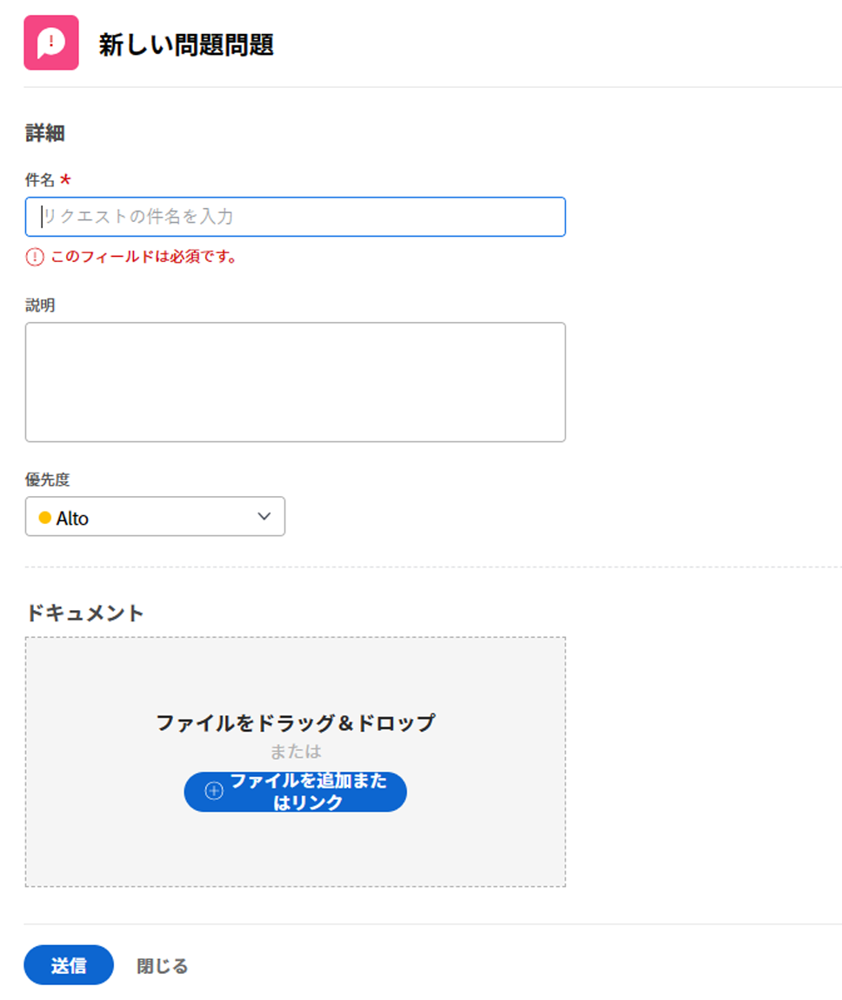
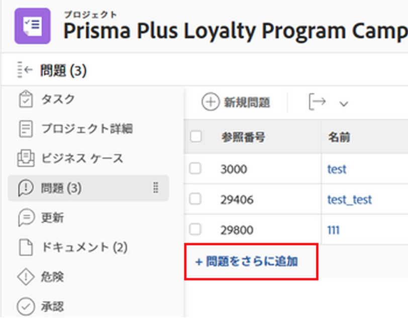

# イシューの作成

<!--

The highlighted information on this page refers to functionality not yet generally available. It is available only in the Preview environment for all customers. After the monthly releases to Production, the same features are also available in the Production environment for customers who enabled fast releases. 

For information about fast releases, see [Enable or disable fast releases for your organization](../../../administration-and-setup/set-up-workfront/configure-system-defaults/enable-fast-release-process.md).  

For information about the current release, see [Fourth Quarter 2023 release overview](../../../product-announcements/product-releases/23-q4-release-activity/23-q4-release-overview.md).  

-->

プロジェクトの作業中に、予期しないイベントが発生することがあります。 これらの予期しないイベントは、特定のプロジェクトやタスクの問題として記録できます。 適切なアクセス権を持つユーザーは、プロジェクトやタスクが完了するにつれて問題のステータスを表示および監視できるので、長時間の E メールチェーンやステータスミーティングを行う必要がありません。 計画イベントであるタスクとは異なり、問題はAdobe Workfrontで計画外の作業項目を表します。

また、リクエストとしてプロジェクトにイシューを追加することもできます。 詳しくは、 [Adobe Workfront要求の作成と送信](../../../manage-work/requests/create-requests/create-submit-requests.md).

>[!TIP]
>
>問題と要求は、Workfrontでも同じ意味で使用されます。 プロジェクトとタスクの両方で問題を記録し、対処する必要のある予期しない作業を示すことができます。 リクエストキューとして指定されたプロジェクトで問題として記録されたリクエストを送信することもできます。

## アクセス要件

この記事の手順を実行するには、次のアクセス権が必要です。

<table style="table-layout:auto"> 
 <col> 
 <col> 
 <tbody> 
  <tr> 
   <td role="rowheader">Adobe Workfront plan*</td> 
   <td> 
任意
 </td> 
  </tr> 
  <tr> 
   <td role="rowheader">Adobe Workfront license*</td> 
   <td> 
レビュー以上を実行して、プロジェクトまたはタスクにタスクを追加する
 
リクエストキューを使用して、リクエストとしてイシューを追加するリクエスト以上。
 </td> 
  </tr> 
  <tr> 
   <td role="rowheader">アクセスレベル設定*</td> 
   <td> 
問題へのアクセスを編集
 
プロジェクトとタスクへのアクセス権を表示または高くする
 
注意：まだアクセス権がない場合は、Workfront管理者に、アクセスレベルに追加の制限が設定されているかどうかを問い合わせてください。 アクセスレベルの問題へのアクセスについて詳しくは、 <a href="../../../administration-and-setup/add-users/configure-and-grant-access/grant-access-issues.md" class="MCXref xref">問題へのアクセス権の付与</a>. Workfront管理者がアクセスレベルを変更する方法について詳しくは、 <a href="../../../administration-and-setup/add-users/configure-and-grant-access/create-modify-access-levels.md" class="MCXref xref">カスタムアクセスレベルの作成または変更</a>. 
 </td> 
  </tr> 
  <tr> 
   <td role="rowheader">オブジェクトの権限</td> 
   <td> 
イシューを作成するタスクまたはプロジェクトにイシューを追加する権限を持つ、コントリビューション以上の権限
 
 問題に対する権限の付与について詳しくは、 <a href="../../../workfront-basics/grant-and-request-access-to-objects/share-an-issue.md" class="MCXref xref">イシューの共有 </a>
 
追加の権限のリクエストについて詳しくは、 <a href="../../../workfront-basics/grant-and-request-access-to-objects/request-access.md" class="MCXref xref">オブジェクトへのアクセスのリクエスト </a>.
 </td> 
  </tr> 
 </tbody> 
</table>

&#42;保有するプラン、ライセンスの種類、アクセス権を確認するには、Workfront管理者に問い合わせてください。

<!--
(NOTE: in NWE Requestors CAN see the Issues tab on a project but in classic they cannot! However, even when they DO see it, they cannot enter the issues - logged this issue for it but they might decide not to fix it: https://hub.workfront.com/issue/60181e28000058980cce29597185b2d6/updates?email-source=comm)

-->

## 問題作成の制限

正しいアクセス権と権限を持っている場合、プロジェクトまたはタスクにイシューを作成できます。 ただし、問題を作成できない場合は、次のようになります。

* Workfront管理者またはグループ管理者は、「プロジェクトの環境設定」領域で、「完了」または「無効」ステータスのプロジェクトへの問題の追加を有効にする必要があります。 プロジェクトの環境設定の詳細については、 [システム全体のプロジェクト環境設定の指定](../../../administration-and-setup/set-up-workfront/configure-system-defaults/set-project-preferences.md).
* 承認待ちのプロジェクトにはイシューを追加できません。

## 新しい問題フォームを準備する

組織では、問題をいつ記録するかに関して、適切に定義されたプロセスを導入する必要があります。 このプロセスを設定する場合、最初の手順は問題の送信に必要なフォームを作成することです。 タスクやプロジェクトに直接イシューを追加できるか、イシューを送信するリクエストキューがある場合は、新しいイシューを送信する際にユーザーが使用できるカスタムフィールドとWorkfrontフィールドを定義できます。 「新しい問題」フォームには、問題をすばやく解決するのに役立つ重要な情報を含めることができます。

プロジェクトの新しい問題のフィールドは、問題が記録されるプロジェクトの「キューの詳細」セクションで定義します。 プロジェクトの「Queue Details」セクションの設定については、 [リクエストキューの作成](../../../manage-work/requests/create-and-manage-request-queues/create-request-queue.md).

問題をリクエストキューに送信して作成する方法について詳しくは、 [新しいリクエストを入力してイシューを作成](#create-issues-by-entering-a-new-request) 」の節を参照してください。

## 「新しいイシュー」ボタンを使用してタスクまたはプロジェクトにイシューを作成する

プロジェクトで新しいイシューフォームのフィールドを定義したら、イシューの作成を開始できます。

<!-- OLD UI: redesigned on Oct 26, 2023:

Creating issues differs depending on which environment you choose to create the issue. 

### Create issues on a task or project using the New Issue button in the Production environment

To create an issue on a task or a project:

1. Go to a project where you want to create the issue. 
1. (Optional) If you want to log the issue for a task, go to the **Tasks** area, then click the name of a task. 
1. Click the **Issues** section.

   
1. Click **New Issue**.

  

1. (Conditional) If the project creator created Queue Topics or Topic Groups on the project they are added to the new issue form. Specify the **Topic Group** or the **Queue Topic** of your new issue. Topic Groups and Queue Topics have names customized to your environment.  
   For more information about creating Topic Groups, see [Create Topic Groups](../../../manage-work/requests/create-and-manage-request-queues/create-topic-groups.md). For more information about creating Queue Topics, see [Create Queue Topics](../../../manage-work/requests/create-and-manage-request-queues/create-queue-topics.md).

   

   * If there is only one Queue Topic set on the project, it is displayed automatically.
   * If the Topic Group does not have any Queue Topics or Topic Groups under it, nothing is available in the Topic Group drop-down.

1. (Conditional) If the project creator allowed for the **Request Type** field to display on the New Issue form, select the type of your issue from the following options:

   * Bug Report
   * Change Order
   * Issue
   * Request  
     Depending on how your Workfront administrator has configured your Project Preferences, the names of the issue types might be different for you. 

   >[!TIP]
   >
   >The Request Types must be enabled in the Queue Details and as well as when creating the Queue Topic to display as a selection in the New Issue form. For information, see the following articles: 
   >* [Create a Request Queue](../../requests/create-and-manage-request-queues/create-request-queue.md)
   >  * [Create Queue Topics](../../requests/create-and-manage-request-queues/create-queue-topics.md)

1. Add a name for the new issue in the **Issue Name** field. 
1. Continue specifying the fields available in the **New Issue** form. For more information about the fields available as you enter a new issue, see [Edit issues](../../../manage-work/issues/manage-issues/edit-issues.md).

   >[!IMPORTANT]
   >
   >Not all the issue-related fields are available in the New Issue form. The project creator enables the fields available when creating an issue when they define the Queue Details area of the project. For more information, see [Create a Requests Queue](../../requests/create-and-manage-request-queues/create-request-queue.md). 

1. (Conditional) If the Queue Topics are associated with a custom form, that custom form will display in the **New Issue** form.  
   Or  
   If the project is associated with an issue custom form through the Queue Details area, the form displays in the **New Issue** form, after the default Workfront fields.

   For information, see [Create a Request Queue](../../../manage-work/requests/create-and-manage-request-queues/create-request-queue.md).

1. Click **Save New Issue.**

Issues can be assigned to multiple users, job roles or to a team. For more information about assigning and managing requests, see [Manage work and team requests](../../../people-teams-and-groups/work-with-team-requests/manage-work-and-team-requests.md).

<!--When this is coming to Production, remove the "Production" section above and replace it with the following content:
-->

タスクまたはプロジェクトにイシューを作成するには：

1. イシューを作成するプロジェクトに移動します。
1. （オプション）タスクの問題をログに記録する場合は、 **タスク** 領域を開き、タスクの名前をクリックします。
1. 次をクリック： **問題** 」セクションに入力します。

   プロジェクトの問題のリストが表示されます

1. クリック **新しい問題** をクリックします。
「新しい問題」ボックスが表示されます。

   

1. （条件付き）プロジェクト作成者がプロジェクトでキュートピックまたはトピックグループを作成した場合、新しいイシューフォームに追加されます。 次を指定します。 **トピックグループ** または **トピックをキュー** 新しい問題を修正しました。 トピックグループとキュートピックには、お使いの環境に合わせてカスタマイズされた名前が付けられます。\
   トピックグループの作成の詳細については、 [トピックグループの作成](../../../manage-work/requests/create-and-manage-request-queues/create-topic-groups.md). キュートピックの作成の詳細については、 [キュートピックを作成](../../../manage-work/requests/create-and-manage-request-queues/create-queue-topics.md).

   * プロジェクトにキュートピックが 1 つだけ設定されている場合は、自動的に表示されます。
   * トピックグループの下にキュートピックまたはトピックグループがない場合、[ トピックグループ ] ドロップダウンには何も表示されません。

1. イシュー名を **件名** フィールドに値を入力し、 **説明**.

1. （条件付き）プロジェクト作成者が **リクエストタイプ** 「新規発行」フォームに表示するフィールドで、次のオプションから発行のタイプを選択します。

   * バグレポート
   * 変更依頼
   * 問題
   * リクエスト\
     Workfrontの管理者がプロジェクトの環境設定をおこなった方法によっては、問題の種類の名前が異なる場合があります。

   >[!TIP]
   >
   >キューの詳細と、キュートピックを作成する際に、新しい問題フォームで選択として表示するために、リクエストタイプをキューの詳細で有効にする必要があります。 詳しくは、次の記事を参照してください。
   >* [リクエストキューの作成](../../requests/create-and-manage-request-queues/create-request-queue.md)
   >  * [キュートピックを作成](../../requests/create-and-manage-request-queues/create-queue-topics.md)

1. 引き続き **新しい問題** フォーム。 新しい問題を入力する際に使用できるフィールドについて詳しくは、 [問題の編集](../../../manage-work/issues/manage-issues/edit-issues.md).

   >[!IMPORTANT]
   >
   >すべての問題関連フィールドが新しい問題フォームで利用できるわけではありません。 プロジェクト作成者は、プロジェクトの「キューの詳細」領域を定義する際に、イシューの作成時に使用できるフィールドを有効にします。 詳しくは、 [リクエストキューの作成](../../requests/create-and-manage-request-queues/create-request-queue.md).

1. （条件付き）キュートピックがカスタムフォームに関連付けられている場合、そのカスタムフォームは **新しい問題** フォーム。\
   または\
   プロジェクトが「キューの詳細」領域でイシューのカスタムフォームに関連付けられている場合、フォームは **新しい問題** フォームを作成し、デフォルトのWorkfrontフィールドの後に配置します。

   詳しくは、 [リクエストキューの作成](../../../manage-work/requests/create-and-manage-request-queues/create-request-queue.md).

1. クリック **送信**.

   イシューは、複数のユーザー、ジョブの役割、またはチームに割り当てることができます。 リクエストの割り当てと管理について詳しくは、 [作業とチームのリクエストを管理](../../../people-teams-and-groups/work-with-team-requests/manage-work-and-team-requests.md).

## タスクまたはプロジェクトをインラインで作成する

>[!IMPORTANT]
>
>プロジェクト所有者が有効にする必要があります **ユーザーがイシューをインラインで追加することを許可** プロジェクトのイシュー設定を定義する際に、イシューをプロジェクトまたはタスクにインラインで追加できます。 プロジェクトでの問題の設定について詳しくは、 [プロジェクトを編集](../../../manage-work/projects/manage-projects/edit-projects.md).
>

複数のイシューをすばやく追加する場合は、タスクまたはプロジェクトのイシューをインラインで作成し、イシューのリストに追加します。

>[!NOTE]
>
>イシューをインラインで追加する場合、Workfrontは新しいイシューに新しいイシューフォームを適用しません。 問題の入力時に特定の情報を提供する場合は、問題をインラインで追加しないでください。 これは、問題のレポートに悪影響を与え、後で問題に割り当てられたユーザーが問題を解決するために必要なすべての情報を持つことに悪影響を与える可能性があります。

イシューをインラインで作成するには：

1. イシューを作成するプロジェクトに移動します。
1. （オプション）タスクの問題をログに記録する場合は、 **タスク** 」セクションで、タスクの名前をクリックします。
1. 左側のパネルで、「**イシュー**」セクションをクリックします。
1. クリック **問題をさらに追加** をクリックします。

   「問題」セクションの問題のリストに新しい行が作成されます。

   >[!TIP]
   >
   >「プロジェクトの編集」ボックスで「ユーザーにインラインでの問題の追加を許可する」設定が選択解除されている場合は、このオプションは淡色表示になります。 詳しくは、 [プロジェクトを編集](../../../manage-work/projects/manage-projects/edit-projects.md).

   

1. 「名前」フィールドに問題の名前を入力し、問題に関する詳細情報の追加を続行します。

   >[!TIP]
   >
   >インラインの編集が可能なフィールドは、イシューリストに適用する表示で利用できます。 次のタイプのフィールドをインライン編集できない可能性があります。
   >   
   >* 別のオブジェクトに属するフィールド
   >* 編集するアクセス権のないフィールド
   >* Workfrontが自動的に更新する計算フィールド

1. Enter キーを押してインライン編集を終了し、イシューをプロジェクトまたはタスクに追加します。

## 新しいリクエストを入力してイシューを作成 {#create-issues-by-entering-a-new-request}

問題を受け取るためのコンセントになるプロジェクトを指定できます。 このタイプのプロジェクトは、Workfrontではリクエストキューと呼ばれます。 リクエストキューには、メインメニューの「リクエスト」領域からアクセスできます。

>[!TIP]
>
>Workfrontでは、「問題」と「リクエスト」という用語を入れ替えることができます。

問題を受け取るためのリクエストキューとしてプロジェクトを設定する方法について詳しくは、 [リクエストキューの作成](../../../manage-work/requests/create-and-manage-request-queues/create-request-queue.md). リクエストの送信について詳しくは、 [Adobe Workfront要求の作成と送信](../../../manage-work/requests/create-requests/create-submit-requests.md).
