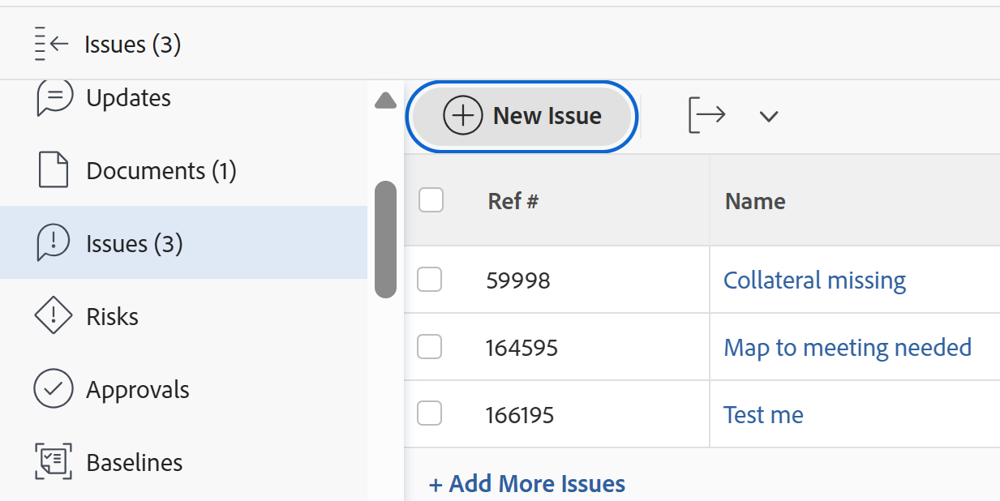
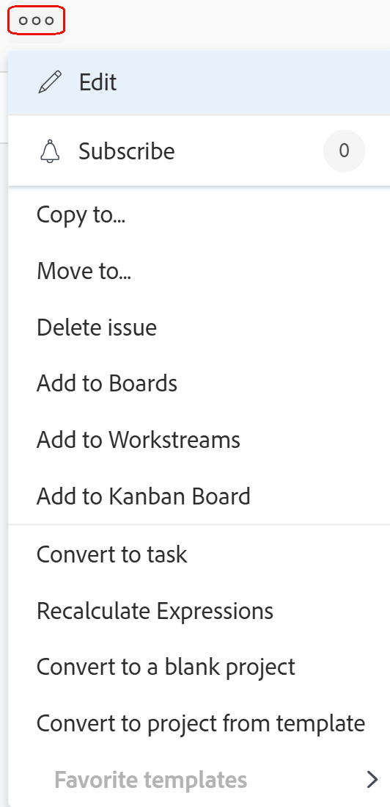

# イシューを削除

<!--Audited: 08/2025-->

Adobe Workfrontで問題やリクエストを削除するには、適切なアクセス権と権限があり、必要がなくなった場合に削除します。 プロジェクトの精度を維持するために、それらを削除する代わりに閉じることをお勧めします。

Workfront管理者は、削除された問題を復元できます。

>[!TIP]
>
>Workfront では、「イシュー」と「リクエスト」が同じような意味で使用されます。 プロジェクトとタスクの両方のイシューを記録して、対処する必要がある予期せぬ作業を示すことができます。 リクエストを送信することもできます。リクエストは、リクエストキューとして指定されたプロジェクトのイシューとして記録されます。

## アクセス要件

+++ 展開してアクセス要件を表示します。 

<table style="table-layout:auto"> 
 <col> 
 <col> 
 <tbody> 
  <tr> 
   <td role="rowheader">Adobe Workfront パッケージ</td> 
   <td> 
任意
 </td> 
  </tr> 
  <tr> 
   <td role="rowheader">Adobe Workfront プラン</td> 
   <td> 
コントリビューター以上

   
リクエスト以上

 </td> 
  </tr> 
  <tr> 
   <td role="rowheader">アクセスレベル設定</td> 
   <td> 
イシューへのアクセス権を編集
 
プロジェクトとタスクへのアクセス権またはそれ以上の権限
  </td> 
  </tr> 
  <tr> 
   <td role="rowheader">オブジェクト権限</td> 
   <td> 
イシューに対する権限の管理
 
プロジェクトまたはタスクに対する参加以上の権限
 </td> 
  </tr> 
 </tbody> 
</table>

*詳しくは、[Workfront ドキュメントのアクセス要件](/help/quicksilver/administration-and-setup/add-users/access-levels-and-object-permissions/access-level-requirements-in-documentation.md)を参照してください。

+++

## イシューの削除に関する考慮事項

* Workfront管理者またはグループ管理者は、プロジェクトの環境設定エリアで「完了」ステータスのプロジェクトの問題の削除を有効にする必要があります。

  プロジェクトの環境設定について詳しくは、[システム全体のプロジェクト環境設定の指定](../../../administration-and-setup/set-up-workfront/configure-system-defaults/set-project-preferences.md)を参照してください。

* イシューにログに記録された時間がある場合、Workfront 管理者またはグループ管理者は、Workfront インスタンスでタスクとイシューの環境設定を指定することで、これらのイシューの削除を許可する必要があります。 これは、時間が記録されたイシューがあるプロジェクトを削除しようとした場合も該当します。

  時間が記録されたイシューの削除を有効にする方法について詳しくは、[システム全体のタスクとイシューの環境設定を行う](../../../administration-and-setup/set-up-workfront/configure-system-defaults/set-task-issue-preferences.md)を参照してください。

## イシューの削除による影響

イシューを削除すると、そのイシューにリンクされている他のオブジェクトに影響を与えます。

イシューを削除すると、イシューに添付されている次のオブジェクトも削除されます。

* ドキュメント

  チェックアウトされたドキュメントが添付されたイシューは削除できません。 ドキュメントのチェックアウトについて詳しくは、[ドキュメントのチェックアウト](../../../documents/managing-documents/check-out-documents.md)を参照してください。

* メモ
* 承認

Workfront インスタンスの&#x200B;**タイムシートおよび時間設定**&#x200B;で、Workfront 管理者またはグループ管理者が指定したプロジェクト、タスクまたはイシューの削除に関する環境設定によって、イシューに記録される時間は、イシューを削除する際に次のいずれかの方法で処理されます。

* イシューが後で復元された場合、プロジェクトに移動しても、イシューで復元されない。
* イシューが後で復元された場合は、削除され、イシューで復元される。

  これは、時間が記録されたタスクを持つプロジェクトを削除しようとした場合にも該当します。

  <!--
   
  (this is not possible in classic)
   
  -->

  イシューに時間が記録されている場合の削除の環境設定について詳しくは、[タイムシートおよび時間設定の指定](../../../administration-and-setup/set-up-workfront/configure-timesheets-schedules/timesheet-and-hour-preferences.md)を参照してください。

* イシューまたはイシューの承認に割り当てられたユーザーは、プロジェクトチームに残ります。\
  プロジェクトチームについて詳しくは、[プロジェクトチームの概要](../../../manage-work/projects/planning-a-project/project-team-overview.md)を参照してください。

## イシューを削除

### プロジェクト内の複数のイシューを同時に削除  {#delete-multiple-issues-in-a-project-simultaneously}

1. **メインメニュー**&#x200B;に移動します。
1. 「**プロジェクト**」をクリックします。
1. 削除するイシューを含むプロジェクト名をクリックします。
1. 左側のパネルで「**イシュー**」をクリックします。

   選択したプロジェクトに関連付けられているイシューのリストが右側に表示されます。
1. リスト内の1つまたは複数の問題を選択し、リストの上部にある&#x200B;**削除** アイコン をクリックします。

1. 削除が許可されている場合は、**削除**&#x200B;をクリックします。

   時間が記録されたイシューの削除を Workfront 管理者が許可していない場合があります。\
   問題の削除に必要なアクセス権と権限について詳しくは、この記事の「[問題の削除に関する考慮事項](#considerations-for-deleting-issues)」を参照してください。

### 単一のイシューを削除 {#delete-a-single-issue}

{{step1-to-projects}}

1. 削除するイシューを含むプロジェクト名をクリックします。
1. 左側のパネルで「**イシュー**」をクリックします。

   左側のパネルの

1. 削除するイシューの名前をクリックします。
1. イシュー名の右側にある&#x200B;**その他**&#x200B;メニューをクリックします。

   

1. 「**イシューを削除**」をクリックします。
1. 「**削除**」をクリックして、をクリックします。

   >[!NOTE]
   >
   >  時間が記録されたイシューの削除を Workfront 管理者が許可していない場合があります。\
   >  問題の削除に必要なアクセス権と権限について詳しくは、この記事の「[問題の削除に関する考慮事項](#considerations-for-deleting-issues)」を参照してください。

## 削除されたイシューを復元

Workfrontまたはグループ管理者は、問題を削除してから30日以内に復元できます。

Workfront での項目の復元について詳しくは、[削除した項目を復元](../../../administration-and-setup/manage-workfront/manage-deleted-items/restore-deleted-items.md)を参照してください。
