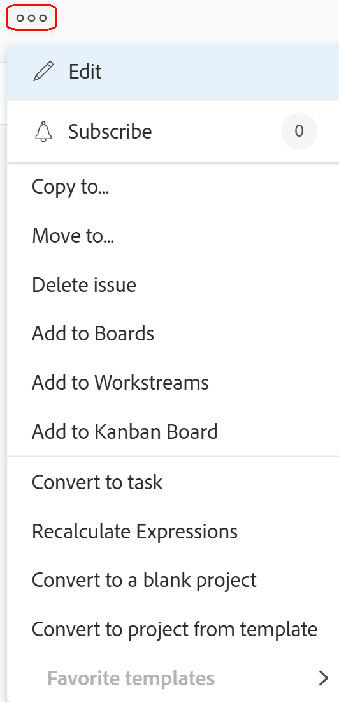

# 問題を削除します

適切なアクセス権と権限を持っている場合は、Adobe Workfrontで問題やリクエストを削除できます。

>[!TIP]
>
>Workfrontでは、「問題」と「リクエスト」が同じ意味で使用されます。 プロジェクトとタスクの両方で問題を記録し、対処する必要のある予期しない作業を示すことができます。 リクエストキューとして指定されたプロジェクトで問題として記録されたリクエストを送信することもできます。

## アクセス要件

この記事の手順を実行するには、次のアクセス権が必要です。

<table style="table-layout:auto"> 
 <col> 
 <col> 
 <tbody> 
  <tr> 
   <td role="rowheader">Adobe Workfront plan*</td> 
   <td> 
任意
 </td> 
  </tr> 
  <tr> 
   <td role="rowheader">Adobe Workfront license*</td> 
   <td> 
リクエスト以上
 
プロジェクトの「問題」セクションで問題を削除するには、ライセンスを確認するか、それ以上のライセンスを使用します。
 </td> 
  </tr> 
  <tr> 
   <td role="rowheader">アクセスレベル設定*</td> 
   <td> 
問題へのアクセスを編集
 
プロジェクトとタスクへのアクセス権を表示または高くする
 
注意：まだアクセス権がない場合は、Workfront管理者に、アクセスレベルに追加の制限を設定しているかどうかを問い合わせてください。 アクセスレベルの問題へのアクセスについて詳しくは、 <a href="../../../administration-and-setup/add-users/configure-and-grant-access/grant-access-issues.md" class="MCXref xref">問題へのアクセス権の付与</a>. Workfront管理者がアクセスレベルを変更する方法について詳しくは、 <a href="../../../administration-and-setup/add-users/configure-and-grant-access/create-modify-access-levels.md" class="MCXref xref">カスタムアクセスレベルの作成または変更</a>. 
 </td> 
  </tr> 
  <tr> 
   <td role="rowheader">オブジェクト権限</td> 
   <td> 
問題に関する権限の管理
 
プロジェクトまたはタスクに対する Contribute 以上の権限
 
 問題に対する権限の付与について詳しくは、 <a href="../../../workfront-basics/grant-and-request-access-to-objects/share-an-issue.md" class="MCXref xref">イシューの共有 </a>
 
追加の権限のリクエストについて詳しくは、 <a href="../../../workfront-basics/grant-and-request-access-to-objects/request-access.md" class="MCXref xref">オブジェクトへのアクセスのリクエスト </a>.
 </td> 
  </tr> 
 </tbody> 
</table>

&#42;保有しているプラン、ライセンスの種類、アクセス権を確認するには、Workfront管理者に問い合わせてください。

## 問題の削除に関する考慮事項

* Workfront管理者またはグループ管理者は、ステータスが「完了」のプロジェクトの問題の削除を、プロジェクトの環境設定領域で有効にする必要があります。 プロジェクトの環境設定の詳細については、 [システム全体のプロジェクト環境設定の指定](../../../administration-and-setup/set-up-workfront/configure-system-defaults/set-project-preferences.md).

* 問題がログに記録された時間がWorkfrontの管理者またはグループ管理者の方が、Workfrontインスタンスでタスクと問題の環境設定を設定して、これらの問題の削除を許可する必要があります。 これは、何時間もログオンしている問題のあるプロジェクトを削除しようとした場合にも当てはまります。

   <!--
  <MadCap:conditionalText data-mc-conditions="QuicksilverOrClassic.Draft mode">
  (this is not possible in classic)
  </MadCap:conditionalText>
  -->

   時間が記録される問題の削除を有効にする方法について詳しくは、 [システム全体のタスクと問題の環境設定を構成](../../../administration-and-setup/set-up-workfront/configure-system-defaults/set-task-issue-preferences.md).

## 問題の削除による影響

イシューを削除すると、そのイシューにリンクされている他のオブジェクトに影響を与えます。

イシューを削除すると、イシューに添付されている次のオブジェクトも削除されます。

* ドキュメント

   チェックアウトされたドキュメントが添付されたイシューは削除できません。 ドキュメントのチェックアウトの詳細については、 [ドキュメントをチェックアウト](../../../documents/managing-documents/check-out-documents.md).

* メモ
* 承認

Workfrontまたはグループの管理者が、 **タイムシートと時間の基本設定** Workfrontインスタンスで問題に関して記録される時間は、問題を削除する際に次のいずれかの方法で処理されます。

* 問題が後で復元された場合、プロジェクトに移動しても、問題で復元されることはありません。
* 問題が後で復元された場合は、削除して問題で復元します。

   これは、時間が経過したタスクを持つプロジェクトを削除しようとした場合にも当てはまります。

   <!--
  <MadCap:conditionalText data-mc-conditions="QuicksilverOrClassic.Draft mode">
  (this is not possible in classic)
  </MadCap:conditionalText>
  -->

   ログオン時間の問題に対する削除の環境設定について詳しくは、 [タイムシートと時間の基本設定を構成する](../../../administration-and-setup/set-up-workfront/configure-timesheets-schedules/timesheet-and-hour-preferences.md).

* イシューまたはイシューの承認に割り当てられたユーザーは、プロジェクトチームに残ります。\
   プロジェクトチームの詳細については、 [プロジェクトチームの概要](../../../manage-work/projects/planning-a-project/project-team-overview.md).

## 問題を削除します

* [プロジェクト内の複数のイシューを同時に削除する](#delete-multiple-issues-in-a-project-simultaneously)
* [単一のイシューの削除](#delete-a-single-issue)

### プロジェクト内の複数のイシューを同時に削除する  {#delete-multiple-issues-in-a-project-simultaneously}

1. 次に移動： **メインメニュー**.
1. クリック **プロジェクト**.
1. 削除する問題を含むプロジェクト名をクリックします。
1. クリック **問題** をクリックします。
1. イシューを選択し、 **削除** アイコン  をクリックします。

1. 削除が許可されている場合は、 **はい、削除します**.\
   時間が記録される問題の削除をWorkfront管理者が許可していない場合があります。\
   問題の削除に必要なアクセスおよび権限について詳しくは、 [問題の削除](#access-and-permissions-needed).

### 単一のイシューの削除 {#delete-a-single-issue}

1. 次をクリック： **メイン** メニュー
1. クリック **プロジェクト**.
1. 削除する問題を含むプロジェクト名をクリックします。
1. クリック **問題** をクリックします。

   

1. 削除するイシューの名前をクリックします。
1. 次をクリック： **詳細** メニュー

   

1. クリック **削除**.
1. 削除が許可されている場合は、 **はい、削除します**.

   時間が記録される問題の削除をWorkfront管理者が許可していない場合があります。\
   問題の削除に必要なアクセスおよび権限について詳しくは、 [問題の削除](#access-and-permissions-needed).

## 削除された問題を復元

Workfrontまたはグループ管理者は、問題を削除してから 30 日以内に復元できます。 Workfrontでの項目の復元について詳しくは、 [削除した項目を復元](../../../administration-and-setup/manage-workfront/manage-deleted-items/restore-deleted-items.md).
