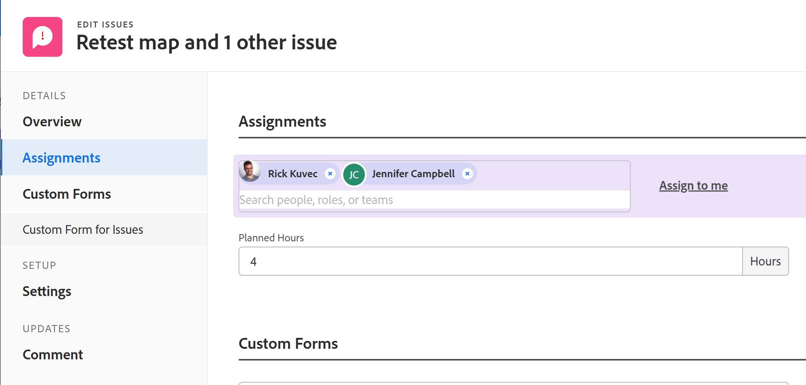
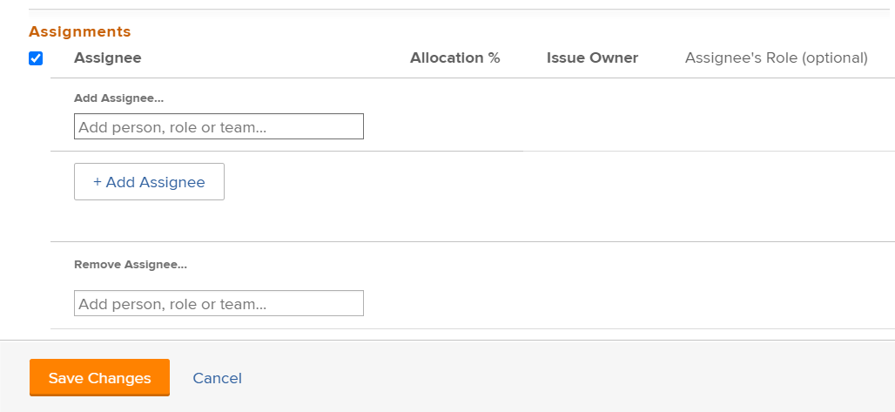

# リスト内の複数のイシューに対するユーザー割り当ての変更

<!--Audited: 07/2024-->
<!--

(NOTE: similar article exists for tasks)

-->

<!--

 

The highlighted information on this page refers to functionality not yet generally available. It is available only in the Preview environment for all customers. The same features will also be available in the Production environment for all customers starting with a week from the Preview release.      

For more information, see [Interface modernization](/help/quicksilver/product-announcements/product-releases/interface-modernization/interface-modernization.md).  

-->

複数のイシューに対するユーザー割り当てを同時に変更できます。 問題を編集したり、一度に1つずつ割り当てたりする方法については、次の記事も参照してください。

* [イシューの編集](../../../manage-work/issues/manage-issues/edit-issues.md)
* [イシューの割り当て](../../../manage-work/issues/manage-issues/assign-issues.md)

イシューの割り当てに関する一般情報については、[イシューの割り当て変更の概要](../../../manage-work/issues/manage-issues/modify-issue-assignments-overview.md)を参照してください。

>[!NOTE]
>
>イシューへの割り当てを行うには、少なくとも、そのイシューへの参加権限が必要です。

## アクセス要件

+++ 展開すると、この記事の機能のアクセス要件が表示されます。 

<table style="table-layout:auto"> 
 <col> 
 <col> 
 <tbody> 
  <tr> 
   <td>Adobe Workfront パッケージ</td> 
   <td> 
任意
 </td> 
  </tr> 
  <tr> 
   <td>Adobe Workfront プラン</td> 
   <td> 
コントリビューター以上

   
リクエスト以上
 </td> 
  </tr> 
  <tr> 
   <td>アクセスレベル設定</td> 
   <td> 
イシューへのアクセス権を編集
 
1つの問題を割り当てるためのプロジェクトとタスクへの表示以上のアクセス
 </td> 
  </tr> 
  <tr> 
   <td>オブジェクト権限</td> 
   <td> 
イシューに対する権限の管理
 
複数のイシューを割り当てる場合、イシューが配置されているプロジェクトまたはタスクに対して権限を割り当てるか、それ以上の権限を割り当てます。
  </td> 
  </tr> 
 </tbody> 
</table>

詳しくは、[Workfront ドキュメントのアクセス要件](/help/quicksilver/administration-and-setup/add-users/access-levels-and-object-permissions/access-level-requirements-in-documentation.md)を参照してください。

+++

<!--

<h2>When to modify user assignments on issues</h2>

(NOTE:  drafted and moved to the overview article: Modify issue assignments overview)

You might want to modify the user assignments for multiple issues for a variety of  reasons, including the following:

<ul>
<li>Users join or leave  your team</li>
<li>A user takes a vacation that extends beyond the issue  due dates</li>
<li>A specific role or user is set as the assignee for multiple issues and you want to quickly modify all items to be assigned to a different user or role</li>
</ul>

-->

## 複数のイシューの割り当てを変更

1. 割り当てを変更するイシューを含むイシューのリストに移動します。
1. （オプション）変更する担当者に割り当てられているイシューのみを表示するフィルターを作成します。

   例えば、フィルターを作成して、特定の役割を持つ問題のみを担当者として表示できます。  次に、役割を特定のユーザーに置き換えます。 次の操作を実行します。

   1. 「**フィルター**」ドロップダウンリストをクリックし、**新規フィルター**&#x200B;をクリックします。

   1. 最初のフィールドに「**割り当てロール**」と入力し、リストから「**割り当てロール：名前**」を選択します。
   1. 「修飾子」ドロップダウンメニューから「**は**&#x200B;のいずれかです」を選択し、役割の名前を入力し始め、リストに表示されたら選択します。 複数の役割を入力できます。

      >[!TIP]
      >
      >**割り当て先**&#x200B;を使用しないでください。このフィールドはイシュー所有者のみを参照し、すべての担当者を参照しているわけではありません。

      イシューのリストは、フィルター条件に対して自動的にフィルターされます。
   1. （オプション）「**新しい名前で保存**」、「**保存**」の順にクリックします。

1. 割り当てを変更する問題を選択し、**編集** アイコン をクリックします。

   **イシューの編集**&#x200B;が表示されます。選択した項目の数が、ページの左上隅に表示されます。

1. 左側のパネルで「**割り当て**」をクリックし、削除する担当者の横にある「**x**」アイコンをクリックします。

   >[!TIP]
   >
   >選択したすべての問題に割り当てられた担当者のみが、**割り当て**&#x200B;領域に表示されます。

   一括編集問題の

1. ユーザー、役割、またはチームの名前を入力して、選択したすべての問題に担当者を追加します。

   >[!TIP]
   >
   >複数のユーザー、担当業務やチームを割り当てることができます。アクティブなユーザー、担当業務およびチームのみを割り当てることができます。
   >
   >非アクティブ化前にユーザー、担当業務やチームが、非アクティブ化される前に割り当てられた場合、ユーザー、担当業務やチームは作業アイテムに割り当てられたままになります。この場合、以下の操作をお勧めします。
   >
   >* 作業アイテムをアクティブなリソースに再割り当てする。
   >* 非アクティブ化されたチームのユーザーをアクティブなチームに関連付け、作業アイテムをアクティブなチームに再割り当てする。

   追加された担当者が既存の担当者に追加されます。 選択したイシューごとに既存のイシューを置き換えることはありません。

1. （オプション）「**自分に割り当て**」をクリックして、すべての問題を自分に割り当てます。
1. 「**保存**」をクリックします。

   <!--
   Old functionality for assignments for issues - before November 2025:
   1. (Conditional) In the Production environment, do the following: 
   1. Go to the **Assignments** section, then select **Assignee**.
      
   1. Do one of the following:
      1. To add a new assignee:
         1. Start typing the name of a user, role, or team, then select it when it displays in the list. The assignment is added and does not replace the current assignments on the selected issues.
         >[!TIP]
         >
         >You can assign multiple users, job roles, or teams. You can assign only active users, job roles, and teams.
         >
         >If a user, job role, or a team was assigned before they were deactivated, they remain assigned to the work item. In this case, we recommend the following:
         >
         >* Reassign the work item to active resources.
         >* Associate the users in a deactivated team with an active team and reassign the work item to the active team.
          Information that is common across all issues selected displays. For example, if the same user is assigned to all issues, that user displays in the **Assignee**  column. If information is not common across the issues selected, no information displays.
      1. To remove individual assignees:
         1. Click the **X icon** next to the name of the assignee that you want to remove if the assignee displays in the Assignments list.
            Or
            If the assignee that you want to remove does not display in the Assignments section because the assignee is assigned to only some of the issues that you have selected, click **Remove Assignee** and start typing the name of the assignee that you want to remove, then click the name when it appears in the drop-down list.
         1. Click  **Remove Assignee** again to add another assignee to remove.
      1. To remove all existing assignees:
         1. Click **Remove All Existing Assignees**, then click **Yes, Delete All Assignees**.
            This removes not only common assignees (assignees that are displayed in the edit  dialog box), but also all assignees on all the selected issues.
         1. (Optional) Modify any of the following options for the assignees you selected to associate with the issues:
          * **Issue Owner:**  Select the radio button to indicate which assignee is designated as the Issues Owner. If left unselected, Adobe Workfront designates the first assignee as the Issue Owner. This is not available for team assignments. 
            * **Assignee's Role**: Select a role from the drop-down list. If left unselected, Workfront automatically selects the Primary Role of the user.
      1. Click **Save Changes**.
      -->

