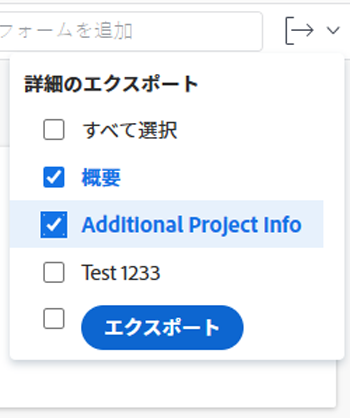
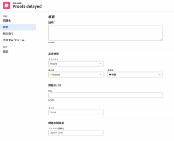
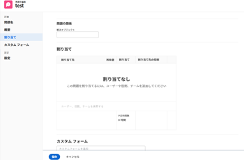
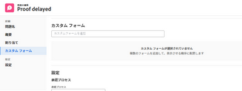
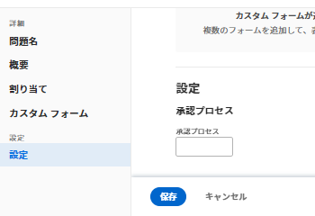

# 問題の編集

自分が作成したイシューに関する情報や、自分と他のユーザーがイシューを共有した場合に他のユーザーが作成したイシューに関する情報を編集できます。

1 つのイシューを編集することも、リスト内のイシューを編集することもできます。 リスト内の問題の編集について詳しくは、 [リスト内の問題の編集](../../../manage-work/issues/manage-issues/edit-issues-in-a-list.md).

## アクセス要件

この記事の手順を実行するには、次のアクセス権が必要です。

<table style="table-layout:auto"> 
 <col> 
 <col> 
 <tbody> 
  <tr> 
   <td role="rowheader">Adobe Workfront plan*</td> 
   <td> 
任意 
 </td> 
  </tr> 
  <tr> 
   <td role="rowheader">Adobe Workfront license*</td> 
   <td> 
リクエスト以上
 
タスクまたはプロジェクトの「問題」セクションで問題を編集する場合は、ライセンスを確認するか、それ以上に設定します
 </td> 
  </tr> 
  <tr> 
   <td role="rowheader">アクセスレベル*</td> 
   <td> 
問題へのアクセスを編集
 
<b>メモ</b>

まだアクセス権がない場合は、Workfront管理者に、アクセスレベルに追加の制限を設定しているかどうかを問い合わせてください。 アクセスレベルの問題へのアクセスについて詳しくは、 <a href="../../../administration-and-setup/add-users/configure-and-grant-access/grant-access-issues.md" class="MCXref xref">問題へのアクセス権の付与</a>. Workfront管理者がアクセスレベルを変更する方法について詳しくは、 <a href="../../../administration-and-setup/add-users/configure-and-grant-access/create-modify-access-levels.md" class="MCXref xref">カスタムアクセスレベルの作成または変更</a>. 
 </td>
</tr> 
  <tr> 
   <td role="rowheader">オブジェクトの権限</td> 
   <td> 
問題に対する権限を付与して、詳細領域の次のフィールドを編集します。 

   <ul>
   <li>説明</li>
   <li>ステータス</li>
   <li>重大度</li>
   </ul>
   
イシューに対する権限を管理して、イシューの詳細領域またはイシューの編集ボックスのすべてのフィールドを編集します
 
 問題に対する権限の付与について詳しくは、 <a href="../../../workfront-basics/grant-and-request-access-to-objects/share-an-issue.md" class="MCXref xref">イシューの共有 </a>
 
追加の権限のリクエストについて詳しくは、 <a href="../../../workfront-basics/grant-and-request-access-to-objects/request-access.md" class="MCXref xref">オブジェクトへのアクセスのリクエスト </a>.
 </td> 
  </tr> 
 </tbody> 
</table>

&#42;保有するプラン、ライセンスの種類、アクセス権を確認するには、Workfront管理者に問い合わせてください。

## 問題を編集する際の制限事項

いくつかの制限があり、問題を編集できない場合があります。

* 承認プロセス中の問題は編集できません。 「承認待ち」の問題に対してのみ、ログに時間を記録したり、ステータスを更新したりできます。
* 「完了」、「無効」、「承認待ち」のステータスを持つプロジェクトのイシューに対するドキュメントの編集や追加は、Workfront管理者またはグループ管理者が「プロジェクトの環境設定」領域でこの機能を有効にした場合にのみ行えます。 プロジェクトの環境設定の詳細については、 [システム全体のプロジェクト環境設定の指定](../../../administration-and-setup/set-up-workfront/configure-system-defaults/set-project-preferences.md).

## 単一のイシューの編集

問題を編集するには、「Edit Issue」領域または「Issue Details」領域を使用します。 次の手順では、「Edit issue」ボックスでイシューを編集する方法を説明します。

1. 次に移動： **メインメニュー**.
1. クリック **プロジェクト**&#x200B;次に、プロジェクトの名前をクリックして、プロジェクトを開きます。
1. （オプション）「 **タスク** 次に、タスクの名前をクリックしてタスクを開きます。
1. クリック **問題** をクリックします。

   

1. （オプション）問題に関する限定的な情報を編集するには、 **問題の詳細** をクリックします。

   

   >[!NOTE]
   >
   >Workfront管理者またはグループ管理者がレイアウトテンプレートを変更した方法に応じて、「問題の詳細」領域のフィールドが並べ替えられたり、表示されなかったりする場合があります。 詳しくは、 [レイアウトテンプレートを使用して詳細ビューをカスタマイズする](../../../administration-and-setup/customize-workfront/use-layout-templates/customize-details-view-layout-template.md).

   「詳細」セクションの情報を編集するには、次の手順を実行します。

   1. （オプション） **すべて折りたたむ** アイコンを使用して、すべての領域を折りたたみます。
   1. （オプションおよび条件付き）領域が折りたたまれている場合、 **右矢印**  各領域の横に、編集する領域を展開します。
   1. （オプション）カスタムフォームを添付するには、 **カスタムフォームを追加** フィールドに値を入力し、リストに表示されるタイミングで選択して、 **変更を保存**.
   1. （オプション） **書き出し** アイコン  概要およびカスタムフォームの情報を書き出すには、PDF・ファイルに **書き出し**. 次の中から選択します。

      * すべてを選択（少なくとも 1 つのカスタムフォームが添付されている場合にのみ表示）
      * 概要
      * 1 つまたは複数のカスタムフォームの名前

      PDFファイルがコンピューターにダウンロードされます。

      

      詳しくは、 [カスタムフォームとオブジェクトの詳細のエクスポート](../../../workfront-basics/work-with-custom-forms/export-custom-forms-details.md).

   「問題の詳細」セクションに表示されるフィールドについて詳しくは、次に説明するように、「問題の編集」ボックスで問題を編集し続けます。

1. イシューに関するすべての情報を編集するには、リストからイシューを選択し、 **編集** リストの一番上に

   または

   リスト内のイシューの名前をクリックし、 **その他** 問題名の横にあるメニュー、「 **編集。**

   The **問題を編集** ダイアログボックスが表示されます。

   >[!IMPORTANT]
   >
   >「編集」リンクを表示するには、問題に対する管理権限が必要です。

   すべてのイシューフィールドは、「イシューを編集」ボックスで使用でき、左側のパネルに表示される領域でグループ化されます。

1. 次のセクションのいずれかで、情報の指定を検討します。

   * [問題名](#issue-name)
   * [概要](#overview)
   * [割り当て](#assignments)
   * [カスタムフォーム](#Custom%C2%A0F)
   * [設定](#settings)

   >[!NOTE]
   >
   >Workfront管理者がレイアウトテンプレートを設定する方法によっては、環境によって問題を編集ボックスのフィールドが異なる場合があります。 詳しくは、 [レイアウトテンプレートを使用して詳細ビューをカスタマイズする](../../../administration-and-setup/customize-workfront/use-layout-templates/customize-details-view-layout-template.md).
   >
   >イシューを作成する際に、以下のセクションに一覧表示されるほとんどのフィールドは、「新しいイシュー」ボックスからもアクセスできます。 フィールドが配置されているセクションが、「 New Issue 」ボックスと一致しません。 問題の作成について詳しくは、 [イシューの作成](../../issues/manage-issues/create-issues.md).

### 問題名 {#issue-name}

1. 上記の説明に従って、問題の編集を開始します。
1. クリック **問題名**.

   

1. を更新します。 **問題名** フィールドに入力します。
1. クリック **保存** または、以降のセクションの編集を続けます。

### 概要 {#overview}

1. 上記の説明に従って、問題の編集を開始します。
1. クリック **概要**.

   

1. 次の表のフィールドを更新または確認します。

   <table style="table-layout:auto"> 
    <col> 
    <col> 
    <tbody> 
     <tr> 
      <td role="rowheader">説明</td> 
      <td> 
問題に関する追加情報を追加します。
 </td> 
     </tr> 
     <tr> 
      <td colspan="2" role="rowheader">「基本情報」セクション</td> 
     </tr> 
     <tr> 
      <td role="rowheader">ステータス</td> 
      <td> 
問題のステータスを選択します。 問題のステータスについて詳しくは、 <a href="../../../administration-and-setup/customize-workfront/creating-custom-status-and-priority-labels/issue-statuses.md" class="MCXref xref">システムの問題ステータスのリストへのアクセス</a>. 
 </td> 
     </tr> 
     <tr> 
      <td role="rowheader">優先度</td> 
      <td> 
これは、問題を優先順位付けできる視覚的なフラグです。
 
次のオプションから選択します。
 
       <ul> 
        <li> 
<strong>なし</strong> 
 </li> 
        <li> 
<strong>低</strong> 
 </li> 
        <li> 
<strong>標準</strong> 
 </li> 
        <li> 
<strong>高</strong> 
 </li> 
        <li> 
<strong>緊急</strong> 
 </li> 
       </ul> 
Workfront管理者が選択したプロジェクトの環境設定によっては、優先度の名前が異なる場合があります。 優先度の編集の詳細については、「 <a href="../../../administration-and-setup/customize-workfront/creating-custom-status-and-priority-labels/create-customize-priorities.md" class="MCXref xref">優先度の作成とカスタマイズ</a>.
 </td> 
     </tr> 
     <tr> 
      <td role="rowheader">重大度</td> 
      <td> 
これは、問題に記載されている問題の重大度を示す視覚的なフラグです。 重大度は問題に特有のものです。 次のオプションから選択します。
 
       <ul> 
        <li> 
一時回避
 </li> 
        <li> 
混乱を招く
 </li> 
        <li> 
対処策のあるバグ
 </li> 
        <li> 
対処策のないバグ
 </li> 
        <li> 
致命的なエラー
 </li> 
       </ul> 
Workfront管理者が選択したプロジェクトの環境設定に応じて、重大度の名前が異なる場合があります。 重大度の編集について詳しくは、 <a href="../../../administration-and-setup/customize-workfront/creating-custom-status-and-priority-labels/create-customize-issue-severities.md" class="MCXref xref">問題の重要度を作成またはカスタマイズ</a>.
 </td> 
     </tr> 
     <tr> 
      <td role="rowheader">URL</td> 
      <td> 
問題に関する情報に関する Web リンクを入力します。
 </td> 
     </tr> 
     <tr> 
      <td role="rowheader">タイプ</td> 
      <td> 
プロジェクトの「キューの詳細」領域で、プロジェクトマネージャーが選択したキューのプロパティに従って、問題のタイプを指定できます。 次のオプションから選択します。 <b>タイプ</b> ドロップダウンメニュー： 
 
       <ul> 
        <li> 
<strong>バグレポート</strong> 
 </li> 
        <li> 
<strong>変更依頼</strong> 
 </li> 
        <li> 
<strong>イシュー</strong> 
 </li> 
        <li> 
<strong>リクエスト</strong> 
 </li> 
       </ul> 
Workfront管理者が選択したプロジェクトの環境設定によっては、問題の種類の名前が異なる場合があります。
 </td> 
     </tr> 
     <tr> 
      <td role="rowheader">プライマリ連絡先</td> 
      <td>デフォルトでは、プライマリの連絡先がイシューの作成者です。 これを変更するには、Workfrontでアクティブなユーザーの名前を入力し、リストから選択します。 1 つの問題に設定できるプライマリ連絡先は 1 つだけです。  「プライマリ連絡先」を変更した場合、元の主要連絡先には引き続き「管理」アクセス権が付与されます。 イシューを共有する際は、イシューのアクセスボックスから手動でこのアクセスを削除する必要があります。

   <b>ヒント</b>

   
プライマリの連絡先ユーザーを追加する際には、アバター、ユーザーのプライマリの役割、電子メールアドレスに注意して、同じ名前のユーザーを区別します。 ユーザーを追加したときに表示するには、少なくとも 1 つのジョブの役割に関連付ける必要があります。

      
 ユーザーがユーザーの電子メールを表示するには、アクセスレベルで [ 連絡先情報の表示 ] 設定を有効にしておく必要があります。 詳しくは、 <a href="../../../administration-and-setup/add-users/configure-and-grant-access/grant-access-other-users.md">ユーザーへのアクセス権の付与</a>.

   </td> 
     </tr> 
     <tr> 
      <td role="rowheader">コミットの日時</td> 
      <td> 
発行の担当者が発行を完了すると見積もった日付です。 委託人のみがこのフィールドを編集できます。
 </td> 
     </tr> 
     <tr> 
      <td role="rowheader">計画開始日</td> 
      <td>デフォルトでは、「計画開始日」は問題が作成された日時です。 次の項目を更新して、 <strong>計画開始日</strong> を設定します。 </td> 
     </tr> 
     <tr> 
      <td role="rowheader">計画完了日時</td> 
      <td> デフォルトでは、計画完了日はデフォルトの計画開始日から 24 時間です。 デフォルトでは、問題の期間は 1 日です。 次の項目を更新して、 <strong>計画完了日</strong> を設定します。</td> 
     </tr> 
     <tr> 
      <td role="rowheader">実際の開始日時</td> 
      <td>問題のステータスを「 <strong>処理中</strong>. 次の項目を更新して、 <strong>実際の開始日</strong> を設定します。 必要に応じて、手動で日付を更新できます。 </td> 
     </tr> 
     <tr> 
      <td role="rowheader">実際の完了日時</td> 
      <td>「実際の完了日」は、問題のステータスを「 <strong>閉じる</strong> または<strong>解決済み</strong>. 次の項目を更新して、 <strong>実際の完了日</strong> を参照してください。 必要に応じて、手動で日付を更新できます。</td> 
     </tr> 
     <tr> 
      <td role="rowheader">解決オブジェクト</td> 
      <td> 
これは、問題が別のオブジェクトによって解決されたかどうかを示します。 この問題をタスク、プロジェクト、または別の問題で解決するかをドロップダウンメニューから選択し、タスク、プロジェクト、または問題を解決する問題の名前を入力します。 リストに表示される場合に選択します。

   <b>メモ</b>

   問題を解決するオブジェクトを選択すると、問題のステータスは解決オブジェクトのステータスにリンクされ、問題で変更することはできません。 オブジェクトの解決の詳細については、「 <a href="../../../manage-work/issues/convert-issues/resolving-and-resolvable-objects.md" class="MCXref xref">オブジェクトの解決と解決の概要 </a>.

   <b>ヒント</b>

   問題のカスタムヘッダーに「Resolved By」フィールドを追加すると、問題に関連する解決オブジェクトがある場合、そのフィールドは「問題の解決」、「タスクの解決」、「プロジェクトの解決」に変わります。

   このフィールドがイシューヘッダーに表示される場合、編集できません。 問題ヘッダーのカスタマイズについて詳しくは、 <a href="../../../administration-and-setup/customize-workfront/use-layout-templates/customize-object-headers.md">レイアウトテンプレートを使用したオブジェクトヘッダーのカスタマイズ </a>
   </td> 
     </tr>

   <tr> 
      <td role="rowheader">問題の解決、タスクの解決、またはプロジェクトの解決</td> 
      <td>問題を解決する問題、タスク、または問題のリンクされた名前。  </td> 
     </tr> 
      <tr> 
      <td role="rowheader">これが解決する問題:</td> 
      <td>アクセスしている問題が解決されたときに完了する、問題のリンクされた名前。  </td> 
     </tr>

   </tbody> 
   </table>

1. クリック **保存** または、以降のセクションの編集を続けます。

#### 割り当て {#assignments}

1. 上記の説明に従って、問題の編集を開始します。
1. クリック **割当て** をクリックします。

   

1. クリック **担当者、役割、チームの検索** タスクに割り当てるユーザー、役割、またはチームの名前を入力し、タスクをクリックするか、Enter キーを押してタスクをリストに表示します。

   <!--
   
(NOTE: ensure this is still called this; asked Anna to change it to "roles" and add a comma)

   -->

   >[!NOTE]
   >
   >ユーザーの名前に特殊文字が含まれている場合は、その特殊文字を検索フィールドに含める必要があります。

   >[!TIP]
   >
   >複数のユーザー、ジョブの役割またはチームを割り当てることができます。 アクティブなユーザー、ジョブの役割およびチームのみを割り当てることができます。
   >
   >
   >非アクティブ化前にユーザー、ジョブの役割、またはチームが割り当てられた場合、そのユーザーは作業項目に割り当てられたままになります。 この場合、次の操作をお勧めします。
   >
   >* 作業項目をアクティブなリソースに再割り当てする。
   >* 非アクティブなチームのユーザーをアクティブなチームに関連付け、作業項目をアクティブなチームに再割り当てします。

1. （オプション）担当者の名前にマウスポインターを置き、「 **Makeプライマリ**. チームをイシューの主な担当者にすることはできません。
1. 次のフィールドを更新します。

   <table style="table-layout:auto"> 
    <col> 
    </col> 
    <col> 
    </col> 
    <tbody> 
     <tr> 
      <td role="rowheader">予定時間数</td> 
      <td> 
これは、問題の担当者が問題を完了するのに実際にかかる時間です。 問題の計画時間数を入力します。 
 
注意：問題の計画時間を変更しても、問題の計画完了日は変更されません。 
 </td> 
     </tr> 
     <tr data-mc-conditions=""> 
      <td role="rowheader">割り当て先の役割</td> 
      <td> 
次の中からロールを選択： <strong>担当者の役割</strong> ドロップダウンメニュー（担当者を担当者として選択した場合） 担当者がこの問題で果たすことができる役割です。 
 
<b>ヒント</b>

   プロファイル内の各担当者に関連付けられているジョブの役割のみがドロップダウンメニューに表示されます。
 </td>
   </tr> 
    </tbody> 
   </table>

1. クリック **保存** または、以降のセクションの編集を続けます。

### カスタムForms

1. 上記の説明に従って、問題の編集を開始します。
1. クリック **カスタムForms**.

   

1. Adobe Analytics の **カスタムフォームを追加** 「 」フィールドで、問題に関連付けるカスタムフォームを選択します。 カスタムフォームをこのフィールドで選択できるようにするには、事前にカスタムフォームを作成する必要があります。 リストには、アクティブなカスタムフォームのみが表示されます。 カスタムフォームの作成について詳しくは、 [カスタムフォームの作成または編集](../../../administration-and-setup/customize-workfront/create-manage-custom-forms/create-or-edit-a-custom-form.md). 1 つのイシューに最大 10 個のカスタムフォームを追加できます。

1. （条件付き）問題にカスタムフォームを添付した場合、フォーム上の任意のフィールドを編集します。 イシューを保存する前に、すべての必須フィールドを指定する必要があります。

   >[!NOTE]
   >
   >Workfront管理者がカスタムフォームのセクションに対して権限を設定した方法に応じて、すべてのユーザーが特定のカスタムフォームの同じフィールドを表示または編集できるわけではありません。 カスタムフォームのセクション内のフィールドを編集する権限は、問題自体に対する権限によって異なります。 カスタムフォームのセクションに対する権限の設定について詳しくは、 [カスタムフォームの作成または編集](../../../administration-and-setup/customize-workfront/create-manage-custom-forms/create-or-edit-a-custom-form.md). 問題の権限の設定について詳しくは、 [イシューの共有](../../../workfront-basics/grant-and-request-access-to-objects/share-an-issue.md).

1. クリック **保存** または、次のセクションの編集を続行します。

### 設定 {#settings}

1. 上記の説明に従って、問題の編集を開始します。
1. クリック **設定**.

   

   次の情報を更新します。

   <table style="table-layout:auto"> 
    <col> 
    </col> 
    <col> 
    </col> 
    <tbody> 
     <tr> 
      <td role="rowheader">承認プロセス</td> 
      <td> 
       
 
       
問題に関連付ける承認プロセスを選択します。 Workfront管理者は、問題に関連付ける前に、システムレベルの承認プロセスを定義する必要があります。 承認プロセスへの管理者アクセス権を持つユーザー  また、グループ固有の承認プロセスを作成することもできます。承認プロセスの作成について詳しくは、 <a href="../../../administration-and-setup/customize-workfront/configure-approval-milestone-processes/create-approval-processes.md" class="MCXref xref">作業項目の承認プロセスの作成</a>. 
 
       
承認プロセスを追加する際は、次の点を考慮してください。 
 
       <ul> 
       <li>アクティブな承認プロセスのみがリストに表示されます。 </li> 
       <li> 
システム全体およびグループ固有の承認プロセスがリストに表示されます。 プロジェクトの承認プロセス以外のグループに関連付けられている承認プロセスは、リストに表示されません。
 
重要：プロジェクトのグループが変更されると、グループ固有の承認プロセスが単一使用の承認プロセスになります。 プロジェクトのグループに対する変更や承認プロセスの変更が承認設定に及ぼす影響について詳しくは、 <a href="../../../administration-and-setup/customize-workfront/configure-approval-milestone-processes/how-changes-affect-group-approvals.md" class="MCXref xref">グループと承認プロセスの変更が、割り当てられた承認プロセスに及ぼす影響</a>. 
 </li> 
       <li> 
リクエストキューまたはキュートピックを作成する際に問題に自動的に添付されるデフォルトの承認プロセスを定義できます。 キューの詳細の更新について詳しくは、 <a href="../../../manage-work/requests/create-and-manage-request-queues/create-request-queue.md" class="MCXref xref">リクエストキューの作成</a>. キュートピックの作成について詳しくは、 <a href="../../../manage-work/requests/create-and-manage-request-queues/create-queue-topics.md" class="MCXref xref">キュートピックを作成</a>. 
 </li> 
       <li>一括編集の問題が発生した場合は、次のシナリオが考えられます。 
       <ul> 
       <li>
同じグループから複数のイシューを選択する場合、システムレベルの承認プロセスとグループ固有の承認プロセスの両方がこのフィールドに表示されます。
</li> 
       <li>
異なるグループから複数の問題を選択した場合、このフィールドにはシステムレベルの承認プロセスのみが表示されます。
</li> 
       <li>
問題の 1 つに 1 回限りの承認プロセスが添付されている場合、そのプロセスは、選択したシステムレベルまたはグループレベルの承認プロセスに置き換えられます。 
</li> 
       </ul></li> 
       </ul> 
       
 </td> 
     </tr> 
     <tr> 
      <td role="rowheader">リマインダー通知</td> 
      <td> 
この問題に関連付けるリマインダー通知のチェックボックスを選択します。 問題に関するすべてのリマインダー通知が表示されます。 イシューでリマインダー通知を選択するには、Workfrontの管理者が事前にリマインダー通知を設定しておく必要があります。 リマインダー通知の設定の詳細については、 <a href="../../../administration-and-setup/manage-workfront/emails/set-up-reminder-notifications.md" class="MCXref xref">リマインダー通知の設定</a>
 </td> 
     </tr> 
    </tbody> 
   </table>

1. クリック **保存します。**

## イシューヘッダーでのイシューの編集（制限あり）

イシューのヘッダー内の限られた量の情報を編集できます。

システム管理者またはグループ管理者が、問題のヘッダーに表示されるフィールドをカスタマイズできます。 詳しくは、 [レイアウトテンプレートを使用したオブジェクトヘッダーのカスタマイズ](../../../administration-and-setup/customize-workfront/use-layout-templates/customize-object-headers.md).

次のフィールドは、デフォルトでイシューヘッダーに含まれています。

* 問題名
* 完了率
* 割り当て
* 計画完了日時
* ステータス
* 現在の承認プロセスで承認者として設定されている場合、承認の決定をおこないます
