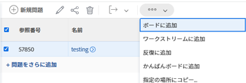
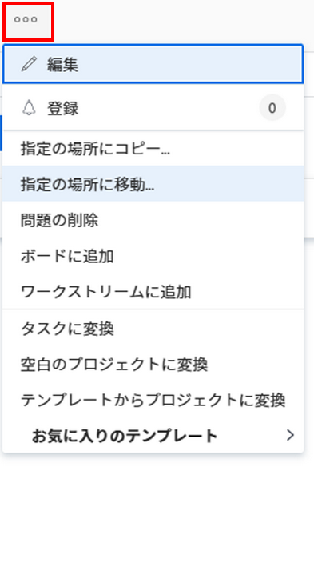
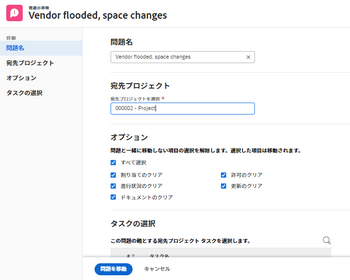
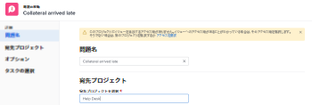

# イシューを移動

次のオブジェクト間でイシューを移動できます。

* プロジェクトから別のプロジェクトへ
* タスクから同じプロジェクト内の別のタスク、または別のプロジェクト内の別のタスクへ
* タスクからプロジェクト、または別のプロジェクトへ
* プロジェクトから同じプロジェクト内のタスク、または別のプロジェクト内のタスクへ

## アクセス要件

この記事の手順を実行するには、次のアクセス権が必要です。

<table style="table-layout:auto"> 
 <col> 
 <col> 
 <tbody> 
  <tr> 
   <td role="rowheader">Adobe Workfront プラン*</td> 
   <td> 
任意
 </td> 
  </tr> 
  <tr> 
   <td role="rowheader">Adobe Workfront ライセンス*</td> 
   <td> 
リクエスト以上
 
プロジェクトの「イシュー」セクションにイシューを移動するには、レビュー以上のライセンスが必要です。
 </td> 
  </tr> 
  <tr> 
   <td role="rowheader">アクセスレベル設定*</td> 
   <td> 
イシューへのアクセス権を編集
 
プロジェクトとタスクへのアクセス権またはそれ以上の権限
 
メモ：まだアクセス権がない場合は、アクセスレベルに追加の制限が設定されていないかどうか Workfront 管理者にお問い合わせください。アクセスレベルにおけるイシューへのアクセス権については、<a href="../../../administration-and-setup/add-users/configure-and-grant-access/grant-access-issues.md" class="MCXref xref">イシューへのアクセス権の付与</a>を参照してください。Workfront 管理者がアクセスレベルを変更する方法について詳しくは、<a href="../../../administration-and-setup/add-users/configure-and-grant-access/create-modify-access-levels.md" class="MCXref xref">カスタムアクセスレベルの作成または変更</a>を参照してください。 
 </td> 
  </tr> 
  <tr> 
   <td role="rowheader">オブジェクト権限</td> 
   <td> 
イシューに対する権限の管理
 
イシューを追加機能を使用してイシューを移動する項目に対する参加権限。
 
 イシューに関する権限の付与については、<a href="../../../workfront-basics/grant-and-request-access-to-objects/share-an-issue.md" class="MCXref xref">イシューの共有</a>を参照してください。
 
追加権限の要求については、<a href="../../../workfront-basics/grant-and-request-access-to-objects/request-access.md" class="MCXref xref">オブジェクトへのアクセス権の要求</a>を参照してください。
 </td> 
  </tr> 
 </tbody> 
</table>

*保有するプラン、ライセンスタイプまたはアクセス権を確認するには、Workfront 管理者にお問い合わせください。

## イシューの移動に関する考慮事項

ドキュメントを含むイシューや、リクエストキューに関連付けられているイシューを移動する際は、次の点を考慮してください。

* **イシューがリクエストキューに関連付けられている場合：**&#x200B;イシューを別のオブジェクトに移動し、そのイシューをリクエストキューに関連付けると、移動したイシューは最初のイシューの元になったキューに関連付けられなくなります。
* **イシューにドキュメントが添付されている場合：**&#x200B;イシューを別のオブジェクトに移動し、イシューにドキュメントが添付されている場合、そのドキュメント、バージョンおよびプルーフも新しいイシューに移動します。ドキュメントに関連付けられている承認は移動されません。
* **イシューがドキュメントまたはフォルダーにリンクされている場合：** Google Drive などのサードパーティのサービスにリンクされたドキュメントまたはフォルダーを含むイシューを移動すると、そのイシューと共にドキュメントへのリンクが移動します。

## リスト内のイシューを移動

イシューのリストまたはイシューレポートから 1 つまたは複数のイシューを移動できます。

1. 移動する 1 つまたは複数のイシューを含むプロジェクトに移動します。

   または

   イシューレポートに移動します。

1. プロジェクトに移動した場合は、左側のパネルで「**イシュー**」をクリックします。
1. 移動する 1 つまたは複数のイシューを選択し、イシューリストの上部にある&#x200B;**「その他」メニュー**&#x200B;をクリックし、「**指定の場所に移動**」をクリックします。

   

1. 引き続きイシューを移動します。[単一のイシューを移動](#move-a-single-issue)の節の手順 2 を参照してください。

   <!--
   <MadCap:conditionalText data-mc-conditions="QuicksilverOrClassic.Draft mode">
   (NOTE: ensure step stays accurate)
   </MadCap:conditionalText>
   -->

## 単一のイシューを移動 {#move-a-single-issue}

1 つのイシューを表示時に移動できます。

### プレビュー環境で単一のイシューを移動

1. コピーするイシューに移動し、イシュー名の右にある&#x200B;**その他**&#x200B;メニュー 、「**指定の場所に移動**」の順に選択します。

   

   **イシューを移動**&#x200B;ボックスが表示されます。

   

1. 「**宛先プロジェクトを選択**」セクションで、イシューの移動先のプロジェクトの名前を指定します。デフォルトでは、現在のプロジェクトの名前が表示されます。

   >[!TIP]
   >
   >リストには 100 個のプロジェクトのみが表示されます。

1. （条件付き）イシューをプロジェクトに移動するアクセス権がない場合は、「**アクセスをリクエスト**」をクリックします。
1. （条件付き）宛先プロジェクトのタスクの 1 つにイシューを追加するアクセス権がある場合は、アクセス権をリクエストせずに、引き続き選択した宛先プロジェクトにイシューを移動します。

   

   >[!TIP]
   >
   >Workfront 管理者がこれらのプロジェクトにイシューを追加できない場合、選択したプロジェクトが承認待ち、完了または無効の場合にも、同様のメッセージが表示されます。詳しくは、[システム全体のプロジェクト環境設定の指定](../../../administration-and-setup/set-up-workfront/configure-system-defaults/set-project-preferences.md)を参照してください。

1. （オプション）「**オプション**」セクションで、以下の表に示すいずれかの項目の選択を解除して、移動したイシューから削除します。デフォルトでは、すべてのオプションが選択されています。

   >[!IMPORTANT]
   >
   >オプションリストで項目の選択を解除すると、データが失われます。既存のイシューの情報は削除され、復元できません。

   <table style="table-layout:auto"> 
    <col> 
    <col> 
    <tbody> 
     <tr> 
      <td role="rowheader">すべて選択</td> 
      <td>このオプションの選択を解除すると、イシューを新しい場所に移動する際に、イシューのすべての情報を削除します。 </td> 
     </tr> 
     <tr> 
      <td role="rowheader">割り当て</td> 
      <td>イシューに割り当てられているユーザー、担当業務またはチームを削除します。</td> 
     </tr> 
     <tr> 
      <td role="rowheader">進捗状況</td> 
      <td>イシューの完了率（存在する場合）を削除します。 </td> 
     </tr> 
     <tr> 
      <td role="rowheader">
ドキュメント
</td> 
      <td> 
ドキュメントのバージョン、リンクされたドキュメント、フォルダーなど、「ドキュメント」タブ内のすべての項目を削除します。

   <b>メモ</b>

   イシューでドキュメントを移動しないように選択した場合、ドキュメントは削除され、30 日間ごみ箱に入れられます。管理者はそれらのドキュメントを復元でき、移動したイシューで復元されます。

   イシューを移動した後に削除すると、復元されたドキュメントは、ドキュメントを復元した管理者のユーザーページのドキュメントエリアに配置されます。
     
 </td>
   </tr> 
     <tr> 
      <td role="rowheader">権限</td> 
      <td>イシューの共有先エンティティを削除します。 </td> 
     </tr> 
     <tr> 
      <td role="rowheader">更新</td> 
      <td>イシューの「更新」セクションからコメントを削除します。</td> 
     </tr> 
    </tbody> 
   </table>

1. （オプション）「**タスクを選択**」セクションで、イシューを移動するタスクを選択します。
1. 「**イシューを移動**」、またはリストで複数のイシューを選択した場合は「**複数のイシューを移動**」をクリックします。

   移動されたイシューが、指定したプロジェクトに追加されます。

