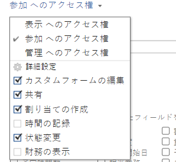

# フィードバック待ちから進行中へイシューステータスを自動的に更新する

イシューのプライマリ連絡先が、フィールド（カスタムフィールドを含む）の更新またはコメントの追加によってイシューを更新すると、イシューのステータスが自動的に「処理中」に更新されます。

この自動ステータス変更を行うには、次の条件が必要です。

* イシューはリクエストキューを通じて入力する必要があります。

  リクエストキューの作成について詳しくは、[リクエストキューを作成および管理](../../../manage-work/requests/create-and-manage-request-queues/create-manage-request-queues.md)の節を参照してください。リクエストの作成について詳しくは、[Adobe Workfront リクエストの作成と送信](../../../manage-work/requests/create-requests/create-submit-requests.md)を参照してください。

* リクエストキュー内のキューの詳細で、次の設定を行う必要があります。
   * 「**リクエストが行われる際に自動的に付与する権限**」を「**アクセスに参加**」に設定
   * 「詳細設定」で「**ステータスを変更**」を選択

  

  >[!IMPORTANT]
  >
  >  リクエストキューを設定する際に、送信されるイシューに対するプライマリ連絡先のアクセスを定義できます。
  >
  >リクエストキューの設定時に「ステータスの変更」設定を選択解除すると、リクエストキュー設定で「ステータスの変更」オプションが選択解除されていても、システム管理者は常にイシューのステータスを変更するアクセス権を持つことに注意してください。

  キューの詳細について詳しくは、[リクエストキューの作成](../../../manage-work/requests/create-and-manage-request-queues/create-request-queue.md)を参照してください。

* イシューのステータスが「フィードバック待ち」になっている必要があります。
* システムレベルのイシューで、フィードバック待ち（AWF）ステータスが使用可能である必要があります。

  システムレベルのステータスについて詳しくは、[ステータスの作成または編集](../../../administration-and-setup/customize-workfront/creating-custom-status-and-priority-labels/create-or-edit-a-status.md)を参照してください。
