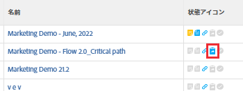

# イシューの表示

プロジェクト、タスクまたはイテレーションに関連付けられているイシューを表示できます。

## アクセス要件

この記事の手順を実行するには、次のアクセス権が必要です。

<table style="table-layout:auto"> 
 <col> 
 <col> 
 <tbody> 
  <tr> 
   <td role="rowheader">Adobe Workfront プラン*</td> 
   <td> 
任意
 </td> 
  </tr> 
  <tr> 
   <td role="rowheader">Adobe Workfront ライセンス*</td> 
   <td> 
リクエスト以上
 
プロジェクトの「問題」セクションにイシューを表示するには、レビュー以上のライセンスが必要です。
 </td> 
  </tr> 
  <tr> 
   <td role="rowheader">アクセスレベル設定*</td> 
   <td> 
イシューへの表示アクセス権
 
プロジェクトとタスクへのアクセス権またはそれ以上の権限
 
メモ：まだアクセス権がない場合は、アクセスレベルに追加の制限が設定されていないかどうか Workfront 管理者にお問い合わせください。アクセスレベルにおけるイシューへのアクセス権については、<a href="../../../administration-and-setup/add-users/configure-and-grant-access/grant-access-issues.md" class="MCXref xref">イシューへのアクセス権の付与</a>を参照してください。Workfront 管理者がアクセスレベルを変更する方法について詳しくは、<a href="../../../administration-and-setup/add-users/configure-and-grant-access/create-modify-access-levels.md" class="MCXref xref">カスタムアクセスレベルの作成または変更</a>を参照してください。 
 </td> 
  </tr> 
  <tr> 
   <td role="rowheader">オブジェクト権限</td> 
   <td> 
イシューの表示権限
 
 イシューに関する権限の付与については、<a href="../../../workfront-basics/grant-and-request-access-to-objects/share-an-issue.md" class="MCXref xref">イシューの共有</a>を参照してください。
 
追加権限の要求については、<a href="../../../workfront-basics/grant-and-request-access-to-objects/request-access.md" class="MCXref xref">オブジェクトへのアクセス権の要求</a>を参照してください。
 </td> 
  </tr> 
 </tbody> 
</table>

&#42;保有するプラン、ライセンスタイプ、アクセス権を確認するには、Workfront 管理者に問い合わせてください。

## ステータスに基づくイシューの表示

プロジェクト、タスクまたはイテレーションに関するイシューを表示するには、次の手順に従います。

1. イシューを含んだプロジェクト、タスクまたはイテレーションを開いて、左パネルの「**問題**」をクリックします。

1. すべてのイシュー、オープン（未解決の）イシューまたはクローズしたイシューを表示するには、**フィルター**&#x200B;ドロップダウンメニューで下記のフィルターのいずれかをクリックします。

>[!TIP]
>
>フィルターのリストは、システム管理者またはグループ管理者がリストに何を表示するかを選択したかによって異なります。

* **オープン**：未解決のイシューを表示します。

  これには、解決オブジェクトに関連付けられているイシューと、「クローズ - 承認保留中」ステータスにあるイシューが含まれます。

  解決オブジェクトについては、[解決オブジェクトと解決可能オブジェクトの概要](../../../manage-work/issues/convert-issues/resolving-and-resolvable-objects.md)を参照してください。

* **完了**：実際の完了日があるすべてのイシューを表示します。
* **すべて**：すべてのイシューを表示します。

## イシューに関する情報について

イシューにアクセスすると、イシューに関する情報を確認できます。

イシューにアクセスしてそれに関する情報を確認するには、次の手順に従います。

1. イシューを含んだプロジェクト、タスクまたはイテレーションを開いて、左パネルの「**問題**」をクリックします。
1. 確認しようとしているイシューを表示するフィルターを、**フィルター**&#x200B;ドロップダウンメニューから選択します。

   次の中から選択します。

   * 開く
   * 完了
   * すべて

1. イシューの名前をクリックします。

   イシューに対する管理権限がある場合は、イシューの編集可能なフィールドを編集して、承認、時間数またはドキュメントをイシューに追加できます。

1. 左パネルで以下のいずれかをクリックすると、イシューに関する詳細情報が表示されます。

* **更新**：次のアクションを実行できます。

   * イシューに関するコメントまたは既存のコメントへの返信。
   * 時間を記録
   * イシューのステータスの変更。

     Workfront での作業の更新について詳しくは、[作業の更新](/help/quicksilver/workfront-basics/updating-work-items-and-viewing-updates/update-work.md)を参照してください。

* **ドキュメント**：イシューにドキュメントを添付します。Workfront へのドキュメントの追加について詳しくは、[ファイルシステムから Adobe Workfront にドキュメントを追加](../../../documents/adding-documents-to-workfront/add-documents-from-file-system.md)を参照してください。

* **イシューの詳細**：このリンクを展開すると、**概要**&#x200B;および&#x200B;**カスタムフォーム**&#x200B;エリアが表示されます。

  イシューに対する管理権限とカスタムフォームの編集権限を持っている場合は、ここで一部の情報を編集できます。

  「**概要**」エリアで次のフィールドを表示または編集します。

   * **名前**
   * **パス**：イシューがプロジェクトに記録されたパス。

     イシューがリクエストキュー内のリクエストとして送信された場合、プロジェクト、トピックグループ、およびキューのトピックの名前がここにリストされます。このフィールドは編集できません。

     リクエストの送信について詳しくは、[Adobe Workfront リクエストの作成と送信](../../../manage-work/requests/create-requests/create-submit-requests.md)を参照してください。

   * **説明**
   * **URL**：イシューに関連する任意の web アドレス。
   * **優先度**：イシューに優先順位を付けるための視覚的なフラグ。
   * **重大度**：イシューに記載されているイシューの重大度を示す視覚的なフラグ。
   * **プライマリ連絡先**：デフォルトのプライマリ連絡先は、イシューを作成したユーザーです。このフィールドは編集できます。
   * **予定時間**：イシューが完了するまでにかかる時間を表示します。デフォルトは 8 時間です。このフィールドは編集できます。
   * **実際の時間**：イシューを完了するまでにかかった時間を表示します。これは、誰かがイシューを記録した実際の時間です。
   * **開始予定日**：イシューの開始予定日。デフォルトは、イシューが作成された日付と時刻です。
   * **実際の開始日**：イシューのステータスが「処理中」に変更された日付と時刻。
   * **完了予定日**：イシューの完了予定日。
   * **実際の完了日**：イシューが実際に完了した日付。このフィールドは、イシューのステータスが「クローズ済み」または「解決済み」に変わると自動的に入力されます。また、手動で編集することもできます。
   * **実際のコスト**：イシューに記録された実際の時間に基づくコスト。このフィールドは編集できません。イシューの実際コストは、次の式に基づいて計算されます。ここで、ユーザー原価率は、ユーザーがイシューにかかる時間を記録することに関連付けられた原価率です。

     発行の実際コスト = 記録時間 * ユーザーコスト率

   * **入力者**：イシューを作成したユーザーです。このフィールドは編集できません。
   * **最終更新者**：イシューのフィールドを最後に更新したユーザーです。このフィールドは編集できません。

     **カスタムフォーム**&#x200B;エリアで、イシューに関連付ける 1 つまたは複数のカスタムフォームを選択します。

* **時間数**：イシューに関する時間数エントリのリストを表示します。
* **承認：** イシューに関連付けられた承認パスを表示します。

  承認をイシューに関連付ける方法について詳しくは、[作業アイテムの承認プロセスを作成](../../../administration-and-setup/customize-workfront/configure-approval-milestone-processes/create-approval-processes.md)の[承認プロセスを作業アイテムに関連付ける](../../../administration-and-setup/customize-workfront/configure-approval-milestone-processes/create-approval-processes.md#associating-the-approval-process-with-an-object)の節を参照してください。

## どのプロジェクトとタスクにイシューがあるかを表示する

プロジェクト、タスクのレポート、またはリストのビューにアイコンを追加して、イシューが添付されているかどうかを示すことができます。レポートまたはリストのビューへのアイコンの追加は、プロジェクトやタスクでも同様です。

プロジェクトにイシューがあるかどうかを表示するアイコンをプロジェクトレポートに追加するには、次の手順を実行します。

1. Adobe Workfront の右上隅にある&#x200B;**メインメニュー**&#x200B;アイコン  をクリックします。
1. **レポート**／**新しいレポート**／**プロジェクトレポート**&#x200B;をクリックします。
1. 「**この列に表示**」フィールドに、**ステータスアイコン**&#x200B;の入力を開始し、リストに表示されたらそれを選択します。

1. 「**保存して閉じる**」をクリックします。

   イシューアイコンは、イシューがあるプロジェクトの&#x200B;**ステータスアイコン**&#x200B;列に表示されます。

   
