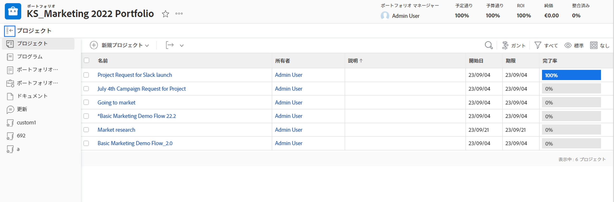
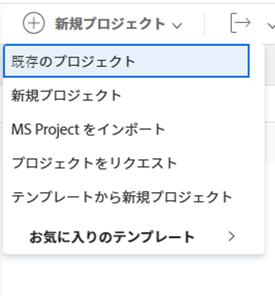
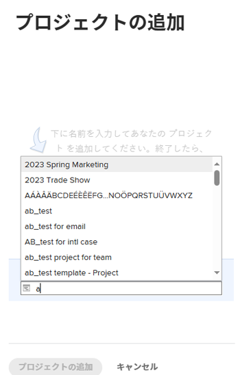

# ポートフォリオへのプロジェクトの追加

ポートフォリオの開始時に、プロジェクトをポートフォリオに追加することをお勧めします。 ただし、ポートフォリオには、その期間中はいつでも追加できます。

ポートフォリオにプロジェクトを追加する際は、次の点に注意してください。

* ポートフォリオには、無制限の数のプロジェクトを含めることができますが、1 つのプロジェクトに関連付けることができるポートフォリオは 1 つだけです。
* プロジェクトは、削除されるか、別のポートフォリオに関連付けられるまで、ポートフォリオ内に残ります。

## アクセス要件

この記事の手順を実行するには、次のアクセス権が必要です。

<table style="table-layout:auto"> 
 <col> 
 <col> 
 <tbody> 
  <tr> 
   <td role="rowheader">[!DNL Adobe Workfront] 計画*</td> 
   <td> 
[!UICONTROL Business] 以降
 </td> 
  </tr> 
  <tr> 
   <td role="rowheader">[!DNL Adobe Workfront] ライセンス*</td> 
   <td> 
[!UICONTROL プラン ] 
 </td> 
  </tr> 
  <tr> 
   <td role="rowheader">アクセスレベル設定*</td> 
   <td> 
[!UICONTROL 表示 ]Portfolio以上へのアクセス
 
プロジェクトへの [!UICONTROL 編集 ] アクセス
 
注意：まだアクセス権がない場合は、 [!DNL Workfront] 管理者（アクセスレベルに追加の制限を設定している場合） を参照してください。 [!DNL Workfront] 管理者は、 <a href="../../../administration-and-setup/add-users/configure-and-grant-access/create-modify-access-levels.md" class="MCXref xref">カスタムアクセスレベルの作成または変更</a>.
 </td> 
  </tr> 
  <tr> 
   <td role="rowheader">オブジェクト権限</td> 
   <td> 
ポートフォリオに対する [!UICONTROL 表示 ] 権限
 
プロジェクトに対する [!UICONTROL 管理 ] 権限
 
追加のアクセス権のリクエストについて詳しくは、 <a href="../../../workfront-basics/grant-and-request-access-to-objects/request-access.md" class="MCXref xref">オブジェクトへのアクセスのリクエスト </a>.
 </td> 
  </tr> 
 </tbody> 
</table>

&#42;ご利用のプラン、ライセンスの種類、アクセス権を確認するには、 [!DNL Workfront] 管理者。

## ポートフォリオへのプロジェクトの追加

1. ポートフォリオに移動し、「 **[!UICONTROL プロジェクト]** をクリックします。

   

1. クリック **[!UICONTROL 新規プロジェクト]** プロジェクトを追加する方法を選択します。

   >[!TIP]
   >
   >プロジェクトの一覧を [!UICONTROL マイルストーン] 表示

   次のオプションから選択します。

   <table style="table-layout:auto"> 
    <col> 
    <col> 
    <tbody> 
     <tr> 
      <td role="rowheader">[!UICONTROL 既存のプロジェクト ]</td> 
      <td> 
作成済みのプロジェクトを追加します。
 </td> 
     </tr> 
     <tr> 
      <td role="rowheader">[!UICONTROL 新規プロジェクト ]</td> 
      <td> 
新しいプロジェクトを追加します。 
 
新しいプロジェクトの作成の詳細については、 <a href="../../../manage-work/projects/create-projects/create-project.md" class="MCXref xref">プロジェクトの作成</a>. 
 </td> 
     </tr> 
     <tr> 
      <td role="rowheader">[!UICONTROL プロジェクトの読み込み元 [!DNL MS Project]] </td> 
      <td> 
以前に書き出したプロジェクトを追加します。 [!DNL MS Project] お使いのコンピューターに保存済み。 
 
新しいプロジェクトを読み込んで作成する方法の詳細 [!DNL Microsoft Project]を参照してください。 <a href="../../../manage-work/projects/create-projects/import-project-from-ms-project.md" class="MCXref xref">プロジェクトのインポート元 [!DNL Microsoft Project]</a>.
 </td> 
     </tr> 
     <tr> 
      <td role="rowheader">[!UICONTROL Request Project]</td> 
      <td> 
プロジェクトの承認をリクエストします。
 
プロジェクトをリクエストする方法については、 <a href="../../../manage-work/projects/create-projects/request-project.md">プロジェクトのリクエスト</a>. 
 </td> 
     </tr> 
     <tr> 
      <td role="rowheader">[!UICONTROL テンプレートから新規作成 ]</td> 
      <td> 
既存のテンプレートを使用して新しいプロジェクトを追加します。 
 
テンプレートからプロジェクトを作成する方法について詳しくは、 <a href="../../../manage-work/projects/create-projects/create-project-from-template.md" class="MCXref xref">テンプレートを使用したプロジェクトの作成</a>.
 </td> 
     </tr> 
    </tbody> 
   </table>

   

1. （条件付き）既存のプロジェクトを追加する場合は、 **[!UICONTROL プロジェクトを追加]** 」ボックスをクリックし、リストに表示されたらクリックします。 一度に複数のプロジェクトを追加できます。

   

1. クリック **[!UICONTROL プロジェクトを追加]**.

   選択した 1 つまたは複数のプロジェクトがポートフォリオに関連付けられます。
