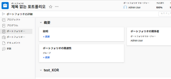
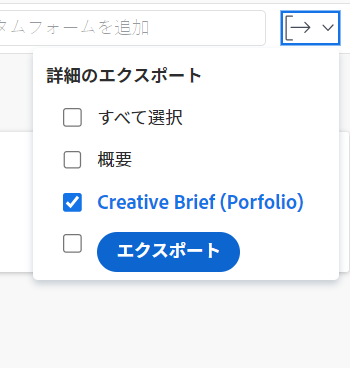
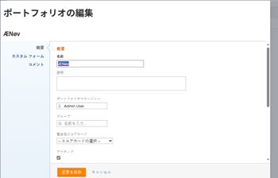
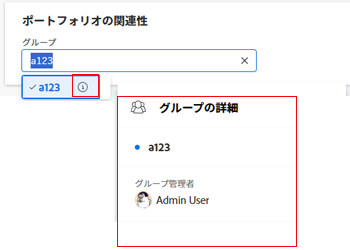
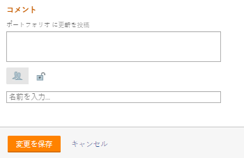

# ポートフォリオを編集

自分で作成したポートフォリオや、自分と共有した他のユーザーが作成したポートフォリオに関する情報を編集できます。

次の項目を編集できます。 [!UICONTROL ポートフォリオ] ポートフォリオページで編集するか、リストでポートフォリオを編集できます。

## アクセス要件

この記事の手順を実行するには、次のアクセス権が必要です。

<table style="table-layout:auto"> 
 <col> 
 <col> 
 <tbody> 
  <tr> 
   <td role="rowheader">[!DNL Adobe Workfront] 計画*</td> 
   <td> 
任意
 </td> 
  </tr> 
  <tr> 
   <td role="rowheader">Adobe [!DNL Workfront] ライセンスの概要*</td> 
   <td> 
[!UICONTROL プラン ] 
 </td> 
  </tr> 
  <tr> 
   <td role="rowheader">アクセスレベル*</td> 
   <td> 
Portfolioへの [!UICONTROL 編集 ] アクセス
 
注意：まだアクセス権がない場合は、 [!DNL Workfront] 管理者（アクセスレベルに追加の制限を設定している場合） アクセスレベルでのポートフォリオへのアクセスについて詳しくは、 <a href="../../../administration-and-setup/add-users/configure-and-grant-access/grant-access-portfolios.md" class="MCXref xref">ポートフォリオへのアクセス権の付与</a>. を参照してください。 [!DNL Workfront] 管理者は、 <a href="../../../administration-and-setup/add-users/configure-and-grant-access/create-modify-access-levels.md" class="MCXref xref">カスタムアクセスレベルの作成または変更</a>. 
 </td> 
  </tr> 
  <tr> 
   <td role="rowheader">オブジェクト権限</td> 
   <td> 
ポートフォリオに対する [!UICONTROL 管理 ] 権限
 
 ポートフォリオへの権限の付与について詳しくは、 <a href="../../../workfront-basics/grant-and-request-access-to-objects/share-a-portfolio..md" class="MCXref xref">ポートフォリオの共有 </a>. 
 
追加の権限のリクエストについて詳しくは、 <a href="../../../workfront-basics/grant-and-request-access-to-objects/request-access.md" class="MCXref xref">オブジェクトへのアクセスのリクエスト </a>.
 </td> 
  </tr> 
 </tbody> 
</table>

ご利用のプラン、ライセンスの種類、アクセス権を確認するには、 [!DNL Workfront] 管理者。

## ポートフォリオを編集

1. 次に移動： **[!UICONTROL メインメニュー]**.
1. クリック **[!UICONTROL Portfolio]**&#x200B;をクリックし、ポートフォリオの名前をクリックして開きます。
1. （オプション）ポートフォリオに関する限定的な情報を編集するには、 **[!UICONTROL Portfolioの詳細]** をクリックします。

   

   <!--
   
(NOTE: the note below will also be true for Edit Portfolio box)

   -->

   >[!NOTE]
   >
   >使用する [!DNL Workfront] 管理者またはグループ管理者がレイアウトテンプレート ( [!UICONTROL Portfolioの詳細] 領域が並べ替えられたり、表示されない場合があります。 詳しくは、 [のカスタマイズ [!UICONTROL 詳細] レイアウトテンプレートを使用して表示](../../../administration-and-setup/customize-workfront/use-layout-templates/customize-details-view-layout-template.md).

   ページの [!UICONTROL 詳細] セクションで、以下の操作を実行します。

   1. （オプション） **[!UICONTROL すべて折りたたむ]** アイコンを使用して、すべての領域を折りたたみます。
   1. （オプションおよび条件付き）領域が折りたたまれている場合、 **右向き矢印**  各領域の横に、編集する領域を展開します。
   1. に表示されるフィールドについて詳しくは、 [!UICONTROL Portfolioの詳細] 「 」セクションで、ポートフォリオの編集を続けます。 [!UICONTROL 編集Portfolio] 」ボックスを使用します。
   1. （オプション）ポートフォリオにカスタムフォームが添付されていない場合は、 **[!UICONTROL カスタムフォームを追加]** フィールドに値を入力する場合は、リストに表示される項目を選択し、 **[!UICONTROL 変更を保存]**.
   1. （オプション） **[!UICONTROL 書き出し]** アイコン  書き出す [!UICONTROL 概要] カスタムフォームの情報をPDFファイルに追加し、 **[!UICONTROL 書き出し]**. 次の中から選択します。

      * すべてを選択（少なくとも 1 つのカスタムフォームが添付されている場合にのみ表示）
      * 概要
      * 1 つまたは複数のカスタムフォームの名前

      PDFファイルがコンピューターにダウンロードされます。

      

      詳しくは、 [カスタムフォームとオブジェクトの詳細のエクスポート](../../../workfront-basics/work-with-custom-forms/export-custom-forms-details.md).

1. 1 つ以上のポートフォリオに関するすべての情報を編集するには、次のいずれかを実行します。

   <!--
   
(NOTE: this might have to be split in two sections if the single edit and the bulk edit won't come at the same time for portfolios)

   -->

   * 次をクリック： **[!UICONTROL 詳細]** ポートフォリオ名の横にあるメニュー、 **[!UICONTROL 編集].**

      <!--   
     
(NOTE: this will change in NWE with a new Edit Portfolio UI)
   
     -->

   * ポートフォリオのリストに移動し、編集する 1 つ以上のポートフォリオを選択し、 **[!UICONTROL 編集]** アイコン  をクリックします。

      <!--   
     
(NOTE: this will need to split into another section when they release the new [!UICONTROL Edit Portfolio] UI)
   
     -->
   この **[!UICONTROL 編集Portfolio]** ダイアログボックスが表示されます。

   

   すべてのポートフォリオフィールドは、 [!UICONTROL 編集Portfolio] ボックスに含まれ、左パネルにリストされた領域でグループ化されます。

1. 次のセクションのいずれかで、情報の指定を検討します。

   * [[!UICONTROL 概要]](#overview)
   * [カスタムフォーム](#Custom%C2%A0F)
   * [コメント](#comment)

### [!UICONTROL 概要] {#overview}

1. 前述のように、ポートフォリオの編集を開始します。
1. クリック **[!UICONTROL 概要]** 次のフィールドを指定します。

   <!--
   
(NOTE: note below is drafted: drafted till they release new Edit Portfolio boxes)

   -->

   <!--
   <note type="note">
   Depending on how your Workfront administrator or Group administrator sets up our Layout Template, the fields in the Edit Portfolio box might be rearranged or not display. For information, see
   <a href="../../../administration-and-setup/customize-workfront/use-layout-templates/customize-details-view-layout-template.md" class="MCXref xref">Customize the Details view using a layout template</a>.
   </note>
   -->

   <table style="table-layout:auto"> 
    <col> 
    <col> 
    <tbody> 
     <tr> 
      <td role="rowheader">[!UICONTROL 名前 ]</td> 
      <td> 
ポートフォリオの名前を更新します。 
 
ヒント：これは、複数のポートフォリオを選択した場合は使用できません。 
 </td> 
     </tr> 
     <tr> 
      <td role="rowheader">[!UICONTROL 説明 ]</td> 
      <td> 
固有の情報を示すPortfolioの説明を入力します。 
 </td> 
     </tr> 
     <tr> 
      <td role="rowheader">[!UICONTROLPortfolioマネージャー ]</td> 
      <td> 
ポートフォリオマネージャとして指定するユーザの名前を入力し、リストに表示されたら選択します。 これは、[!UICONTROLPortfolio所有者 ] と同じです。 これは、ポートフォリオのプロジェクトで定義された作業を監視し、ビジネスケースを承認できる人です。
 
重要：誰かをPortfolioマネージャーに指定すると、ポートフォリオ、プログラム、およびポートフォリオ内のプロジェクトに対する [!UICONTROL 管理 ] 権限が自動的に付与されます。 
 
ヒント：ポートフォリオヘッダーでポートフォリオマネージャをすばやく更新できます。 
 </td> 
     </tr> 
     <tr> 
      <td role="rowheader">[!UICONTROL グループ ]</td> 
      <td> 
グループがポートフォリオに関連付けられている場合、またはそのグループを完了する責任を持つ場合は、1 つのグループの名前を追加します。 
 
ヒント：  
[!UICONTROL グループの詳細 ] ページから [!UICONTROLPortfolio] フィールドにアクセスする際に、次の操作を行います。 
 
適切なグループを選択していることを確認するには、グループにマウスポインターを置いて [!UICONTROL information] アイコンをクリックします  その横に表示されます。 グループの上位のグループの階層や管理者など、グループに関する情報が一覧表示されるツールチップが表示されます。
 
  
 
このオプションは、[!UICONTROL 編集Portfolio] ボックスでは使用できません。 
 
 </td> 
     </tr> 
     <tr> 
      <td role="rowheader"> 
[!UICONTROL Alignment Scorecard]
 </td> 
      <td> 
使用する線形スコアカードをドロップダウンリストから選択します。 スコアカードは、多くの場合、Portfolioのミッション、価値、戦略目標を反映した、組織の確立された基準にプロジェクトがどの程度適合するかを測定するために使用されます。 詳しくは、 <a href="../../../manage-work/projects/define-a-business-case/apply-scorecard-to-project-to-generate-alignment-score.md" class="MCXref xref">プロジェクトにスコアカードを適用し、線形スコアを生成する</a> および <a href="../../../administration-and-setup/set-up-workfront/configure-system-defaults/create-scorecard.md" class="MCXref xref">スコアカードの作成</a>.
 </td> 
     </tr> 
     <tr> 
      <td role="rowheader">[!UICONTROL がアクティブです ]</td> 
      <td> 
 ポートフォリオをアクティブにする場合は、このチェックボックスを選択します。 他のユーザーは、プロジェクトの作成や編集を行う際に、アクティブなポートフォリオを見つけて、プロジェクトに添付することができます。 非アクティブなポートフォリオは、プロジェクトに添付できません。 これはデフォルトで有効になっています。
 </td> 
     </tr> 
    </tbody> 
   </table>

1. クリック **[!UICONTROL 変更を保存]** または、以降のセクションの編集を続けます。

### カスタムフォーム

1. 前述の説明に従って、ポートフォリオの編集を開始します。
1. 次をクリック： **[!UICONTROL Formsを追加]** ドロップダウンメニューを使用してカスタムフォームを選択し、ポートフォリオに追加します。

   ポートフォリオカスタムフォームを追加する前に、カスタムフォームを作成する必要があります。

   >[!NOTE]
   >
   >使用する [!DNL Workfront] 管理者は、カスタムフォームのセクションに対する権限を設定します。誰もが特定のカスタムフォームの同じフィールドを表示または編集できるわけではありません。 カスタムフォームのセクション内のフィールドを編集する権限は、ポートフォリオ自体に対する権限によって異なります。 カスタムフォームのセクションに対する権限の設定について詳しくは、 [カスタムフォームの作成または編集](../../../administration-and-setup/customize-workfront/create-manage-custom-forms/create-or-edit-a-custom-form.md).

1. カスタムフォームのフィールドを更新し、 **[!UICONTROL 変更を保存]** または、次のセクションに進みます。

### コメント {#comment}

1. 前述のように、ポートフォリオの編集を開始します。
1. クリック **[!UICONTROL コメント]**.

   

1. コメントを **[!UICONTROL ポートフォリオの更新を投稿]** フィールドに入力します。
1. （オプション） **[!UICONTROL 人]** アイコンをクリックして、コメントにユーザーまたはチームを追加します。
1. （オプション） **[!UICONTROL ロック]** アイコンを使用して、コメントをロックし、会社のユーザーのみに非公開にします。
1. クリック **[!UICONTROL 変更を保存]**.
