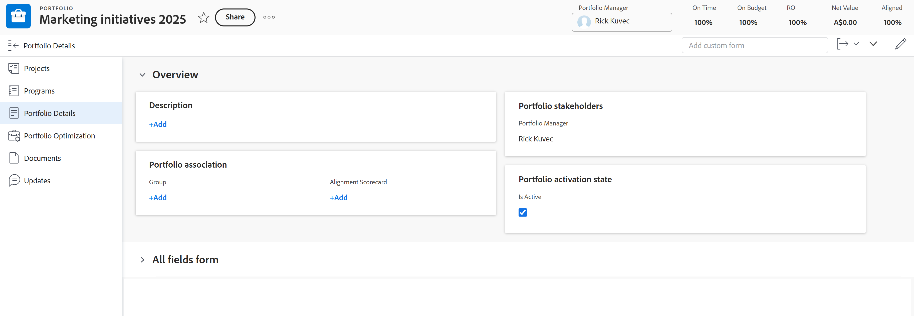
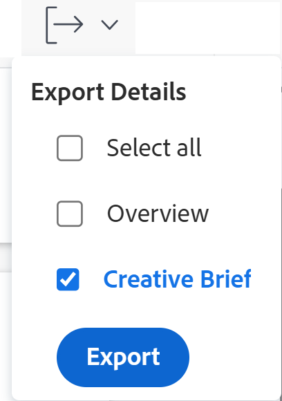
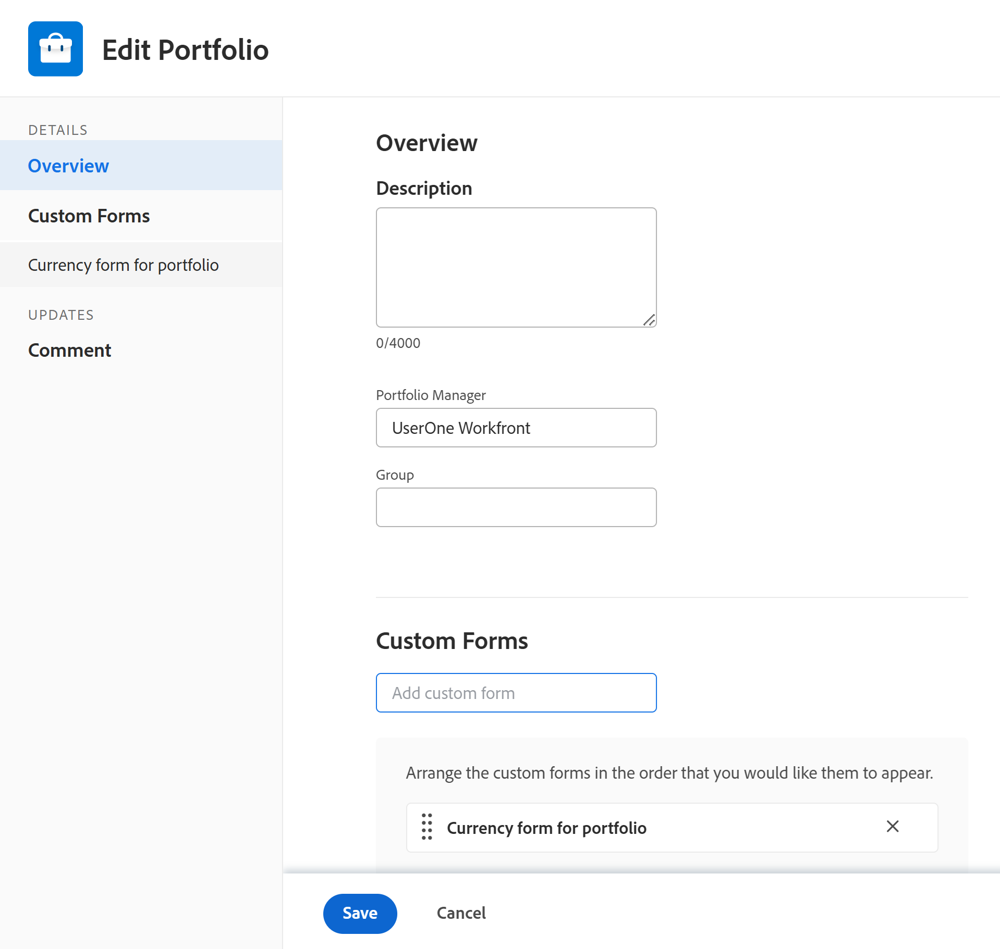
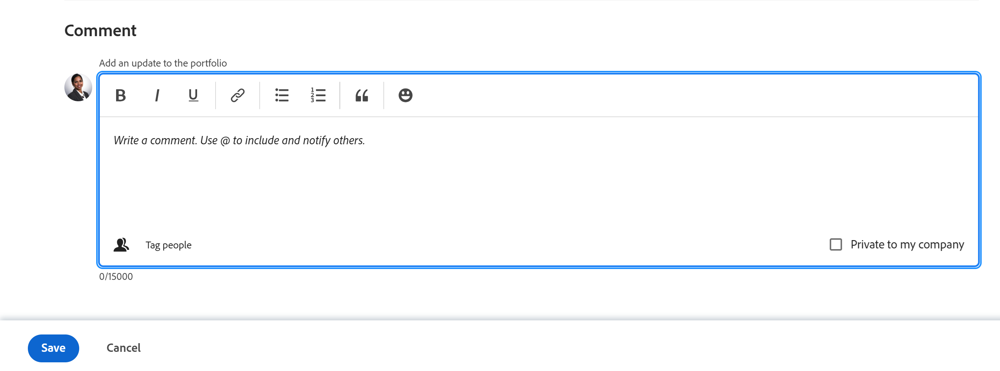

# ポートフォリオを編集する

<!--

 

The highlighted information on this page refers to functionality not yet generally available. It is available only in the Preview environment for all customers. The same features will also be available in the Production environment for all customers after a week from the Preview release.      

For more information, see [Interface modernization](/help/quicksilver/product-announcements/product-releases/interface-modernization/interface-modernization.md).  

-->

自分が作成したポートフォリオや、他のユーザーが自分と共有した場合にはそのユーザーが作成したポートフォリオに関する情報を編集できます。

ポートフォリオページでポートフォリオを編集したり、リストでポートフォリオを編集したりできます。

## アクセス要件

+++ 展開すると、この記事の機能のアクセス要件が表示されます。 

<table style="table-layout:auto"> 
 <col> 
 <col> 
 <tbody> 
  <tr> 
   <td role="rowheader">[!DNL Adobe Workfront] パッケージ</td> 
   <td> 
任意
</td> 
  </tr> 
  <tr> 
   <td role="rowheader">Adobe [!DNL Workfront] ライセンス</td> 
   <td> 
[!UICONTROL Standard]

   
[!UICONTROL Plan]
 </td> 
  </tr> 
  <tr> 
   <td role="rowheader">アクセスレベル</td> 
   <td> 
[!UICONTROL Edit] [!UICONTROL Portfolios]へのアクセス
  </td> 
  </tr> 
  <tr> 
   <td role="rowheader">オブジェクト権限</td> 
   <td> 
ポートフォリオに対する [!UICONTROL Manage] 権限

   
ポートフォリオ内のプロジェクトに対する[!UICONTROL Manage]権限を追加または削除します
  </td> 
  </tr> 
 </tbody> 
</table>

* 詳しくは、[Workfront ドキュメント &#x200B;](/help/quicksilver/administration-and-setup/add-users/access-levels-and-object-permissions/access-level-requirements-in-documentation.md)のアクセス要件を参照してください。

+++ 

<!--
Old:

<table style="table-layout:auto"> 
 <col> 
 <col> 
 <tbody> 
  <tr> 
   <td role="rowheader">[!DNL Adobe Workfront] plan</td> 
   <td> 
Any
</td> 
  </tr> 
  <tr> 
   <td role="rowheader">Adobe [!DNL Workfront] licenses*</td> 
   <td> 
New: Standard

   
Current: [!UICONTROL Plan] 
 </td> 
  </tr> 
  <tr> 
   <td role="rowheader">Access level</td> 
   <td> 
[!UICONTROL Edit] access to Portfolios
  </td> 
  </tr> 
  <tr> 
   <td role="rowheader">Object permissions</td> 
   <td> 
[!UICONTROL Manage] permissions to a portfolio

   
 Manage permissions to the projects in the portfolio to add or remove them from the portfolio
  </td> 
  </tr> 
 </tbody> 
</table>

*For information, see [Access requirements in Workfront documentation](/help/quicksilver/administration-and-setup/add-users/access-levels-and-object-permissions/access-level-requirements-in-documentation.md).
-->

## ポートフォリオを編集する

{{step1-to-portfolios}}

1. （オプション）ポートフォリオに関する限定的な情報を編集するには、次の操作を行います。

   1. ポートフォリオの名前をクリックして開き、左側のパネルで「**[!UICONTROL Portfolioの詳細]**」をクリックします。

      

      <!--
      
(NOTE: the note below will also be true for Edit Portfolio box)

      -->

      >[!NOTE]
      >
      >[!DNL Workfront] 管理者またはグループ管理者がレイアウトテンプレートを変更した方法によっては、[!UICONTROL ポートフォリオの詳細]エリアが並べ替えられたり、表示されない場合があります。詳しくは、[レイアウトテンプレートを使用した[!UICONTROL 詳細]表示のカスタマイズ](../../../administration-and-setup/customize-workfront/use-layout-templates/customize-details-view-layout-template.md)を参照してください。

      「[!UICONTROL **詳細**]」セクションの情報を編集するには、以下を行います。

   1. （オプション）右上隅の&#x200B;**[!UICONTROL すべて折りたたむ]** アイコン をクリックして、すべての領域を折りたたみます。
   1. （オプションおよび条件付き）領域が折りたたまれたら、各領域の横にある&#x200B;**展開** アイコン をクリックして、編集する領域を展開します。

      >[!TIP]
      >
      >すべての領域が折りたたまれている場合は、詳細セクションの右上隅にある&#x200B;**すべて展開** アイコン をクリックできます。

      [!UICONTROL **ポートフォリオの詳細**]&#x200B;セクションに表示されるフィールドについて詳しくは、次に説明するように、「[!UICONTROL **ポートフォリオを編集**]」ボックスでポートフォリオの編集を続けます。
   1. （オプション）ポートフォリオにカスタムフォームが添付されていない場合は、**[!UICONTROL 詳細]** ページの右上隅にある「**カスタムフォームを追加**」フィールドにフォームの名前を入力し、リストに表示されたら選択します。
   1. [!UICONTROL **概要**]&#x200B;および&#x200B;[!UICONTROL **カスタム Forms**]&#x200B;領域のフィールドに情報を追加し、[!UICONTROL **変更を保存**]&#x200B;をクリックします。
   1. （オプション）「**[!UICONTROL 書き出し]**」アイコン「」をクリックして、[!UICONTROL 概要]およびカスタムフォーム情報をPDF ファイルに書き出してから、**[!UICONTROL 書き出し]**&#x200B;をクリックします。 次の中から選択します。

      * すべてを選択（1 つ以上のカスタムフォームが添付されている場合にのみ表示）
      * 概要
      * 1 つまたは複数のカスタムフォームの名前

        PDF ファイルがお使いのコンピューターにダウンロードされます。

        

        詳しくは、[カスタムフォームとオブジェクト詳細の書き出し](../../../workfront-basics/work-with-custom-forms/export-custom-forms-details.md)を参照してください。

1. （オプション） 1つ以上のポートフォリオに関するすべての情報を編集するには、ポートフォリオのリストで編集する1つ以上のポートフォリオを選択し、リストの上部にある&#x200B;**[!UICONTROL 編集]** アイコン をクリックします。

   <!--
   
(NOTE: this might have to be split in two sections if the single edit and the bulk edit won't come at the same time for portfolios)

   -->
   「**[!UICONTROL Portfolioを編集]**」ボックスが表示されます。

   

   すべてのポートフォリオフィールドは、[!UICONTROL ポートフォリオを編集]ボックスで使用でき、左のパネルに表示されたエリアでグループ化されます。

1. 次のセクションのいずれかに情報を指定することを検討してください。

   * [[!UICONTROL 概要]](#overview)
   * [カスタムフォーム](#custom-forms)
   * [コメント](#comment)

   >[!TIP]
   >
   >一度に複数のポートフォリオのカスタムフィールドを再計算するには、リスト内の複数のポートフォリオを選択し、リストの上部にある&#x200B;**詳細** メニューをクリックしてから、**式を再計算**&#x200B;します。

### [!UICONTROL 概要] {#overview}

1. 上記の説明に従って、ポートフォリオの編集を開始します。
1. 「**[!UICONTROL 概要]**」をクリックし、次のフィールドを指定します。

   <!--
   
(NOTE: note below is drafted: drafted till they release new Edit Portfolio boxes)

   -->

   <!--
   <note type="note">
   Depending on how your Workfront administrator or Group administrator sets up our Layout Template, the fields in the Edit Portfolio box might be rearranged or not display. For information, see
   <a href="../../../administration-and-setup/customize-workfront/use-layout-templates/customize-details-view-layout-template.md" class="MCXref xref">Customize the Details view using a layout template</a>.
   </note>
   -->

   <table style="table-layout:auto"> 
    <col> 
    <col> 
    <tbody> 
     <tr> 
      <td role="rowheader">[!UICONTROL Name]</td> 
      <td> 
ポートフォリオの名前を更新します。 
 
<b>ヒント</b>
 
      
複数のポートフォリオを選択する場合、「名前」フィールドは使用できません。 
 </td> 
     </tr> 
     <tr> 
      <td role="rowheader">[!UICONTROL Description]</td> 
      <td> 
ポートフォリオの説明を入力して、その独自性を示します。 
 </td> 
     </tr> 
     <tr> 
      <td role="rowheader">[!UICONTROL Portfolio Manager]</td> 
      <td> 
ポートフォリオマネージャーとして指定するユーザーの名前を入力し、リストに名前が表示されたらそれを選択します。これは、[!UICONTROL Portfolio Owner]と同じです。これは、ポートフォリオのプロジェクトで定義された作業を監視し、ビジネスケースを承認できる人です。
 
重要：任意のユーザーをポートフォリオマネージャーに指定すると、ポートフォリオ、プログラムおよびポートフォリオ内のプロジェクトに対する[!UICONTROL Manage]権限が自動的に付与されます。 
 
ヒント：ポートフォリオヘッダーで、ポートフォリオマネージャーをすばやく更新できます。 
 </td> 
     </tr> 
     <tr> 
      <td role="rowheader">[!UICONTROL Group]</td> 
      <td> 
グループがポートフォリオに関連付けられている場合、またはポートフォリオを完了する責任を持つ場合は、1 つのグループの名前を追加します。 
 
ヒント：  
[!UICONTROL Portfolio Details]ページから「[!UICONTROL Group]」フィールドにアクセスする場合は、次の操作を行います。 
 
適切なグループを選択していることを確認するには、グループにポインタを合わせて、横に表示される[!UICONTROL information]アイコン  をクリックします。グループの上位のグループの階層や管理者など、グループに関する情報が一覧表示されるツールチップが表示されます。
 
  
 
このオプションは、「[!UICONTROL Edit Portfolio]」ボックスでは使用できません。 
 
 </td> 
     </tr> 
     <tr> 
      <td role="rowheader"> 
[!UICONTROL Alignment Scorecard]
 </td> 
      <td> 
使用する整合性スコアカードをドロップダウンリストから選択します。スコアカードは、組織のミッション、価値、戦略目標を反映して確立されたポートフォリオの基準に対するプロジェクトの整合性を測定するために使用されます。詳しくは、<a href="../../../manage-work/projects/define-a-business-case/apply-scorecard-to-project-to-generate-alignment-score.md" class="MCXref xref">プロジェクトにスコアカードを適用し、整合性スコアを生成</a>および<a href="../../../administration-and-setup/set-up-workfront/configure-system-defaults/create-scorecard.md" class="MCXref xref">スコアカードを作成</a>を参照してください。
 </td> 
     </tr> 
     <tr> 
      <td role="rowheader">[!UICONTROL Is Active]</td> 
      <td> 
 ポートフォリオをアクティブにする場合は、このチェックボックスを選択します。他のユーザーが、プロジェクトの作成時や編集時に、アクティブなポートフォリオを見つけてプロジェクトに添付することができます。非アクティブなポートフォリオは、プロジェクトに添付できません。これはデフォルトで有効になっています。
 </td> 
     </tr> 
    </tbody> 
   </table>

1. [!UICONTROL **保存**]&#x200B;をクリックして、次のセクションの編集を続行します。

### カスタムフォーム

1. 上記の説明に従って、ポートフォリオの編集を開始します。
1. 「[!UICONTROL **カスタムフォームを追加**]」フィールドにフォームの名前を入力します。

   追加できるようにするには、ポートフォリオのカスタムフォームを作成する必要があります。

   >[!NOTE]
   >
   >[!DNL Workfront] の管理者がカスタムフォーム内のセクションに権限を設定する方法によっては、特定のカスタムフォーム上の同じフィールドを誰もが表示または編集できるわけではありません。カスタムフォームのセクション内のフィールドを編集する権限は、ポートフォリオ自体に対する権限によって異なります。カスタムフォームのセクションに対する権限の設定について詳しくは、[&#x200B; カスタムフォームの作成](/help/quicksilver/administration-and-setup/customize-workfront/create-manage-custom-forms/form-designer/design-a-form/design-a-form.md)を参照してください。

1. [!UICONTROL **保存**]&#x200B;をクリックして、次のセクションの編集を続行します。

### コメント {#comment}

1. 上記の説明に従って、ポートフォリオの編集を開始します。
1. 「**[!UICONTROL コメント]**」をクリックします。

   

1. 「**[!UICONTROL ポートフォリオに更新を追加]**」フィールドにコメントを追加します。
1. （オプション）**[!UICONTROL ユーザー]**&#x200B;アイコンをクリックして、コメントにユーザーまたはチームを追加します。
1. （オプション）**[!UICONTROL ロック]**&#x200B;アイコンをクリックして、コメントをロックし、社外秘にします。
1. 「[!UICONTROL **保存**]」をクリックします。
