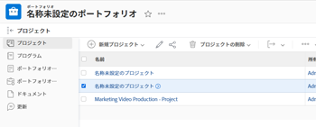

# ポートフォリオからのプロジェクトの削除

プロジェクトをポートフォリオから削除して別のポートフォリオに関連付けることも、プロジェクトとポートフォリオの関連付けを完全に削除することもできます。

また、ポートフォリオからプロジェクトを削除することもでき、その場合、そのプロジェクトは [!DNL Adobe Workfront] からも削除されます。

## アクセス要件

この記事の手順を実行するには、次のアクセス権が必要です。

<table style="table-layout:auto"> 
 <col> 
 <col> 
 <tbody> 
  <tr> 
   <td role="rowheader">[!DNL Adobe Workfront] プラン*</td> 
   <td> 
[!UICONTROL Business] 以降
 </td> 
  </tr> 
  <tr> 
   <td role="rowheader">[!DNL Adobe Workfront] ライセンス*</td> 
   <td> 
[!UICONTROL Plan] 
 </td> 
  </tr> 
  <tr> 
   <td role="rowheader">アクセスレベル設定*</td> 
   <td> 
プロジェクトへの [!UICONTROL Edit] アクセス
 
ポートフォリオ以上への [!UICONTROL View] アクセス
 
メモ：それでもアクセスできない場合は、アクセスレベルに追加の制限が設定されていないかどうかを [!DNL Workfront] 管理者にお問い合わせください。[!DNL Workfront] 管理者がアクセスレベルを変更する方法について詳しくは、<a href="../../../administration-and-setup/add-users/configure-and-grant-access/create-modify-access-levels.md" class="MCXref xref">カスタムアクセスレベルの作成または変更</a>を参照してください。
 </td> 
  </tr> 
  <tr> 
   <td role="rowheader">オブジェクト権限</td> 
   <td> 
プロジェクトを削除するポートフォリオに対する[!UICONTROL Manage] 権限  [!UICONTROL Manage] 権限と、プロジェクトをポートフォリオから削除するためのプロジェクトへの [!UICONTROL Delete] アクセス権
 
追加のアクセス権のリクエストについて詳しくは、<a href="../../../workfront-basics/grant-and-request-access-to-objects/request-access.md" class="MCXref xref">オブジェクトへのアクセス権のリクエスト</a>を参照してください。
 </td> 
  </tr> 
 </tbody> 
</table>

&#42;ご利用のプラン、ライセンスタイプまたはアクセス権を確認するには、[!DNL Workfront] 管理者にお問い合わせください。

## ポートフォリオからのプロジェクトの削除

1. ポートフォリオに移動し、左パネルの「**[!UICONTROL プロジェクト]**」をクリックします。
1. 削除するプロジェクトを選択します。 

   

1. 「**[!UICONTROL プロジェクトの削除]**」をクリックします。
1. 「**[!UICONTROL 削除]**」をクリックしてプロジェクトを [!DNL Workfront] から削除するか、「**[!UICONTROL ポートフォリオから]****[!UICONTROL 削除する]**」をクリックして、選択したポートフォリオから削除します。

1. （オプションおよび条件付き）ポートフォリオから削除したプロジェクトを見つけて、別のポートフォリオに関連付けます。ポートフォリオへのプロジェクトの関連付けについては、[ポートフォリオへのプロジェクトの追加](../../../manage-work/portfolios/create-and-manage-portfolios/add-projects-to-portfolios.md)を参照してください。
