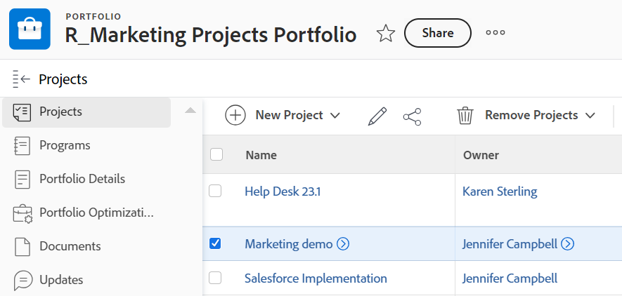

# ポートフォリオからのプロジェクトの削除

<!--Audited: 7/2024-->

プロジェクトをポートフォリオから削除して別のポートフォリオに関連付けることも、プロジェクトとポートフォリオの関連付けを完全に削除することもできます。

また、ポートフォリオからプロジェクトを削除することもでき、その場合、そのプロジェクトは [!DNL Adobe Workfront] からも削除されます。

## アクセス要件

+++ 展開すると、この記事の機能のアクセス要件が表示されます。 

<table style="table-layout:auto"> 
 <col> 
 <col> 
 <tbody> 
  <tr> 
   <td role="rowheader">[!DNL Adobe Workfront] パッケージ</td> 
   <td> 
任意
 </td> 
  </tr> 
  <tr> 
   <td role="rowheader">[!DNL Adobe Workfront] ライセンス</td> 
   <td> 
[!UICONTROL Standard]

   
[!UICONTROL Plan] 
 </td> 
  </tr> 
  <tr> 
   <td role="rowheader">アクセスレベル設定</td> 
   <td> 
プロジェクトへの [!UICONTROL Edit] アクセス
 
ポートフォリオへの[!UICONTROL Edit]アクセス権
  </td> 
  </tr> 
  <tr> 
   <td role="rowheader">オブジェクト権限</td> 
   <td> 
[!UICONTROL Manage] ポートフォリオおよびプロジェクトを削除するプロジェクトに対する権限

   
[!UICONTROL Delete] アクセス権を持つ[!UICONTROL Manage]権限を持つプロジェクトにアクセスして、ポートフォリオから削除します
 </td> 
  </tr> 
 </tbody> 
</table>

* 詳しくは、[Workfront ドキュメント ](/help/quicksilver/administration-and-setup/add-users/access-levels-and-object-permissions/access-level-requirements-in-documentation.md)のアクセス要件を参照してください。

+++

<!--
Old:

<table style="table-layout:auto"> 
 <col> 
 <col> 
 <tbody> 
  <tr> 
   <td role="rowheader">[!DNL Adobe Workfront] plan</td> 
   <td> 
Any
 </td> 
  </tr> 
  <tr> 
   <td role="rowheader">[!DNL Adobe Workfront] license*</td> 
   <td> 
New: Standard

   
Current: [!UICONTROL Plan] 
 </td> 
  </tr> 
  <tr> 
   <td role="rowheader">Access level</td> 
   <td> 
[!UICONTROL Edit] access to Projects
 
[!UICONTROL Edit] access to Portfolios
  </td> 
  </tr> 
  <tr> 
   <td role="rowheader">Object permissions</td> 
   <td> 
[!UICONTROL Manage] permissions on the portfolio and the projects to remove projects

   
[!UICONTROL Manage] permissions with [!UICONTROL Delete] access to the projects to delete them from the portfolio
 </td> 
  </tr> 
 </tbody> 
</table>

*For information, see [Access requirements in Workfront documentation](/help/quicksilver/administration-and-setup/add-users/access-levels-and-object-permissions/access-level-requirements-in-documentation.md).
-->

## ポートフォリオからのプロジェクトの削除

1. ポートフォリオに移動し、左パネルの「**[!UICONTROL プロジェクト]**」をクリックします。
1. 削除するプロジェクトを選択します。

   

1. 「**[!UICONTROL プロジェクトを削除]**」をクリックします。
1. 「**[!UICONTROL 削除]**」をクリックしてプロジェクトを [!DNL Workfront] から削除するか、「**[!UICONTROL ポートフォリオから]****[!UICONTROL 削除する]**」をクリックして、選択したポートフォリオから削除します。

1. （オプションおよび条件付き）ポートフォリオから削除したプロジェクトを見つけて、別のポートフォリオに関連付けます。 ポートフォリオへのプロジェクトの関連付けについては、[ポートフォリオへのプロジェクトの追加](../../../manage-work/portfolios/create-and-manage-portfolios/add-projects-to-portfolios.md)を参照してください。
