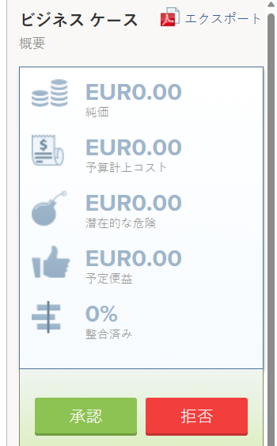
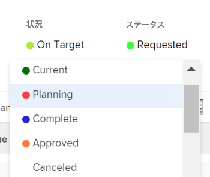

# リクエストされたプロジェクトの確認

複数のプロジェクトリクエストがレビューのために提出された場合、プロジェクト管理オフィスまたはポートフォリオ委員会が会合を開き、提出されたリクエストをレビューし、プロジェクトのリクエストの承認を決定することができます。プロジェクトのリクエストは、[!DNL Adobe Workfront] でステータスが[!UICONTROL リクエスト済み]のプロジェクトとして表示されます。

以下の操作のいずれかを行って、プロジェクトのリクエストをレビュー用に送信できます。

* プロジェクトステータスを&#x200B;**[!UICONTROL リクエスト済み]**&#x200B;に変更する。
* プロジェクトの[!UICONTROL ビジネスケース]を完了し、承認用に送信する。\
   プロジェクトのビジネスケースの完了について詳しくは、[プロジェクトのビジネスケースの作成](../../../manage-work/projects/define-a-business-case/create-business-case.md)を参照してください。

[!DNL Adobe Workfront] の次のエリアで、リクエストされたプロジェクトをレビューできます。

* プロジェクトレポート内
* ポートフォリオ内

## アクセス要件

この記事の手順を実行するには、次のアクセス権が必要です。

<table style="table-layout:auto"> 
 <col> 
 <col> 
 <tbody> 
  <tr> 
   <td role="rowheader">[!DNL Adobe Workfront] プラン*</td> 
   <td> 
[!UICONTROL Business] 以降
 </td> 
  </tr> 
  <tr> 
   <td role="rowheader">[!DNL Adobe Workfront] ライセンス*</td> 
   <td> 
[!UICONTROL Plan] 
 </td> 
  </tr> 
  <tr> 
   <td role="rowheader">アクセスレベル設定*</td> 
   <td> 
ポートフォリオへの [!UICONTROL View] アクセス権以上
 
プロジェクトへの [!UICONTROL Edit] アクセス
 
メモ：それでもアクセスできない場合は、アクセスレベルに追加の制限が設定されていないかどうかを [!DNL Workfront] 管理者にお問い合わせください。[!DNL Workfront] 管理者がアクセスレベルを変更する方法について詳しくは、<a href="../../../administration-and-setup/add-users/configure-and-grant-access/create-modify-access-levels.md" class="MCXref xref">カスタムアクセスレベルの作成または変更</a>を参照してください。
 </td> 
  </tr> 
  <tr> 
   <td role="rowheader">オブジェクト権限</td> 
   <td> 
ポートフォリオへの [!UICONTROL View] 以上の権限
 
ステータスを更新するためにプロジェクトへの [!UICONTROL Manage] 権限
 
追加のアクセス権のリクエストについて詳しくは、<a href="../../../workfront-basics/grant-and-request-access-to-objects/request-access.md" class="MCXref xref">オブジェクトへのアクセス権のリクエスト</a>を参照してください。
 </td> 
  </tr> 
 </tbody> 
</table>

&#42;ご利用のプラン、ライセンスタイプまたはアクセス権を確認するには、[!DNL Workfront] 管理者にお問い合わせください。

## プロジェクトレポートでリクエストされたプロジェクトをレビュー

プロジェクトレポートを作成して、[!UICONTROL リクエスト済み]のステータスを持つプロジェクトを表示できます。

プロジェクトレポートの作成によるプロジェクトリクエストの承認について詳しくは、[ビジネスケースの承認](../../../manage-work/projects/define-a-business-case/approve-business-case.md)にある[[!UICONTROL プロジェクトレポートの作成によるビジネスケースの承認]](../../../manage-work/projects/define-a-business-case/approve-business-case.md#build-a-report)の節を参照してください。

## ポートフォリオ内でリクエストされたプロジェクトをレビュー

1. リクエストされたプロジェクトをレビューするポートフォリオに移動します。
1. 左側のパネルで「**[!UICONTROL プロジェクト]**」をクリックします。
1. **[!UICONTROL フィルター]**&#x200B;ドロップダウンメニューから、「**[!UICONTROL リクエスト済み]**」を選択します。

   ステータスが&#x200B;**[!UICONTROL リクエスト済み]**&#x200B;のプロジェクトのみがリストに表示されます。

   >[!TIP]
   >
   >このリストに表示するには、プロジェクトのステータスが&#x200B;**[!UICONTROL リクエスト済み]**&#x200B;であることに加えて、選択したポートフォリオに関連付けられている必要があります。

1. リスト内のプロジェクトの名前をクリックして開きます。
1. 左側のパネルの「**[!UICONTROL プロジェクト詳細]**」をクリックします。
1. 以下の操作のいずれかを行います。

   * **[!UICONTROL ビジネスケース]**&#x200B;をクリックし、続いて[!UICONTROL ビジネスケースの概要]エリアにある「**[!UICONTROL 承認]**」または「**[!UICONTROL 却下]**」をクリックして、ビジネスケースを承認または却下します。

     

     ビジネスケースが承認されると、プロジェクトステータスが&#x200B;**[!UICONTROL 承認済み]**&#x200B;に変更されます。

     ビジネスケースが却下されると、プロジェクトステータスが&#x200B;**[!UICONTROL 却下]**&#x200B;に変更されます。

     >[!NOTE]
     >
     >ビジネスケースの承認を送信したユーザーに、プロジェクトリクエストが承認されたか却下されたかを知らせる通知はありません。 

     または

   * **[!UICONTROL ステータス]**&#x200B;ドロップダウンメニューで、プロジェクトのステータスを他のステータスに変更します。

     
 

 
