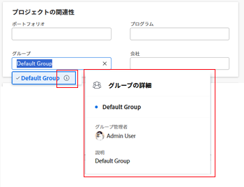

# プログラムの作成

<!-- Audited: 1/2024 -->

プログラムとは、プロジェクトの境界を越えた共通の戦略、目標、または目標を共有するプロジェクトの集まりを表します。 プログラムは、ポートフォリオ外には存在できません。

## アクセス要件

この記事の手順を実行するには、次のアクセス権が必要です。

<table style="table-layout:auto"> 
 <col> 
 <col> 
 <tbody> 
  <tr> 
   <td role="rowheader">[!DNL Adobe Workfront] 計画</td>

<td> 
新規：任意

または

現在： [!UICONTROL Business] 以降
 </td> 
  </tr> 
  <tr> 
   <td role="rowheader">[!DNL Adobe Workfront] ライセンス</td> 
   <td> 
新規： [!UICONTROL Standard] 

または 

現在： [!UICONTROL プラン ] 
 </td> 
  </tr> 
  <tr> 
   <td role="rowheader">アクセスレベル設定</td> 
   <td> 
[!UICONTROL 編集 ] によるPortfolioとプログラムへのアクセス 
  </td> 
  </tr> 
  <tr> 
   <td role="rowheader">オブジェクトの権限</td> 
   <td> 
ポートフォリオに対する [!UICONTROL 管理 ] 権限
 
プログラムを作成した後は、デフォルトで [!UICONTROL 管理 ] 権限が付与されます。
  </td> 
  </tr> 
 </tbody> 
</table>

この表の情報の詳細については、 [Workfrontドキュメントのアクセス要件](/help/quicksilver/administration-and-setup/add-users/access-levels-and-object-permissions/access-level-requirements-in-documentation.md).

## プログラムの作成

1. 次をクリック： **[!UICONTROL メインメニュー]** アイコン  Adobe Workfrontの右上隅にある、または（使用可能な場合）、 **[!UICONTROL メインメニュー]** アイコン  をクリックします。

1. 次のいずれかの操作を行います。

   * からプログラムを作成する [!UICONTROL プログラム] 領域：

      1. クリック **[!UICONTROL プログラム]** 」をクリックします。
      1. クリック **[!UICONTROL 新規プログラム]**.
      1. 表示されるボックスに、既存のPortfolioの名前を **[!UICONTROL 選択Portfolio]** フィールドに入力します。
      1. 新しいプログラムの名前を **[!UICONTROL 名前]** フィールドに入力します。
      1. 「**[!UICONTROL 保存]**」をクリックします。
   * からプログラムを作成する [!UICONTROL Portfolio] 領域：

      1. クリック **[!UICONTROL Portfolio]** （内） [!UICONTROL メインメニュー]をクリックし、ポートフォリオを開きます。
      1. 左側のパネルで、 **[!UICONTROL プログラム]**.
      1. 次をクリック： **[!UICONTROL 新規プログラム]** ドロップダウンメニューから、 **[!UICONTROL 新規プログラム]**.

1. （条件付き）ポートフォリオからプログラムを作成した場合は、 **[!UICONTROL 名称未設定プログラム]** フィールドに入力します。

   名前は 255 文字までです。

1. （オプション）「 **[!UICONTROL プログラムマネージャ]** を設定し、更新する必要があります。

   >[!TIP]
   >
   >プログラムの作成者は、デフォルトでプログラムマネージャとして設定されます。

1. クリック **[!UICONTROL プログラムの詳細]** をクリックします。
1. 任意のフィールドをダブルクリックして、 **[!UICONTROL 概要]** 領域。

次の情報を指定できます。

<table style="table-layout:auto"> 
    <col> 
    <col> 
    <thead> 
     <tr> 
      <th>フィールド</th> 
      <th>説明</th> 
     </tr> 
    </thead> 
    <tbody> 
     <tr> 
      <td role="rowheader">[!UICONTROL 説明 ]</td> 
      <td> 
プログラムの説明を指定します。
 
説明は、プログラムのランディングページに表示されます。
 </td> 
     </tr> 
     <tr> 
      <td role="rowheader">[!UICONTROL プログラムマネージャー ]</td> 
      <td> 
プログラムマネージャーとして機能させるユーザーの名前を入力し、ドロップダウンリストに表示されたら、そのユーザーの名前をクリックします。 これは、[!UICONTROL プログラム所有者 ] と同じです。 
 
ヒント：プログラムヘッダーでプログラムマネージャーを更新することもできます。 
 </td> 
     </tr> 
     <tr data-mc-conditions=""> 
      <td role="rowheader">[!UICONTROL グループ ] </td> 
      <td> 
グループがプログラムを所有している場合、またはプログラムの完了を担当している場合は、1 つのグループの名前を追加します。 
 
適切なグループを選択していることを確認するには、グループにマウスポインターを置いて [!UICONTROL information] アイコンをクリックします  その横に表示されます。 グループの上位のグループの階層や管理者など、グループに関する情報が一覧表示されるツールチップが表示されます。
 
       
 
         
       
 </td> 
     </tr> 
    </tbody> 
   </table>

1. （オプションおよび条件付き） **[!UICONTROL カスタムフォームを追加]** ボックスを使用して、ポートフォリオのカスタムフォームを選択し、カスタムフィールドを更新します。

   >[!TIP]
   >
   >プログラムをプログラムに添付するには、プログラムのカスタムフォームが既に作成されている必要があります。

1. （オプションおよび条件付き）カスタムフォームを追加する場合、カスタムフォーム上の任意のフィールドをクリックして、そのフィールドの情報を更新します。
1. 「**[!UICONTROL 変更を保存]**」をクリックします。
1. クリック **[!UICONTROL プロジェクト]** 左のパネルで、 **[!UICONTROL プロジェクトを追加]** をクリックして、プログラムにプロジェクトを追加します。

   プログラムへのプロジェクトの追加については、 [プログラムにプロジェクトを追加する](../../../manage-work/portfolios/create-and-manage-programs/add-project-to-program.md).

1. 「**[!UICONTROL 変更を保存]**」をクリックします。
1. （オプション） **[!UICONTROL その他のメニュー]**  プログラム名の横にあるをクリックし、 **[!UICONTROL プログラムを非アクティブ化]**.

   プログラムを非アクティブ化すると、ユーザーがプロジェクトに追加しようとすると、そのプログラムはプログラムのリストに表示されなくなります。 引き続き、 [!UICONTROL プログラム] 領域。

## プログラムヘッダーの概要

プログラムのヘッダーには、プログラムに関する情報が表示されます。

プログラムのヘッダーには、次の情報が表示されます。

<table style="table-layout:auto"> 
 <col> 
 <col> 
 <tbody> 
  <tr> 
   <td role="rowheader">ヘッダー情報</td> 
   <td> <strong>メモ</strong> </td> 
  </tr> 
  <tr> 
   <td role="rowheader">ポートフォリオ名を示すパンくず</td> 
   <td>プログラムのヘッダーから、プログラムが属するポートフォリオにアクセスできます。 </td> 
  </tr> 
  <tr> 
   <td role="rowheader">プログラムの名前</td> 
   <td>ヘッダーでプログラム名を編集できます。</td> 
  </tr> 
  <tr> 
   <td role="rowheader">オブジェクトタイプの名前とアクティベーションステータス</td> 
   <td>「プログラム」という単語は、プログラムを表示する際にオレンジ色のアイコン付きで表示されます。 プログラムが [!UICONTROL アクティブ ] とマークされていない場合、「[!UICONTROL 非アクティブ ]」という単語が横に表示され、アウトラインは灰色で表示されます。 </td> 
  </tr> 
  <tr> 
   <td role="rowheader">プログラムの「アクション」領域 </td> 
   <td> 
プログラムの詳細情報や編集オプションにアクセスするには、次のいずれかをクリックします。
 
    <ul> 
     <li>お気に入りのリストにプログラムを追加する星形のアイコン</li> 
     <li> 
[!UICONTROL その他 ] メニュー  次のいずれかの操作を行うには： 
 
      <ul> 
       <li>プログラムを編集</li> 
       <li>無効にします。 プログラムを非アクティブ化すると、プロジェクトレベルでプロジェクトに関連付けられなくなります。 </li> 
       <li> 
削除します。 プログラムを削除しても、プログラム内のプロジェクトは削除されません。 プロジェクトとプログラムとの関連付けが削除されます。 
 </li> 
       <li>他のユーザーと共有する</li> 
      </ul> </li> 
    </ul> </td> 
  </tr> 
  <tr> 
   <td role="rowheader">[!UICONTROL 完了率 ]</td> 
   <td> 
ヘッダーのプログラムの [!UICONTROL 完了率 ] を編集することはできません。 この情報は、プログラムのプロジェクトから更新されます。 デフォルトでは、プログラムの完了率は、[!UICONTROL 現在 ] または [!UICONTROL 承認済み ] ステータスのプロジェクトの完了率の値の平均です。
 </td> 
  </tr> 
  <tr> 
   <td role="rowheader">[!UICONTROL プログラムマネージャー ]</td> 
   <td> 
ヘッダーでプログラムマネージャーを編集できます。 これは、[!UICONTROL プログラム所有者 ] と同じです。 
 </td> 
  </tr> 
  <tr> 
   <td role="rowheader">[!UICONTROL 計画完了日 ]</td> 
   <td>ヘッダーのプログラムの計画完了日は編集できません。 この情報は、プログラムのプロジェクトから更新されます。 プログラムの最新プロジェクトの計画完了日が、プログラムの計画完了日になります。  </td> 
  </tr> 
  <tr> 
   <td role="rowheader">[!UICONTROL アクティブプロジェクト条件 ]</td> 
   <td>これは、[!UICONTROL Condition] が [!UICONTROL On Target]、[!UICONTROL At Risk]、[!UICONTROL In Trable] のいずれかに設定されている、プログラム内のプロジェクトの割合の計算です。 ここで表されるプロジェクトは、ステータスが [!UICONTROL Current] および [!UICONTROL Approved] のプロジェクトです。 </td> 
  </tr> 
 </tbody> 
</table>

## プログラムの移動

既存のプログラムをポートフォリオに追加できます。 2 つの異なるポートフォリオにプログラムが存在することはできないので、既存のプログラムを追加すると、ポートフォリオ間でプログラムが永続的に移動します。

詳しくは、 [ポートフォリオに既存のプログラムを追加する](../../../manage-work/portfolios/create-and-manage-programs/move-program.md).
