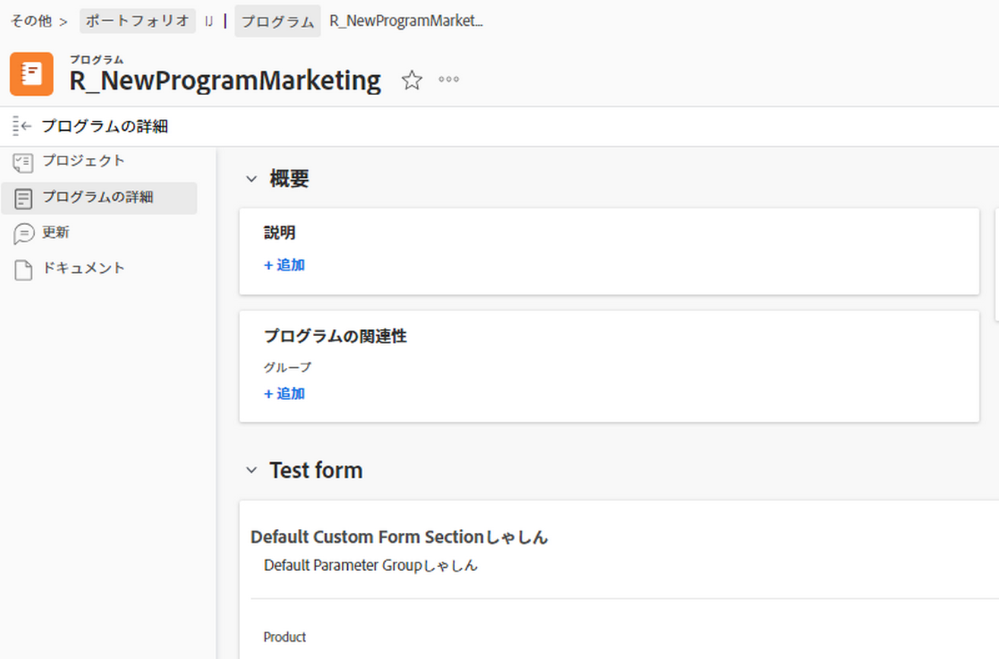
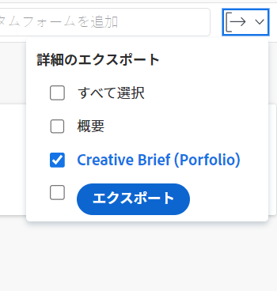
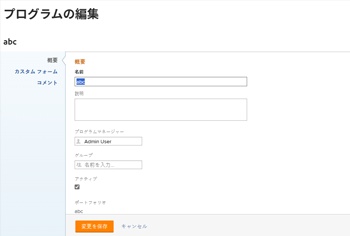
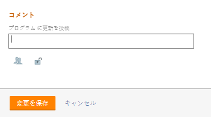

# プログラムの編集

自分が作成したプログラムや、他のユーザーが自分と共有した場合に作成したプログラムに関する情報を編集できます。

プログラムページでプログラムを編集することも、リスト内のプログラムを編集することもできます。

## アクセス要件

この記事の手順を実行するには、次のアクセス権が必要です。

<table style="table-layout:auto"> 
 <col> 
 <col> 
 <tbody> 
  <tr> 
   <td role="rowheader">[!DNL Adobe Workfront] 計画*</td> 
   <td> 
任意
 </td> 
  </tr> 
  <tr> 
   <td role="rowheader">[!DNL Adobe Workfront] ライセンス*</td> 
   <td> 
[!UICONTROL プラン ] 
 </td> 
  </tr> 
  <tr> 
   <td role="rowheader">アクセスレベル*</td> 
   <td> 
プログラムへの [!UICONTROL 編集 ] アクセス
 
注意：まだアクセス権がない場合は、 [!DNL Workfront] 管理者（アクセスレベルに追加の制限を設定している場合） アクセスレベルのプログラムへのアクセスについては、 <a href="../../../administration-and-setup/add-users/configure-and-grant-access/grant-access-programs.md" class="MCXref xref">プログラムへのアクセス権の付与</a>. を参照してください。 [!DNL Workfront] 管理者は、 <a href="../../../administration-and-setup/add-users/configure-and-grant-access/create-modify-access-levels.md" class="MCXref xref">カスタムアクセスレベルの作成または変更</a>. 
 </td> 
  </tr> 
  <tr> 
   <td role="rowheader">オブジェクト権限</td> 
   <td> 
プログラムに対する [!UICONTROL 管理 ] 権限
 
 プログラムに権限を付与する方法については、 <a href="../../../workfront-basics/grant-and-request-access-to-objects/share-a-program.md" class="MCXref xref">プログラムの共有 </a>. 
 
追加の権限のリクエストについて詳しくは、 <a href="../../../workfront-basics/grant-and-request-access-to-objects/request-access.md" class="MCXref xref">オブジェクトへのアクセスのリクエスト </a>.
 </td> 
  </tr> 
 </tbody> 
</table>

&#42;ご利用のプラン、ライセンスの種類、アクセス権を確認するには、 [!DNL Workfront] 管理者。

## プログラムの編集

1. 次に移動： **[!UICONTROL メインメニュー]**.
1. クリック **[!UICONTROL プログラム]**&#x200B;をクリックし、プログラム名をクリックして開きます。

   >[!TIP]
   >
   >関連付けられているポートフォリオ内のプログラムにアクセスするには、まずポートフォリオに移動し、次に「 」をクリックします。 **[!UICONTROL プログラム]** をクリックします。 詳しくは、 [プログラムの作成](../../../manage-work/portfolios/create-and-manage-programs/create-program.md).

1. （オプション）プログラムに関する限定的な情報を編集するには、 **[!UICONTROL プログラムの詳細]** をクリックします。

   >[!TIP]
   >
   >プログラムに関するすべての情報を編集する場合は、手順 4 に進みます。

   

   >[!NOTE]
   >
   >使用する [!DNL Workfront] 管理者またはグループ管理者がレイアウトテンプレート ( [!UICONTROL プログラムの詳細] 領域が並べ替えられたり、表示されない場合があります。 詳しくは、 [のカスタマイズ [!UICONTROL 詳細] レイアウトテンプレートを使用して表示](../../../administration-and-setup/customize-workfront/use-layout-templates/customize-details-view-layout-template.md).

   <!--
   
(NOTE: the above note will also come to the Edit Program box)

   -->

   ページの [!UICONTROL 詳細] セクションで、以下の操作を実行します。

   1. （オプション） **[!UICONTROL すべて折りたたむ]** アイコンを使用して、すべての領域を折りたたみます。
   1. （オプションおよび条件付き）領域が折りたたまれている場合、 **右向き矢印**  各領域の横に、編集する領域を展開します。
   1. に表示されるフィールドについて詳しくは、 [!UICONTROL プログラムの詳細] セクションで、 [!UICONTROL プログラムを編集] 」ボックスを使用します。
   1. （オプション）プログラムにカスタムフォームが添付されていない場合は、 **[!UICONTROL カスタムフォームを追加]** フィールドに値を入力する場合は、リストに表示される項目を選択し、 **[!UICONTROL 変更を保存]**.
   1. （オプション） **[!UICONTROL 書き出し]** アイコン  書き出す [!UICONTROL 概要] カスタムフォームの情報をPDFファイルに追加し、 **[!UICONTROL 書き出し]**. 次の中から選択します。

      * すべてを選択（少なくとも 1 つのカスタムフォームが添付されている場合にのみ表示）
      * [!UICONTROL 概要]
      * 1 つまたは複数のカスタムフォームの名前

      PDFファイルがコンピューターにダウンロードされます。

      

      詳しくは、 [カスタムフォームとオブジェクトの詳細のエクスポート](../../../workfront-basics/work-with-custom-forms/export-custom-forms-details.md).

1. 1 つ以上のプログラムに関するすべての情報を編集するには、次のいずれかを実行します。

   * 次をクリック： **[!UICONTROL 詳細]** メニュー  プログラム名の横に表示され&#x200B;、**[!UICONTROL 編集].**
   * プログラムの一覧に移動し、編集する 1 つ以上のプログラムを選択し、 **[!UICONTROL 編集]** アイコン  をクリックします。

   この **[!UICONTROL プログラムを編集]** ダイアログボックスが表示されます。

   

   すべてのプログラムフィールドは、 [!UICONTROL プログラムを編集] ボックスに含まれ、左パネルにリストされた領域でグループ化されます。

1. 次のセクションのいずれかで、情報の指定を検討します。

   * [[!UICONTROL 概要]](#overview)
   * [[!UICONTROL カスタムフォーム]](#Custom%C2%A0F)
   * [[!UICONTROL コメント]](#comment)

### [!UICONTROL 概要] {#overview}

1. 上記の説明に従って、プログラムの編集を開始します。
1. クリック **[!UICONTROL 概要]** 次のフィールドを指定します。

   <!--
   
(NOTE:&nbsp;note below drafted for now)

   -->

   <!--
   <note type="note">
   Depending on how your Workfront administrator or Group administrator sets up our Layout Template, the fields in the Edit Program box might be rearranged or not display. For information, see
   <a href="../../../administration-and-setup/customize-workfront/use-layout-templates/customize-details-view-layout-template.md" class="MCXref xref">Customize the Details view using a layout template</a>.
   </note>
   -->

   <table style="table-layout:auto"> 
    <col> 
    <col> 
    <tbody> 
     <tr> 
      <td role="rowheader">[!UICONTROL 名前 ]</td> 
      <td> 
プログラムの名前を更新します。 
 
ヒント：複数のプログラムを選択した場合は使用できません。 
 </td> 
     </tr> 
     <tr> 
      <td role="rowheader">[!UICONTROL 説明 ]</td> 
      <td> 
固有の情報を示すPortfolioの説明を入力します。 
 </td> 
     </tr> 
     <tr> 
      <td role="rowheader">[!UICONTROL プログラムマネージャー ]</td> 
      <td> 
プログラムマネージャとして指定するユーザの名前を入力し、リストに表示されたら選択します。 これは、プログラムのプロジェクトで定義された作業を監視できる人です。 
 
重要：任意のユーザーをプログラムマネージャーに指定すると、自動的にプログラムおよびプログラム内のプロジェクトに対する [!UICONTROL 管理 ] 権限が付与されます。 
 
ヒント：プログラムヘッダーで、プログラムマネージャをすばやく更新できます。 
 </td> 
     </tr> 
     <tr> 
      <td role="rowheader">[!UICONTROL グループ ]</td> 
      <td> 
グループがプログラムに関連付けられている場合、またはプログラムを完了する責任を持つ場合は、1 つのグループの名前を追加します。 
 
ヒント：  
[!UICONTROL プログラムの詳細 ] ページから [!UICONTROL グループ ] フィールドにアクセスする際に、次の手順を実行します。 
 
適切なグループを選択していることを確認するには、グループにマウスポインターを置いて [!UICONTROL information] アイコンをクリックします  その横に表示されます。 グループの上位のグループの階層や管理者など、グループに関する情報が一覧表示されるツールチップが表示されます。
 
  
 
このオプションは、[!UICONTROL プログラムの編集 ] ボックスでは使用できません。 
 
 </td> 
     </tr> 
     <tr> 
      <td role="rowheader">[!UICONTROL がアクティブです ]</td> 
      <td> 
 プログラムをアクティブにする場合は、このチェックボックスを選択します。 他のユーザーは、アクティブなプログラムを見つけてプロジェクトに添付したり、ポートフォリオに追加したりできます。 非アクティブなプログラムは、プロジェクトやポートフォリオに添付できません。 これはデフォルトで有効になっています。
 </td> 
     </tr> 
    </tbody> 
   </table>

1. クリック **[!UICONTROL 変更を保存]** または、以降のセクションの編集を続けます。

### [!UICONTROL カスタムフォーム]

1. 上記の説明に従って、プログラムの編集を開始します。
1. 次をクリック： **[!UICONTROL Formsを追加]** ドロップダウンメニューからカスタムフォームを選択し、プログラムに追加します。

   追加する前に、プログラムのカスタムフォームを作成する必要があります。

   >[!NOTE]
   >
   >使用する [!DNL Workfront] 管理者は、カスタムフォームのセクションに対する権限を設定します。誰もが特定のカスタムフォームの同じフィールドを表示または編集できるわけではありません。 カスタムフォームのセクション内のフィールドを編集する権限は、プログラム自体に対する権限によって異なります。 カスタムフォームのセクションに対する権限の設定について詳しくは、 [カスタムフォームの作成または編集](../../../administration-and-setup/customize-workfront/create-manage-custom-forms/create-or-edit-a-custom-form.md).

1. カスタムフォームのフィールドを更新し、 **[!UICONTROL 変更を保存]** または、次のセクションに進みます。

### [!UICONTROL コメント] {#comment}

1. 上記の説明に従って、プログラムの編集を開始します。
1. クリック **[!UICONTROL コメント]**.

   

1. コメントを **[!UICONTROL プログラムの更新を投稿]** フィールドに入力します。
1. （オプション） **[!UICONTROL 人]** アイコンをクリックして、コメントにユーザーまたはチームを追加します。
1. （オプション） **[!UICONTROL ロック]** アイコンを使用して、コメントをロックし、会社のユーザーのみに非公開にします。

   変更を保存すると、追加したコメントがプログラムの [!UICONTROL 更新] 「 」タブに移動し、そこに含まれるユーザーに電子メールを送信します。
