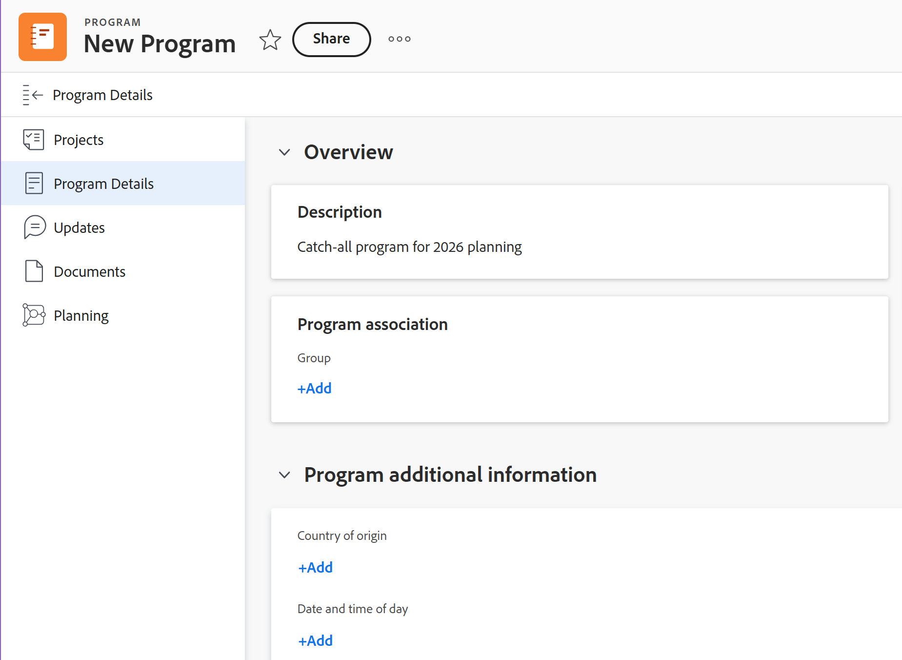
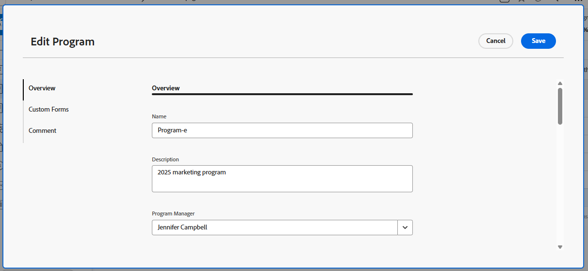
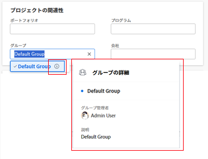
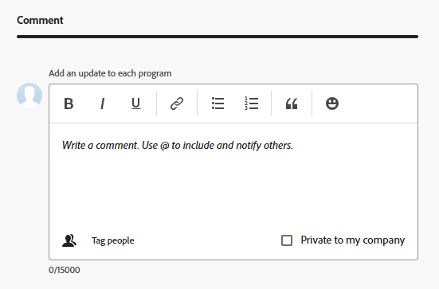

# プログラムの編集

自分が作成したプログラムや他のユーザーが作成したプログラム（そのユーザーと共有した場合）に関する情報を編集できます。

プログラムページでプログラムを編集したり、リストで1つまたは複数のプログラムを一括編集したりできます。

## アクセス要件

+++ 展開すると、この記事の機能のアクセス要件が表示されます。

<table style="table-layout:auto"> 
 <col> 
 <col> 
 <tbody> 
  <tr> 
   <td role="rowheader">[!DNL Adobe Workfront] パッケージ</td> 
   <td> 
任意
 </td> 
  </tr> 
  <tr> 
   <td role="rowheader">[!DNL Adobe Workfront] ライセンス</td> 
   <td> 
[!UICONTROL Standard]

   
[!UICONTROL Plan]
 </td> 
  </tr> 
  <tr> 
   <td role="rowheader">アクセスレベル設定</td> 
   <td> 
プログラムへの[!UICONTROL Edit]アクセス権
  </td> 
  </tr> 
  <tr> 
   <td role="rowheader">オブジェクト権限</td> 
   <td> 
プログラムの[!UICONTROL Manage]権限
  </td> 
  </tr> 
 </tbody> 
</table>

詳しくは、[Workfront ドキュメントのアクセス要件](/help/quicksilver/administration-and-setup/add-users/access-levels-and-object-permissions/access-level-requirements-in-documentation.md)を参照してください。

+++

## プログラムの編集

1. **[!UICONTROL メインメニュー]**&#x200B;に移動します。
1. 「**[!UICONTROL プログラム]**」をクリックし、プログラム名をクリックして開きます。

   >[!TIP]
   >
   >関連付けられているポートフォリオからプログラムにアクセスするには、まずポートフォリオに移動し、左パネルの「**[!UICONTROL プログラム]**」をクリックします。詳しくは、[プログラムの作成](../../../manage-work/portfolios/create-and-manage-programs/create-program.md)を参照してください。

1. （オプション）プログラムに関する限定的な情報を編集するには、左パネルの「**[!UICONTROL プログラムの詳細]**」をクリックします。

   >[!TIP]
   >
   >プログラムに関するすべての情報を編集する場合は、手順 4 に進みます。

   を含むプログラムの詳細

   >[!NOTE]
   >
   >[!DNL Workfront] 管理者またはグループ管理者がレイアウトテンプレートを変更した方法によっては、[!UICONTROL プログラムの詳細]エリアのフィールドが並べ替えられたり、表示されなかったりする場合があります。詳しくは、[レイアウトテンプレートを使用した[!UICONTROL 詳細]ビューのカスタマイズ](../../../administration-and-setup/customize-workfront/use-layout-templates/customize-details-view-layout-template.md)を参照してください。

   <!--
   
(NOTE: the above note will also come to the Edit Program box)

   -->

   「[!UICONTROL 詳細]」セクションの情報を編集するには、以下を行います。

   1. （オプション）右上隅の&#x200B;**[!UICONTROL すべて折りたたむ]**&#x200B;アイコンをクリックして、すべてのエリアを折りたたみます。
   1. （オプションおよび条件付き）領域が折りたたまれたら、各領域の横にある&#x200B;**右向き矢印** をクリックして、編集する領域を展開します。
   1. 「[!UICONTROL プログラムの詳細]」セクションに表示されるフィールドについては、以下に説明するように、引き続き[!UICONTROL プログラムの編集]ボックスでプログラムを編集します。
   1. （オプション）プログラムにカスタムフォームが添付されていない場合は、**[!UICONTROL カスタムフォームを追加]** フィールドにフォームの名前を入力し始め、リストに表示されたら選択し、**[!UICONTROL 変更を保存]**&#x200B;をクリックします。
   1. （オプション）「**[!UICONTROL 書き出し]**」アイコン「」をクリックして、[!UICONTROL 概要]およびカスタムフォーム情報をPDF ファイルに書き出してから、**[!UICONTROL 書き出し]**&#x200B;をクリックします。 次の中から選択します。

      * すべてを選択（1 つ以上のカスタムフォームが添付されている場合にのみ表示）
      * [!UICONTROL 概要]
      * 1 つまたは複数のカスタムフォームの名前

      PDF ファイルがお使いのコンピューターにダウンロードされます。

      

      詳しくは、[カスタムフォームとオブジェクト詳細の書き出し](../../../workfront-basics/work-with-custom-forms/export-custom-forms-details.md)を参照してください。

1. 1 つ以上のプログラムに関するすべての情報を編集するには、次のいずれかを行います。

   * プログラム名の横にある&#x200B;**[!UICONTROL 詳細]** メニューをクリックしてから、**[!UICONTROL 編集].**&#x200B;をクリックします
   * プログラムのリストに移動し、編集する1つ以上のプログラムを選択し、リストの上部にある&#x200B;**[!UICONTROL 編集]** アイコン をクリックします。

     「**[!UICONTROL プログラムを編集]**」ボックスが表示されます。

     

     すべてのプログラムフィールドが[!UICONTROL プログラムの編集]ボックスで使用でき、左パネルに表示されたエリアにグループ化されています。

1. 次のセクションのいずれかに情報を指定することを検討してください。

   * [[!UICONTROL 概要]](#overview)
   * [[!UICONTROL カスタムフォーム]](#Custom%C2%A0F)
   * [[!UICONTROL コメント]](#comment)

   >[!TIP]
   >
   >一度に複数のプログラムのカスタムフィールドを再計算するには、リスト内の複数のプログラムを選択し、リストの上部にある&#x200B;**詳細** メニューをクリックしてから、**式を再計算**&#x200B;します。

### [!UICONTROL 概要] {#overview}

1. 上記の説明に従って、プログラムの編集を開始します。
1. 「**[!UICONTROL 概要]**」をクリックし、以下のフィールドを指定します。

   <!--
   
(NOTE: note below drafted for now)

   -->

   <!--
   <note type="note">
   Depending on how your Workfront administrator or Group administrator sets up our Layout Template, the fields in the Edit Program box might be rearranged or not display. For information, see
   <a href="../../../administration-and-setup/customize-workfront/use-layout-templates/customize-details-view-layout-template.md" class="MCXref xref">Customize the Details view using a layout template</a>.
   </note>
   -->

   <table style="table-layout:auto"> 
    <col> 
    <col> 
    <tbody> 
     <tr> 
      <td role="rowheader">[!UICONTROL Name]</td> 
      <td> 
プログラムの名前を更新します。 
 
<b>ヒント</b>

これは、複数のプログラムを選択した場合は使用できません。
 </td> 
     </tr> 
     <tr> 
      <td role="rowheader">[!UICONTROL Description]</td> 
      <td> 
ポートフォリオの説明を入力して、固有の内容を示します。 
 </td> 
     </tr> 
     <tr> 
      <td role="rowheader">[!UICONTROL Program Manager]</td> 
      <td> 
プログラムマネージャーとして指定するユーザの名前を入力していき、リストに目的の名前が表示されたら選択します。これは、プログラムのプロジェクトで定義された作業を監督できるユーザーです。 
 
<b>
重要</b>
 
誰かをプログラムマネージャーに指定すると、その人はプログラムとプログラム内のプロジェクトに対する[!UICONTROL Manage]権限を自動的に取得します。 
 
<b>ヒント</b>
 
プログラムヘッダーのプログラムマネージャーを素早く更新できます。 
 </td> 
     </tr> 
     <tr> 
      <td role="rowheader">[!UICONTROL Group]</td> 
      <td> 
グループがプログラムに関連付けられている場合や、プログラムを完了する責任がある場合は、1 つのグループの名前を追加します。 
 
<b>ヒント</b>
  
[!UICONTROL プログラムの詳細] ページから[!UICONTROL グループ ] フィールドにアクセスする場合は、次の手順を実行して、適切なグループを選択していることを確認します。 
 
グループ名にカーソルを合わせ、その横にある[!UICONTROL情報] アイコン をクリックします。 グループの上位のグループの階層や管理者など、グループに関する情報が一覧表示されるツールチップが表示されます。
 
  
 
このオプションは、[!UICONTROL Edit Program]ボックスでは使用できません。 
 
 </td> 
     </tr> 
    </tbody> 
   </table>

   <!--
   this was removed from the unshimmed version - asking on the epic:
   <tr> 
      <td role="rowheader">[!UICONTROL Is Active]</td> 
      <td> 
 Select this checkbox if you want the program to be active. Other users can find active programs and attach them to projects or add them to portfolios. Inactive programs cannot be attached to projects or portfolios. This is enabled by default.
 </td> 
     </tr>
     -->

1. **[!UICONTROL 保存]**&#x200B;をクリックするか、次のセクションの編集を続行します。

### [!UICONTROL カスタムフォーム]

1. 上記の説明に従って、プログラムの編集を開始します。
1. **[!UICONTROL フォームを追加]**&#x200B;ドロップダウンメニューをクリックしてカスタムフォームを選択し、プログラムに追加します。

   追加できるようにするには、まず、プログラムのカスタムフォームを作成する必要があります。

   >[!NOTE]
   >
   >[!DNL Workfront] 管理者がカスタムフォームのセクションの権限を設定する方法によっては、特定のカスタムフォーム上の同じフィールドを誰でも表示または編集できるとは限りません。カスタムフォームのセクション内のフィールドを編集する権限は、プログラム自体に対する権限によって異なります。カスタムフォームのセクションに対する権限の設定について詳しくは、[ カスタムフォームの作成](/help/quicksilver/administration-and-setup/customize-workfront/create-manage-custom-forms/form-designer/design-a-form/design-a-form.md)を参照してください。

1. カスタムフォームのフィールドを更新し、**[!UICONTROL 保存]**&#x200B;をクリックするか、次のセクションに進みます。

### [!UICONTROL コメント] {#comment}

1. 上記の説明に従って、プログラムの編集を開始します。
1. 「**[!UICONTROL コメント]**」をクリックします。

   プログラムボックスを編集 コメントボックス

1. 「**[!UICONTROL 各プログラムに更新を追加]**」フィールドにコメントを追加します。
1. （オプション）**[!UICONTROL ユーザー]**&#x200B;アイコンをクリックして、コメントにユーザーまたはチームを追加します。
1. （オプション）「[!UICONTROL **会社に対してプライベートにする**]」を選択して、コメントをロックし、社内のユーザーのみにプライベートにする。

   >[!TIP]
   >
   >会社に対する&#x200B;**非公開**&#x200B;設定は、Workfront プロファイルが会社に関連付けられている場合にのみ使用できます。

   変更を保存すると、追加したコメントがプログラムの「[!UICONTROL 更新]」タブに表示され、コメントに含まれているユーザーにメールが送信されます。
1. 「**[!UICONTROL 保存]**」をクリックします。

## プログラムの一括編集

プログラムを一括編集すると、更新したすべての情報が、選択したすべてのプログラムに適用され、各プログラムの元の情報が上書きされます。

1. プログラムのリストに移動し、複数のプログラムを選択します。
1. リストの上部にある&#x200B;**編集** アイコン をクリックします。

   「**プログラムを編集**」ボックスが開きます。
1. 次のセクションの情報を更新します。

   * 概要
   * カスタムフォーム
   * コメント

   詳しくは、この記事の「[ プログラムを編集](#edit-programs-1)」の節（手順4）を参照してください。<!--ensure this stays accurate-->

