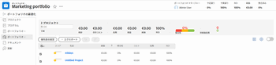

# を [!UICONTROL Portfolio最適化]

次の [!UICONTROL Portfolio最適化] ポートフォリオにアクセスするとき。

## アクセス要件

この記事の手順を実行するには、次のアクセス権が必要です。

<table style="table-layout:auto"> 
 <col> 
 <col> 
 <tbody> 
  <tr> 
   <td role="rowheader">[!DNL Adobe Workfront] 計画*</td> 
   <td> 
[!UICONTROL Business] 以降
 </td> 
  </tr> 
  <tr> 
   <td role="rowheader">[!DNL Adobe Workfront] ライセンス*</td> 
   <td> 
[!UICONTROL プラン ] 
 </td> 
  </tr> 
  <tr> 
   <td role="rowheader">アクセスレベル設定*</td> 
   <td> 
[!UICONTROLPortfolioおよびプロジェクトへの編集 ] アクセス
 
<b>メモ</b>

まだアクセス権がない場合は、 [!DNL Workfront] 管理者（アクセスレベルに追加の制限を設定している場合） を参照してください。 [!DNL Workfront] 管理者はアクセスレベルを変更できます。詳しくは、 <a href="../../../administration-and-setup/add-users/configure-and-grant-access/create-modify-access-levels.md" class="MCXref xref">カスタムアクセスレベルの作成または変更</a>.
 </td>
</tr> 
  <tr> 
   <td role="rowheader">オブジェクト権限</td> 
   <td> 
ポートフォリオに対する [!UICONTROL 管理 ] 権限
 
追加のアクセス権のリクエストについて詳しくは、 <a href="../../../workfront-basics/grant-and-request-access-to-objects/request-access.md" class="MCXref xref">オブジェクトへのアクセスのリクエスト </a>.
 </td> 
  </tr> 
 </tbody> 
</table>

&#42;ご利用のプラン、ライセンスの種類、アクセス権を確認するには、 [!DNL Workfront] 管理者。

## を [!UICONTROL Portfolio最適化]

1. 次の **[!UICONTROL メインメニュー]**&#x200B;をクリックし、 **[!UICONTROL Portfolio]**.

   デフォルトでは、自分が所有するポートフォリオが表示されます。

1. （オプション） **[!UICONTROL フィルター]** 別のポートフォリオのセットを表示するには、ドロップダウンメニューの「 」を選択します。
1. ポートフォリオの名前をクリックしてアクセスします。
1. クリック **[!UICONTROL Portfolioの最適化]** をクリックします。

   この [!UICONTROL Portfolio最適化] が表示されます。

   
