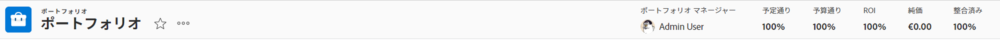
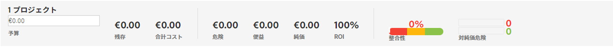
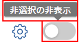
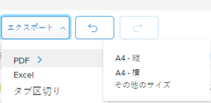

# [!UICONTROL Portfolio最適化] 概要

この [!UICONTROL Portfolio最適化] は、プロジェクトの評価と比較に使用されるツールです。 レビューと比較のプロセス [!UICONTROL ビジネス事例] ポートフォリオに割り当てられたプロジェクトの値は、ポートフォリオマネージャがプロジェクトに優先順位を付け、組織に最も多くの価値を生み出す方法です。

の目的 [!UICONTROL ポートフォリオ管理] は、ポートフォリオマネージャ、運営委員会、または製品管理オフィスが、各プロジェクトのビジネス事例に関する概要情報を表示できるインターフェイスを提供する。 その後、プロジェクトは、戦略的な値や目標に従って、または全体的なスコアに従って優先順位付けできます。

この [!UICONTROL Portfolio最適化] は、次の前提条件を満たしている場合にのみ、サポートを提供します。

* この [!UICONTROL ビジネス事例] プロジェクトが完了しました。 詳しくは、「 」セクションの記事を参照してください。 [ビジネスケースの定義](../../projects/define-a-business-case/define-business-case.md).
* ポートフォリオは、レビューするプロジェクトの「プロジェクトの詳細」セクションの「プロジェクトの概要」領域で定義します
* レビューするプロジェクトに対して、「プロジェクト予算」と「計画特典」が指定されています。 「固定コスト」と「固定売上高」はオプションですが、値を追加します。 詳しくは、 [プロジェクトの財務分野](../../projects/project-finances/project-finances-overview-1.md).

の検索方法 [!UICONTROL Portfolio最適化]を参照してください。 [を [!UICONTROL Portfolio最適化]](../../../manage-work/portfolios/portfolio-optimizer/locate-portfolio-optimizer.md).

## 財務 [!UICONTROL Portfolio最適化]

* [の財務分野 [!UICONTROL Portfolio最適化]](#the-financial-areas-in-the-portfolio-optimizer)
* [の財務分野 [!UICONTROL Portfolio最適化]](#the-financial-fields-in-the-portfolio-optimizer)

ポートフォリオの財務状態は、 [!UICONTROL Portfolio最適化].

財政を取り扱う際には、次の点を考慮してください。 [!UICONTROL Portfolio最適化]:

* プロジェクトには、 [!UICONTROL ビジネス事例] は、 [!UICONTROL Portfolio最適化]. 例えば、低コストや高いアライメントプロジェクトの場合、高いスコアが割り当てられます。

   プロジェクトのポートフォリオ管理者スコアの計算の詳細については、「 [の概要 [!UICONTROL Portfolio最適化] スコア](../../../manage-work/portfolios/portfolio-optimizer/portfolio-optimizer-score.md).

* の財務計算 [!UICONTROL Portfolio最適化] を使用します。 [!UICONTROL 予算コスト] 内 [!UICONTROL ビジネス事例] プロジェクトの
* 手動で [!UICONTROL Portfolio最適化]では、それらに関するすべての情報を考慮に入れます。 これには、財務データ、スコアカードとの整合、ROI などが含まれます。

### の財務分野 [!UICONTROL Portfolio最適化] {#the-financial-areas-in-the-portfolio-optimizer}

財務情報は、 [!UICONTROL Portfolio最適化]:

* **[!UICONTROL Portfolioヘッダー]**:この領域には、ポートフォリオ内のすべてのプロジェクトから収集された財務情報が表示されます。 これは、Portfolioオブジェクトの各タブに表示されます。
* **[!UICONTROL 選択したプロジェクトのPortfolio財政]**:この領域には、 [!UICONTROL Portfolio最適化]. この領域の情報を表示することで、プロジェクトを追加または削除し、ポートフォリオの財政に与える影響を理解できます。
* **[!UICONTROL プロジェクト財務]**:この領域には、 [!UICONTROL Portfolio最適化].

### の財務分野 [!UICONTROL Portfolio最適化] {#the-financial-fields-in-the-portfolio-optimizer}

次の財務フィールドが [!UICONTROL Portfolio最適化]:

* [Portfolioヘッダー](#portfolio-header)
* [選択したプロジェクトのPortfolio財政](#portfolio-finances-for-selected-projects)

#### Portfolioヘッダー {#portfolio-header}

[!DNL Adobe Workfront] ポートフォリオヘッダーの財務フィールドを、次の条件にのみ一致するステータスのプロジェクトからの情報を使用して計算します [!UICONTROL 承認済み] または [!UICONTROL 現在].

<table style="table-layout:auto"> 
 <col> 
 <col> 
 <thead> 
  <tr> 
   <th><strong>フィールド名</strong> </th> 
   <th><strong>説明</strong> </th> 
  </tr> 
 </thead> 
 <tbody> 
  <tr> 
   <td>[!UICONTROL オンタイム ]</td> 
   <td> 
ポートフォリオ内で [!UICONTROL オンタイム ] と見なされるプロジェクトの割合。 これは、Portfolio内の任意のタブから表示されます。
 
プロジェクトは、 <strong>[!UICONTROL 条件 ]</strong> が <strong>[!UICONTROL On Target]</strong>.  [!UICONTROL Project Conditions] の詳細については、 <a href="../../../manage-work/projects/manage-projects/project-condition-and-condition-type.md" class="MCXref xref">プロジェクト条件と条件タイプの概要</a>.
 
この <strong>[!UICONTROL オンタイム ]</strong> 割合は次の数式を使用して計算されます。
 
<em>[!UICONTROLPortfolio時の割合 ] = [!UICONTROL オンタイム ] プロジェクトの数/ [!UICONTROL 現在 ] または [!UICONTROL 承認済み ] ステータスのプロジェクトの合計数</em> 
 </td> 
  </tr> 
  <tr> 
   <td>[!UICONTROL 予算 ]</td> 
   <td> 
ポートフォリオ内で [!UICONTROL 予算対象 ] と見なされるプロジェクトの割合。 これは、[!UICONTROLPortfolio] 内の任意のタブから表示されます。
 
プロジェクトは <strong>[!UICONTROL 予算 ]</strong> 事前に定義された予算を超えていない場合に発生します。  プロジェクトの予算の詳細については、「 <a href="../../../manage-work/projects/project-finances/manage-project-finance-area.md" class="MCXref xref">[!UICONTROL 管理 ] プロジェクトの財務領域の情報</a>.
 
[!UICONTROL 予算に対する ] 割合は、次の式を使用して計算されます。
 
<em>[!UICONTROL 予算Portfolio率 ] = [!UICONTROL 予算で ] プロジェクトの数/プロジェクトの合計数 </em><em>（[!UICONTROL Current] または [!UICONTROL Approved] ステータス）</em> 
 </td> 
  </tr> 
  <tr> 
   <td>ROI （ポートフォリオ用）</td> 
   <td> 
ポートフォリオの [!UICONTROL 投資利益率 ] (ROI) は、[!UICONTROLPortfolio] の合計 [!UICONTROL 利益 ] とプロジェクトの [!UICONTROL 予算コスト ] の合計を考慮して計算されます。 これは、Portfolio内の任意のタブから表示されます。
 
Portfolioの ROI の値は、次の式を使用して計算されます。
 
<em>PortfolioROI = ([!UICONTROL Total Benefit] - [!UICONTROL Total Budgeted Cost])/ [!UICONTROL Total Cost] * 100</em> 
 
プロジェクトの ROI の計算方法について詳しくは、 <a href="../../../manage-work/projects/project-finances/calculate-roi.md" class="MCXref xref">投資利益率 (ROI) の計算</a> .
 </td> 
  </tr> 
  <tr> 
   <td>[!UICONTROL 整列 ] または [!UICONTROL 整列スコア ] </td> 
   <td> 
プロジェクトの [!UICONTROL ビジネスケース ] で [!UICONTROL スコアカード ] を完了した後に計算されるすべての [!UICONTROL プロジェクト整列スコア ] 値の平均。 各プロジェクトの配置スコアは、[!UICONTROL Alignment Optimizer] の [!UICONTROL Alignment] 列に表示されます。 これは、ポートフォリオ内の任意のタブに表示されます。
 
プロジェクトの線形スコアの生成の詳細については、「 <a href="../../../manage-work/projects/define-a-business-case/apply-scorecard-to-project-to-generate-alignment-score.md" class="MCXref xref">プロジェクトにスコアカードを適用し、線形スコアを生成する</a>.
 </td> 
  </tr> 
  <tr> 
   <td>[!UICONTROL 正味値 ]</td> 
   <td> 
ポートフォリオ内のすべてのプロジェクトのすべての [!UICONTROL ネット値 ] の合計。 これは、ポートフォリオ内の任意のタブに表示されます。
 
プロジェクトでの [!UICONTROL 正味値 ] の計算方法について詳しくは、この記事を参照してください <a href="../../../manage-work/projects/project-finances/calculate-net-value.md" class="MCXref xref">正味値を計算</a>.
 </td> 
  </tr> 
 </tbody> 
</table>

#### 選択したプロジェクトのPortfolio財政 {#portfolio-finances-for-selected-projects}

<table style="table-layout:auto"> 
 <col> 
 <col> 
 <thead> 
  <tr> 
   <th><strong>フィールド名</strong> </th> 
   <th> 
<strong>説明</strong> 
 
 
 </th> 
  </tr> 
 </thead> 
 <tbody> 
  <tr> 
   <td>[!UICONTROL プロジェクト数 ]</td> 
   <td> 
ポートフォリオ内のアクティブなプロジェクトの合計数です。 ポートフォリオ内でアクティブと見なされるプロジェクトは、次のいずれかのステータスになります。
 
    <ul> 
     <li>[!UICONTROL Current]</li> 
     <li>[!UICONTROL Planning]</li> 
     <li>[!UICONTROL 承認済み ]</li> 
    </ul> </td> 
  </tr> 
  <tr> 
   <td>[!UICONTROL 予算 ]</td> 
   <td>このフィールドを手動で更新して、ポートフォリオ全体の合計予算を指定できます。 この予算は、ポートフォリオ内のすべてのプロジェクトで使用されます。 </td> 
  </tr> 
  <tr> 
   <td>[!UICONTROL 残り ]</td> 
   <td> 
ポートフォリオ内のすべてのプロジェクトに対する [!UICONTROL 予算コスト ] の残りの予算が、ポートフォリオの予算から差し引かれます。
 
[!UICONTROL 残りのPortfolio予算 ] は、次の式を使用して計算されます。
 
<em>[!UICONTROL 残りのPortfolio予算 ] = [!UICONTROL 合計Portfolio予算 ] — すべてのPortfolioプロジェクトの合計 [!UICONTROL 予算コスト ]</em> 
 
ポートフォリオ内のすべてのプロジェクトの全体的な [!UICONTROL 予算コスト ] は、「予算」フィールドの下のインジケーターバーに表示されます。 
 
プロジェクトのコストの追跡の詳細については、「<a href="../../../manage-work/projects/project-finances/track-costs.md" class="MCXref xref">コストの追跡</a>.
 </td> 
  </tr> 
  <tr> 
   <td>[!UICONTROL 総コスト ]</td> 
   <td> 
[!UICONTROL Optimizer] に表示されるすべてのプロジェクトのコストの合計。 各プロジェクトのコストは、[!UICONTROL ビジネスケースサマリー ] に表示されるプロジェクトの [!UICONTROL 予算コスト ] と同じです。 
 
[!UICONTROL ビジネスケース ] のプロジェクトの財務分野の詳細については、この記事の「ビジネスケースの財務分野について」の節を参照してください <a href="../../../manage-work/projects/define-a-business-case/create-business-case.md" class="MCXref xref">プロジェクトのビジネスケースの作成 </a>.
 </td> 
  </tr> 
  <tr> 
   <td>[!UICONTROL リスク ] </td> 
   <td> 
ポートフォリオ内のすべてのプロジェクトの [!UICONTROL 潜在的なリスクコスト ] の合計。 各プロジェクトの [!UICONTROL 潜在的なリスクコスト ] は、[!UICONTROLPortfolioオプティマイザー ] の [!UICONTROL リスク ] 列に一覧表示されます。 
 
プロジェクトのリスクを計算する方法の詳細については、「 <a href="../../../manage-work/projects/project-finances/potential-risk-cost.md" class="MCXref xref">潜在的なリスクコストの計算 </a>.
 </td> 
  </tr> 
  <tr> 
   <td>[!UICONTROL Benefit]</td> 
   <td> 
ポートフォリオ内のすべてのプロジェクトの [!UICONTROL Planned Benefit] 値の合計。 各プロジェクトの「計画特典」の値は、[!UICONTROL Planned Benefityr] の [!UICONTROL Benefit] 列に一覧表示されます。 
 
プロジェクトの [!UICONTROL 計画的メリット ] の詳細については、この記事を参照してください <a href="../../../manage-work/projects/project-finances/project-planned-benefit.md" class="MCXref xref">プロジェクト計画福利厚生の概要</a>.
 </td> 
  </tr> 
  <tr> 
   <td>[!UICONTROL 純価値へのリスク ] 指標</td> 
   <td> 
ポートフォリオ内のすべてのプロジェクトで提供される [!UICONTROL 正味値 ] を考慮して、[!UICONTROL 潜在的なリスク ] 値を測定します。 ポートフォリオ内で最も効率を高めるには、[!UICONTROL リスク ] 指標が低く、[!UICONTROL 純値 ] 指標が高いことを確認します。 
 
[!UICONTROL 純価値 ] へのリスク計算の詳細については、「 <a href="../../../manage-work/portfolios/portfolio-optimizer/calculate-risk-to-net-value-in-portfolio.md" class="MCXref xref">ポートフォリオ内の純価値に対するリスクを計算</a>.
 </td> 
  </tr> 
 </tbody> 
</table>

## のカスタマイズ [!UICONTROL Portfolio最適化]

カスタマイズできるのは、 [!UICONTROL Portfolio最適化] リスト内の情報を変更するために設定を使用します。

以下のアイコンとオプションを、 [!UICONTROL Portfolio最適化]:

<table style="table-layout:auto"> 
 <col> 
 <col> 
 <col> 
 <tbody> 
  <tr> 
   <td>Icon Optimizer 内のアイコン</td> 
   <td>名前</td> 
   <td>関数</td> 
  </tr> 
  <tr> 
   <td>  </td> 
   <td>[!UICONTROL プロジェクトの優先度を設定 ]</td> 
   <td>優先度に基づいてプロジェクトの順序を保存する場合は、このアイコンを使用します。 </td> 
  </tr> 
  <tr> 
   <td>  </td> 
   <td>[!UICONTROL ポートフォリオを最適化 ]</td> 
   <td>このアイコンを使用して、プロジェクトの次の財務値に基づいてポートフォリオを最適化します。
    <ul>
     <li>[!UICONTROL コスト ]</li>
     <li>[!UICONTROL 整列 ]</li>
     <li>[!UICONTROL 値 ]</li>
     <li>[!UICONTROL メリットのリスク ]</li>
     <li>[!UICONTROL ROI]</li>
    </ul>
ポートフォリオの最適化について詳しくは、 <a href="../../../manage-work/portfolios/portfolio-optimizer/optimize-projects-in-portfolio-optimizer.md" class="MCXref xref">[!UICONTROL Optimizer] でのプロジェクトの最適化 </a>.
</td> 
  </tr> 
  <tr> 
   <td>  </td> 
   <td>[!UICONTROL 取り消し ]/ [!UICONTROL やり直し ] アイコン</td> 
   <td>保存する前に [!UICONTROL Adobe Manager] に加えた変更をキャンセルまたはやり直すには、これらのPortfolioを使用します。</td> 
  </tr> 
  <tr> 
   <td>  </td> 
   <td>[!UICONTROL Show]/ [!UICONTROL Hide unched] プロジェクト</td> 
   <td>これらのアイコンを使用して、チェックを外したポートフォリオ内のプロジェクトを表示または非表示にします。</td> 
  </tr> 
  <tr> 
   <td>  </td> 
   <td>[!UICONTROL 書き出し ] </td> 
   <td> 
このアイコンを使用して、[!UICONTROL Project Optimizer] の [!UICONTROL プロジェクトの優先順位付け ] 領域にデータを書き出します。 次の形式に書き出すことができます。
 
    <ul> 
     <li>PDF</li> 
     <li>[!DNL Excel]</li> 
     <li>[!UICONTROL タブ ] 区切り</li> 
    </ul> </td> 
  </tr> 
  <tr> 
   <td>  </td> 
   <td>[!UICONTROL 環境設定 ]</td> 
   <td> 
このアイコンを使用して、[!UICONTROL Optimizer] の列に表示されるプロジェクトフィールドを変更したり、[!UICONTROL Optimizer] に表示されるプロジェクトをそのステータスに基づいて変更したりします。 
 
ヒント：  
     <ul> 
      <li> 
すべてではない [!DNL Workfront] 標準フィールドを列に追加できます。 
 </li> 
     </ul> 
     <ul> 
      <li> 
ポートフォリオ内のプロジェクトのいずれかに、ゼロ以外の値を持つカスタムフィールドのみを追加できます。
 </li> 
     </ul> 
 </td> 
  </tr> 
 </tbody> 
</table>
