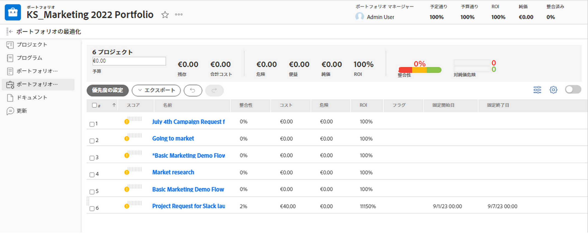

# [!UICONTROL ポートフォリオオプティマイザー]の概要

<!-- Audited: 01/2024 -->

[!UICONTROL ポートフォリオオプティマイザー]は、プロジェクトの評価と比較に使用されるツールです。ポートフォリオに割り当てられたプロジェクトの[!UICONTROL ビジネスケース]の価値のレビューと比較のプロセスは、ポートフォリオマネージャーがプロジェクトに優先順位を付け、組織に最も多くの価値を生み出すことができる方法です。

[!UICONTROL ポートフォリオオプティマイザー]の目的は、ポートフォリオマネージャー、運営委員会または製品管理オフィスが、各プロジェクトのビジネスケースに関する概要情報を表示できるインターフェイスを提供することです。その後、プロジェクトを戦略的な価値観や目標または全体的なスコアに従って優先順位付けできます。

[!UICONTROL ポートフォリオオプティマイザー]は、次の前提条件を満たしている場合にのみ役立ちます。

* プロジェクトの[!UICONTROL ビジネスケース]が完了している。詳しくは、 [ビジネスケースの定義：記事インデックス](../../projects/define-a-business-case/define-business-case.md).
* ポートフォリオは、レビューするプロジェクトの「プロジェクトの詳細」セクションの「プロジェクトの概要」領域で定義します。
* レビューするプロジェクトに対して、プロジェクト予算と予定利益が指定されている。固定コストおよび固定収益はオプションですが、価値を追加します。詳しくは、[プロジェクトの財務情報フィールド](../../projects/project-finances/project-finances-overview-1.md)を参照してください。

[!UICONTROL ポートフォリオオプティマイザー]の場所について詳しくは、[[!UICONTROL ポートフォリオオプティマイザー]](../../../manage-work/portfolios/portfolio-optimizer/locate-portfolio-optimizer.md)を参照してください。

## [!UICONTROL ポートフォリオオプティマイザー]の財務情報

ポートフォリオの財務状態は、[!UICONTROL ポートフォリオオプティマイザー]を使用する場合、プロジェクトの期間中いつでも表示できます。

[!UICONTROL ポートフォリオオプティマイザー]で財務情報を取り扱う際には、次の点を考慮してください。

* プロジェクトは、[!UICONTROL ビジネスケース]が完了すると、[!UICONTROL ポートフォリオオプティマイザー]でどの条件に一致するかに応じてスコアで評価されます。例えば、低コストまたは整合性の高いプロジェクトの場合は、高いスコアがつけられます。

  プロジェクトのポートフォリオ管理者スコアの計算について詳しくは、 [の概要 [!UICONTROL Portfolioの最適化] スコア](../../../manage-work/portfolios/portfolio-optimizer/portfolio-optimizer-score.md).

* [!UICONTROL ポートフォリオオプティマイザー]の財務計算では、プロジェクトの[!UICONTROL ビジネスケース]の[!UICONTROL 予算計上コスト]が使用されます。
* [!UICONTROL ポートフォリオオプティマイザー]では、それらに関するすべての情報を考慮して、プロジェクトを手動で優先付けることができます。これには、財務データ、スコアカードとの整合、ROI などが含まれます。

### [!UICONTROL ポートフォリオオプティマイザー]の財務情報エリア {#the-financial-areas-in-the-portfolio-optimizer}

財務情報は、[!UICONTROL ポートフォリオオプティマイザー]の次のエリアに表示できます。

* **[!UICONTROL ポートフォリオヘッダー]**：このエリアには、ポートフォリオ内のすべてのプロジェクトから収集された財務情報が表示されます。これは、ポートフォリオオブジェクトの各タブに表示されます。
* **[!UICONTROL 選択したプロジェクトのPortfolio財務]**：この領域には、 [!UICONTROL Portfolioの最適化]. このエリアの情報を表示することで、プロジェクトを追加または削除し、ポートフォリオの財務に与える影響を理解できます。
* **[!UICONTROL プロジェクト財務]**：このエリアには、[!UICONTROL ポートフォリオオプティマイザー]に一覧表示される各プロジェクトの財務情報が表示されます。

### [!UICONTROL ポートフォリオオプティマイザー]の財務情報フィールド {#the-financial-fields-in-the-portfolio-optimizer}

次の財務情報フィールドが[!UICONTROL ポートフォリオオプティマイザー]に表示されます。

* [ポートフォリオヘッダー](#portfolio-header)
* [選択したプロジェクトのポートフォリオ財務情報](#portfolio-finances-for-selected-projects)

#### ポートフォリオヘッダー {#portfolio-header}

[!DNL Adobe Workfront] は、ポートフォリオヘッダーの財務情報フィールドを、[!UICONTROL 承認済み]または[!UICONTROL 現在]のステータスのプロジェクトからの情報を使用して計算します。

<table style="table-layout:auto"> 
 <col> 
 <col> 
 <thead> 
  <tr> 
   <th><strong>フィールド名</strong> </th> 
   <th><strong>説明</strong> </th> 
  </tr> 
 </thead> 
 <tbody> 
  <tr> 
   <td>[!UICONTROL On Time]</td> 
   <td> 
ポートフォリオ内で [!UICONTROL オンタイム ] と見なされるプロジェクトの割合。 これは、ポートフォリオのどのタブからも確認できます。
 
プロジェクトは、プロジェクト <strong>[!UICONTROL Condition]</strong> が <strong>[!UICONTROL On Target]</strong> である場合に [!UICONTROL On Time] とみなされます。 [!UICONTROL Project Conditions] について詳しくは、<a href="../../../manage-work/projects/manage-projects/project-condition-and-condition-type.md" class="MCXref xref">プロジェクト状況と状況タイプの概要</a>の記事を参照してください。
 
The <strong>[!UICONTROL オンタイム ]</strong> 割合は次の式を使用して計算されます。
 
<em>[!UICONTROL On Time Portfolio Percentage] = [!UICONTROL On Time] プロジェクトの数 ÷ [!UICONTROL Current] ステータスまたは [!UICONTROL Approved] ステータスのプロジェクトの合計数</em> 
 </td> 
  </tr> 
  <tr> 
   <td>[!UICONTROL On Budget]</td> 
   <td> 
ポートフォリオ内で [!UICONTROL 予算対象 ] と見なされるプロジェクトの割合。 これは、[!UICONTROL ポートフォリオ ] 内の任意のタブに表示されます。
 
事前定義された予算を超えていないプロジェクトは、「<strong>[!UICONTROL On Budget]</strong>」となります。 プロジェクトの予算について詳しくは、<a href="../../../manage-work/projects/project-finances/manage-project-finance-area.md" class="MCXref xref">プロジェクトの財務領域の [!UICONTROL Manage] 情報</a>の記事を参照してください。
 
[!UICONTROL 予算に対する ] 割合は、次の式を使用して計算されます。
 
<em>[!UICONTROL On Budget Portfolio Percentage] = [!UICONTROL On Budget] プロジェクト数／<em>[!UICONTROL Current] または [!UICONTROL Approved] ステータスでの</em>プロジェクトの合計数</em> 
 </td> 
  </tr> 
  <tr> 
   <td>ROI（ポートフォリオ用）</td> 
   <td> 
ポートフォリオの [!UICONTROL Return on Investment] (ROI) は、[!UICONTROL Portfolio] の合計 [!UICONTROL Benefit] とプロジェクトの [!UICONTROL Budgeted Costs] の合計を考慮して計算されます。これは、ポートフォリオのどのタブからも確認できます。
 
Portfolioの ROI の値は、次の式を使用して計算されます。
 
<em>Portfolio ROI = ([!UICONTROL Total Benefit] - [!UICONTROL Total Budgeted Cost]) / [!UICONTROL Total Cost] * 100</em> 
 
プロジェクトの ROI の計算方法について詳しくは、 <a href="../../../manage-work/projects/project-finances/calculate-roi.md" class="MCXref xref">投資利益率 (ROI) の計算</a>.
 </td> 
  </tr> 
  <tr> 
   <td>[!UICONTROL Aligned] または [!UICONTROL Alignment Score] </td> 
   <td> 
すべての [!UICONTROL Project Alignment Score] 値の平均。プロジェクトの [!UICONTROL ビジネスケース ] で [!UICONTROL Scorecard] を完了した後に計算されます。 各プロジェクトの配置スコアは、[!UICONTROL Portfolio Optimizer] の [!UICONTROL Alignment] 列に表示されます。これは、ポートフォリオのどのタブからも確認できます。
 
プロジェクトで線形スコアを生成する方法について詳しくは、<a href="../../../manage-work/projects/define-a-business-case/apply-scorecard-to-project-to-generate-alignment-score.md" class="MCXref xref">プロジェクトにスコアカードを適用し、線形スコアを生成</a>の記事を参照してください。
 </td> 
  </tr> 
  <tr> 
   <td>[!UICONTROL Net Value]</td> 
   <td> 
ポートフォリオ内のすべてのプロジェクトのすべての [!UICONTROL Net Values] の合計。これは、ポートフォリオのどのタブからも確認できます。
 
プロジェクトでの [!UICONTROL Net Value] の計算方法について詳しくは、<a href="../../../manage-work/projects/project-finances/calculate-net-value.md" class="MCXref xref">正味価値を計算</a>の記事を参照してください。
 </td> 
  </tr> 
 </tbody> 
</table>

#### 選択したプロジェクトのポートフォリオ財務情報 {#portfolio-finances-for-selected-projects}

<table style="table-layout:auto"> 
 <col> 
 <col> 
 <thead> 
  <tr> 
   <th><strong>フィールド名</strong> </th> 
   <th><strong>説明</strong></th> 
  </tr> 
 </thead> 
 <tbody> 
  <tr> 
   <td>[!UICONTROL Number of projects]</td> 
   <td> 
ポートフォリオ内のアクティブなプロジェクトの合計数。ポートフォリオ内でアクティブと見なされるプロジェクトは、次のいずれかのステータスになります。
 
    <ul> 
     <li>[!UICONTROL Current]</li> 
     <li>[!UICONTROL Planning]</li> 
     <li>[!UICONTROL Approved]</li> 
    </ul> </td> 
  </tr> 
  <tr> 
   <td>[!UICONTROL Budget]</td> 
   <td>このフィールドを手動で更新して、ポートフォリオ全体の合計予算を指定できます。この予算は、ポートフォリオ内のすべてのプロジェクトで使用されます。 </td> 
  </tr> 
  <tr> 
   <td>[!UICONTROL Remaining]</td> 
   <td> 
ポートフォリオ内のすべてのプロジェクトに対するすべての [!UICONTROL Budgeted Costs] は、ポートフォリオの予算から差し引かれました。
 
[!UICONTROL Remaining Portfolio Budget] は、次の式を使用して計算されます。
 
<em>[!UICONTROL Remaining Portfolio Budget] = [!UICONTROL Total Portfolio Budget] - すべてのポートフォリオプロジェクトの合計 [!UICONTROL Budgeted Cost]</em> 
 
ポートフォリオ内のすべてのプロジェクトの全体的な [!UICONTROL Budgeted Cost] は、予算フィールドの下のインジケーターバーに表示されます。 
 
プロジェクトのコストの追跡の詳細については、 <a href="../../../manage-work/projects/project-finances/track-costs.md" class="MCXref xref">コストの追跡</a>.
 </td> 
  </tr> 
  <tr> 
   <td>[!UICONTROL Total Cost]</td> 
   <td> 
[!UICONTROL Portfolio Optimizer] に表示されるすべてのプロジェクトのコストの合計。各プロジェクトのコストは、[!UICONTROL Business Case Summary] に表示されるプロジェクトの [!UICONTROL Budgeted Cost] と同じです。 
 
[!UICONTROL ビジネスケース ] のプロジェクトの財務分野の詳細については、この記事の「ビジネスケースの財務分野について」の節を参照してください <a href="../../../manage-work/projects/define-a-business-case/create-business-case.md" class="MCXref xref">プロジェクトのビジネスケースの作成</a>.
 </td> 
  </tr> 
  <tr> 
   <td>[!UICONTROL Risk] </td> 
   <td> 
ポートフォリオ内のすべてのプロジェクトのすべての [!UICONTROL Potential Risk Costs] の合計。各プロジェクトの [!UICONTROL Potential Risk Cost] は、[!UICONTROL Portfolio Optimizer] の [!UICONTROL Risk] 列に表示されます。 
 
プロジェクトのリスクを計算する方法の詳細については、「 <a href="../../../manage-work/projects/project-finances/potential-risk-cost.md" class="MCXref xref">潜在的なリスクコストの計算</a>.
 </td> 
  </tr> 
  <tr> 
   <td>[!UICONTROL Benefit]</td> 
   <td> 
ポートフォリオ内のすべてのプロジェクトのすべての [!UICONTROL Planned Benefit] 値の合計。各プロジェクトの予定利益の値は、[!UICONTROL Portfolio Optimizer] の [!UICONTROL Benefit] 列に一覧表示されます。 
 
プロジェクトの [!UICONTROL Planned Benefit] について詳しくは、<a href="../../../manage-work/projects/project-finances/project-planned-benefit.md" class="MCXref xref">プロジェクト予定利益の概要</a>の記事を参照してください。
 </td> 
  </tr> 
  <tr> 
   <td>[!UICONTROL Risk to Net Value] 指標</td> 
   <td> 
ポートフォリオ内のすべてのプロジェクトで提供される [!UICONTROL 正味値 ] を考慮して、[!UICONTROL 潜在的なリスク ] の値を測定します。 ポートフォリオで最も効率を高めるには、[!UICONTROL Risk] 指標が低く、[!UICONTROL Net Value] 指標が高いことを確認します。 
 
[!UICONTROL Net Value] に対するリスク計算について詳しくは、「<a href="../../../manage-work/portfolios/portfolio-optimizer/calculate-risk-to-net-value-in-portfolio.md" class="MCXref xref">ポートフォリオの純価に対するリスクを計算する</a>の記事を参照してください。
 </td> 
  </tr> 
 </tbody> 
</table>

## [!UICONTROL ポートフォリオオプティマイザー]のカスタマイズ

設定を使用してリストの情報を変更することで、[!UICONTROL ポートフォリオオプティマイザー]のプロジェクトのリストエリアのみをカスタマイズできます。

[!UICONTROL ポートフォリオオプティマイザー]では、次のアイコンとオプションを利用できます。

<table style="table-layout:auto"> 
 <col> 
 <col> 
 <col> 
 <tbody> 
  <tr> 
   <td><strong>ポートフォリオオプティマイザーのアイコン</strong></td> 
   <td><strong>名前</strong></td> 
   <td><strong>関数</strong></td> 
  </tr> 
  <tr> 
   <td>  </td> 
   <td>[!UICONTROL Set project priority]</td> 
   <td>優先度に基づいてプロジェクトの順序を保存する場合は、このアイコンを使用します。 </td> 
  </tr> 
  <tr> 
   <td>  </td> 
   <td>[!UICONTROL Optimize portfolio]</td> 
   <td>このアイコンを使用して、プロジェクトの次の財務価値に基づいてポートフォリオを最適化します。
    <ul>
     <li>[!UICONTROL Cost]</li>
     <li>[!UICONTROL Alignment]</li>
     <li>[!UICONTROL Value]</li>
     <li>[!UICONTROL Risk to Benefit]</li>
     <li>[!UICONTROL ROI]</li>
    </ul>
ポートフォリオの最適化について詳しくは、 <a href="../../../manage-work/portfolios/portfolio-optimizer/optimize-projects-in-portfolio-optimizer.md" class="MCXref xref">[!UICONTROL Optimizer] でのプロジェクトの最適化</a>.
</td> 
  </tr> 
  <tr> 
   <td>  </td> 
   <td>[!UICONTROL Undo] アイコン／[!UICONTROL Redo] アイコン</td> 
   <td>保存する前に [!UICONTROL Portfolio Optimizer] に加えた変更をキャンセルまたはやり直すには、これらのアイコンを使用します。</td> 
  </tr> 
  <tr> 
   <td>  </td> 
   <td>[!UICONTROL Show]/[!UICONTROL Hide] チェックがオフのプロジェクト</td> 
   <td>これらのアイコンを使用して、チェックを外したポートフォリオのプロジェクトを表示または非表示にします。</td> 
  </tr> 
  <tr> 
   <td>  </td> 
   <td>[!UICONTROL Export] </td> 
   <td> 
このアイコンを使用して、[!UICONTROL Portfolio Optimizer] の [!UICONTROL Project Prioritization] エリアにデータを書き出します。次の形式に書き出すことができます。
 
    <ul> 
     <li>PDF</li> 
     <li>[!DNL Excel]</li> 
     <li>[!UICONTROL Tab] 区切り</li> 
    </ul> </td> 
  </tr> 
  <tr> 
   <td>  </td> 
   <td>[!UICONTROL Preferences]</td> 
   <td> 
このアイコンを使用して、[!UICONTROL Portfolio Optimizer] の列に表示されるプロジェクトフィールドを変更したり、[!UICONTROL Optimizer] に表示されるプロジェクトをそのステータスに基づいて変更したりします。 
 
ヒント：  
     <ul> 
      <li> 
すべての [!DNL Workfront] 標準フィールドを列に追加できるわけではありません。 
 </li> 
     </ul> 
     <ul> 
      <li> 
ポートフォリオ内のプロジェクトのいずれかに、ゼロ以外の値を持つカスタムフィールドのみを追加できます。
 </li> 
     </ul> 
 </td> 
  </tr> 
 </tbody> 
</table>
