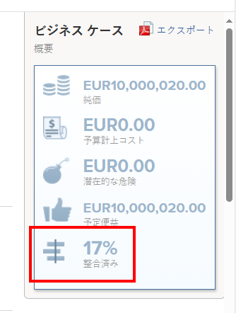
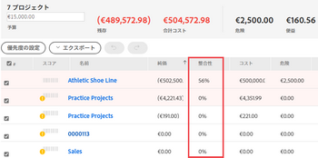
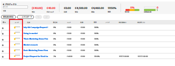
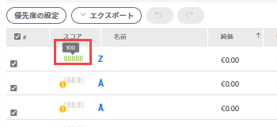
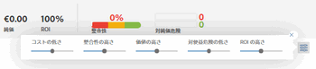

# の概要 [!UICONTROL Portfolio最適化] スコア

次の [!UICONTROL Portfolio最適化] 得点 [!UICONTROL Portfolio最適化]. これは、 **[!UICONTROL スコア]** 各プロジェクトの列。 これは、ポートフォリオ内のすべてのプロジェクトのスコアを表します。

の検索方法 [!UICONTROL Portfolio最適化]（記事を参照） [[!UICONTROL Portfolio最適化] 概要](../../../manage-work/portfolios/portfolio-optimizer/portfolio-optimizer-overview.md).

詳しくは、 [!DNL Adobe Workfront] は、プロジェクトのスコアや他のプロジェクト情報を使用して、 [!UICONTROL Portfolio最適化]を参照してください。 [Optimizer でのプロジェクトのPortfolio](../../../manage-work/portfolios/portfolio-optimizer/optimize-projects-in-portfolio-optimizer.md).

## 次の項目間の違い [!UICONTROL 線形スコア] そして [!UICONTROL Portfolioオプティマイザースコア]

プロジェクトの線形スコアとポートフォリオ最適化スコアには違いがあります。

プロジェクトの線形スコアは、スコアカードの完了後に取得したポイントに基づいて計算されます。 このスコアは、ポートフォリオ配置スコアの決定に使用されます。 線形のスコアは、割合で表示されます。\
プロジェクトの線形スコアは、 **[!UICONTROL 整列]** 列 [!UICONTROL Portfolio最適化] または [!UICONTROL 整列] フィールド [!UICONTROL ビジネス事例の概要].





プロジェクトの線形スコアの生成の詳細については、「 [プロジェクトにスコアカードを適用し、線形スコアを生成する](../../../manage-work/projects/define-a-business-case/apply-scorecard-to-project-to-generate-alignment-score.md).

この [!UICONTROL ポートフォリオ管理] スコアは、 [!UICONTROL Portfolio最適化] どのプロジェクトを優先順位付けできるか。 ポートフォリオ・オプティマイザ・スコアは、数字と共にインジケータ・アイコンとして表示され、 **[!UICONTROL スコア]** 列 [!UICONTROL Portfolio最適化].

>[!NOTE]
>
>プロジェクトは [!UICONTROL Portfolio最適化] ビジネスケースが完了した場合にのみ。 ビジネスケースの完了について詳しくは、 [[!UICONTROL ビジネスケースの作成] プロジェクトの](../../../manage-work/projects/define-a-business-case/create-business-case.md).



各プロジェクトのスコアは、次のカテゴリの重要度に基づいて計算されます。

* [!UICONTROL コスト]
* [!UICONTROL 整合性]
* [!UICONTROL 純価]
* [!UICONTROL 利益のリスク]
* [!UICONTROL ROI]

## 次を計算： [!UICONTROL Portfolio最適化] スコア

<!--
<p data-mc-conditions="QuicksilverOrClassic.Draft mode">(NOTE: This was edited based on this issue, per Anna: https://hub.workfront.com/issue/603d0c58000095ea0bc00ce5e2110693/overview)</p>
-->

[!DNL Workfront] は、 [!UICONTROL Portfolio最適化] プロジェクトの優先順位付けを支援するランキングです。 ポートフォリオ内の値は、プロジェクトのビジネスケースに入力された値に基づき、プロジェクトのスコアの計算に使用されます。 スコアが高いプロジェクトはより重要と見なされ、最初に完了するように優先順位付けすることができます。

プロジェクトのランクを調べるには、次の手順を実行します。

1. 次に移動： [!UICONTROL Portfolio最適化].
1. ランキングアイコンの上にマウスポインターを置くと、プロジェクトのポートフォリオ管理者スコアが表示されます。



スコアを計算するアルゴリズムは、プロジェクトのビジネスケースで概要を説明する値と、そのプロジェクトに含まれる重みを考慮に入れます。 オプティマイザー内のすべてのプロジェクトにスコアを割り当て、そのスコアを正規化して、常にスコアが 100 のプロジェクトが存在するようにします。 これにより、最高のプロジェクトに高いスコアが割り当てられます。

**例：** 例えば、 [!UICONTROL 高い整列] 考慮すべき唯一の要素は、最も高い線形を持つプロジェクトのスコアは 100 です。

次に、プロジェクトにスコアを付ける条件を示します。

* [!UICONTROL コスト]
* [!UICONTROL 整合性]
* [!UICONTROL 値]
* [!UICONTROL 利益のリスク]
* [!UICONTROL ROI]



ポートフォリオ内のプロジェクトを最適化する方法について詳しくは、 [でのプロジェクトの最適化 [!UICONTROL Portfolio最適化]](../../../manage-work/portfolios/portfolio-optimizer/optimize-projects-in-portfolio-optimizer.md).

設定パネル ([!UICONTROL コスト], [!UICONTROL 整列], [!UICONTROL ROI], [!UICONTROL 正味値], [!UICONTROL 利益のリスク]) には、選択した内容に基づいて 0 ～ 100 の範囲で重みが付与されます。

完全なビジネスケースを持つ各プロジェクトに対して、次の式を使用して、条件ごとのスコアが生成されます。

```
Score Per Criteria = (Project Value For The Criteria - AVG(all the project values for this criteria)) / Standard Deviation of that value for that project
```

**例：** の [!UICONTROL 線形スコア] プロジェクト A に関しては、次のことが可能です。

```
Alignment Score = (Project A Alignment Score - AVG (of all the project Alignments)) / Standard Deviation of alignment score for that project
```

一度 [!UICONTROL 条件ごとのスコア] 計算後は、重み付けを考慮して追加し、プロジェクトごとのフルスコアを取得できます。 プロジェクトのスコアは、次の式を使用して計算されます。

```
Score = Cost Score * Cost Weight + Alignment Score * Alignment Weight + ROI Score * ROI Weight + Net Value Score * Net Value Weight + Risk Score * Risk Weight
```

プロジェクトのコストと [!UICONTROL リスク] ロジックは、他の条件の動作とは逆の動作をします。もし [!UICONTROL 低コスト] 重要なのは、プロジェクト全体のスコアは増加せず、減少するということです。 `Cost Score * Cost Weight`.

各プロジェクトのスコアを計算した後、 [!UICONTROL 最適化スコア] は、プロジェクトに対して次のように定義されます。

1. [!UICONTROL 最小] および [!UICONTROL 最大] スコアが定義されている。
1. これらの値の範囲が計算されます。
1. 各プロジェクトに対して、 [!UICONTROL 最適化スコア] は次の式を使用して計算されます。

   ```
   Optimization Score = Rounded ((Score - Minimum / Range)*100)
   ```
