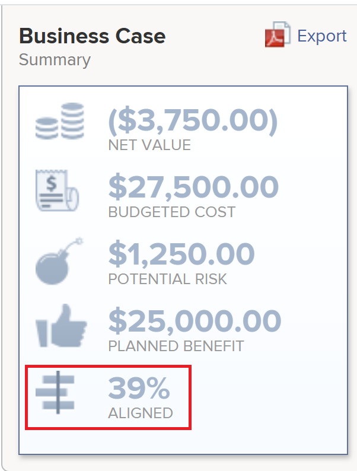
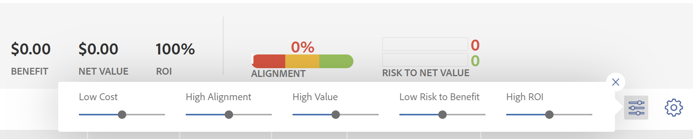

# [!UICONTROL Portfolio Optimizer] スコアの概要

<!--Audited: 01/2025-->

[!UICONTROL ポートフォリオオプティマイザー]のスコアは、[!UICONTROL ポートフォリオオプティマイザーで]確認できます。 これは、すべてのプロジェクトの&#x200B;**[!UICONTROL スコア]**&#x200B;列に表示されます。 これは、ポートフォリオ内のすべてのプロジェクトのスコアを表します。

[!UICONTROL ポートフォリオオプティマイザー]の場所について詳しくは、[[!UICONTROL ポートフォリオオプティマイザー]の概要](../../../manage-work/portfolios/portfolio-optimizer/portfolio-optimizer-overview.md)の記事を参照してください。

[!DNL Adobe Workfront] がプロジェクトスコアやその他のプロジェクト情報を使用して、[!UICONTROL ポートフォリオオプティマイザー]でプロジェクトを最適化する方法について詳しくは、[ポートフォリオオプティマイザーでのプロジェクトの最適化](../../../manage-work/portfolios/portfolio-optimizer/optimize-projects-in-portfolio-optimizer.md)を参照してください。

## [!UICONTROL 整合性スコア]と[!UICONTROL ポートフォリオオプティマイザーのスコア]の違い

プロジェクトの整合性スコアとポートフォリオオプティマイザーのスコアには違いがあります。

プロジェクトの整合性スコアは、スコアカードの完了後に取得したポイントに基づいて計算されます。 このスコアは、ポートフォリオ整合性スコアの決定に使用されます。 整合性スコアは、割合で表示されます。

プロジェクトの整合性スコアは、[!UICONTROL ポートフォリオオプティマイザー]の&#x200B;**[!UICONTROL 整合性]**&#x200B;列、または[!UICONTROL ビジネスケースの概要]の「[!UICONTROL 整合性]」フィールドに表示されます。




プロジェクトの整合性スコアを生成する方法について詳しくは、[プロジェクトへのスコアカードの適用と整合性スコアの生成](../../../manage-work/projects/define-a-business-case/apply-scorecard-to-project-to-generate-alignment-score.md)の記事を参照してください。

[!UICONTROL ポートフォリオオプティマイザー]のスコアは、[!UICONTROL ポートフォリオオプティマイザー]で自動的に計算され、プロジェクトの優先順位付けに使用されるランキングです。 ポートフォリオオプティマイザースコアは、数字が付いたインジケーターアイコンとして表示され、[!UICONTROL ポートフォリオオプティマイザー]の&#x200B;**[!UICONTROL スコア]**&#x200B;列に表示されます。

>[!NOTE]
>
>[!UICONTROL ポートフォリオオプティマイザー]でプロジェクトをスコアリングできるのは、ビジネスケースが完了した場合だけです。 ビジネスケースの完了について詳しくは、プロジェクトの[[!UICONTROL ビジネスケースの作成]](../../../manage-work/projects/define-a-business-case/create-business-case.md)の記事を参照してください。


各プロジェクトのスコアは、次のカテゴリの重要度に基づいて計算されます。

* [!UICONTROL コスト]
* [!UICONTROL 整合性]
* [!UICONTROL 純価]
* [!UICONTROL 危険と便益]
* [!UICONTROL ROI]

## [!UICONTROL ポートフォリオオプティマイザー]のスコアを計算

<!--
<p data-mc-conditions="QuicksilverOrClassic.Draft mode">(NOTE: This was edited based on this issue, per Anna: https://hub.workfront.com/issue/603d0c58000095ea0bc00ce5e2110693/overview)</p>
-->

[!DNL Workfront] は、[!UICONTROL ポートフォリオオプティマイザー]を使用してスコアを生成します。これは、プロジェクトの優先順位付けを支援するランキングです。 ポートフォリオ内の値は、プロジェクトのビジネスケースに入力された値に基づき、プロジェクトのスコア計算に使用されます。 スコアが高いプロジェクトはより重要と見なされ、最初に完了するように優先順位付けできます。

プロジェクトのランキングを調べるには、次の手順を実行します。

1. [!UICONTROL ポートフォリオオプティマイザー]に移動します。
1. ランキングアイコンの上にポインタを合わせると、プロジェクトのポートフォリオオプティマイザーのスコアが表示されます。


スコアを計算するアルゴリズムでは、プロジェクトのビジネスケースに概説されている値と、そのプロジェクトに含まれる重みを考慮に入れます。 オプティマイザー内のすべてのプロジェクトにスコアを割り当て、そのスコアを正規化して、スコアが 100 のプロジェクトが常に存在するようにします。 これにより、優れたプロジェクトに高いスコアが割り当てられます。

>[!BEGINSHADEBOX]

**例**

例えば、[!UICONTROL 高い整列]を考慮する唯一の要素にする場合、最も高い整列を持つプロジェクトはスコアが100になります。

>[!ENDSHADEBOX]

次に、プロジェクトにスコアを付けるための基準を示します。

* [!UICONTROL コスト]
* [!UICONTROL 整合性]
* [!UICONTROL 値]
* [!UICONTROL 危険と便益]
* [!UICONTROL ROI]



ポートフォリオ内のプロジェクトを最適化する方法について詳しくは、[[!UICONTROL ポートフォリオオプティマイザー]](../../../manage-work/portfolios/portfolio-optimizer/optimize-projects-in-portfolio-optimizer.md)でのプロジェクトの最適化を参照してください。

設定パネルの各基準（[!UICONTROL コスト]、[!UICONTROL 整合性]、[!UICONTROL ROI]、[!UICONTROL 純価]、[!UICONTROL 危険と便益]）には、選択した内容に基づいて 0～100 の範囲で重みが付与されます。

完全なビジネスケースを持つ各プロジェクトごとに、次の式を使用して、基準ごとのスコアを生成します。

```
Score Per Criteria = (Project Value For The Criteria - AVG(all the project values for this criteria)) / Standard Deviation of that value for that project
```

**例：**&#x200B;プロジェクト A の[!UICONTROL 整合性スコア]の場合、次のようになります。

```
Alignment Score = (Project A Alignment Score - AVG (of all the project Alignments)) / Standard Deviation of alignment score for that project
```

すべての[!UICONTROL 基準ごとのスコア]を計算したら、重み付けを考慮して追加し、プロジェクトごとの完全なスコアを取得できます。 プロジェクトのスコアは、次の式を使用して計算されます。

```
Score = Cost Score * Cost Weight + Alignment Score * Alignment Weight + ROI Score * ROI Weight + Net Value Score * Net Value Weight + Risk Score * Risk Weight
```

プロジェクトのコストと[!UICONTROL リスク]の場合、ロジックは他の基準の動作とは逆の動作をします。[!UICONTROL 低コスト]を重要視したい場合は、プロジェクト全体のスコアは増加するのではなく、`Cost Score * Cost Weight` 減少します。

各プロジェクトのスコアを計算した後、[!UICONTROL 最適化スコア]は、プロジェクトに対して次のように定義されます。

1. [!UICONTROL 最小]および[!UICONTROL 最大]スコアが定義されている。
1. これらの値の範囲が計算される。
1. 各プロジェクトの[!UICONTROL 最適化スコア]は、次の式を使用して計算されます。

   ```
   Optimization Score = Rounded ((Score - Minimum / Range)*100)
   ```
