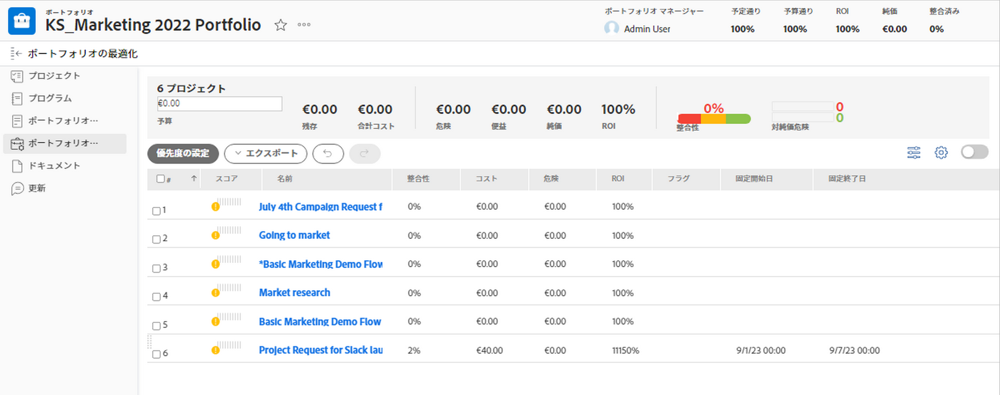

# ポートフォリオ内での移動

<!--

(NOTE: This article will need to be further revised and maybe merged into Understanding Portfolios?! (other?!).)

-->

[!DNL Adobe Workfront] では、ポートフォリオは、同じリソース、予算、スケジュール、優先度で競い合うプロジェクトの集まりを表します。ポートフォリオの主な目的は、企業にとって最も有益なプロジェクトを選択する際に、経営幹部やプロジェクトマネージャーを支援することです。

ポートフォリオについて詳しくは、[ [!DNL Adobe Workfront]](../../../manage-work/portfolios/portfolios-overview/portfolio-overview.md) のポートフォリオの概要を参照してください。

## アクセス要件

この記事の手順を実行するには、次のアクセス権が必要です。

<table style="table-layout:auto"> 
 <col> 
 <col> 
 <tbody> 
  <tr> 
   <td role="rowheader">[!DNL Adobe Workfront] プラン*</td> 
   <td> 
任意 
 </td> 
  </tr> 
  <tr> 
   <td role="rowheader">[!DNL Adobe Workfront] ライセンス*</td> 
   <td> 
[!UICONTROL Plan] 
 </td> 
  </tr> 
  <tr> 
   <td role="rowheader">アクセスレベル設定*</td> 
   <td> 
プロジェクトおよびポートフォリオへのアクセスの [!UICONTROL Edit]
 
メモ：それでもアクセスできない場合は、アクセスレベルに追加の制限が設定されていないかどうかを [!DNL Workfront] 管理者にお問い合わせください。[!DNL Workfront] 管理者がアクセスレベルを変更する方法について詳しくは、<a href="../../../administration-and-setup/add-users/configure-and-grant-access/create-modify-access-levels.md" class="MCXref xref">カスタムアクセスレベルの作成または変更</a>を参照してください。
 </td> 
  </tr> 
  <tr> 
   <td role="rowheader">オブジェクト権限</td> 
   <td> 
ポートフォリオへの権限の [!UICONTROL Manage]
 
プロジェクトへの表示権限またはそれ以上の権限
 
追加のアクセス権のリクエストについて詳しくは、<a href="../../../workfront-basics/grant-and-request-access-to-objects/request-access.md" class="MCXref xref">オブジェクトへのアクセス権のリクエスト</a>を参照してください。
 </td> 
  </tr> 
 </tbody> 
</table>

&#42;ご利用のプラン、ライセンスタイプまたはアクセス権を確認するには、[!DNL Workfront] 管理者にお問い合わせください。

## ポートフォリオ内での移動

1. [!DNL Adobe Workfront] の右上隅にある&#x200B;**[!UICONTROL メインメニュー]**&#x200B;アイコン  をクリックします。

1. 「[!UICONTROL ポートフォリオ]」をクリックします。
1. **[!UICONTROL フィルター]**&#x200B;ドロップダウンメニューから、次の項目を選択します。

   * **[!UICONTROL 所有ポートフォリオ]**：[!UICONTROL ポートフォリオ管理者]に指定されたポートフォリオのリストを含みます。
   * **[!UICONTROL すべて]**：少なくとも表示アクセス権のあるすべてのポートフォリオを含みます。

     ポートフォリオへのアクセス権について詳しくは、[アクセスレベルの概要](../../../administration-and-setup/add-users/access-levels-and-object-permissions/access-levels-overview.md)を参照してください。\
      ポートフォリオに対する権限について詳しくは、[ポートフォリオの共有](../../../workfront-basics/grant-and-request-access-to-objects/share-a-portfolio.md)を参照してください。

     新しいポートフォリオを追加するには、[ポートフォリオの作成](../../../manage-work/portfolios/create-and-manage-portfolios/create-portfolios.md)を参照してください。

1. ポートフォリオの名前をクリックしてアクセスします。\
   次のポートフォリオパフォーマンス指標は、ポートフォリオ内の[!UICONTROL ポートフォリオの詳細]領域に表示されます。

   * ポートフォリオが[!UICONTROL 予定通り]かどうか
   * ポートフォリオが[!UICONTROL 予算通り]かどうか
   * [!UICONTROL 投資回収率]（ROI）
   * ポートフォリオの [!UICONTROL  整合性]
   * ポートフォリオの[!UICONTROL 純価]

1. （オプション）左側のパネルの「**[!UICONTROL プロジェクト]**」をクリックして、選択したポートフォリオに関連付けられたプロジェクトを表示し、次のいずれかのフィルターを&#x200B;**[!UICONTROL フィルター]**&#x200B;ドロップダウンメニューから選択します。

   * **[!UICONTROL アクティブ]**：選択したポートフォリオに関連付けられている、次のステータスのすべてのプロジェクトを含みます。

      * [!UICONTROL 計画中]
      * [!UICONTROL 承認済み]
      * [!UICONTROL 現在]
   * **[!UICONTROL リクエスト済み]**：選択したポートフォリオに関連付けられているプロジェクトが含まれ、ステータスは「 **[!UICONTROL リクエスト済み]**.

     リクエストされたプロジェクトの確認については、[リクエストされたプロジェクトの確認](../../../manage-work/portfolios/create-and-manage-portfolios/review-requested-projects.md)を参照してください。

   * **[!UICONTROL すべて]**：選択したポートフォリオに関連付けられているすべてのプロジェクトを含みます。

     >[!NOTE]
     >
     >特定のプロジェクトのみを表示するには、プロジェクトのリストの上部にある&#x200B;**[!UICONTROL フィルター]**&#x200B;ドロップダウンメニューでプロジェクトフィルターを作成して、表示されるプロジェクトの数を減らします。

     フィルターの作成について詳しくは、 [フィルターの概要](../../../reports-and-dashboards/reports/reporting-elements/filters-overview.md).

1. クリック **[!UICONTROL プログラム]** 左側のパネルで、ポートフォリオ内にプログラムを作成したり、既存のプログラムを管理したりします。\
   プログラムについて詳しくは、[プログラムの作成と管理](../../../manage-work/portfolios/create-and-manage-programs/create-and-manage-programs.md)を参照してください。

1. （オプション）**[!UICONTROL ポートフォリオの詳細]**&#x200B;領域を展開して、「**[!UICONTROL 概要]**」または「**[!UICONTROL カスタムフォーム]**」をクリックし、ポートフォリオに関する情報を編集します。

1. （オプション）左側のパネルの「**[!UICONTROL ポートフォリオ最適化]**」をクリックして、ポートフォリオのパフォーマンスを最適化します。

   

   >[!IMPORTANT]
   >
   >[!UICONTROL ポートフォリオ最適化]にアクセスするには、[!UICONTROL Business] またはそれ以上の [!DNL Workfront]プランが必要です。

   ポートフォリオ最適化の使用について詳しくは、[ポートフォリオ最適化でのプロジェクトの管理](../../../manage-work/portfolios/portfolio-optimizer/manage-projects-in-portfolio-optimizer.md)を参照してください。

1. （オプション）左側のパネルの「**ドキュメント**」をクリックして、ドキュメントをポートフォリオに添付します。
1. （オプション）「 **[!UICONTROL 更新]** 左側のパネルで、ポートフォリオの更新ストリームにコメントを追加します。 詳しくは、[作業の更新](../../../workfront-basics/updating-work-items-and-viewing-updates/update-work.md)を参照してください。
1. （オプション）**[!UICONTROL その他] メニュー**  をクリックして、次のいずれかの操作を実行します。

   * ポートフォリオをディアクティベートします。ポートフォリオをディアクティベートすると、プロジェクトレベルでプロジェクトに関連付けることができなくなります。
   * ポートフォリオを削除します。

     >[!IMPORTANT]
     >
     >ポートフォリオに関連付けられたプロジェクトは削除されません。この操作により、ポートフォリオに現在関連付けられているプロジェクトから、ポートフォリオの名前が削除されます。

   * 他のユーザーとポートフォリオを共有します。

1. （オプション）ポートフォリオ名の右にある&#x200B;**スター**&#x200B;アイコン  をクリックして、お気に入りリストにポートフォリオを追加します。
