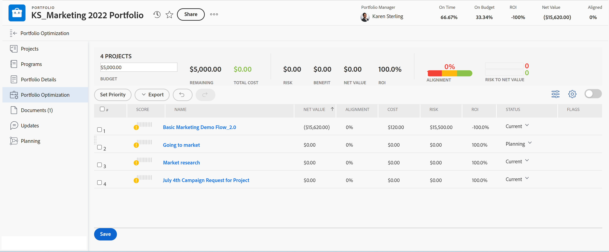

# ポートフォリオ内での移動

<!--Audited: 08/2025-->

<!--

(NOTE: This article will need to be further revised and maybe merged into Understanding Portfolios?! (other?!).)

-->

[!DNL Adobe Workfront] では、ポートフォリオは、同じリソース、予算、スケジュール、優先度で競い合うプロジェクトの集まりを表します。 ポートフォリオの主な目的は、企業にとって最も有益なプロジェクトを選択する際に、経営幹部やプロジェクトマネージャーを支援することです。

ポートフォリオについて詳しくは、[ポートフォリオの方法論について](../../../manage-work/portfolios/portfolios-overview/portfolio-overview.md)を参照してください。

## アクセス要件

+++ 展開すると、この記事の機能のアクセス要件が表示されます。 

<table style="table-layout:auto"> 
 <col> 
 <col> 
 <tbody> 
  <tr> 
   <td role="rowheader">[!DNL Adobe Workfront] パッケージ</td> 
   <td> 
任意
 </td> 
  </tr> 
  <tr> 
   <td role="rowheader">[!DNL Adobe Workfront] ライセンス</td> 
   <td> 
[!UICONTROL Standard] 

   
[!UICONTROL Plan] 
 </td> 
  </tr> 
  <tr> 
   <td role="rowheader">アクセスレベル設定</td> 
   <td> 
[!UICONTROL Edit] [!UICONTROL Projects]および[!UICONTROL Portfolios]へのアクセス
  </td> 
  </tr> 
  <tr> 
   <td role="rowheader">オブジェクト権限</td> 
   <td> 
ポートフォリオへの権限の [!UICONTROL Manage]
 
プロジェクトへの表示権限またはそれ以上の権限
  </td> 
  </tr> 
 </tbody> 
</table>

* 詳しくは、[Workfront ドキュメント ](/help/quicksilver/administration-and-setup/add-users/access-levels-and-object-permissions/access-level-requirements-in-documentation.md)のアクセス要件を参照してください。

+++

<!--
Old:

<table style="table-layout:auto"> 
 <col> 
 <col> 
 <tbody> 
  <tr> 
   <td role="rowheader">[!DNL Adobe Workfront] plan</td> 
   <td> 
Any 
 </td> 
  </tr> 
  <tr> 
   <td role="rowheader">[!DNL Adobe Workfront] license*</td> 
   <td> 
New: [!UICONTROL Standard] 

   
Current: [!UICONTROL Plan] 
 </td> 
  </tr> 
  <tr> 
   <td role="rowheader">Access level configurations</td> 
   <td> 
[!UICONTROL Edit] access to Projects and Portfolios
  </td> 
  </tr> 
  <tr> 
   <td role="rowheader">Object permissions</td> 
   <td> 
[!UICONTROL Manage] permissions to the portfolio
 
View or higher permissions to the projects
  </td> 
  </tr> 
 </tbody> 
</table>

*For information, see [Access requirements in Workfront documentation](/help/quicksilver/administration-and-setup/add-users/access-levels-and-object-permissions/access-level-requirements-in-documentation.md).
-->

## ポートフォリオ内での移動

{{step1-to-portfolios}}

1. **[!UICONTROL フィルター]**&#x200B;ドロップダウンメニューから、次の項目を選択します。

   * **[!UICONTROL 所有ポートフォリオ]**：[!UICONTROL ポートフォリオ管理者]に指定されたポートフォリオのリストを含みます。
   * **[!UICONTROL すべて]**：少なくともビューにアクセスできるすべてのポートフォリオが含まれます。

     ポートフォリオへのアクセスについて詳しくは、[ アクセスレベルの概要](../../../administration-and-setup/add-users/access-levels-and-object-permissions/access-levels-overview.md)を参照してください。
ポートフォリオへの権限について詳しくは、[ ポートフォリオの共有](../../../workfront-basics/grant-and-request-access-to-objects/share-a-portfolio.md)を参照してください。

     新しいポートフォリオを追加するには、[ポートフォリオの作成](../../../manage-work/portfolios/create-and-manage-portfolios/create-portfolios.md)を参照してください。

1. ポートフォリオの名前をクリックしてアクセスします。
ポートフォリオのパフォーマンス指標は、ポートフォリオ内の[!UICONTROL Portfolioの詳細]領域に表示されます。

   * ポートフォリオが[!UICONTROL 予定通り]かどうか
   * ポートフォリオが[!UICONTROL 予算通り]かどうか
   * [!UICONTROL 投資回収率]（ROI）
   * ポートフォリオの [!UICONTROL  整合性]
   * ポートフォリオの[!UICONTROL 純価]

1. （オプション）左側のパネルの「**[!UICONTROL プロジェクト]**」をクリックして、選択したポートフォリオに関連付けられたプロジェクトを表示し、次のいずれかのフィルターを&#x200B;**[!UICONTROL フィルター]**&#x200B;ドロップダウンメニューから選択します。

   * **[!UICONTROL アクティブ]**：選択したポートフォリオに関連付けられている、次のステータスのすべてのプロジェクトを含みます。

      * [!UICONTROL 計画中]
      * [!UICONTROL 承認済み]
      * [!UICONTROL 現在]
   * **[!UICONTROL 要求済み]**：選択したポートフォリオに関連付けられている、ステータスが&#x200B;**[!UICONTROL 要求済み]**&#x200B;のプロジェクトを含みます。

     リクエストされたプロジェクトの確認については、[リクエストされたプロジェクトの確認](../../../manage-work/portfolios/create-and-manage-portfolios/review-requested-projects.md)を参照してください。

   * **[!UICONTROL すべて]**：選択したポートフォリオに関連付けられているすべてのプロジェクトを含みます。

     >[!NOTE]
     >
     >特定のプロジェクトのみを表示するには、プロジェクトのリストの上部にある&#x200B;**[!UICONTROL フィルター]**&#x200B;ドロップダウンメニューでプロジェクトフィルターを作成して、表示されるプロジェクトの数を減らします。

     フィルターの作成について詳しくは、[フィルターの概要](../../../reports-and-dashboards/reports/reporting-elements/filters-overview.md)を参照してください。

1. 左側のパネルの&#x200B;**[!UICONTROL プログラム]**をクリックして、ポートフォリオ内にプログラムを作成するか、既存のプログラムを管理します。
プログラムについて詳しくは、「[ プログラムの作成と管理](../../../manage-work/portfolios/create-and-manage-programs/create-and-manage-programs.md)」の節を参照してください。

1. （オプション）**[!UICONTROL ポートフォリオの詳細]**&#x200B;領域を展開して、「**[!UICONTROL 概要]**」または「**[!UICONTROL カスタムフォーム]**」をクリックし、ポートフォリオに関する情報を編集します。

1. （オプション）左側のパネルの「**[!UICONTROL ポートフォリオ最適化]**」をクリックして、ポートフォリオのパフォーマンスを最適化します。

   

   >[!IMPORTANT]
   >
   >[!UICONTROL Portfolio Optimizer]にアクセスするには、会社に[!UICONTROL Prime]以降の[!DNL Workfront] パッケージが必要です。
   >

   Portfolio Optimizerの使用について詳しくは、「Portfolio Optimizerでプロジェクトを管理する：記事インデックス ](../../../manage-work/portfolios/portfolio-optimizer/manage-projects-in-portfolio-optimizer.md)」セクションを参照してください。[

1. （オプション）左側のパネルの「**ドキュメント**」をクリックして、ドキュメントをポートフォリオに添付します。

   >[!NOTE]
   >
   >ポートフォリオへのドキュメントの追加は、Workfrontに使用するストレージの種類によって異なります。
   >一部のお客様は、次の両方のドキュメントストレージ環境にアクセスできます。
   >
   >  * **レガシーWorkfront ストレージ**：このストレージを使用しているポートフォリオでは、名前の横にレガシーストレージアイコン が表示されます。
   >  * **Adobe クラウドストレージ**
   >
   >Workfront管理者は、会社が使用するストレージを決定するか、各ポートフォリオを関連付けるストレージを選択できるようにします。
   >詳しくは、[組織でAdobe クラウドストレージを有効にする](/help/quicksilver/administration-and-setup/set-up-workfront/configure-system-defaults/enable-esm.md)を参照してください。
   >
   >ポートフォリオへのドキュメントの追加は、使用するストレージの種類によって異なります。
   >
   >詳しくは、「[ ファイルシステムからAdobe Workfrontにドキュメントを追加する](/help/quicksilver/documents/adding-documents-to-workfront/add-documents-from-file-system.md)」を参照してください。

1. （オプション）左パネルの「**[!UICONTROL 更新]**」をクリックして、ポートフォリオの更新ストリームにコメントを追加します。 詳しくは、[作業の更新](../../../workfront-basics/updating-work-items-and-viewing-updates/update-work.md)を参照してください。
1. （オプション）次のいずれかの操作を行うには、**[!UICONTROL 詳細] メニュー** をクリックします。

   * ポートフォリオをディアクティベートします。 ポートフォリオをディアクティベートすると、プロジェクトレベルでプロジェクトに関連付けることができなくなります。
   * ポートフォリオを削除します。

     >[!IMPORTANT]
     >
     >ポートフォリオに関連付けられたプロジェクトは削除されません。 この操作により、ポートフォリオに現在関連付けられているプロジェクトから、ポートフォリオの名前が削除されます。

   * 他のユーザーとポートフォリオを共有します。

1. （オプション）ポートフォリオ名の右側にある&#x200B;**星** アイコン をクリックして、お気に入りのリストにポートフォリオを追加します。
