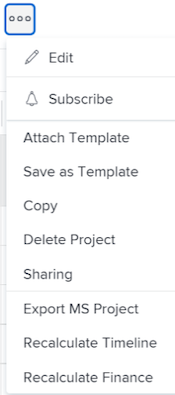
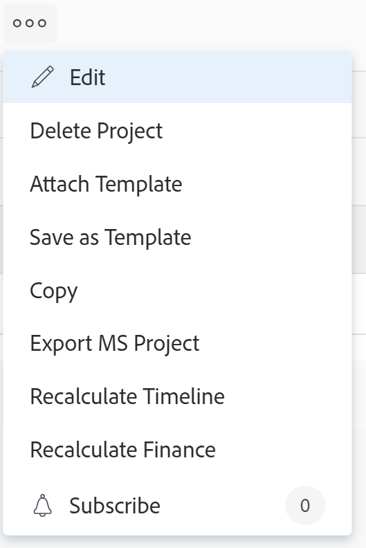
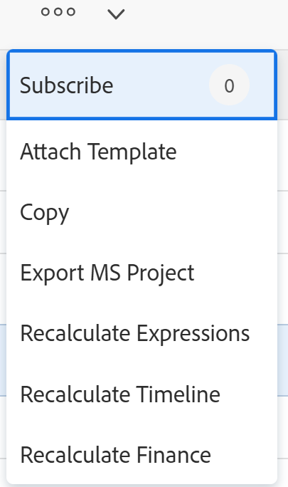
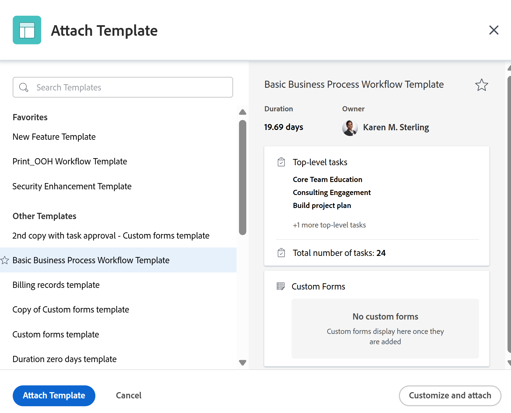
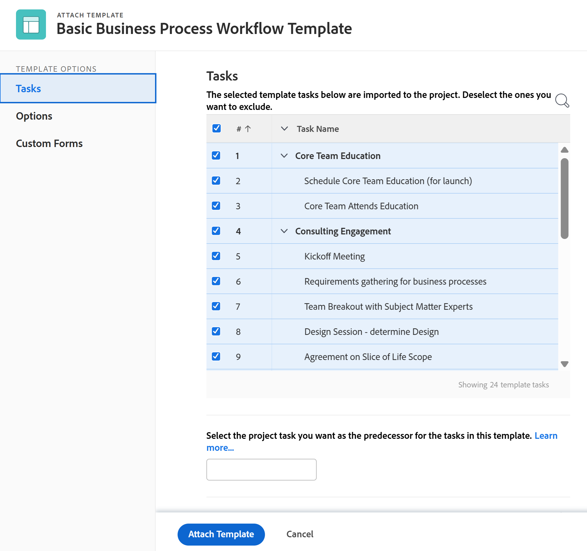
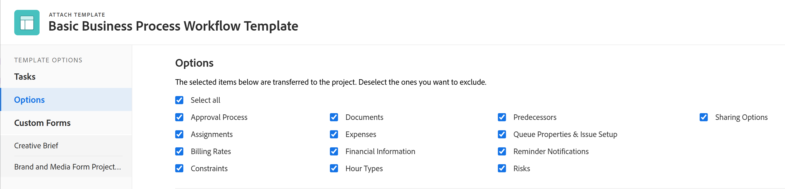
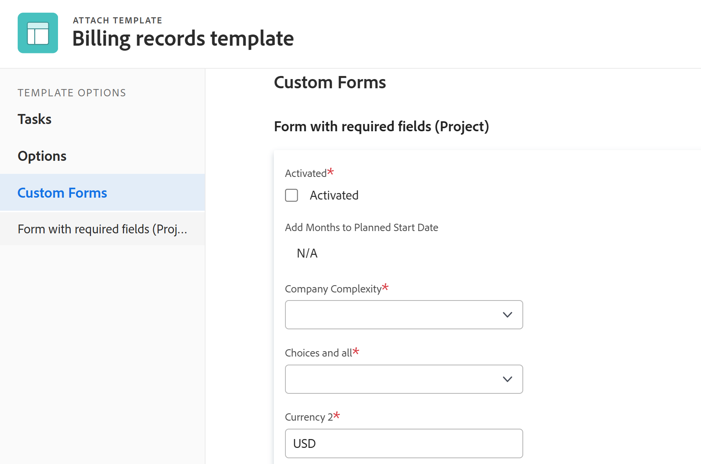
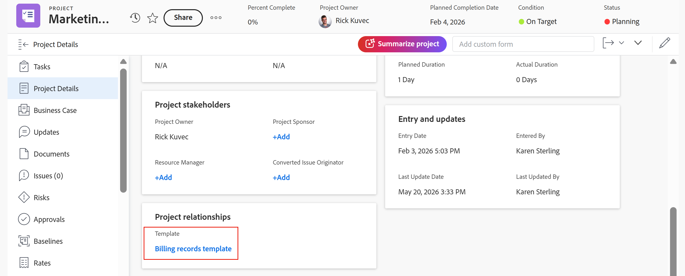

# プロジェクトにテンプレートを添付

<!-- Audited: 10/2025 -->

テンプレートは、プロジェクトの初期作成段階または作成後にプロジェクトに添付できます。

テンプレートを使用してプロジェクトを作成する方法について詳しくは、[テンプレートを使用したプロジェクトの作成](../../../manage-work/projects/create-projects/create-project-from-template.md)を参照してください。

## アクセス要件

+++ 展開すると、この記事の機能のアクセス要件が表示されます。

<table style="table-layout:auto"> 
 <col> 
 <col> 
 <tbody> 
  <tr> 
   <td role="rowheader">Adobe Workfront パッケージ</td> 
   <td> 
任意
 </td> 
  </tr> 
  <tr> 
   <td role="rowheader">Adobe Workfront プラン</td> 
   <td> 
標準

    
プラン

    
 </td> 
  </tr> 
  <tr> 
   <td role="rowheader">アクセスレベル設定</td> 
   <td> 
プロジェクトへのアクセスを編集 
 
テンプレートへのアクセスの表示
</td> 
  </tr> 
  <tr> 
   <td role="rowheader">オブジェクト権限</td> 
   <td> 
プロジェクトの管理権限
 
テンプレートに対する表示権限以上
 </td> 
  </tr> 
 </tbody> 
</table>

この表の情報について詳しくは、[Workfront ドキュメントのアクセス要件](/help/quicksilver/administration-and-setup/add-users/access-levels-and-object-permissions/access-level-requirements-in-documentation.md)を参照してください。

+++

<!--
 Old:
 
 <table style="table-layout:auto"> 
 <col> 
 <col> 
 <tbody> 
  <tr> 
   <td role="rowheader">Adobe Workfront plan</td> 
   <td> 
Any 
 </td> 
  </tr> 
  <tr> 
   <td role="rowheader">Adobe Workfront license</td> 
   <td> 
New: Standard

   
Or

   
Current: Plan

    
 </td> 
  </tr> 
  <tr> 
   <td role="rowheader">Access level configurations</td> 
   <td> 
Edit access to Projects 
 
For information about project access, see <a href="../../../administration-and-setup/add-users/configure-and-grant-access/grant-access-projects.md" class="MCXref xref">Grant access to projects</a>.
 
View access to Templates
 
For information about template permissions, see <a href="../../../workfront-basics/grant-and-request-access-to-objects/share-a-template.md" class="MCXref xref">Share a template</a>. 
 
For information about template access, see <a href="../../../administration-and-setup/add-users/configure-and-grant-access/grant-access-templates.md" class="MCXref xref">Grant access to templates</a>.
 
Note: If you still don't have access, ask your Workfront administrator if they set additional restrictions in your access level. For information on how a Workfront administrator can modify your access level, see <a href="../../../administration-and-setup/add-users/configure-and-grant-access/create-modify-access-levels.md" class="MCXref xref">Create and modify custom access levels</a>.
 </td> 
  </tr> 
  <tr> 
   <td role="rowheader">Object permissions</td> 
   <td> 
Manage permissions to the project
 
For information about project permissions, see <a href="../../../workfront-basics/grant-and-request-access-to-objects/share-a-project.md" class="MCXref xref">Share a project in Adobe Workfront</a>. 
 
View permissions or higher to the template
 
For information on requesting additional access, see <a href="../../../workfront-basics/grant-and-request-access-to-objects/request-access.md" class="MCXref xref">Request access to objects </a>.
 </td> 
  </tr> 
 </tbody> 
</table>
-->

<!--

<h2>Considerations when adding templates to projects</h2>

(NOTE: moved this to an Overview article of its own) 

Consider the following when adding templates to projects:

<ul>
<li> 
You can attach only active templates to projects. 
 </li>
<li> 
You can attach a template to a project when the project is in a status of Complete, Dead, or in Pending Approval, only when your Adobe Workfront administrator or a group administrator has enabled this functionality in the Project Preferences area. For information about setting project preferences, see <a href="../../../administration-and-setup/set-up-workfront/configure-system-defaults/set-project-preferences.md" class="MCXref xref">Configure system-wide project preferences</a>. 
 </li>
<li> 
Unless you exclude specific template tasks from being added in the attachment process, all template tasks are added to the existing project. 
 </li>
<li> 
Most template settings are added to the project. 
 </li>
<li> 
Some settings from the template automatically transfer to the project, unless you specifically mark them to be excluded. 

Example: </b>">
<b>Example: </b>

For example, these settings are added to the project:

<ul>
<li>Start From field</li>
<li>Custom forms and the information on them</li>
<li>Queue Details </li>
<li>Financial settings </li>
</ul>

 </li>
</ul>

-->

## 既存のプロジェクトにテンプレートを添付 {#attach-a-template-to-an-existing-project}

プロジェクトページまたはプロジェクトリストまたはレポートから、テンプレートをプロジェクトに添付できます。

{{step1-to-projects}}

1. **プロジェクト** ページで、テンプレートを添付するプロジェクトを選択します。

1. プロジェクト名の右側にある&#x200B;**詳細** アイコン をクリックします。

   

   または

   プロジェクトのリストまたはレポートに移動してプロジェクトを選択し、リストの上部にある&#x200B;**詳細** アイコン をクリックします。

   

1. 「**テンプレートを添付**」をクリックします。 「**テンプレートを添付**」ボックスが表示されます。

1. 添付するテンプレートの名前を&#x200B;**テンプレートを検索** フィールドに入力し、リストに表示されたらクリックします。

   または

   **その他のテンプレート**&#x200B;エリアでテンプレートの名前をクリックします。

   テンプレートのプレビューが右側に表示され、テンプレートに関する次の情報が示されます。

   * 期間
   * 所有者
   * 最上位タスクの数（最初の3つの最上位タスクのリストを含む）
   * タスクの合計数
   * 添付されたカスタムフォームの名前

   

1. （オプション）テンプレート名の右側にある&#x200B;**お気に入り** アイコン をクリックして、お気に入りとしてマークし、**お気に入り** リストに移動します。

1. （オプション） **お気に入り** アイコン をもう一度クリックして、**お気に入り** リストから削除します。
1. 「**カスタマイズして添付**」をクリックします。 **テンプレートを添付** サイドパネルが開きます。

1. （オプション）次のセクションの情報を更新します。

   <table style="table-layout:auto"> 
    <col> 
    <col> 
    <tbody> 
     <tr> 
      <td role="rowheader" colspan="2"> 
タスクのセクション
 
  
 </td> 
     </tr> 
     <tr> 
      <td role="rowheader">以下の選択したテンプレートタスクがプロジェクトに読み込まれます。 除外するものは選択を解除してください。 </td> 
      <td>
テンプレートをプロジェクトに添付する前に、テンプレートから除外するタスクの選択を解除します。

      
<b>ヒント</b>

      
1つのタスクのみを選択できます。

      </td> 
     </tr> 
     <tr> 
      <td role="rowheader">このテンプレートにあるタスクの先行タスクとするプロジェクト タスクを選びます。</td> 
      <td> 
フィールドボックス内をクリックしてプロジェクトタスクのリストを表示し、テンプレートタスクを開始する前に終了する必要があるタスクを選択します。 または、この手順をスキップし、テンプレートを添付した後でプロジェクト内で関係を設定することもできます。 
 
 「<strong>依存関係タイプ </strong>、<strong>遅延時間</strong>」の情報を選択します。また、「<strong>先行タスクを適用</strong>」チェックボックスをオンにして先行タスクを適用する場合も選択します。 
 </td> 
     </tr> 
     <tr> 
      <td role="rowheader">このテンプレートで親タスクとするプロジェクト タスクを選びます。</td> 
      <td> 
すべてのテンプレートタスクの親タスクとして指定するプロジェクトタスクを選択します。選択しないと、すべてのテンプレートタスクが現在のプロジェクトタスクの最後に表示されます。 この手順をスキップし、テンプレートを添付した後で、プロジェクト内でタスクを移動することができます。

      
<b>メモ</b>

      
追加の子を含む親テンプレートタスクを選択した場合、プロジェクトに追加された後は、親のみがプロジェクトタスクを先行タスクとして表示します。 子テンプレートタスクには先行タスクは表示されません。

      
子テンプレートタスクのみを選択した場合、プロジェクトタスクはプロジェクトに追加された後に先行タスクとして表示されます。 

   </td> 
     </tr> 
     <tr> 
      <td role="rowheader" colspan="2"> 
「オプション」セクション
 
  
 </td> 
     </tr> 
     <tr> 
      <td role="rowheader">下に選択されたアイテムがプロジェクトにインポートされます。除外するものは選択を解除してください。</td> 
      <td> 
テンプレートから除外する情報をプロジェクトに添付する前に、チェックボックスの選択を解除します。 各フィールドについて詳しくは、<a href="../../../manage-work/projects/create-and-manage-templates/attach-template-to-project-overview.md" class="MCXref xref">プロジェクトへのテンプレートの添付の概要</a>を参照してください。 
 
重要：「<strong>キュー プロパティ &amp; 問題設定</strong>」チェックボックスを選択すると、テンプレートのキューの詳細でプロジェクトのキューの詳細が上書きされます。この場合、テンプレートの「ルーティング規則」、「キュートピック」および「トピックグループ」が、プロジェクトの各項目に追加されます。  プロジェクトがリクエストキューとして設定されていて、プロジェクトに添付したテンプレートがリクエストキューとして設定されていない場合、「<strong> キューのプロパティと問題の設定</strong>」チェックボックスをオンのままにすると、プロジェクトのキュー情報が削除されます。   「<strong> キューのプロパティと問題の設定</strong>」ボックスの選択を解除すると、プロジェクトのキューの設定設定はすべて保持され、テンプレートのキューの設定設定は添付されません。 
 </td> 
     </tr> 
     <tr> 
      <td role="rowheader" colspan="2"> 
「カスタムフォーム」セクション
 
  
 </td> 
     </tr> 
     <tr> 
      <td role="rowheader">カスタムフォーム</td> 
      <td> 
カスタムフォームをテンプレートに添付すると、その名前が左パネルに表示されます。 
 </td> 
     </tr> 
    </tbody> 
   </table>

1. （オプション）カスタムフォームの情報を更新します。この情報はプロジェクトに転送されます。

   >[!TIP]
   >
   >* テンプレート上のカスタムフォームに空の必須フィールドが含まれている場合、この手順は必須です。
   >* テンプレートのカスタムフォームのフィールドがプロジェクトに既に存在し、そこに情報が含まれている場合は、既にプロジェクトにある情報が保持されます。テンプレートの接続中に編集することはできません。

1. 「**テンプレートの添付**」をクリックします。
1. 「**添付ファイルをキャンセル**」をクリックして、テンプレートの添付を停止します。

   または

   添付を終了して、プロジェクトにテンプレートを追加できるようにします。

   テンプレートを添付した後、プロジェクトを編集し、必要に応じてタスク、情報または設定を調整できます。

1. （オプション）左側のパネルで、**プロジェクトの詳細**&#x200B;をクリックし、**概要**&#x200B;をクリックして、**プロジェクトの関係**&#x200B;領域で添付したテンプレートの名前を表示します。

   >[!TIP]
   >
   >プロジェクトに複数のテンプレートを添付した場合、最初に添付したテンプレートのみが、このフィールドに表示されます。 詳しくは、この記事の[既存のプロジェクトへの複数テンプレートの添付とテンプレート情報の表示](#attach-multiple-templates-to-an-existing-project-and-view-template-information)の節を参照してください。

1. （オプション）テンプレートを添付したプロジェクトからテンプレート情報を削除します。 詳しくは、[プロジェクトからのテンプレート情報の削除](../../../manage-work/projects/create-and-manage-templates/remove-template-from-project.md)を参照してください。

## 既存のプロジェクトへの複数テンプレートの添付とテンプレート情報の表示 {#attach-multiple-templates-to-an-existing-project-and-view-template-information}

この記事の「[&#x200B; テンプレートを既存のプロジェクトに添付](#attach-a-template-to-an-existing-project)」で説明されている手順に従って、同じプロジェクトに複数のテンプレートを（一度に1つずつ）添付できます。 これにより、各テンプレートのタスクやその他の情報がプロジェクトに追加されます。

>[!TIP]
>
>プロジェクトに複数のテンプレートを添付すると、最初に添付したテンプレートのみがプロジェクトの詳細領域に表示されます。

プロジェクトに適用されているテンプレートを表示するには：

{{step1-to-projects}}

1. **プロジェクト** ページで、テンプレートが添付されているプロジェクトを選択します。

1. 左パネルの「**プロジェクト詳細**」をクリックします。

1. **プロジェクト関係**&#x200B;の&#x200B;**概要** セクションの下部にある&#x200B;**テンプレート** フィールドで、プロジェクトに添付されたテンプレートの名前を探します。

   

