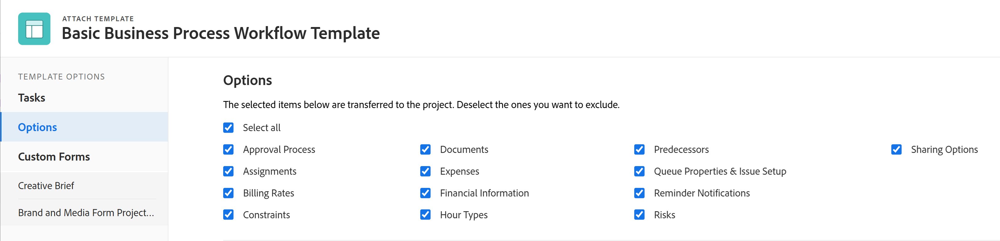

# プロジェクトにテンプレートを添付する

テンプレートは、プロジェクトの最初の作成段階で、または作成後に、プロジェクトに添付できます。

テンプレートを使用してプロジェクトを作成する方法について詳しくは、 [テンプレートを使用したプロジェクトの作成](../../../manage-work/projects/create-projects/create-project-from-template.md).

## アクセス要件

この記事で説明する手順を実行するには、次の手順を実行する必要があります。

<table style="table-layout:auto"> 
 <col> 
 <col> 
 <tbody> 
  <tr> 
   <td role="rowheader">Adobe Workfront plan*</td> 
   <td> 
任意 
 </td> 
  </tr> 
  <tr> 
   <td role="rowheader">Adobe Workfront license*</td> 
   <td> 
計画 
 </td> 
  </tr> 
  <tr> 
   <td role="rowheader">アクセスレベル設定*</td> 
   <td> 
プロジェクトへのアクセスを編集 
 
プロジェクトへのアクセスについて詳しくは、 <a href="../../../administration-and-setup/add-users/configure-and-grant-access/grant-access-projects.md" class="MCXref xref">プロジェクトへのアクセス権の付与</a>.
 
テンプレートへのアクセスを表示
 
テンプレートの権限について詳しくは、 <a href="../../../workfront-basics/grant-and-request-access-to-objects/share-a-template.md" class="MCXref xref">テンプレートの共有</a>. 
 
テンプレートへのアクセスについて詳しくは、 <a href="../../../administration-and-setup/add-users/configure-and-grant-access/grant-access-templates.md" class="MCXref xref">テンプレートへのアクセス権の付与</a>.
 
注意：まだアクセス権がない場合は、Workfront管理者に、アクセスレベルに追加の制限が設定されているかどうかを問い合わせてください。 Workfront管理者がアクセスレベルを変更する方法について詳しくは、 <a href="../../../administration-and-setup/add-users/configure-and-grant-access/create-modify-access-levels.md" class="MCXref xref">カスタムアクセスレベルの作成または変更</a>.
 </td> 
  </tr> 
  <tr> 
   <td role="rowheader">オブジェクトの権限</td> 
   <td> 
プロジェクトに対する権限の管理
 
プロジェクト権限について詳しくは、 <a href="../../../workfront-basics/grant-and-request-access-to-objects/share-a-project.md" class="MCXref xref">Adobe Workfrontでプロジェクトを共有する</a>. 
 
テンプレートに対する表示権限以上
 
追加のアクセス権のリクエストについて詳しくは、 <a href="../../../workfront-basics/grant-and-request-access-to-objects/request-access.md" class="MCXref xref">オブジェクトへのアクセスのリクエスト </a>.
 </td> 
  </tr> 
 </tbody> 
</table>

&#42;保有するプラン、ライセンスの種類、アクセス権を確認するには、Workfront管理者に問い合わせてください。

<!--

<h2>Considerations when adding templates to projects</h2>

(NOTE: moved this to an Overview article of its own) 

Consider the following when adding templates to projects:

<ul>
<li> 
You can attach only active templates to projects. 
 </li>
<li> 
You can attach a template to a project when the project is in a status of Complete, Dead, or in Pending Approval, only when your Adobe Workfront administrator or a group administrator has enabled this functionality in the Project&nbsp;Preferences area. For information about setting project preferences, see <a href="../../../administration-and-setup/set-up-workfront/configure-system-defaults/set-project-preferences.md" class="MCXref xref">Configure system-wide project preferences</a>. 
 </li>
<li> 
Unless you exclude specific template tasks from being added in the attachment process, all template tasks are added to the existing project. 
 </li>
<li> 
Most template settings are added to the project. 
 </li>
<li> 
Some settings from the template automatically transfer to the project, unless you specifically mark them to be excluded. 

Example: </b>">
<b>Example: </b>

For example, these settings are added to the project:

<ul>
<li>Start&nbsp;From field</li>
<li>Custom forms and the information on them</li>
<li>Queue Details </li>
<li>Financial settings </li>
</ul>

 </li>
</ul>

-->

## 既存のプロジェクトにテンプレートを添付する {#attach-a-template-to-an-existing-project}

テンプレートは、プロジェクトページからWorkfrontのプロジェクトに添付することも、プロジェクトリストまたはレポートから添付することもできます。

1. テンプレートを添付するプロジェクトに移動し、 **その他** アイコン  プロジェクト名の右側に

   

   または

   プロジェクトリストまたはレポートに移動し、プロジェクトを選択して、 **その他** アイコン  をクリックします。

   

1. クリック **テンプレートを添付**.

   「テンプレートを添付」(Attach Template) ボックスが表示されます。

1. 添付するテンプレートの名前を **テンプレートを検索** フィールドに値を入力し、リストに表示されたらクリックします。

   または

   テンプレートの名前をクリックします。 **その他のテンプレート** 領域。

   テンプレートのプレビューが右側に表示され、テンプレートに関する次の情報が示されます。

   * 期間
   * 所有者
   * トップレベルのタスクの数（最初の 3 つのトップレベルのタスクのリストが含まれます）
   * タスクの合計数
   * 添付されたカスタムフォームの名前

   

1. （オプション） **お気に入力** アイコン  をクリックして、テンプレート名の左側に追加します。 これにより、お気に入りリスト内のテンプレートが移動します。

   

1. （オプション） **お気に入力** アイコン  [ お気に入り ] の一覧から削除する場合は、このアイコンを再度選択します。
1. クリック **カスタマイズと添付**.

   

1. テンプレートをアタッチする前に、次のセクションの情報を更新します ( または、 **テンプレートを添付** （任意の時点）:

   <table style="table-layout:auto"> 
    <col> 
    <col> 
    <tbody> 
     <tr> 
      <td role="rowheader" colspan="2"> 
タスクセクション
 
  
 </td> 
     </tr> 
     <tr> 
      <td role="rowheader">以下で選択したテンプレートタスクがプロジェクトにインポートされます。 除外する項目の選択を解除します。 </td> 
      <td>テンプレートをプロジェクトに添付する前に、テンプレートから除外するタスクの選択を解除します。</td> 
     </tr> 
     <tr> 
      <td role="rowheader">このテンプレートのタスクの先行タスクとして使用するプロジェクトタスクを選択します。</td> 
      <td> 
プロジェクトタスクのリストを表示するには、フィールドをクリックします。 テンプレートタスクを開始する前に終了するプロジェクトタスクを選択します。 または、テンプレートをアタッチした後で、この手順をスキップしてプロジェクト内で関係を設定することもできます。 
 
 を選択します。 <strong>依存タイプ</strong>, <strong>ラグ</strong> 情報、および先行者になるかどうか <strong>強制</strong> またはそうではありません。 
 </td> 
     </tr> 
     <tr> 
      <td role="rowheader">このテンプレートのタスクの親として使用するプロジェクトタスクを選択します。</td> 
      <td> すべてのテンプレートタスクの親タスクとして指定するプロジェクトタスクを選択します。 選択しない場合は、すべてのテンプレートタスクが現在のプロジェクトタスクの最後に表示されます。 この手順をスキップし、テンプレートを添付した後で、プロジェクト内でタスクを移動することができます。</td> 
     </tr> 
     <tr> 
      <td role="rowheader" colspan="2"> 
「オプション」セクション
 
  
 </td> 
     </tr> 
     <tr> 
      <td role="rowheader">以下で選択した項目がプロジェクトに転送されます。 除外する項目の選択を解除します。</td> 
      <td> 
テンプレートをプロジェクトに添付する前に、テンプレートから消去する情報の横にあるチェックボックスの選択を解除します。 この情報は、テンプレートからプロジェクトには転送されません。 各フィールドについて詳しくは、 <a href="../../../manage-work/projects/create-and-manage-templates/attach-template-to-project-overview.md" class="MCXref xref">プロジェクトへのテンプレートのアタッチの概要</a>. 
 
重要： <strong>キューのプロパティと問題の設定</strong> 」ボックスに入力すると、テンプレートの「キューの詳細」で、プロジェクトの詳細が上書きされます。 この場合、テンプレートの「ルーティングルール」、「キュートピック」、「トピックグループ」がプロジェクトのルーティングルールに追加されます。  プロジェクトが要求キューとして設定され、プロジェクトに添付するテンプレートが要求キューとして設定されていない場合、 <strong>キューのプロパティと問題の設定</strong> 」ボックスをオンにします。  このオプションを選択解除すると、 <strong>キューのプロパティと問題の設定</strong> ボックスには、プロジェクトのキュー設定の設定がすべて保持され、テンプレートのキュー設定の設定は添付されません。 
 </td> 
     </tr> 
     <tr> 
      <td role="rowheader" colspan="2"> 
Custom Forms section
 
  
 </td> 
     </tr> 
     <tr> 
      <td role="rowheader">カスタムForms</td> 
      <td> 
カスタムフォームをテンプレートに添付すると、その名前が左のパネルに表示されます。 
 </td> 
     </tr> 
    </tbody> 
   </table>

1. （オプション）カスタムフォームの情報を更新します。 この情報はプロジェクトに転送されます。

   >[!TIP]
   >
   >* この手順は、テンプレート上のカスタムフォームに空の必須フィールドが含まれている場合に必須です。
   >* テンプレートのカスタムフォームのフィールドがプロジェクト上に既に存在し、情報が含まれている場合、既にプロジェクト上にある情報が保持されます。 テンプレートの添付中は編集できません。

1. クリック **テンプレートを添付します。**
1. クリック **添付ファイルをキャンセル** をクリックして、テンプレートのアタッチを停止します。

   または

   添付ファイルが終了して、プロジェクトにテンプレートを追加できるようにします。

   テンプレートをアタッチした後、プロジェクトを編集し、必要に応じてタスク、情報、設定を調整できます。

1. （オプション）「 **プロジェクトの詳細**&#x200B;を、 **概要** をクリックして、 **プロジェクトの関係** 領域。

   >[!TIP]
   >
   >複数のテンプレートをプロジェクトにアタッチする場合は、最初にアタッチしたテンプレートのみがこのフィールドに表示されます。 詳しくは、 [既存のプロジェクトに複数のテンプレートをアタッチし、テンプレート情報を表示します。](#attach-multiple-templates-to-an-existing-project-and-view-template-information) 」の節を参照してください。

1. （オプション）テンプレートを添付したプロジェクトからテンプレート情報を削除します。 詳しくは、 [プロジェクトからテンプレート情報を削除する](../../../manage-work/projects/create-and-manage-templates/remove-template-from-project.md).

## 既存のプロジェクトに複数のテンプレートをアタッチし、テンプレート情報を表示します。 {#attach-multiple-templates-to-an-existing-project-and-view-template-information}

「 」セクションで説明されている手順に従って、同じプロジェクトに複数のテンプレートを（一度に 1 つずつ）アタッチできます。 [既存のプロジェクトにテンプレートを添付する](#attach-a-template-to-an-existing-project) 」を参照してください。 これにより、各テンプレートのタスクやその他の情報がプロジェクトに追加されます。

>[!TIP]
>
>複数のテンプレートをプロジェクトにアタッチする場合、最初にアタッチしたテンプレートのみが「プロジェクトの詳細」領域に表示されます。

プロジェクトに適用されるテンプレートを理解するには：

1. テンプレートが添付されたプロジェクトに移動します。
1. クリック **プロジェクトの詳細** をクリックします。
1. 内で、プロジェクトに添付されているテンプレートの名前を探します。 **テンプレート** の一番下のフィールド **概要** の下のセクション **プロジェクトの関係** .

   

