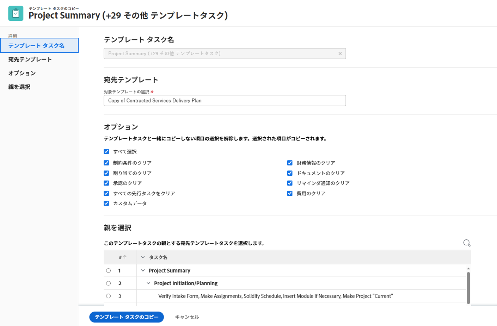
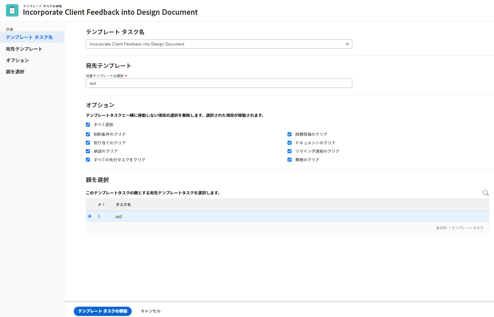

# テンプレートタスクのコピーと移動

テンプレートタスクは、テンプレートから別のテンプレートにコピーすることも、別のテンプレートに移動することも、同じテンプレート内の別の場所に移動することもできます。

## アクセス要件

この記事の手順を実行するには、次のアクセス権が必要です。

<table style="table-layout:auto"> 
 <col> 
 <col> 
 <tbody> 
  <tr> 
   <td role="rowheader">Adobe Workfront plan*</td> 
   <td> 
任意
 </td> 
  </tr> 
  <tr> 
   <td role="rowheader">Adobe Workfront license*</td> 
   <td> 
計画 
 </td> 
  </tr> 
  <tr> 
   <td role="rowheader">アクセスレベル設定*</td> 
   <td> 
テンプレートへのアクセスを編集
 
<b>メモ</b>

まだアクセス権がない場合は、Workfront管理者に、アクセスレベルに追加の制限を設定しているかどうかを問い合わせてください。 Workfront管理者がアクセスレベルを変更する方法について詳しくは、 <a href="../../../administration-and-setup/add-users/configure-and-grant-access/create-modify-access-levels.md" class="MCXref xref">カスタムアクセスレベルの作成または変更</a>.
 </td>
</tr> 
  <tr> 
   <td role="rowheader">オブジェクトの権限</td> 
   <td> 
テンプレートおよびテンプレートタスクに対する権限の管理 
 
追加のアクセス権のリクエストについて詳しくは、 <a href="../../../workfront-basics/grant-and-request-access-to-objects/request-access.md" class="MCXref xref">オブジェクトへのアクセスのリクエスト </a>.
 </td> 
  </tr> 
 </tbody> 
</table>

*保有するプラン、ライセンスの種類、アクセス権を確認するには、Workfront管理者にお問い合わせください。

## テンプレートタスクのコピーや移動に関する考慮事項

テンプレートタスクをコピーする際は、次の点に注意してください。

* デフォルトでは、次の情報が移動されたタスクに転送されます。

   * カスタムフォームおよびカスタムフィールド情報。
   * サブタスク.

* 次の情報は、移動またはコピーされたタスクには転送されません。

   * マイルストーンは、コピーまたは移動されたテンプレートタスクには転送されません。

* コピー処理中に、テンプレートタスクに関連付けられた項目をコピー先のタスクにコピーすることを選択できます。 ただし、デフォルトでは、次のオブジェクトはコピーされたタスクに転送されません。

   * ユーザーコメント
* カスタムフォームはテンプレートタスクと共にコピーされます。 カスタムフィールドの情報は、「カスタムデータのコピー」を選択した場合にのみ、新しいテンプレートタスクに転送されます。

## テンプレートタスクのコピー

1 つのテンプレートタスクをコピーすることも、複数のテンプレートタスクを一括コピーすることもできます。

1. コピーするテンプレートタスクまたはテンプレートタスクを含むテンプレートに移動します。
1. クリック **テンプレートタスク** をクリックします。
1. 次のいずれかの操作を行います。
   * テンプレートタスクの名前をクリックして開きます。
   * リストから 1 つまたは複数のテンプレートタスクを選択します。
1. （条件付き） **その他** メニュー  タスクを開いた場合は、テンプレートタスクリストの上部、またはテンプレートタスク名の右側にあるをクリックし、 **コピー先** または **コピー**（「コピー」オプションにアクセスする元の場所に応じて）
「テンプレートのコピー」タスクボックスが開きます。
   
1. （オプション） **テンプレートタスク名** フィールドに入力します。

   >[!TIP]
   >
   >リスト内の複数のテンプレートタスクをコピーする場合は、このフィールドが淡色表示になり、編集できなくなります。 「テンプレートタスク名」フィールドにマウスポインターを置くと、選択したすべてのテンプレートタスクのリストが表示されます。

1. 名前の入力を開始 **宛先テンプレート** テンプレートタスクをコピーする場所： **宛先テンプレートを選択** フィールドに値を入力し、リストに表示されるときに選択します。

   デフォルトでは、現在のテンプレート名が表示されます。 同じテンプレート内のテンプレートタスクをコピーする場合は、このフィールドを変更しないでください。

   >[!TIP]
   >
   >「参照番号」の入力を開始したり、テンプレートの ID を入力したりすることもできます。 これにより、同じ名前のテンプレートを区別するのに役立ちます。

1. （条件付き）クリック **アクセスを要求** をクリックして、宛先テンプレートへのアクセスを要求します（選択したテンプレートへのアクセス権がない場合）。
1. （条件付き）テンプレートタスクを宛先テンプレートのテンプレートタスクの 1 つに追加するアクセス権がある場合は、引き続き、アクセス権を要求せずに、テンプレートタスクを選択した宛先テンプレートにコピーします。

1. クリック **オプション** 左のパネルで、テンプレートタスクと共にコピーしないテンプレートタスク属性の選択を解除します。 デフォルトでは、すべてのオプションが選択されています。

   >[!TIP]
   >
   >選択解除 **すべて選択** すべてのオプションの選択を解除します。

   コピーしたテンプレートタスクに転送しない場合は、次のオプションの選択を解除します。 次の表は、オプションの選択を解除した場合の動作を示しています。

   <table style="table-layout:auto"> 
    <col> 
    <col> 
    <tbody> 
    <tr> 
      <td role="rowheader">すべて選択</td> 
      <td>このオプションの選択を解除すると、新しい場所に情報をコピーする際に、テンプレートタスクからすべての情報が削除されます。 </td> 
     </tr>
     <tr> 
      <td role="rowheader">制約</td> 
      <td> 
テンプレートタスクの制約は、テンプレートスケジュールモードの設定に基づいて、「可能な限り早く」または「可能な限り遅く」に設定されます。
 
 選択すると、テンプレートタスクの現在の制約がコピーされたテンプレートタスクに転送されます。 
 
      
<b>メモ</b>

   日付固有の制約を含むテンプレートタスクを別のテンプレートにコピーし、テンプレートタスクの制約日が新しいテンプレートの日付の外にある場合、テンプレートタスクの「制約」が「可能な限り早く」または「遅く」に変わるか、テンプレートの「計画開始日」または「計画完了日」が調整されます。

   次に、日付固有の制約の例を示します。
   <ul>
      <li> 指定日に開始</li>
      <li> 指定日に終了</li>
      <li> 指定日以後に開始</li>
      <li> 指定日までに開始</li>
      </ul>
     </td> 
     </tr> 
     <tr> 
      <td role="rowheader">割り当て</td> 
      <td> 
すべての割り当てがテンプレートタスクから削除されます。 
 </td> 
     </tr> 
     <tr> 
      <td role="rowheader">承認プロセス</td> 
      <td>すべての承認プロセスがテンプレートタスクから削除されます。</td> 
     </tr>

   <tr> 
      <td role="rowheader">すべての先行タスク</td> 
      <td> 
つまり、依存関係はコピーされたテンプレートタスクに引き継がれません。 
 
選択すると、コピーされたテンプレートタスクのグループ内の先行タスクが保持され、その他のタスクは削除されます。
 </td> 
     </tr>
     <tr> 
      <td role="rowheader">カスタムデータ</td> 
      <td> 
カスタムフィールドの値がクリアされ、カスタムフォームがコピーされたテンプレートタスクに転送されます。 
 
選択すると、カスタムフィールドのフォームと値の両方が、コピーされたテンプレートタスクに転送されます。 
 </td> 
     </tr> 
     <tr> 
      <td role="rowheader">財務情報</td> 
      <td>コピーしたテンプレート・タスクの財務情報が削除され、Workfrontがテンプレート・タスク「コスト・タイプ」を「コストなし」に、「収益タイプ」を「請求不可」に更新します。
      </td> 
     </tr> 
     <tr> 
      <td role="rowheader">ドキュメント</td> 
      <td> 
テンプレートタスクに添付されたドキュメントは、コピーされたテンプレートタスクには転送されません。 これには、バージョン、配達確認およびリンクされたドキュメントが含まれます。
 
<b>メモ</b>

   
ドキュメントの承認は含まれません。 テンプレートタスクがコピーされる際に、ドキュメント承認をコピーすることはできません。
 </td> 
     </tr> 
     <tr> 
      <td role="rowheader">リマインダー通知</td> 
      <td>テンプレートタスクのリマインダーは、コピーされたテンプレートタスクに転送されません。 </td> 
     </tr> 
     <tr> 
      <td role="rowheader">費用</td> 
      <td>テンプレートタスクにログオンした費用は、コピーしたテンプレートタスクには転送されません。 </td> 
     </tr>  
    </tbody> 
   </table>

1. （オプション）「 **親を選択** 左のパネルで、コピーしたテンプレートタスクの親にするテンプレートのテンプレートタスクを選択します。

   >[!TIP]
   >
   >リスト内の複数のテンプレートタスクをコピーするように選択すると、選択したすべてのテンプレートタスクが選択した親の子になり、既存の子タスクの後に追加されます。

   次のいずれかの操作を行って、親を選択します。

   * テンプレートタスクリストで、テンプレートプランの親の 1 つを選択します。
   * 検索アイコンをクリックします。  親テンプレートタスクを名前で検索します。

   テンプレートタスクがリストに表示されます。

1. 親が見つかったら、その親のラジオボタンを選択します。

   親テンプレートタスクを選択しない場合、テンプレートタスクはサブタスクではなくメインテンプレートタスクとしてコピーされ、コピー先テンプレートのテンプレートタスクリストの最後に配置されます。

1. クリック **テンプレートタスクをコピー**.

   コピーされたテンプレートタスクは、指定されたテンプレート上にあり、選択された親テンプレートタスクのサブタスク、またはテンプレート上の最後のテンプレートタスクのいずれかになります。

## テンプレートタスクの移動

テンプレートタスクは、同じテンプレート内の別のテンプレートタスク、または別のテンプレートに移動できます。 1 つのテンプレートタスクまたは複数のテンプレートタスクを一括して移動できます。

1. 移動するテンプレートタスクまたはテンプレートタスクを含むテンプレートに移動します。
1. クリック **テンプレートタスク** をクリックします。
1. 次のいずれかの操作を行います。
   * テンプレートタスクの名前をクリックして開きます。
   * リストから 1 つまたは複数のテンプレートタスクを選択します。
1. （条件付き） **その他** メニュー  タスクを開いた場合は、テンプレートタスクリストの上部、またはテンプレートタスク名の右側にあるをクリックし、 **移動先** または **移動**（「移動」オプションにアクセスする場所に応じて）
「テンプレートを移動」タスクボックスが開きます。
   

1. （オプション） **テンプレートタスク名** フィールドに入力します。

   >[!TIP]
   >
   >リスト内の複数のテンプレートタスクを移動する場合は、このフィールドが淡色表示になり、編集できなくなります。 テンプレートタスクの「名前」フィールドにマウスポインターを置くと、選択したすべてのテンプレートタスクのリストが表示されます。

1. 名前の入力を開始 **宛先テンプレート** テンプレートタスクを移動する場所 ( **宛先テンプレートを選択** フィールドに値を入力し、リストに表示されるときに選択します。

   >[!TIP]
   >
   >「参照番号」の入力を開始したり、テンプレートの ID を入力したりすることもできます。 これにより、同じ名前のテンプレートを区別するのに役立ちます。

1. （条件付き）クリック **アクセスを要求** をクリックして、宛先テンプレートへのアクセス権を持っていない場合に、テンプレートへのアクセス権を要求します。
1. （条件付き）テンプレートタスクを宛先テンプレートのテンプレートタスクの 1 つに追加するアクセス権がある場合は、アクセス権を要求せずに、テンプレートタスクを選択した宛先テンプレートに引き続き移動します。

1. クリック **オプション** 左のパネルで、テンプレートタスクと共にコピーしないテンプレートタスク属性の選択を解除します。 デフォルトでは、すべてのオプションが選択されています。

   >[!TIP]
   >
   >* 「オプション」セクションは、宛先テンプレートを選択した後でのみ使用できます。
   >* 選択解除 **すべて選択** すべてのオプションの選択を解除します。

   移動したテンプレートタスクに情報を転送しない場合は、以下のオプションの選択を解除します。 次の表は、オプションの選択を解除した場合の動作を示しています。

   <table style="table-layout:auto"> 
    <col> 
    <col> 
    <tbody> 
    <tr> 
      <td role="rowheader">すべて選択</td> 
      <td>このオプションの選択を解除すると、新しい場所に移動する際にテンプレートタスクからすべての情報が削除されます。 </td> 
     </tr>
     <tr> 
      <td role="rowheader">制約</td> 
      <td> 
テンプレートタスクの制約は、テンプレートスケジュールモードの設定に基づいて、「可能な限り早く」または「可能な限り遅く」に設定されます。
 
 選択すると、テンプレートタスクの現在の制約が、移動したテンプレートタスクに転送されます。 

   
<b>メモ</b>

   日付固有の制約を持つテンプレートタスクを別のテンプレートに移動し、テンプレートタスクの制約日が新しいテンプレートの日付の外にある場合、テンプレートタスクの制約が「可能な限り早く」、「可能な限り遅く」に変わるか、テンプレートの計画開始日または計画完了日が調整されます。

   次に、日付固有の制約の例を示します。
   <ul>
      <li> 開始日</li>
      <li> 指定日に終了</li>
      <li> 指定日以後に開始</li>
      <li> 指定日までに開始</li>
      </ul>

   </td> 
     </tr> 
     <tr> 
      <td role="rowheader">割り当て</td> 
      <td> 
すべての割り当てがテンプレートタスクから削除されます。 
 </td> 
     </tr> 
     <tr> 
      <td role="rowheader">承認プロセス</td> 
      <td>すべての承認プロセスがテンプレートタスクから削除されます。</td> 
     </tr>

   <tr> 
      <td role="rowheader">すべての先行タスク</td> 
      <td> 
つまり、依存関係は、移動されたテンプレートタスクでは継承されません。 
 
選択すると、移動したテンプレートタスクのグループ内の先行タスクが保持され、その他のタスクは削除されます。
 </td> 
     </tr>
     <tr> 
      <td role="rowheader">カスタムデータ</td> 
      <td> 
カスタムフィールドの値がクリアされ、移動したテンプレートタスクでカスタムフォームが転送されます。 
 
選択すると、カスタムフィールドのフォームと値の両方が、移動されたテンプレートタスクと共に転送されます。 
 </td> 
     </tr> 
     <tr> 
      <td role="rowheader">財務情報</td> 
      <td>移動したテンプレート・タスクの財務情報が削除され、Workfrontがテンプレート・タスク「コスト・タイプ」を「コストなし」に、「収益タイプ」を「請求不可」に更新します。</td> 
     </tr> 
     <tr> 
      <td role="rowheader">ドキュメント</td> 
      <td> 
テンプレートタスクに添付されたドキュメントは、移動されたテンプレートタスクと共に転送されません。 これには、バージョン、配達確認およびリンクされたドキュメントが含まれます。

   
<b>メモ</b>

   <ul><li>
      
ドキュメントの承認は含まれません。 テンプレートタスクを移動する際に、ドキュメント承認を移動することはできません。
 </li>
      <li>テンプレートタスクでドキュメントを移動しないように選択した場合、ドキュメントは削除され、30 日間ごみ箱に入れられます。 管理者が復元できます。移動したテンプレートタスクで復元されます。

   テンプレートタスクを移動した後に削除すると、復元されたドキュメントは、復元元の管理者のユーザーページの「ドキュメント」領域に配置されます。 </li> </ul>

   </td> 
     </tr> 
     <tr> 
      <td role="rowheader">リマインダー通知</td> 
      <td>テンプレートタスクのリマインダーは、移動されたテンプレートタスクには転送されません。 </td> 
     </tr> 
     <tr> 
      <td role="rowheader">費用</td> 
      <td>テンプレートタスクにログオンした費用は、移動したテンプレートタスクとは一緒に転送されません。 </td> 
     </tr>  
    </tbody> 
   </table>

1. （オプション）「 **親を選択** 左のパネルで、移動したテンプレートタスクの親にするテンプレートタスクを移動先のテンプレートで選択します。

   >[!TIP]
   >
   >リスト内の複数のテンプレートタスクを移動するように選択する場合、選択したすべてのテンプレートタスクが選択した親の子になり、既存の子タスクの後に追加されます。

   次のいずれかの操作を行って、親を選択します。

   * テンプレートタスクリストで、テンプレートプランの親の 1 つを選択します。
   * 検索アイコンをクリックします。  親テンプレートタスクを名前で検索します。

   テンプレートタスクがリストに表示されます。

1. 親が見つかったら、その親のラジオボタンを選択します。

   親テンプレートタスクを選択しない場合、テンプレートタスクはサブタスクではなくメインテンプレートタスクとして移動され、移動先テンプレートのテンプレートタスクリストの最後に配置されます。

1. クリック **テンプレート移動タスク**.

   移動されたテンプレートタスクは、指定されたテンプレート上にあり、選択された親テンプレートタスクのサブタスク、またはテンプレート上の最後のテンプレートタスクのいずれかになります。
