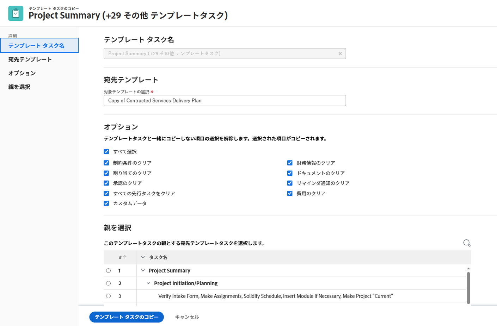
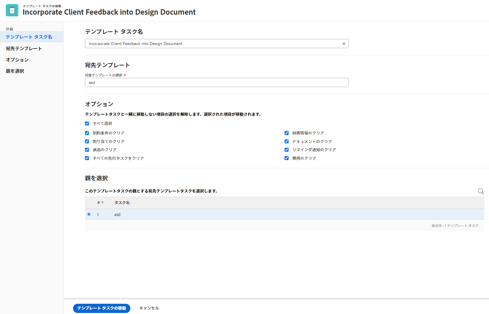

# テンプレートタスクのコピーと移動

<!--Audited: 05/2026-->

テンプレートタスクは、テンプレートから別のテンプレートにコピーすることも、別のテンプレートに移動することも、同じテンプレート内の別の場所に移動することもできます。

## アクセス要件

+++ 展開すると、この記事の機能のアクセス要件が表示されます。

<table style="table-layout:auto"> 
 <col> 
 <col> 
 <tbody> 
  <tr> 
   <td role="rowheader">Adobe Workfront パッケージ</td> 
   <td> 
任意
 </td> 
  </tr> 
  <tr> 
   <td role="rowheader">Adobe Workfront プラン</td> 
   <td> 
標準

   
プラン
 </td> 
  </tr> 
  <tr> 
   <td role="rowheader">アクセスレベル設定</td> 
   <td> 
テンプレートへの編集アクセス
 </td> 
  </tr> 
  <tr> 
   <td role="rowheader">オブジェクト権限</td> 
   <td> 
テンプレートへの権限を管理します。
 
テンプレートタスクは共有できません。
 </td> 
  </tr> 
 </tbody> 
</table>

この表の情報について詳しくは、[Workfront ドキュメントのアクセス要件](/help/quicksilver/administration-and-setup/add-users/access-levels-and-object-permissions/access-level-requirements-in-documentation.md)を参照してください。

+++

<!--
Old:

<table style="table-layout:auto"> 
 <col> 
 <col> 
 <tbody> 
  <tr> 
   <td role="rowheader">Adobe Workfront plan*</td> 
   <td> 
Any
 </td> 
  </tr> 
  <tr> 
   <td role="rowheader">Adobe Workfront license*</td> 
   <td> 
Plan 
 </td> 
  </tr> 
  <tr> 
   <td role="rowheader">Access level configurations*</td> 
   <td> 
Edit access to templates
 </td> 
  </tr> 
  <tr> 
   <td role="rowheader">Object permissions</td> 
   <td> 
Manage permissions to a template.
 
You cannot share a template task.
 </td> 
  </tr> 
 </tbody> 
</table>
-->

## テンプレートタスクのコピーや移動に関する考慮事項

テンプレートタスクをコピーする際は、次の点を考慮します。

* 次の情報は、コピーされたタスクには転送されません。

   * マイルストーン

* コピー処理中に、テンプレートタスクに関連付けられた項目をコピー先のタスクにコピーすることを選択できます。 ただし、デフォルトでは、次のオブジェクトはコピーされたタスクに転送されません。

   * ユーザーコメント

* カスタムフォームは、テンプレートタスクをコピーする際に、テンプレートタスクと共にコピーされます。 カスタムフィールドの情報は、カスタムデータのコピーを選択した場合にのみ、新しいテンプレートタスクに転送されます。

* 次の項目は、コピー先のテンプレートタスクにデフォルトで転送されます。

   * サブタスク

テンプレートタスクを移動するときは、次の点を考慮します。

* 次の情報は、デフォルトで移動先のタスクに転送されます。

   * カスタムフォームとカスタムフィールド情報
   * サブタスク
   * ユーザーコメント

* 次の情報は、移動先のタスクに転送されません。

   * マイルストーン。

* 従来のAdobe ストレージテンプレートからWorkfront ストレージテンプレートにテンプレートタスクをコピーしたり、移動したりすることはできません。 その逆も同じです。 Workfront インスタンスには、両方の種類のドキュメントストレージがない可能性があります。

  詳しくは、[ プロジェクトおよび関連オブジェクトのドキュメント管理の概要](/help/quicksilver/manage-work/projects/manage-projects/manage-documents-on-projects.md)を参照してください。

## テンプレートタスクのコピー

1 つのテンプレートタスクをコピーすることも、複数のテンプレートタスクを一括コピーすることもできます。

1. コピーしたいテンプレートタスクを含むテンプレートに移動します。
1. 左側のパネルの「**テンプレートタスク**」をクリックします。
1. 次のいずれかの操作を行います。
   * テンプレートタスクの名前をクリックして開きます。
   * リストから 1 つまたは複数のテンプレートタスクを選択します。
1. （条件付き）テンプレートタスクリストの上部またはテンプレートタスク名の右側にある&#x200B;**詳細** メニューをクリックし、コピーオプションにアクセスしている場所に応じて、**コピー先**&#x200B;または&#x200B;**コピー**をクリックします。
「テンプレートをコピー」タスクボックスが開きます。
   
1. （オプション）「**テンプレートタスク名**」フィールドでテンプレートタスクの名前を変更します。

   >[!TIP]
   >
   >リスト内の複数のテンプレートタスクをコピーする場合は、このフィールドが淡色表示になり、編集できなくなります。 テンプレートタスクの「名前」フィールドにポインタを合わせると、選択したすべてのテンプレートタスクのリストが表示されます。

1. **宛先テンプレートの選択**&#x200B;フィールドにテンプレートタスクをコピーしたい&#x200B;**宛先テンプレート**&#x200B;の名前を入力し、リストに表示されたら選択します。

   >[!TIP]
   >
   >参照番号の入力を開始したり、テンプレートの ID を入力したりすることもできます。 これは、同じ名前のテンプレートを区別するのに役立ちます。

   デフォルトでは、現在のテンプレート名が表示されます。 同じテンプレート内のテンプレートタスクをコピーする場合は、このフィールドを変更しないでください。

   >[!TIP]
   >
   >ドキュメントの種類が類似しているテンプレートを選択する必要があります。 元のテンプレートとは異なるストレージタイプを持つテンプレートにテンプレートタスクをコピーすることはできません。 Workfront インスタンスには、両方の種類のドキュメントストレージがない可能性があります。
   >
   >詳しくは、[ プロジェクトおよび関連オブジェクトのドキュメント管理の概要](/help/quicksilver/manage-work/projects/manage-projects/manage-documents-on-projects.md)を参照してください。

1. （条件付き）選択したテンプレートへのアクセス権がない場合は、「**アクセスをリクエスト**」をクリックして、宛先テンプレートへのアクセスを要求します。
1. （条件付き）宛先テンプレートのテンプレートタスクのうち 1 つにテンプレートタスクを追加するアクセス権がある場合は、引き続き、アクセス権を要求せずに、テンプレートタスクを選択した宛先テンプレートにコピーします。

1. 左側のパネルで「**オプション**」をクリックし、テンプレートタスクでコピーしたくないテンプレートタスク属性の選択を解除します。 デフォルトでは、すべてのオプションが選択されています。

   >[!TIP]
   >
   >「**すべて選択**」の選択を解除すると、すべてのオプションの選択が解除されます。

   コピーしたテンプレートタスクに転送しない場合は、次のオプションの選択を解除します。 次の表は、オプションの選択を解除した場合の動作を示しています。

   <table style="table-layout:auto"> 
    <col> 
    <col> 
    <tbody> 
    <tr> 
      <td role="rowheader">すべて選択</td> 
      <td>このオプションの選択を解除すると、新しい場所に情報をコピーする際に、テンプレートタスクからすべての情報が削除されます。 </td> 
     </tr>
     <tr> 
      <td role="rowheader">制約</td> 
      <td> 
テンプレートタスクの制約は、テンプレートスケジュールモードの設定に基づいて、「可能な限り早く」または「可能な限り遅く」に設定されます。
 
 選択すると、テンプレートタスクの現在の制約がコピーされたテンプレートタスクに転送されます。 
 
      
<b>メモ</b>

   日付固有の制約を含むテンプレートタスクを別のテンプレートにコピーし、テンプレートタスクの制約日が新しいテンプレートの日付外にある場合、テンプレートタスクの「制約」が「可能な限り早く」または「可能な限り遅く」に変わるか、テンプレートの「予定開始日」または「計画完了日」が調整されます。

   次に、日付固有の制約の例を示します。
   <ul>
      <li> 指定日に開始</li>
      <li> 指定日に終了</li>
      <li> 指定日以降に開始</li>
      <li> 指定日までに開始</li>
      </ul>
     </td> 
     </tr> 
     <tr> 
      <td role="rowheader">割り当て</td> 
      <td> 
すべての割り当てがテンプレートタスクから削除されます。 
 </td> 
     </tr> 
     <tr> 
      <td role="rowheader">承認プロセス</td> 
      <td>すべての承認プロセスがテンプレートタスクから削除されます。</td> 
     </tr>

   <tr> 
      <td role="rowheader">すべての先行タスク</td> 
      <td> 
つまり、依存関係はコピーされたテンプレートタスクに引き継がれません。 
 
選択すると、コピーされたテンプレートタスクのグループ内の先行タスクが保持され、その他のタスクは削除されます。
 </td> 
     </tr>
     <tr> 
      <td role="rowheader">カスタムデータ</td> 
      <td> 
カスタムフィールドの値がクリアされ、カスタムフォームはコピーされたテンプレートタスクに転送されます。 
 
選択すると、カスタムフィールドのフォームと値の両方が、コピーされたテンプレートタスクに転送されます。 
 </td> 
     </tr> 
     <tr> 
      <td role="rowheader">財務情報</td> 
      <td>コピーしたテンプレートタスクの財務情報が削除され、Workfront がテンプレートタスクのコストタイプをコストなしに、テンプレートタスクの収益タイプを請求不可に更新します。
      </td> 
     </tr> 
     <tr> 
      <td role="rowheader">ドキュメント</td> 
      <td> 
テンプレートタスクに添付されたドキュメントは、コピーされたテンプレートタスクには転送されません。 これには、バージョン、プルーフ、およびリンクされたドキュメントが含まれます。
 
<b>メモ</b>

   
これにはドキュメントの承認は含まれません。 テンプレートタスクがコピーされる際に、ドキュメントの承認をコピーすることはできません。
 </td> 
     </tr> 
     <tr> 
      <td role="rowheader">リマインダー通知</td> 
      <td>テンプレートタスクのリマインダーは、コピーされたテンプレートタスクに転送されません。 </td> 
     </tr> 
     <tr> 
      <td role="rowheader">費用</td> 
      <td>テンプレートタスクにログオンした費用は、コピーしたテンプレートタスクには転送されません。 </td> 
     </tr>  
    </tbody> 
   </table>

1. （オプション）左側のパネルで「**親を選択**」をクリックし、宛先テンプレートで、コピーしたテンプレートタスクの親にするテンプレートタスクを選択します。

   >[!TIP]
   >
   >リスト内の複数のテンプレートタスクをコピーするように選択すると、選択したすべてのテンプレートタスクが選択した親の子になり、既存の子タスクの後に追加されます。

   次のいずれかの操作を行って、親を選択します。

   * テンプレートタスクリストで、テンプレート計画の親の 1 つを選択します。
   * 検索アイコン  をクリックして、親テンプレートタスクを名前で検索します。

   テンプレートタスクがリストに表示されます。

1. 親が見つかったら、その親のラジオボタンを選択します。

   親テンプレートタスクを選択しない場合、テンプレートタスクはサブタスクではなくメインテンプレートタスクとしてコピーされ、宛先テンプレートのテンプレートタスクリストの最後に配置されます。

1. 「**テンプレートタスクをコピー**」をクリックします。

   コピーされたテンプレートタスクは、指定されたテンプレート上にあり、選択された親テンプレートタスクのサブタスク、またはテンプレート上の最後のテンプレートタスクのいずれかになります。

## テンプレートタスクを移動

テンプレートタスクは、同じテンプレート内の別のテンプレートタスクまたは別のテンプレートに移動できます。 1 つのテンプレートタスクまたは複数のテンプレートタスクを一括で移動できます。

1. 移動するテンプレートタスクまたはテンプレートタスクを含むテンプレートに移動します。
1. 左側のパネルの「**テンプレートタスク**」をクリックします。
1. 次のいずれかの操作を行います。
   * テンプレートタスクの名前をクリックして開きます。
   * リストから 1 つまたは複数のテンプレートタスクを選択します。
1. （条件付き）テンプレートタスクリストの上部またはテンプレートタスク名の右側にある&#x200B;**詳細** メニューをクリックし、**移動先**&#x200B;または&#x200B;**移動先**をクリックします。
テンプレートの移動タスク ボックスが開きます。
   

1. （オプション）「**テンプレートタスク名**」フィールドでテンプレートタスクの名前を変更します。

   >[!TIP]
   >
   >リスト内の複数のテンプレートタスクを移動する場合は、このフィールドが淡色表示になり、編集できなくなります。 テンプレートタスクの「名前」フィールドにポインタを合わせると、選択したすべてのテンプレートタスクのリストが表示されます。

1. 「**宛先テンプレートの選択**」フィールドにテンプレートタスクを移動したい&#x200B;**宛先テンプレート**&#x200B;の名前を入力し、リストに表示されたら選択します。

   >[!TIP]
   >
   >* 参照番号の入力を開始したり、テンプレートの ID を入力したりすることもできます。 これは、同じ名前のテンプレートを区別するのに役立ちます。
   >
   >* ドキュメントの種類が類似しているテンプレートを選択する必要があります。 元のテンプレートとは異なるストレージタイプを持つテンプレートにテンプレートタスクをコピーすることはできません。 Workfront インスタンスには、両方の種類のドキュメントストレージがない可能性があります。
   >
   >詳しくは、[ プロジェクトおよび関連オブジェクトのドキュメント管理の概要](/help/quicksilver/manage-work/projects/manage-projects/manage-documents-on-projects.md)を参照してください。

1. （条件付き）宛先テンプレートへのアクセス権がない場合は、「**アクセスをリクエスト**」をクリックして、テンプレートへのアクセスをリクエストします。
1. （条件付き）テンプレートタスクを宛先テンプレートのテンプレートタスクの 1 つに追加するアクセス権がある場合は、アクセスをリクエストせずに、テンプレートタスクを選択した宛先テンプレートに引き続き移動します。

1. 左側のパネルで「**オプション**」をクリックし、テンプレートタスクでコピーしたくないテンプレートタスク属性の選択を解除します。 デフォルトでは、すべてのオプションが選択されています。

   >[!TIP]
   >
   >* 「オプション」セクションは、宛先テンプレートを選択した後でのみ使用できます。
   >* 「**すべて選択**」の選択を解除すると、すべてのオプションの選択が解除されます。

   移動したテンプレートタスクに情報を転送しない場合は、以下のオプションの選択を解除します。 次の表は、オプションの選択を解除した場合の動作を示しています。

   <table style="table-layout:auto"> 
    <col> 
    <col> 
    <tbody> 
    <tr> 
      <td role="rowheader">すべて選択</td> 
      <td>このオプションの選択を解除すると、新しい場所に移動する際にテンプレートタスクからすべての情報が削除されます。 </td> 
     </tr>
     <tr> 
      <td role="rowheader">制約</td> 
      <td> 
テンプレートタスクの制約は、テンプレートスケジュールモードの設定に基づいて、「可能な限り早く」または「可能な限り遅く」に設定されます。
 
 選択すると、テンプレートタスクの現在の制約が、移動したテンプレートタスクに転送されます。 

   
<b>メモ</b>

   日付固有の制約を持つテンプレートタスクを別のテンプレートに移動し、テンプレートタスクの制約日が新しいテンプレートの日付の外にある場合、テンプレートタスクの制約が「可能な限り早く」、「可能な限り遅く」に変わるか、テンプレートの予定開始日または予定完了日が調整されます。

   次に、日付固有の制約の例を示します。
   <ul>
      <li> 開始日</li>
      <li> 指定日に終了</li>
      <li> 指定日以降に開始</li>
      <li> 指定日までに開始</li>
      </ul>

   </td> 
     </tr> 
     <tr> 
      <td role="rowheader">割り当て</td> 
      <td> 
すべての割り当てがテンプレートタスクから削除されます。 
 </td> 
     </tr> 
     <tr> 
      <td role="rowheader">承認プロセス</td> 
      <td>すべての承認プロセスがテンプレートタスクから削除されます。</td> 
     </tr>

   <tr> 
      <td role="rowheader">すべての先行タスク</td> 
      <td> 
つまり、依存関係は、移動したテンプレートタスクでは継承されません。 
 
選択すると、移動したテンプレートタスクのグループ内の先行タスクが保持され、その他のタスクは削除されます。
 </td> 
     </tr>
     <tr> 
      <td role="rowheader">カスタムデータ</td> 
      <td> 
カスタムフィールドの値がクリアされ、移動したテンプレートタスクでカスタムフォームが転送されます。 
 
選択すると、カスタムフィールドのフォームと値の両方が、移動したテンプレートタスクで転送されます。 
 </td> 
     </tr> 
     <tr> 
      <td role="rowheader">財務情報</td> 
      <td>移動したテンプレートタスクの財務情報が削除され、Workfront がテンプレートタスクのコストタイプをコストなしに、テンプレートタスクの収益タイプを請求不可に更新します。</td> 
     </tr> 
     <tr> 
      <td role="rowheader">ドキュメント</td> 
      <td> 
テンプレートタスクに添付されたドキュメントは、移動したテンプレートタスクで転送されません。 これには、バージョン、プルーフ、およびリンクされたドキュメントが含まれます。

   
<b>メモ</b>

   <ul><li>
      
これにはドキュメントの承認は含まれません。 テンプレートタスクを移動する際に、ドキュメントの承認を移動することはできません。
 </li>
      <li>テンプレートタスクでドキュメントを移動しないように選択した場合、ドキュメントは削除され、30 日間ごみ箱に入れられます。 管理者はそれらを復元でき、移動したテンプレートタスクで復元されます。

   テンプレートタスクを移動した後に削除すると、復元されたドキュメントは、ドキュメントを復元した管理者のユーザーページのドキュメントエリアに配置されます。 </li> </ul>

   </td> 
     </tr> 
     <tr> 
      <td role="rowheader">リマインダー通知</td> 
      <td>テンプレートタスクのリマインダーは、移動したテンプレートタスクには転送されません。 </td> 
     </tr> 
     <tr> 
      <td role="rowheader">費用</td> 
      <td>テンプレートタスクに記録した費用は、移動したテンプレートタスクには転送されません。 </td> 
     </tr>  
    </tbody> 
   </table>

1. （オプション）左側のパネルで「**親を選択**」をクリックし、宛先テンプレートで、移動したテンプレートタスクの親にするテンプレートタスクを選択します。

   >[!TIP]
   >
   >リスト内の複数のテンプレートタスクを選択して移動すると、選択したすべてのテンプレートタスクが選択した親の子になり、既存の子タスクの後に追加されます。

   次のいずれかの操作を行って、親を選択します。

   * テンプレートタスクリストで、テンプレート計画の親の 1 つを選択します。
   * 検索アイコン  をクリックして、親テンプレートタスクを名前で検索します。

   テンプレートタスクがリストに表示されます。

1. 親が見つかったら、その親のラジオボタンを選択します。

   親テンプレートタスクを選択しない場合、テンプレートタスクはサブタスクではなくメインテンプレートタスクとして移動され、宛先テンプレートのテンプレートタスクリストの最後に配置されます。

1. 「**テンプレートタスクを移動**」をクリックします。

   移動したテンプレートタスクは、指定したテンプレートに配置され、選択した親テンプレートタスクのサブタスクか、テンプレートの最後のテンプレートタスクのいずれかになります。
