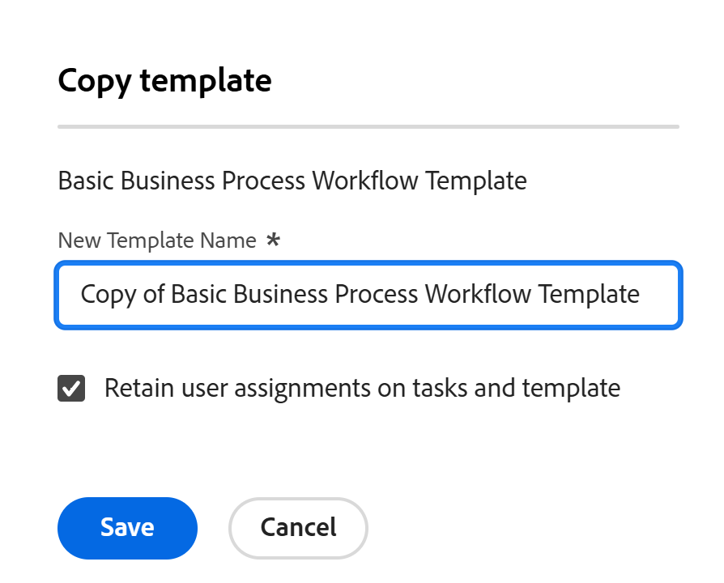

# プロジェクトテンプレートのコピー

<!--Audited: 5/2025-->

プロジェクトテンプレートをゼロから作成する以外に、既存のテンプレートをコピーしてAdobe Workfrontで変更することもできます。

## アクセス要件

+++ 展開すると、この記事の機能のアクセス要件が表示されます。 

次のアクセス権が必要です。

<table style="table-layout:auto"> 
 <col> 
 <col> 
 <tbody> 
  <tr> 
   <td role="rowheader">Adobe Workfront パッケージ</td> 
   <td> 
任意 
 </td> 
  </tr> 
  <tr> 
   <td role="rowheader">Adobe Workfront プラン</td> 
   <td>
標準
 
   
プラン
 </td> 
  </tr> 
  <tr> 
   <td role="rowheader">アクセスレベル設定</td> 
   <td> 
テンプレートへの編集アクセス
 </td> 
  </tr> 
  <tr> 
   <td role="rowheader">オブジェクト権限</td> 
   <td> 
テンプレートに対する表示権限またはそれ以上の権限
  </td> 
  </tr> 
 </tbody> 
</table>

*詳しくは、[Workfront ドキュメントのアクセス要件 ](/help/quicksilver/administration-and-setup/add-users/access-levels-and-object-permissions/access-level-requirements-in-documentation.md) を参照してください。

+++

<!--Old:

 <col> 
 <col> 
 <tbody> 
  <tr> 
   <td role="rowheader">Adobe Workfront plan</td> 
   <td> 
Any 
 </td> 
  </tr> 
  <tr> 
   <td role="rowheader">Adobe Workfront license*</td> 
   <td>
New: Standard
 
   
Current: Plan 
 </td> 
  </tr> 
  <tr> 
   <td role="rowheader">Access level configurations</td> 
   <td> 
Edit access to Templates
 </td> 
  </tr> 
  <tr> 
   <td role="rowheader">Object permissions</td> 
   <td> 
View or higher permissions to a template
  </td> 
  </tr> 
 </tbody> 
</table>-->

## テンプレートのコピーに関する考慮事項

次の項目は、常に既存のテンプレートから新しいテンプレートにコピーされます。

* テンプレートタスク
* テンプレートタスクのデフォルト情報（タスクのデフォルトの承認プロセス、タスクのデフォルトのカスタムフォーム）
* カスタムフォーム
* リスク
* キューの設定情報
* ポートフォリオとプログラム
* 承認
* ドキュメント
* 元のテンプレートタスクの日数は、新規テンプレートに移行されます。必要に応じて、テンプレートの開始日または完了日を（スケジュールモードに応じて）変更し、テンプレートタスクの日付を更新する必要があります。

次の項目は、既存のテンプレートから新しいテンプレートにコピーされません。

* 請求レート
* ユーザーコメント

## テンプレートをコピーする

<!--ensure steps and casing on the fields and buttons is accurate with unshim-->

1. コピーするテンプレートに移動します。
1. ヘッダーのテンプレート名の右側にある **その他** メニュー  をクリックし、「**コピー**」をクリックします。

   「**テンプレートをコピー**」ボックスが開きます。

   

1. 「**新しいテンプレート名**」フィールドにテンプレートの名前を指定します。

   デフォルトでは、Workfrontは新しい名前を `Copy of Original template name` というフォーマットで設定します。

1. 元のテンプレートから新しいテンプレートにすべてのタスクとテンプレートの割り当てを保持する場合は、「**タスクとテンプレートのユーザー割り当てを保持**」オプションを選択します。 テンプレートのタスクの割り当ておよびテンプレートの所有者とスポンサーは、コピーされたテンプレートに転送されます。
1. 「**保存**」をクリックしてテンプレートのコピーを作成します。

   新しいテンプレートが、Workfrontの「テンプレート」領域のテンプレートリストに表示されます。
